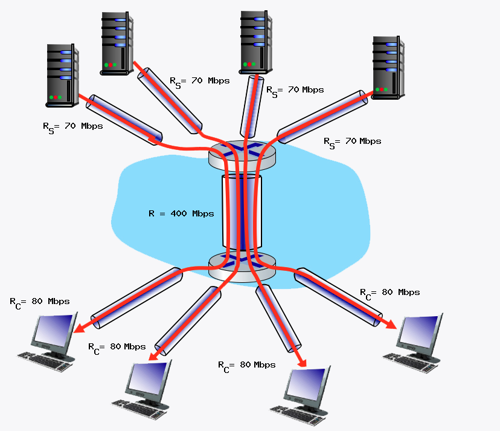
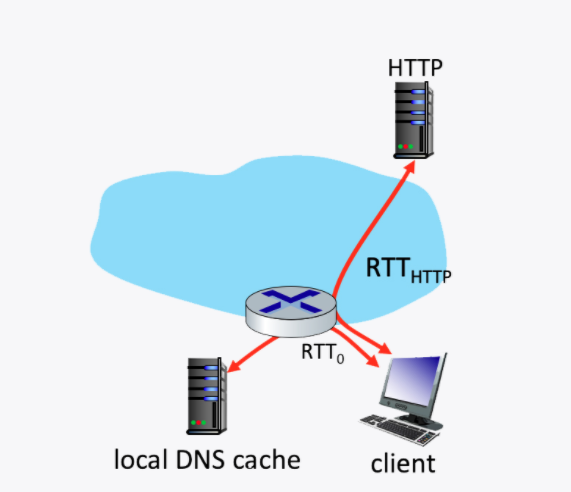
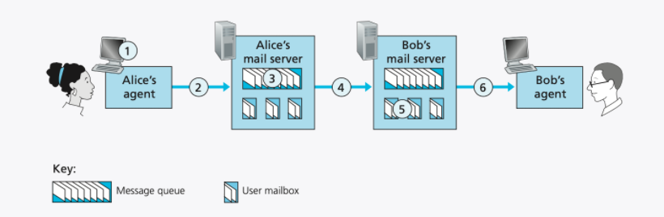
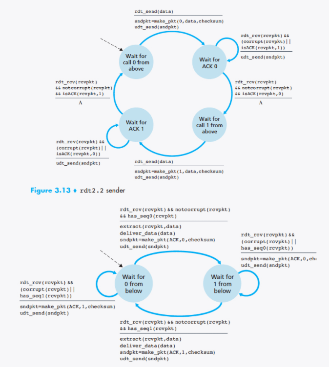
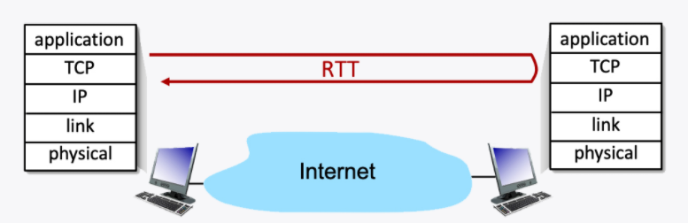
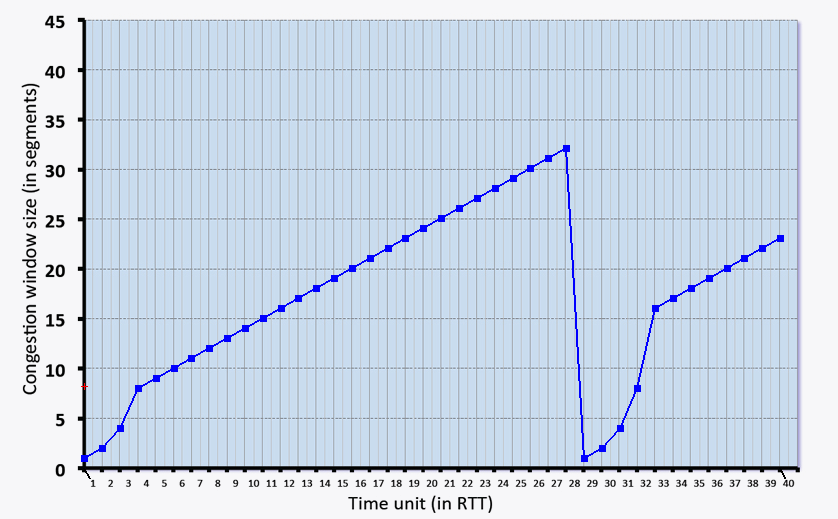
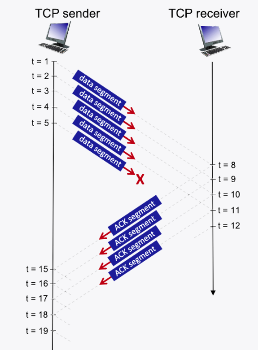
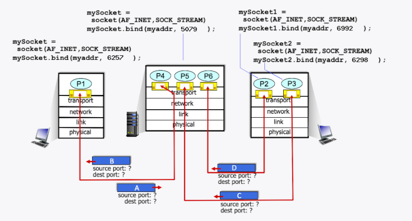

# INTERACTIVE END-OF-CHAPTER EXERCISES 1

## 1장

### CIRCUIT SWITCHING

>Consider the circuit-switched network shown in the figure below, with circuit switches A, B, C, and D. Suppose there are 19 circuits between A and B, 13 circuits between B and C, 12 circuits between C and D, and 16 circuits between D and A.
>
>
>
>Question List
>
>>1. What is the maximum number of connections that can be ongoing in the network at any one time?
>>
>>2. Suppose that these maximum number of connections are all ongoing. What happens when another call connection request arrives to the network, will it be accepted? Answer Yes or No
>>
>>3. Suppose that every connection requires 2 consecutive hops, and calls are connected clockwise. For example, a connection can go from A to C, from B to D, from C to A, and from D to B. With these constraints, what is the is the maximum number of connections that can be ongoing in the network at any one time?
>>
>>4. Suppose that 18 connections are needed from A to C, and 17 connections are needed from B to D. Can we route these calls through the four links to accommodate all 35 connections? Answer Yes or No
>>
>>1. 한 번에 네트워크에서 진행 가능한 최대 연결 수는 얼마인가?
>>
>>2. 이러한 최대 연결 수가 모두 진행 중이라고 가정합시다. 다른 통화 연결 요청이 네트워크에 도착하면 어떻게 되는가, 수락될 것인가? 예 또는 아니오로 대답
>>
>>3. 매 연결마다 2회 연속 홉이 필요하고, 통화는 시계방향으로 연결된다고 가정한다. 예를 들어, 연결은 A에서 C로, B에서 D로, C에서 A로, D에서 B로 갈 수 있다. 이러한 제약조건으로, 네트워크에서 한 번에 계속 진행 가능한 최대 연결 수는 얼마인가?
>>
>>4. A에서 C까지 18개의 연결이 필요하고, B에서 D까지 17개의 연결이 필요하다고 가정한다. 이 통화들을 4개의 링크를 통해 35개의 연결을 모두 수용할 수 있도록 할 수 있을까? 예 또는 아니오로 대답
>
>Solution
>
>>1. The maximum number of connections that can be ongoing at any one time is the sum of all circuits, which happens when 19 connections go from A to B, 13 connections go from B to C, 12 connections go from C to D, and 16 connections go from D to A. This sum is 60.
>>
>>2. No, it will be blocked because there are no free circuits.
>>
>>3. There can be a maximum of 28 connections. Consider routes A->C and C->A, sum the bottleneck links, and compare that value to the equivalent of B->D and D->B.
>>
>>4. Using our answer from question 4, the sum of our needed connections is 35, and we have 28 available connections, so it is NOT possible.
>>
>>1. 한 번에 진행 가능한 최대 연결 수는 모든 회로의 합으로, 19개의 연결부가 A에서 B로, 13개의 연결부가 B에서 C로, 12개의 연결부가 C에서 D로, 16개의 연결부가 D에서 A로 연결될 때 발생한다. 이 금액은 60이다. (60)
>>
>>2. 아니, 자유로운 회로가 없기 때문에 차단될 것이다. (No)
>>
>>3. 최대 28개의 연결이 있을 수 있다. 경로 A->C와 C->A를 고려하여 병목 링크를 합산한 후 그 값을 B->D와 D->B의 등가 값과 비교한다. (28)
>>
>>4. 질문 4.의 답변을 이용하여 필요한 연결의 합은 35이며, 28개의 연결 가능한 연결이 있으므로 불가능하다. (No)

### QUANTITATIVE COMPARISON OF PACKET SWITCHING AND CIRCUIT SWITCHING

>This question requires a little bit of background in probability (but we'll try to help you though it in the solutions). Consider the two scenarios below:
>
>- A circuit-switching scenario in which *Ncs* users, each requiring a bandwidth of 10 Mbps, must share a link of capacity 100 Mbps.
>- A packet-switching scenario with *Nps* users sharing a 100 Mbps link, where each user again requires 10 Mbps when transmitting, but only needs to transmit 30 percent of the time.
>
>
>
>Question
>
>>1. When circuit switching is used, what is the maximum number of users that can be supported?
>>
>>2. Suppose packet switching is used. If there are 19 packet-switching users, can this many users be supported under circuit-switching? Yes or No.
>>
>>3. Suppose packet switching is used. What is the probability that a given (specific) user is transmitting, and the remaining users are not transmitting?
>>
>>4. Suppose packet switching is used. What is the probability that one user (*any* one among the 19 users) is transmitting, and the remaining users are not transmitting?
>>
>>5. When one user is transmitting, what fraction of the link capacity will be used by this user? Write your answer as a decimal.
>>
>>6. What is the probability that any 10 users (of the total 19 users) are transmitting and the remaining users are not transmitting?
>>
>>7. What is the probability that *more* than 10 users are transmitting?
>>
>>\1. 회로 전환을 사용할 때 지원할 수 있는 최대 사용자 수는 얼마인가?
>>
>>\2. 패킷 교환이 사용된다고 가정한다. 19명의 패킷 교환 사용자가 있는 경우, 이 많은 사용자가 회로 교환 하에서 지원될 수 있는가? 예스 또는 아니오.
>>
>>\3. 패킷 교환이 사용된다고 가정한다. 주어진 (특정) 사용자가 송신하고 있고, 나머지 사용자가 송신하지 않을 확률은 얼마인가?
>>
>>\4. 패킷 교환이 사용된다고 가정한다. 사용자 한 명(19명 중 한 명)이 송신하고, 나머지 사용자가 송신하지 않을 확률은 얼마인가.
>>
>>\5. 한 명의 사용자가 송신할 때, 이 사용자가 사용하는 링크 용량의 일부분은? 답안을 십진법으로 쓰시오.
>>
>>\6. (총 19명의 사용자 중) 10명의 사용자가 송신하고 있으며, 나머지 사용자가 송신하지 않을 확률은 얼마인가?
>>
>>\7. 10명 이상의 사용자가 송신하고 있을 확률은 얼마인가?
>
>Solution
>
>>\1. When circuit switching is used, at most 10 users can be supported. This is because each circuit-switched user must be allocated its 10 Mbps bandwidth, and there is 100 Mbps of link capacity that can be allocated.
>>
>>\2. No. Under circuit switching, the 19 users would each need to be allocated 10 Mbps, for an aggregate of 190 Mbps - more than the 100 Mbps of link capacity available.
>>
>>\3. The probability that a given (specific) user is busy transmitting, which we'll denote p, is just the fraction of time it is transmitting, i.e. 0.3. The probability that one specific other user is not busy is (1-p), and so the probability that all of the other Nps-1 users are not transmitting is (1-p)Nps-1. Thus the probability that one specific user is transmitting and the remaining users are not transmitting is p*(1-p)Nps-1, which has the numerical value of 0.00049.
>>
>>\4. The probability that exactly one (any one) of the Nps users is transmitting is Nps times the probability that a given specific user is transmitting and the remaining users are not transmitting. The answer is thus Nps * p * (1-p)Nps-1, which has the numerical value of 0.0093.
>>
>>\5. This user will be transmitting at a rate of 10 Mbps over the 100 Mbps link, using a fraction 0.1 of the link's capacity when busy.
>>
>>\6. The probability that 10 specific users of the total 19 users are transmitting and the other 9 users are idle is p10(1-p)9. Thus the probability that any 4 of the 7 users are busy is choose(19, 10) * p10(1-p)9, where choose(19, 10) is the (19, 10) coefficient of the binomial distribution). The numerical value of this probability is 0.022.
>>
>>\7. The probability that more than 10 users of the total 19 users are transmitting is Σ i=11,19 choose(19, i) * pi(1-p)19 - i. The numerical value of this probability is 0.011. Note that 10 is the maximum number of users that can be supported using circuit switching. With packet switching, nearly twice as many users (19) are supported with a small probability that more than 10 of these packet-switching users are busy at the same time.
>>
>>\1. 회선 전환을 사용할 경우 최대 10명의 사용자를 지원할 수 있다. 회선 교환 사용자마다 10Mbps 대역폭을 할당해야 하고, 할당할 수 있는 링크 용량이 100Mbps에 달하기 때문이다.
>>
>>\2. 아니오. 회선 전환에서 19명의 사용자는 각각 사용 가능한 링크 용량의 100Mbps 이상인 190Mbps의 총계값으로 10Mbps를 할당받아야 한다.
>>
>>\3. 주어진 (특정) 사용자가 전송을 하고 있을 확률은, 우리가 p를 나타내게 될 것은, 그것이 전송하고 있는 시간의 일부, 즉 0.3에 지나지 않는다. 특정 다른 사용자 한 명이 바쁘지 않을 확률은 (1-p)이므로 다른 모든 Nps-1 사용자가 전송하지 않을 확률은 (1-p)Nps-1이다. 따라서 특정 사용자 한 명이 송신하고 나머지 사용자가 송신하지 않을 확률은 0.00049의 숫자 값을 갖는 p*(1-p)Nps-1이다.
>>
>>\4. Nps 사용자 중 정확히 1명(누구나)이 송신하고 있는 확률은 특정 사용자가 송신하고 나머지 사용자가 송신하지 않는 확률을 Nps로 곱한 것이다. 따라서 Nps * p * (1-p)Nps-1로, 숫자 값은 0.0093이다.
>>
>>\5. 이 사용자는 통화 중일 때 링크 용량의 0.1분의 1을 사용하여 100Mbps 링크에서 10Mbps의 속도로 전송한다.
>>
>>\6. 전체 19명의 사용자 중 10명의 특정 사용자가 송신하고 나머지 9명의 사용자가 유휴 상태일 확률은 p10(1-p)9이다. 따라서 7명의 사용자 중 4명이 사용 중일 확률은 선택(19, 10) * p10(1-p)9이며, 여기서 선택(19, 10)은 이항 분포의 (19, 10) 계수다. 이 확률의 수치는 0.022이다.
>>
>>\7. 총 19명의 사용자 중 10명 이상이 송신하고 있을 확률은 is i=11,19 select (19, i) * pi(1-p)19 - i이다. 이 확률의 수치는 0.011이다. 10은 회로 전환을 사용하여 지원할 수 있는 최대 사용자 수라는 점에 유의하십시오. 패킷 교환을 통해, 이러한 패킷 교환 사용자들 중 10명 이상이 동시에 사용 중일 가능성이 거의 두 배(19명)에 달하는 사용자들이 지원된다.

### CAR - CARAVAN ANALOGY

>Consider the figure below, adapted from Figure 1.17 in the text, which draws the analogy between store-and-forward link transmission and propagation of bits in packet along a link, and cars in a caravan being serviced at a toll booth and then driving along a road to the next tollbooth.
>
>Suppose the caravan has 10 cars, and that the tollbooth services (that is, transmits) a car at a rate of one car per 5 seconds. Once receiving serving a car proceeds to the next tool both, which is 500 kilometers away at a rate of 10 kilometers per second. Also assume that whenever the first car of the caravan arrives at a tollbooth, it must wait at the entrance to the tollbooth until all of the other cars in its caravan have arrived, and lined up behind it before being serviced at the toll booth. (That is, the entire caravan must be stored at the tollbooth before the first car in the caravan can pay its toll and begin driving towards the next tollbooth).
>
>본문의 그림 1.17에서 개조한 아래 그림을 고려해 보십시오. 이 그림은 링크를 따라 패킷의 저장 및 전달 링크 전송과 캐러밴에 탄 자동차들이 요금소에서 서비스를 받은 후 다음 톨게이트로 가는 도로를 따라 주행하는 것과 유사하다.
>
>캐러밴에 10대의 차가 있고, 톨게이트가 5초당 1대의 속도로 자동차를 서비스(즉, 전송)한다고 가정하자. 서빙 차량을 받으면 초당 10km의 속도로 500km 떨어진 다음 공구로 이동한다. 또한 캐러밴의 첫 번째 차가 톨게이트에 도착할 때마다 캐러밴의 다른 차들이 모두 도착할 때까지 톨게이트 입구에서 대기하고 그 뒤에 줄을 서야 톨게이트에서 서비스를 받을 수 있다고 가정한다.(즉, 캐러밴의 첫 번째 차가 발을 딛기 전에 캐러밴 전체를 톨게이트에 보관해야 한다.통행료를 지불하고 다음 통행료 징수소를 향해 운전하기 시작한다.
>
>
>
>Question
>
>>\1. Once a car enters service at the tollbooth, how long does it take until it leaves service?
>>
>>\2. How long does it take for the entire caravan to receive service at the tollbooth (that is the time from when the first car enters service until the last car leaves the tollbooth)?
>>
>>\3. Once the first car leaves the tollbooth, how long does it take until it arrives at the next tollbooth?
>>
>>\4. Once the last car leaves the tollbooth, how long does it take until it arrives at the next tollbooth?
>>
>>\5. Once the first car leaves the tollbooth, how long does it take until it enters service at the next tollbooth?
>>
>>\6. Are there ever two cars in service at the same time, one at the first toll booth and one at the second toll booth? Answer Yes or No
>>
>>\7. Are there ever zero cars in service at the same time, i.e., the caravan of cars has finished at the first toll both but not yet arrived at the second tollbooth? Answer Yes or No
>>
>>\1. 일단 톨게이트에서 운행이 시작되면, 운행이 끝날 때까지 얼마나 걸리나?
>>
>>\2. 전체 캐러밴이 톨게이트에서 서비스를 받는 데 걸리는 시간은 (첫 번째 차량이 서비스를 시작하는 시점부터 마지막 차가 톨게이트를 떠나는 시점까지) 어느 정도인가?
>>
>>\3. 첫차가 톨게이트를 떠나면 다음 톨게이트에 도착하기까지 얼마나 걸리나?
>>
>>\4. 마지막 차가 톨게이트를 떠나면 다음 톨게이트에 도착할 때까지 얼마나 걸리나?
>>
>>\5. 첫 번째 차가 톨게이트를 벗어나면 다음 톨게이트에서 운행되기까지 얼마나 걸리는가?
>>
>>\6. 1호 요금소와 2호 요금소에 각각 1대씩, 2호 요금소에 2대의 차량이 동시에 운행된 적이 있는가? 예 또는 아니오로 대답
>>
>>\7. 동시에 운행되는 차량이 제로인 적이 있는가? 즉, 카러밴이 첫 번째 통행료에서 모두 끝났지만 두 번째 통행료 징수소에 아직 도착하지 않은 적이 있는가? 예 또는 아니오로 대답
>
>Solution
>
>>\1. Service time is 5 seconds
>>
>>\2. It takes 50 seconds to service every car, (10 cars * 5 seconds per car)
>>
>>\3. It takes 50 seconds to travel to the next toll booth (500 km / 10 km/s)
>>
>>\4. Just like in the previous question, it takes 50 seconds, regardless of the car
>>
>>\5. It takes 95 seconds until the first car gets serviced at the next toll booth (10-1 cars * 5 seconds per car + 500 km / 10 km/s)
>>
>>\6. No, because cars can't get service at the next tollbooth until all cars have arrived
>>
>>\7. Yes, one notable example is when the last car in the caravan is serviced but is still travelling to the next toll booth; all other cars have to wait until it arrives, thus no cars are being serviced

### COMPUTING THE ONE-HOP TRANSMISSION DELAY

>Consider the figure below, in which a single router is transmitting packets, each of length *L* bits, over a single link with transmission rate *R* Mbps to another router at the other end of the link.
>
>
>
>Suppose that the packet length is *L*= 16000 bits, and that the link transmission rate along the link to router on the right is *R* = 1 Mbps.
>
>Round your answer to two decimals after leading zeros
>
>아래 그림은 단일 라우터가 각 길이 *L* 비트의 패킷을 링크의 다른 쪽 끝에 있는 다른 라우터에 전송 속도 *R* Mbps의 단일 링크를 통해 전송하고 있는 것을 고려해 보십시오.
>패킷 길이가 *L*= 16000비트이고, 오른쪽의 라우터에 대한 링크를 따라 전송되는 링크 전송 속도가 *R* = 1Mbps라고 가정하자.
>
>0을 리딩한 후 답안을 2자리 숫자로 반올림하십시오.
>
>Question
>
>>\1. What is the transmission delay?
>>
>>\2. What is the maximum number of packets per second that can be transmitted by this link?
>>
>>\1. 변속기의 지연은?
>>
>>\2. 이 링크로 전송할 수 있는 초당 최대 패킷 수는 얼마인가?
>
>Solution
>
>>The transmission delay = L/R = 16000 bits / 1000000 bps = 0.016 seconds
>>
>>The number of packets that can be transmitted in a second into the link = R / L = 1000000 bps / 16000 bits = 62 packets
>>
>>전송 지연 = L/R = 16000비트/1000000bps = 0.016초
>>
>>1초 내에 링크로 전송할 수 있는 패킷 수 = R/L = 1000000bps / 16000비트 = 62개 패킷

### QUEUING DELAY

>Consider the queuing delay in a router buffer, where the packet experiences a delay as it waits to be transmitted onto the link. The length of the queuing delay of a specific packet will depend on the number of earlier-arriving packets that are queued and waiting for transmission onto the link. If the queue is empty and no other packet is currently being transmitted, then our packet’s queuing delay will be zero. On the other hand, if the traffic is heavy and many other packets are also waiting to be transmitted, the queuing delay will be long.
>
>
>
>Assume a constant transmission rate of R = 500000 bps, a constant packet-length L = 3200 bits, and a is the average rate of packets/second. Traffic intensity I = La/R, and the queuing delay is calculated as I(L/R)(1 - I) for I < 1.
>
>패킷이 링크로 전송되기를 기다리는 동안 패킷이 지연되는 라우터 버퍼의 대기 지연을 고려하십시오. 특정 패킷의 대기열 지연 길이는 링크에 대한 전송을 대기하고 대기 중인 이전 도착 패킷의 수에 따라 달라진다. 대기열이 비어 있고 현재 전송되고 있는 다른 패킷이 없다면, 우리의 패킷의 대기열 지연은 0이 될 것이다. 반면 트래픽이 많고 다른 많은 패킷들도 전송을 기다리고 있다면 대기열 지연은 길어질 수밖에 없다.
>
>일정한 전송 속도는 R = 500,000 bps, 일정한 패킷 길이 L = 3200 비트, 그리고 a는 패킷/초의 평균 전송 속도라고 가정한다. 트래픽 강도 I = La/R, 대기열 지연은 I < 1에 대해 I(L/R)(1 - I)로 계산된다.
>
>Question
>
>>\1. In practice, does the queuing delay tend to vary a lot? Answer with Yes or No
>>
>>\2. Assuming that a = 28, what is the queuing delay? Give your answer in milliseconds (ms)
>>
>>\3. Assuming that a = 88, what is the queuing delay? Give your answer in milliseconds (ms)
>>
>>\4. Assuming the router's buffer is infinite, the queuing delay is 1.5744 ms, and 1837 packets arrive. How many packets will be in the buffer 1 second later?
>>
>>\5. If the buffer has a maximum size of 968 packets, how many of the 1837 packets would be dropped upon arrival from the previous question?
>>
>>\1. 실제로 대기열 지연은 많이 달라지는 경향이 있는가? 예 또는 아니오로 대답
>>
>>\2. a = 28이라고 가정할 때 대기열 지연은? 밀리초(ms) 단위로 답변 제공
>>
>>\3. a = 88이라고 가정할 때, 대기열 지연은 무엇인가? 밀리초(ms) 단위로 답변 제공
>>
>>\4. 라우터의 버퍼가 무한하다고 가정하면, 대기 지연은 1.5744ms이며, 1837개의 패킷이 도착한다. 1초 후에 버퍼에 몇 개의 패킷이 있는지요?
>>
>>\5. 버퍼의 최대 크기가 968 패킷인 경우, 이전 질문에서 오는 즉시 삭제되는 패킷은 1837개 중 몇 개인가?
>
>Solution
>
>>\1. Yes, in practice, queuing delay can vary significantly. We use the above formulas as a way to give a rough estimate, but in a real-life scenario it is much more complicated.
>>
>>\2. Queuing Delay = I(L/R)(1 - I) * 1000 = 0.1792*(3200/500000)*(1-0.1792) * 1000 = 0.9414 ms.
>>
>>\3. Queuing Delay = I(L/R)(1 - I) * 1000 = 0.5632*(3200/500000)*(1-0.5632) * 1000 = 1.5744 ms.
>>
>>\4. Packets left in buffer = a - floor(1000/delay) = 1837 - floor(1000/1.5744) = 1202 packets.
>>
>>\5. Packets dropped = packets - buffer size = 1837 - 968 = 869 dropped packets.
>>
>>\1. 예, 실제로 대기열 지연은 상당히 다를 수 있다. 우리는 대략적인 견적을 내기 위한 방법으로 위의 공식들을 사용하지만, 실제 상황에서는 훨씬 더 복잡하다.
>>
>>\2. 큐 지연 = I(L/R)(1 - I) * 1000 = 0.1792*(3200/500000)*(1-0.1792) * 1000 = 0.9414ms
>>
>>\3. 큐 지연 = I(L/R)(1 - I) * 1000 = 0.5632*(3200/500000)*(1-0.56322) * 1000 = 1.5744ms
>>
>>\4. 버퍼에 남아 있는 패킷 = a - floor(1000/delay) = 1837 - floor(1000/1.5744) = 1202 패킷.
>>
>>\5. 손실된 패킷 = 패킷 - 버퍼 크기 = 1837 - 968 = 869 패킷.

### COMPUTING END-END DELAY (TRANSMISSION AND PROPAGATION DELAY)

>Consider the figure below, with three links, each with the specified transmission rate and link length.
>
>
>
>![img](data:image/png;base64,iVBORw0KGgoAAAANSUhEUgAAAkAAAAESCAYAAAAVNGpXAAAACXBIWXMAAAsTAAALEwEAmpwYAAAgAElEQVR4nOzdeZxcxXno/V9VnXN6mZ59NCONdiGBQBIISWwCxI4FNthm802MiRe85722YzvXjuMkdpz49XUSx75v7MS7nTi28QJmX4xAAozYBAjQvm+jkWbv9SxV9f5xegZBnMT3A2Y0qL6fT3+mp9Uz6q4z3f2cp556SlhrcRzHcRzHOZbI8X4AjuM4juM4rzUXADmO4ziOc8xxAZDjOI7jOMccFwA5juM4jnPMcQGQ4ziO4zjHHBcAOY7jOI5zzHEBkOM4juM4xxwXADmO4ziOc8xxAZDjOI7jOMccFwA5juM4jnPMcQGQ4ziO4zjHHBcAOY7jOI5zzHEBkOM4juM4xxwXADmO4ziOc8xxAZDjOI7jOMccFwA5juM4jnPM8cb7ATiO4ziOc3RZs2bN8U8//fQKKWWycuXKm+bNm1cZ78f0anMBkOM4juNMIB//+Me/dODAgWnNzc1DSimjlIqUUsbzvMTzvEgpFSulkvrFSCmNUiqqfzVSSiOESOpfUUol1lo5ent7e3vfX/7lX35rw4YNc6y1fO1rX2PevHnfH+/n/WpzAZDjOI7jTCB33HHHH27ZsmVaZ2cnvu/jeR6+75PJZPB9f+y2Iy+jtymlxi5SSqSUCCHwPA8pJdZampqaeOGFF7juuut47LHH2LVr14nj/Zx/H1wA5DiO4zgTyJQpU3aVSqVpkyZNekmwEwTBS75XSo199X3/twY/R14AlFI0Njbi+z7WWoIgoKenZ9o4P+XfC1cE7TiO4zgTiLVWWmv/b3/mt94uhBj7t9EM0Ojtxhistfi+H23evLnwyh710ccFQI7jOI4zgVhrxzI2r8bvEkK8JBAavT76/2it3zkyMtJyzz33LHlV/tOjhAuAHMdxHGcCkVKa3yUDNBrYCCHGan2OdOTv+G3XhRD4vk9PTw9a672bNm1a8sADDyx8lZ7GuHMBkOM4juNMIKNFy6P1PC8vdh69ZPzgxQJoHzy/jPRLeFSxJoQkxJgKNqpi4go2qaYXW0QKi7BgrUAoSaFQoLOz81t33nnn2zdv3vq6mA5zRdCO4ziOM4Hs27dvzu7duzl06NBYZuflFwCLxFMCbIyxMQX7LmbM+1+0L4hpmybo6BY0tEkyeYsQijCG6oChUplKaH+B0UWaCg0MDw4xMjLEihUrWL9+/af+8R//oekb3/jGh8d5GF4xlwFyHMdxnAkkDMMsQLVapVwuUyqVKBaLFItFRkZGGBoaYmhoiOGhAfr7++kfKjI42Mzw0OcY6JtBNT4OE8xCtM4m6JiOP3UWwbTp+JOn4TXPpJrxwOSxtkxrayvbtu3g7//hyxSLRW688Uaef/75JT/84Q+vHO9xeKVcBshxHMdxJpB8Pj8CtDU2Nr4kA/TybJBEIIRCemV04qF7N6C8c8nmBLm8JNdgyTZKGgoghUEJgW2EuJYWRhvSYmilFJs2buHzn/88H/3oR5kzZ86ZpVKpabzH4ZVyAZDjOI7jTCDd3d17wjCcNdoHaLT3z39shCjx/Qy+r/AzCevX/S2btkxiZDVsflqQawAvD76ySATaeES1EJJGSF6g0PhWeg/10NbRyoIFi9i5cydf/vKXKZfLdHV1HRjvcXilXADkOI7jOBOIMUZGUUQURVhrMcagtcZai9aaJEnSAEgq4sCCEOSyAScu6mLanJ2IqiSxAVILrJEIC0iBUj6q0dLcBk8/ZEgin2KxyKxZs/jABz7EXXfdwQsvPIfv52hsbBwY73F4pVwA5DiO4zgTiDHmd67fNSbBC3wSE+PXcrQ0nYxqlvhCYhUIGaAkCAVCKKwQtDU1EmQzxDrBWk0YVunq6uKTn/wkP/vZT/npT39BkiQTPn5wRdCO4ziOM4Ec2c/nP+sHZK0FaUEKMBplFbHUxLUqUWyp6pAo0Zg4Io41YRKjwxgbxkRRAolBkjZCtNowPDxILpdjwYIFhFFELQrzr9Xz/X2Z8BGc4ziO4xyrXt7c8MjbrRVIa4AMWlgCBH6QQymBUtl6gbRA2HQPMOEpkOn+X1JKDBZrNUIoPKkolUoc7h9AYIirsQuAHMdxHMd57fi+X8tkMi8pevZ9f2wz1CAI6o0SfYJAIj2frJdFM8jg4GZsTaCFhMQHYxHSRxoQvo/yDOXGLFFk8KTCGh/PC5CeIgxDSiPFNLgSxoz3OLxSLgByHMdxnAlkcHCws7e3F2MMUsqxrtBSyrHO0FJKlAQlfZCKTC6iNJRlf898/IaYQjP4jYZMoFBKgLQkNUhqguRgDkNMNiPwPQ9jDLlcDqUUxeIwSqnxHoJXhQuAHMdxHGcCOXz4cHe5XKZcLv/XdxTAWImQJMe9nDTvQqaeL5h8vKVrnqBtsiHbIhEehCVN6ZCi1Afrf7OakZEDTJ7cwfoN67np5z/jf1z3B1gr0ukyYSd8DbELgBzHcRzn9cimMRBCgO0iL5dQiwSVqqVag6gC5ZH6ajDPEJYUlWFDaUSCEUgJfqAol8vcfPPNFIdLNDc34nkB1go3BeY4juM4zmunu7t7V7lcbuvo6PgPm6GOXtKNUuu9fTxLkLH07/42ob6KgpL41YRo0KcmNDYSKCGJKpZk2CMXdoIoA90MDxVpa2ln6pTJPP74WmbNmjW6wWoy3uPwSrkAyHEcx3EmkIaGhlJjYyNNTU0v6fwcBMFYAbTv+/UiaA+hJIGSTJ7yJPAMKvEwg4JoQKKFh1GWwAqs9JHK0tHSTCD3Ir3FDAz1MH/+fD784Q9z5513cuDAATIZn0KhMDTe4/BKuQDIcRzHcSaQJEm8OI6J4xhgrBv06HWtNVprlApJIh/p+SS+j1I5PC8AJZBCIpQE6eFLQAYIqcFKEpVLl8AjAUOlUuHEE+bj+z6/vOVmDuzbjyfVhJ8Cm/BFTI7jOI7j/HZCKISwCKHBBlgx2jtIIoBE6HqgAyCRwmIQCOsBaYwjrKRcKWISTffkqURJTDWMsuP0lF41LgByHMdxnNclj9FaZWsFqBhpJNYqpLBgPaTwsNYirEFYMIK0J5A1gJfuLK/AGkEtCrFWE9VCKpVSYXyf2yvnpsAcx3EcZwIRQhgpZRqcCIGU8j+9IAVKpvmeQi5DEAQo30cIgWcVwhMoFFal+4OhLM0tTfiBwmjGukFra8a23Rj9vyc6FwA5juM4zgRirZXGmLHan//sIkSSZnxEButrNm5+hp6eKp6qb4EhbNoJWqQBkRQai0eQyVCp1mho8BC2vknqy+qMhHDL4B3HcRzHeQ3t27dvzv79+zl8+PBYFmjUkd+n+4FppIKYGErvpK31fzJlUUTbTEHbdE2+VZJptCAhqkJ5wBAOTcU+vJwkHkJYCIKATMYf+7124id/ABcA/c52H+qVidbecVO6o//99a9/6Lvf/tanf/LDHy5dvHDRofF+bI7jOM6xI47jACCKov/yflKAGW2GyHQmia/S3Zmn+wSYcpyla66kpRMyLRYlIawKij2G6oDg1kwTSVwmm83ywgsv8Oijj9Lc3J5ulMrrIwJyAdDvaGZnlwEigDtvv+Ptge/XXPDjOI7jvNYaGxuHgLa2traxepzRfcBGrwshUMLDCMgECX1DIaVDvyKs/QFhRRBHgijSVEKFDQ2eUlRqhmoiKddARAaETzabp7e3l5/85CZOOmkhLS0FhHB7gR1TNu3YVpg/Z27pjvsfPPP5558//bN//mcfHO/H5DiO4xx7pkyZsqtWq82ZNGnSb90NfuyiPGQAjZkGhqqDPP7oF+nr+1fKjwfsfB6yWVBKIH0DUoIGGwksWQwbyeYXUIv2MPu4OcydO5e9e3dTrbbR0dHhGiH+Pm3f3xN40iTGRhIrMQYJBoQBK5FSmtlTZ/5Orbi37zkQxJENoigJoijOVkNdKJdqhSg02Uo5LlSrYSEKTTasESRJEkSxDqKqyMe1uGGwL5k8f2HnE3/8kTO/DfDEE4+vUEpFy8848+7f7wg4juM4zn8Ux3G2VqtRq9XQWpMkCXEckyTJWFdoz/NQvodXU5RVSEOuwIoVywiTHog04CGMQOCh0fgyg5QGpXyaW7I8/zjUqh6VSonjZs/hHe94O4888ih79u0lihJyuVxlvMfhlToqA6Btu/cHfcMD3eXB6k4hWgnDmCQxaK0JawlRaEgSe/W94f5sGJnAJMaLIxGEYZKPIrLGSKlj6WttgzAyQRTqbK2WfKBWjalVE6qVhGI5IgxjyqWQWi0iriZUioZaEhOTkFgNGAQxN7zj9CzwbYC1Tz5+ycyZM7eddsop+8Z3lJz/yv4Du+VA/1BHpRQWqtVyvlqtFqK4FhhjvCRJPK21JyX4Xq4mlcHzglo+ny9lMplaoaFpqLm5dWDm7BkTfq8bx/ldbdr4XFuxWGwpl6uFKIqCWq2WP+L1IgXKeJ6XKKUSz/OSTCZTyeX9Wj7XNNLc0jg057h5E/4D8XXHaEAifYnWGhB43kyCxgxIixQeSmikyiAUSBQIQb65gFRZLCFCWKIoIpvNM3fuXMIwZPfOXVQqFdcH6PfCVxTLpZ13/GoNC+dfRRxDHBni2KC1IIkFUWx/kSSSOLbEEcRxjE4EUaKJwog41iSxQWtLkqTXR4Mok1iUhYz0kLkc+UxM0hDT0iJJkog4ttgIonJMFBuu/B+TvwPw6Prn52xY/8Kyy1de9O/jPUQOvPDsM51btm85ef++3mkHD/VOKxaLreVqpRBHOqjFST6J9XVaHtm3ot67wr7Y/9MKEGiMsaABNBjwPO/nQdbWsipTCbKZqKmpaaCzraNn8uTJe+YeP2/96aef7gJgZ0LZuHFj086d20/atWvf3EOHD3cPDPZ11Wq1fBQm2ShKgjBOsgZxlRUCUf9wlIqx3i/WiPqqIotFp7frdCW0kuKXWT+oZLKqlvGDWiHfWGpvb+3t7u7eNWv2tG2zZs7dMH3mjAm/bHrikQhpx7bHUCoAozGJRigwKkECtn4cjUgzQ+ky+rTAOu0kLTCJplarIYSgUqlQqVSaxu95vTqOygAojKJ8X18frc0zaGpUhGFClFEkiSSONMYIkkSQxJLEKOJIE0ceWltibdLAJ04PeBglaRAU27GgKI41OrZpUBTHxAkkiSSsCjzfR0pNImNKRcO8ZY3MOq5tC8CG555bsn/PnpYV51xw23iP0bFm65ZNhXWPP7Nix+4d83ft2TtvYHCwQ+UwWb/xOukXyDVkaZo0lWmtk8g3ZCgUCmTzBTIZn0wmRyaTwfeDlzQOs9aik/TNXOuEMKwSRQlhGFGpVK6pVMpUS2WGRwYZ6Otn675etu7byt2/vvPfKn8X5RsbmgamdU/ZO2fOnA0LT17w5GmnnbFrvMfJcUbdcssvV2zdun3hrl07FhwaGOxEabL5wjWeaiCbzdLSMoXutnbyDQGFQhO5hiay2Ux9yXMW3/fHmukppcY+RK01Y1MutVoNHSVUKpWripUS5XKR8kiZwYE+dh7uY+ehfdz/8K8pD0c/zwRBrbu7c9+cOXNeOP7449dfeOHF68d7jCYqpVQyuvHpf1YDlE6DSXzfRyhJzs8hpEYQIUSMsAprZbonmDFIJNbTZGRAJkh7BVmrsEYBBivSTtHWCqT0kK+DfSSOugDosXXPzhqulVu2b9pBZ/tisjmFNhaEwasPepLUO18KC0mMlAqlFHGsEUla1BUrjYglCD+9vd6zSUoQ0qKVQKgE6QUQJQjpo6QlDEOslXh+hlDXWL68kyUnzDu4s3/AW/Obh984eUrnyNlnLb13nIfpmHDn7Xec+dDDq9+4b++BWcNhpU36hcunz+hm2QWnM3PObIhaEIGgo9NnZDgmLAsSXcXaNLix1iKMQUcxpVoIMHY78GKvDGmxJn2TNzYhm/XJZtNCP4QgyAi6JuUYHgrZuzem0Ohfn2+q0HNgN5te2Mqdax7iF7ffdXcho0amTOo8sHTp0tXnX3T+rdOmz3RnvM5r5sHVvz55zeqHV27fuevE4WK5zeLTNa3rykVLT+HyE+bgy0lYI+mcmqNSDCmXDTpJZ3lHAxuAOA5JkghrBcJY6i8XwCLqGVVsmlFFCWSQoSmboaW9GYXC8zxaJvkkWrFrS4lM3qOxJblmcPgAm9Zv4eEnn+GOex+485/+5du1zpa2Q4tPXfjIivPOu/3EExdM+KLa18r+/fvn7Ny5k76+vpec1L38OsJHIpAKjK6AB4XgJETOQ/oJWU9hfIsHSCsxAkykMNIjChMa8h7GJmQyGRoaGsa6Qgth/9vHOBEcdQHQof6+7mK59EitpOmY3omUiiDIIERMJAyBUqSfWyY92FKRJAZhLQiBEJIEi7CghETaBCkkSkiUMMSxRQpIhEUIRUK9GEwJkjDGRyIUVMoJ7e055i9upSfst319/Ty9dh3LFp9y68zps9wH2+/J6gdXLbz73rvevnnznvlWWuadNP8tK958GdOnT6e1ZRIjJcGzjx7iZ/cOsvY3u/DQnHNJJ2evbKCrO0OAolSsEkUSKzQSNdq1tB74GIQU6b44AFhEOg8GOgELWhuktOSaFJ5vGB40/OSuw6y5a4D1jw8xZVqORUuaOfHUySw8eRFvusKnWh5a2dvbw46dW7h9zZqP/uSWW++eObVzx4oV5//qbW97mwuYnd+L9c8+PflXt9x2w4ZNG08p1eKW2fPmXn7GBSuYPmcGre1d2FqW9U/3cfePh3n84RcYGYo5+4J2znpDgdnz8mQzhkrJkkRpIGSFqr82bP1ioD51bOv9ZMb+3RpkDNYmoCz5xgyZbEJpJOH+23p4+L4RHrlvkIZmxalnNHP8onZOOvliLjz/CrStXH6wdw+79u7i0Wee+8Cv7vj1vd1dHbvOOnPZ/e+58X03jd+ITgzVajUPUCwW/9v7jh5NBPj2czRO/QRTTk2YcnxE+wyPhk4IChaRWMojluEeS+VAB889NY8oHCCX89m+fSfbtu0gm83ieWMbp074GsmjLgBSvh/19Ownn2tl8pQpDA0NoRQI4SNlQqwNoJAyzfhI66GweMIgYp0GPdIgJIhYI2WACJMjIlY/PW7CjhWBCWUQcYJCoGRALNOC6DnHN3LiwnaoSnZv3c7WbRu48T3X3zye4/N69YMf/OAtt91x6zvKVV2YNnvepVf8wTs4ccF8+vtK7N8+wt03DbHu0T3s3lrm8IChSg2EAizrN5e4+d/ynHVeMysua2X+4iZa2qA4ALXIIIRM37zrX0fPaIXgiO/roXDGp9Bs8FTA1o0jrL2zyJp7+9naU8YKyFrJjr1VtuwdQv5qH80yy5QZkuNObGT+4hamzlrOO975JhLdv3LNA2v415/8fM6//vimj52+dMn9f/HZz/zd+I2w83py2213LL/pZ794/6GB/u7J3TMvPucNV7B42anUqppdOwZZc0eZ9Y+9wNYNRQ72RtRIsEIgrWHL90e4+d8DTju7kXPf1M4ppzXTOTXP8GBMXLUYEqy1KBmg0wqR+snDiycOQoAlRniKQpNPLi/ZvanMukdK3HPLIJu2F0lETM4GFAcst929D3nXIXJCMW1KlhnH5zlxaYHpM5bw1qsuJMjGlz726Bpuve/ByT+75bb3nnzSCU++54/e/aUTFpzkskK/RSaTqQHk8/mxrM9vu1ir8aSPUcNUh6bRkvwpTc1Z2jotbZ2CSV0JzV0e2QLYBKoNlqwQDALSZkHE5LJZnn32Ob7zne+xaNEigiANgKyd+FmgoyoA2rB1R1MtDPPFYpGOhun42Qyeb5BKoZM0YyOlRNgYBShhCYXAJhabCAKpiBONUC82hop1godAegopQcYgEg+BrTeK0ggpAZP+btLACE9w/MkddE5vILKCtU88SVSLOe/s5W75+6vopp/+eOUP/u1HH/GClujci1deOX/BMhqbshgdctfNm/je1w6yv7eMERHYLBIIEDThI6yHxBBKwf6hEj//VY1f/aqHpae2cs4lTZx2XgddU310IiiORCQxSKkwRo/VAAkhMMbS2JQhm7eUhzRr7y2y+u59PPWbIfrDtBAwjyKwEi00WSuALBGGkqmyYZdmw55Bbr+rlxVntfHuP06YdlyBy99yDSvfdMXKnVu38NCD9x+68NI3PHTx+ef94s/+7M/+cVwH3Zmwfn3vfYu/+Z3vfma4XGk5+7wLLr56yWm0trYhVczjD/Xwna/uYfPmIpoalgCFRAlBI5l0t28sGslIpLnngX4efGCIOcflOW9lO2ee38iMOTmkzDI8VCOKLFLYtHxAaASqPr1syOUVhaY8lZJhw9oqD99/mNWrhukbrmARZPFotD6JEGSsAJtHAyExW3uG2HxgiF8/KFgwp5n3/elM5i8usOKCSznnvIuv7D2wl4ceeODiD/zJx85ZfNJJa7/yla98crzH/Wgzbdq0HVEUdXd0dBAEwdiy99G6oLFl8CqdkmxqzvHkuqdY9+gXyA/8L/K9FbwGi/YtxUiRa7BobamUYOQgDO/vwhChhI9OKnR3TyOfz/L888/T3d1JS0vb62IZvDiaorjVjz0xf8eBvRu3PLuFc097M02NLdSiGJ0YkgR0YklsfWVXrDGxIdIGnUCS1Iufta5ftySJIU7qRc9G1IugLUmkiSNdL5pOSGJBkiREYb1gOkoY7E94xwfmsPK6qfQNav74hncQV4pbnnnmmRPGe5xeL2644fp/3X14YM6b3nzN8uVnn0+xOEylPIISFkHAwFCFnRurPLZ6hCfWlhks15BCIKzAUsOQdiOVwiNjJR4Cg6WCxmCZMynH8otbOeeyduYtzOELKJc0YTU9ewl8n2yDISjA/t2GtfcN8tA9/azfMEwsBFkryeBhRFoPUQMSkU6TeXhjPamaCwFnnNvMxVe0c/yCRhCGWjVCSg9MQpBtoK19Els2b+CWn/37LeX+vqbPfPpTHznvgvOfH98j4Ewkf/qJT37xkSefvviCy65YdsmlbyCOY0aGhwGNUj4jwyF7t5V4am2NR1cPcqi/BggECkMEIsFahUQRoPCRgKaExWDobMhyzoWtnL2yhZOXFAgaFNWRGtXIx0YaPwA/71NoEhw+kLDu4WEevKOfp58oUibGA/JksBgSoYmtQZNgkCgUQlgSC41+lqVL8lx8zSQWLEkXKFQr4diGm0opJk2aRG9vLzf//Bc/3LVp3fHvv/E9X3z79TfcOr5H4Ohx/vnnP7Jt27blo40QjwyAjvzeVx6eFxAEWYRfZuPG7RzuEXgZDz/joTyBkAmeJ2hubgHrkcSCSrXEk4+v4vo//EOefvpppk2bxic+8QlWrVrF4OAglUqFd7/73Seed955m8Z7LF6JoyoDNDg83BGFVdCCtrY24sTg+/Wsj7BIaZEaEmuQnsJIiY11ersUSAlxXM8UCYOUyVg2SCekxWDSoOrZoSRJkLGHEBop0wxRHFkwkvYuRUNrkd17DrBz10E2bNjAB97zzlvGe4xeDx584P6TP/7JT//ovDdcfud7/p9rr4+N5lDvgfruxRKBRJuIjkkNTJ/VwCVv7WLvtjKP3D/IqtsGOdwLC1ZM54QzWoiGqzx5+0F27CwygiWHR6MN0Gh29kXs+Mlebv7JYU45tZFzL+9g6dl5uroDZMZS6jc8+1SZh28d5OFHhjlUrKQ9MPDJWYkQmpoNiWxCjixzZzex7I2TQAQ8/Ivd+MZwwdWtnHfJJGbOzRCWE6qViDC2COGlGSbpE9dq9B7YTVfHJD7+qb94y5OPP8qffOrPfvz26976jT/5+Ce/Pt7Hwzm6bduyNf+u97///plz52/7/N9+eZkfBAwODpAk6bS9lR5JktDSmmHqeTkuuBz27+vi8YdHeODmw2zfEjJv2XQWnttKICxP3tHD5hcGKNoKAVka8LAYBssVfnl7ldtuO8RJ8wqc/8Y2lp7bxLRZglwhR2UoYtsLJR7+9RCr7x1gT18VBGQRFEj3hwpJqBGStT7T2ps49c1TaOkIePTWQ5R6ipx/RRsrLmvjhEUZ4kRQLQoq5dpLMrJaaw4ePEgQBHzwgx+8YfPmzXz96//42XVPPXPu33/lH1w26P+CFhopDVFSJevlOW3pYpSXABKswhMegZ9jaHiQ+++/nyTWNDZlue6669j2/GNUKhWMSWdHpk2bxpIlS3juued49tlnCcMwO97P75U6agKgrbt35rWQwdDhfqZOmkmhkKdYqqATw+hWbkLYdOVB/brW6XxlHMckY0XQHokcLZCWEBlERqI9i4gkIrbo0X4w0o5NlYUiQggPiaVSjpk+N09DW0Slqtm1eTNGxyw/5+x7xnGIXhfuvffexZ/587/4wbs++McLF5929sKBQ73EJqkHuOkZoDFpbVYcxyQDgiKaju4s1713Cisu66BYFHjteZJMI2FsWHBBN3vXDbP+wT08+1g/g4lBGknOKnwCakKy9unDrF03wHHdBS66up32Zp819w3y1GMjVAjx8GjGx1qooKkRYaylu6OJ409uZ9H5HXQvaKW9XdHoaS64wCfnGabOzBDWLIcPlMF69b/PtIBUIbHGYKVAWAjDkPKhQ5x86jL+/K9nLvzSX3/uvdrAJz/pgiDnt9u8aUPTu2/80P3nXfbGZZdf8ZYzB/r7SUZGUEqhECDMWE1bHMeMDElGhgQNBY8r39bOmec30XcYsq05knwDVas4bvkUejcP8+zqHp5bc5hDxSoGjyw+BauIpObZrcM8+9URpn8rzwXXtjB7do6nHiry0JohilEICBoJUBZqaIrUkChacj5Ll83g+DM7mLO0g45JkqacYvnZOQJdY/qsHMYYBg4aEpue1KaZH+rT0WasfiWKIvYf7KF7xgz++v/9h2Vf/sJfDXzoAx/8p6//8zc+PK4HZQKRCKwGGaQzJ7WKQkqBUhmkStBS4WcDStWELdv3AJDJZChVDQniJYFptVqlVqvheR7lctk1Qnw1Pbdx07L9B/vu7913kHNPX0o2m6EaVpFCQTK6hN1DJqMvEJjPFNsAACAASURBVINUhjgC369ncRJLXM8GCWERSdrDQsY6XRnmpxkGIoPNgPA8EmHqAVMGrSw1GxEEksnTBZmch9aC555ax5SuSYeufutVq8Z5mCa8z/7FX33v7e/94MmnLD2DgwcPpMXrgrH0d7rK1mKExBhRX/GnKQ5bSiOWQoOgtVkRxWWq5SrDJiBRWWavaGP+RV2ct2GQFx45zDP3HWL3oSI1BBmraSJPhGHngZBv/p89GJVuk5xF0iQDrDGUMSQiodULmLOgnYUXdDL75Da65hVQUUymViYfhmQSRWuHIBaK/kMRwkjAS89ex55pGrgLITDWYuvFpArD0OAADU3NfOYLX1r815/++Ptnz5m76Zqr3+r+tpz/4BOf/PSPl194ybIr33I1Bw7sBwzC89D1JVkKBaQZ7PREMUGgCMuGasWSDXxmT7ckUYWwGlJMFIgs004uMHf5Ys65dpCtT/Xy9O297NhVYpAqGePTREBiLT3lKj/8fjntH2IiAgIKIoclIiQmtiGNMsvsWZM49ZJ2ZpzSxswFzXgiQZUj8nGNjA7paAuIrcfAQITUEiENol5U/eIKTY4o3n2xgWlxZJhsNsef//UXL/38Zz8lv/jFL37005/+tKuj+10YhVLpiRgynY4UQmHQyCPHHR8hFC0tBUqlGtb4QDKW/Rk9LpC2TKgnDib8auijJgDq7x+cfGDfbjwZMH36dLSJCaQl8dIpsDhJI1gAUT8gSWIhAF0PdLQy2FgjhEYIHyESYjQ+Kg2Y5GhHYI1KIBLpgSQCpEHE4CXQ0paha6pBCJ9KsczzzzzNokWL1o7vCE18f/6ZT3/uhEWnrj/9rHMWHzhwAF9atJUvecMDsFIcUais006kBgyGMJbUIoO0goxnmUxEJCpUa1lGah6T5zYxbXEr598wm+fu3s/63xzmhccGGaaMFYom62FF2jTTQ1IiJjSWDIo5s3LMP6OTxRdPovuEdkyiaTA15MgABS9EBQZjFcYYajWBJcGmkxAAaCxC1PsPCUVi6lOzZvR5WUz9TLc4XKR1UgdXXn3tyf/24598xAVAzst999vfucZmsvKq695GT09PfaIKzFiwYNH2xZMHsNh6QIQAQUAYa2qRBakQ0tCajWnWMTUtGO6r0DGlgSnXHs95V83i+TWHeG5VL8+uHWQojDDo+tSWn74eRZbQWkZsGR+PKW05Fpw7g5POncTcpR0gDHmdIMtD5FRMJtBgPYxRlKqjn5VprxnG2lC8aKzj9BHBkLSgBUTVKkUlue6Pbrz4R9/6p6wLgH43Vpg02LESIfwjxlZjbYCUJr1NJMDoZ2yCVGYsONVa43neS7JBo8HQRHdUBEDbd+4IRoqlttJIkWlt0znuuBkcONiPkmAEY1sYxDIhPatOfy5dFZYGMUk82tjOEonRg+TXD+CRB00jhCSWICREcZI2UkwEMZYkluQaNa0dgkxQYMu+59m+fQsf++j//MU4DtHrwvObty2++g/edeXw0FA9+BGkS2vt2AvKivQNcDT4kTY9exEyLaTUVgOq/iaaoK2PkYLmhojJmQgvb9h1wLC3x2Px1TM4+bJpHNg8wHP39fP06oPsLY6gTBbQVEmY0tTA8ad1cPK5HcxY1EbT1CyDu2v4h/uZd7xEV0OqVUE1lKRraAQCkCTplhpCY4TkxWlaibVJPXCj3mm1vn2AFSAl1lg8ISgNDXHaWefw2CMPe/fff//JF110keuM64xZ8/BDbzzjnPNWVoolhDEkQiCtQEhe/Hsa+7sTR7R3UFirsURj276IJD2T11oRG00+I2ltTsgXRtg/UGbjDsHcczpZsGIqF2w/zPrV/ay7r5ddB0sYIgQKYSNaGvIsPnESp76hmxknttI1q5G+/iphbx+LT/CwaKrFGF310XH6WBPSDKjAIklXk2mR1KeMxViWYdSRfbs01KeVNdVqlZkzZ9LW2Xnom9/85nXve5/rF/TfSwPP0SXxY7WJViFIAG/svTYlgRdPPEd/9siA52haOPVKHRUB0N79vXMqYe0bSZLQ3TUNISHwBFr4iMQSCwvCEggPKQ1xHEN9flIk1OeRLToZDYpkuv8XFqnSjpaQTqEppYjCGCEsSkqk9IgjA8YiMx5RJOmaIcg2JFihWPf4WnL5POeuOP/28R2liW3b1s0FzwuSKdOmMTw8hIdNI1DSzfrQ9VqZI1Lgqn7Oq5RK6wUsCFmvF8BDW/A86GoNCLVhz86Itff18OCtfZy0ciodk7OENUvnvE7eeMokzr1hKpseGebR23eT8XwWXzqZuWe2096dJw4hqiaEQ5rNjx7mX360gzPOb+HcN7Qza36OyZM9hgcTalWdZnIAqO+RY5L6m8VoDUP6skqfQ/3DSqZNh4Stz8tjsTqmpbWbxsbGy3t7e/8P4AIgZ0ysE2/q1OmUSqU04EdgpcBak07xG4ERaadmSQL1JobGjNbTAaNn/1KOBRqdnenf5/59Met+WeKem3rpPHESb/xAjqqNKXS3cPF721l+7Sy2PdXHY7fspziYsOySKcxb3krX3BZ0rElqhqHhkJ5NRW796gucdGIjZ1/RyoJT8zRPUVSqhtLQ6KKUtN+WqU/aKeuj6/2FRjMLwEuuj7LWIoVAG0Mm8OmcNPmqvv7Bh17LYzFxvZi1SZmx+leLQkiBtgYhg/TkU5h6ci5tDQMvnpAqpV7ym18PWaCjIgDas3ff8UJJ4jBi0aJTqFYreP7o5pV6LAjSpNMW0veJZbqk3fM8tEh3bpcSkjhtjgf1Zl2JJch49aAo7WwaZNTYUnqkYHSztyQxBBlBe6cg3xAwXBzhmSefYPGSJetOXrRgYDzHaKILgqAWVsrZcrmE5wdQb8E/Vvsj66lxjjzDsGlrdmsZDZSMAc8T5Bo0+axHqQy/eWiEB+8e5unVJQ5WQiQJ8yIQgUSXIyrFCpUhSZDLcsaVTcw7sxMhYlqmNFEZqjHUU0NIQyIU2YxCC8mOvjI7flbkzp8fZuGyRs55wySWnJ1ncneADqEaGqqVBKxASh9hDIgYw2jwY5AYNAoESKuRNs0I6fqJu1cv9C6VSuSyQfRaHxPn6BaFSbY8UqSzazJJGKKsTfdjqn9ApScLFmFsOr2hLUKNnkCk739oCZ4kk9c05DxiLXnmiSqPr+7jobuK7BkMkYTk5rbiK0sSCcJSRG3Y4GUDFl0wjTknd1KrVWmf2kRU0Qz2lOp7g0G20UNZw/7DMTt7evj1qkEWntjIWZc0ceq5zcyeG2CNV18hqTFCk+Zw09eJELzkA9qYFz90AZRN0MIH0uBIC8HQ0BDHTW13r5ffgRWkwc7YGKf1iun0FumJPwKspp5neMnl5YHpywPWie6oCID6R4Ymh9WI9kIzHZNagHrazQMFaR2FVkTCpGfYRgAKiSBOTH0Ju0Tqev1Pwtj+YEppoihGWpBKoJQkjg0irqf1ogRJ2vDLao+2DkmucYRK2Wfbxu3s27OXK9//AZf9eYVmzJydPPLwmpWnn38xF150Gb2HDgAgTDqlpMXo5FJaPKyExZo0WwIWKxVSxrS15bBCsH9nld/cP8Cae4bYtK1GLDSetTQIRWQVcS1GGg9kjDCAEFTLEFdrNBXSadCB/RUSLZCBQlmRvhiEIooNvvXICkHNJjz6xBCPPDFId1uOM5Y3c85lrcxf0MiUaQGloZhyxWAEWHwUGmkFxoKWEmHrgRuqnvAyePXtWrxslv5DPdx999186L1/NDI+R8Y5Wj333HNnqlwzpy9fzt69e9EShLUvnpuLNLuj0xN6pBRpcTSmXvNhaWz1CAoevTtjHnxogDX3lnnm6UHC+mRuXkhCm0WWDTUAKVCJIJGCamSJeyo0FSz5rGTkUJUoUQiZZgIsoISglgiyWqSFtGie2jDCExsG6Pimx5Iz2zn30kYWntbElCkZhisR5aKpvyZt2pzRqvrUN9T3pEmnuwErJAiBATxhIUm4+/bbWDTnfRN+BdJrIQ1kXt65Od1N4b+SZoNezPKM7S3GixkhMbrB5gQ27gHQY089OUsq3+zbs5MzFiyla3ILfX0VAj8NbowaLfAzeEi0TleAUS+eFUqSxPVCrvqUhBCWRBjQGmshCNId3knqqWPhp78j0oiMIonrxauZDDI7RG/fboaLjWzbtBFjDJe+4eKfjfc4vR40NjYOPXDPnW3Lli0j31CgVCymxeciDUCsMYyGPGlODzyhaWjJ4PkQFhWPPzLMQ/eUeXLNMAeKFbCSvJDkbAZBQtFqjIgJY4MWMToBkHjK0poJaclENHoxxiqamhQjscdILImtjzUahCGuhmgMRWsoEJBFYYTh4ECVm2+vcvftg5x0os9Zb2hnydmNzJ6dQXiC6jBUQoXBooREWIsSaYpZWglWYJUi0gm+79PW3sr3/+XfiSsl/ImfTXZeZZ2dnfvWPrJq2o6tb2by1FkM9R9KmxoKkZY614tUsRYrTVqEbxWFBkWmQRFGho3PVVl7/wiPPjDEjoMhloQ8Hk0oLFC2EVokVCODSCRxWjKLh6EtqFHIRDR6lkAaikIyHGcoxT6xliQItBXEkaZsNLGsENgGGoXEWp/BasK9D/Tw6wcOccLMBk6/sJmzLuxkzrwM2YyhXNVUSiqdPtYxSsqxoEfb0SBIARFKKLq6Z3HP7bcw2NdLttDstsh4jbzeCp+PNO4BUO+hge5KLfpWdajEzBkz8H1R76ArUCpmdKuCNOVr0UIT1+cQhBEILZC+QApLom09QKqnhkX9Z5I0OIJ0pU4sXlxFkSS8GBQhsdlhEl1DJzl2bd/O9O6puy44z3XsfaW2b95UuPDSy36ZwI1f/Zu/4VNf/AJSNlMqDqUFm1aldTKQ7l/jeTQWPHINhh3bKqz7TciqW/rYuLlGKGJ8q2giU68jEIyIMtJ6TGvPM/f06Zx22WTCsiXvGZqCKk1BROClhX5aewgLjUGNRl/SahSVKKEUZhgpRixY0Q2JzzOrDrB7b5GECM9KCgQgITIRT2+MWbexTNfXcyw9r5lzL23kxNOamTo1YGgkpFJJELFECw8lDFbo9KzdSlQmw5SuLr7/z19n7+7dvO3t1zMyMtI2fkfHORotXLjwyWlzTzjz7/7m8/zVF/+OxvZJjAwMIG26XY+yEmsjhM0gvISGvE9zk6TngGb1vUP85q4hnnm8zBAhCp9GIcFmiUkYIcQgmdLQwPTFbSy/cgqxAM8kTMoaCpmQnKdRUmO0T6IleT+hkI2JYkUpzDESKWply9TjW/jDjyzgyTsOsntnP8O2SkBAg/UAHwts2V1m8/cq3PL9Xhaf0cTZK1tYuryVrmkZKsWIsCyINWmX9TT1gK5PuXj4dM2Yya9v/wV333YzV11/Pcr33BTYa+jIDNDrybgHQD2HB2f1D/TSkM+xZPGp1EJQnsFqUPVMTRrQgND1r8KghUUngmTs9novoHogBAqpRD27k2Z+RpfKi0ijEHhSEklNLNIl18qLCb1hvCBPWCnz9BOPc81br3I7eb8KrBSUK9UbP/bpz/LVL/0Nn/3EJ/jwxz7B9JlzOHz4EMYkYNN2BdYElIoxWzeUeeSuER5fU+RAsYgVihw+TTYgEZqSDTEY2r0cS8+azqzTW1hwejttXT6iWiFjihQCjSfi+nLctPBSSImFdAkxikBCLhPS7keMJB7lfED3DTM4+9rJbHxsiB2PHeK5NQP01SoYoymIDFkr0MJyOKpyx6+r3H1fL/Nm5Fh+URsLlhXonhrQ0CCJrUaTTtlaa2hra8UkEV/+28+xdfMGvv6dH/Hdb36DahRP+K6qzqtrcHCw7Zp3fYg193XwuU99jHd96COcctrZDB7uJQxDfJm+roQ2hCXJ/u0V1q4q85sHh9jVU0PLBIVKG3wKGCFGAgUynHhqGyecOZnjz2xhyrQM0lTI1kZoDHSaiZEJaEWkRRpwIdBWgbb4AtrzVVrzlmLoU80EdL55MqeunMLuZ8tsXNvDhocO09s/TIQhKwIa60XPJQyr1w6yeu0Ax00qcNr5eU5Z3sTUWU00NNTf240HWISB5qZmglyWH337n7j3ztv53P/+Cs+sW0dtpNQyzofnmHLkKr1Rr4eAaFwDoC07dubL1ZFC/6HDtBea6ZrSSv9AFSkBqepTVqOpt3oazowWLadBDQYSDEKmQZCUJv03a9AincgcbZyYbqiaFoJJbSAyZIREIYitQKgKFSpkvAw79qVdMVeuXPnT8Ryj1wsl/Sip1ahUa/zPT32Gn/7wu3z5C5/jkpVXcOllbwRPUSwWkTIEGfOTbx/m9p8fIiTCEpARWQKrqImIqq2RtRnmz+1g3vJ2TlzexKQZjbQ1gS6WyFeKFHyNlSHaZNFGjtbFIwGsqa/K8hDWYqUlQSCUpTmo0ZSEVGshnvU545IOFq7o5szrhti2tp9nVx9k17YRSoR4NkNW+AibUAM27R1m0/f6mHprO+//0+ksOdtDVNM3iaamZoIg4JknH+cn3/8OLe1tfP6Lf097Rxd9A4Mo6bszWuclhBAM9R/kne/7AJ0dbXz3699g2ZnP8Oarr6ZjUifDpSJSG5RvefCuYb7ztQOUTRUrBQE5GkxAjYRhqvhWMXdGO3OXNLPg/HYmz2mgtVWgqiFBrUgu0AQ5Q2R9tE0gUdjRkwVhEfWWFEYohDVYIzACmjMJTdZSiWsUtc+CM/Icd9bxnH3NdLY80ccLqw6xfWs/Q7UanoCcDRB41IRh++Fhdv5siDtv7efGD8/koitb0BqMNeQbcuQLTWzbto0ff+ufGS4X+ewXvsTiU07jvrvupmXapGS8j8+x4sgpsCN7NL0ejGsA9PSzz5yzr+fAv4wMDnHRZWemK2M878WVAFIilUAnaVXIaGOm9NMsnd4SOr2u9Yt9DEanwKSu30cydpvW9QBorJlighAST2UZjg9ibQg6YOeObTQ3N9PV2bEHYPfu3XLmzJlm9+7d/zEUdv5LM2fONHv27Z1jBMTVKiSa933wj1l+xhn88Aff44nHHubMc8/hggveSLbQztBwP1f8YTuLz2hg/RNlnn2oxI6DFYpYOpoLnH5hG3NPb2XWolbyBYFXiWkQI2QrJZQvsXhp9+UkgxTUV2KlK8le7DitEVZiVQyJhyckWljiROAJST6IyYkYUw3JGEV2epapx83inGvmsP3Zw2z4TR/r7j/E4VIRiUdnLsuCpa2ccUEzs+YWmDrTQ9ckHW1NCOWz7snHuefWmznUc4BLrngLV151LZWRIsP9fWSUoufg/lmj4/Va/41Za5k1a5bZuXOnN3v27N/6wfKZz3zmL+67776r29raDkkpjZTSDA0Nddxwww1ffnk/li984Qt/cu+9917b1dW1T0ppjDHy8OHD3ddff/1Xbrzxxp8fed+vfe1r71y1atVbW1paBoQQCUCpVGq57LLLfvzud7/7l0fe91vf+tZ199xzz9smT568x1rrKaWivr6+yStXrvzpDTe8dKPMm2666eJVq1a9tbm5eUAIYYQQlEqlpnPPPfeO66677tdH3ve2225bvmrVqre2tbX1SimNEMIMDw+3L1u2bPW11177kvs+8MADCx988ME3zZgxY9uFF154y+h4vZJj9vL3lZkzZxqAJEkCYxL6Dh3k8qvexmlnnMW3/+X/44uf+wtOXXo6F69cSVfndAZHBjjzIsuUWR6bnwt5cvUwO7aXKVpFSy7DWedM56SzmpixtJOmNkVQCcnbCkG1RqDSXjCgSLQAqTHIevVs2lV6dN+olK2v1rRIQ9pPzRiyUtOQBR31UTY+fkeeziumc+YVM9i3aYiNj/ax7v7DHDg4QoKkTUlOWtzJsrObmHtyA1NnBsRa0NDQRKHQyP/P3nnHR1Hmf/zzzMzW7G56DxDSSOhCqNK7ooAgggVRVM7G3Yl6oh7nz66HHnreifVEPDnFQhOkCEjvBEILaSSkb5JN3zozz++P2d0sIWhESAI879drXpvstGdm5/nO9/k+33Lq+An8uO5fyDydgaFDh2D6XfeBUIKqSjMENY/Kysro33vfr0Y6deok5+TkqCVJ4pqGpV9JmpsC8/TXq5k2VYDyCs4lWcorYK9rQN8+/QAAPKfUDpYkCbyghA1TXpnSkt1Osop7rKcumOz2DeLgkqj3e481SAk3kL2h7krOII81yL0dAURehkusBAgHp92FutoqFJ0rwNChQ7Oaar6+iboYvwan1GgnQL+BQ+BvMqGurg4lRcXo2vsGLLqhHzb9uArbt/2Mg7v2IjGlO/r2H4jOiTHok9oRI26xoqLQggM/18JSRdB1eAi4UBNUlIK3WeFX54BO44QADjLUcIGASiIE4i5NQZwgUCkJFSkUh1HijoMgBJBUoDyBS3ZBoEp4qDsXKnhQUF6EkZdgoA7YGqyok/XoMtCEpFQjbrknDMe3mQGXE4PGhSE6mod/sB4cp0etRUJVpRkbN27Egb27UFdVhRv69MPcx+cjOjoaFeVlcEgy/AMCER4aivnzn1ryxPynlnjuWms/X57zxcfHl2ZnZ0c2Xb9169bJhw4d6tm0TQkJCTc1VYB27949fufOnQObHjslJeVoUwXohx9+mLV58+ZRvtt5aKoAbd68efp33303tem2siwLTRWgr7/++pHvv//+vG0JIcjNzU1uRgGa9fHHHz/c9JonTpyY2lQBWrZs2Z+WLl36YNNruxLEdOhUffcf/ggqE1SYSxASFoqX3nwLe3ftxJZ1P+Dfi95EdFxnpA4YiISkZHTvHYFRN7lgvrcOh/dWIi9TRvfhIdBFG6Hi1eBsNVDXOGFQUQgqETLlQUUVQDiIsqTk5aI8BFkG5SRA1sAT6CMRJRCFgMBTjxHe5J4EEggkmUIgKhgFCSZihcPhQJ1LQFxXP8Sm6DH+jlBk7jKjqtSO/qMCEJukhn+gHhq1PxrqRVgqLDi4dw8O7t2F4qJzSExIxjPPLkRy966orCyH1e5EsCYMCbFx+MufHlvw9ltvLbgeJHDTZ4wQgk6dOiEg4MrPAnqUHuYEfZnJzstXl1dURNtsDqQkdUZySgIAQKfRQJQluFyAKCmJ48C7p7zcEWCEKAnBZAkQCA9JUhyZKXEnRHRbhYDGUD5PNmiO85jzZEgiAeEoBKKDLNXALlZCrdeipqwGJefOoUPHaHNQQKDZ4XBom/745yeXYlwMjlBQopLLi4titSrhiE1yDQQhkDmguqIaarWAadNn4vbps7Fr+yZs37oF337xMTidDjEdE9GvXz8kd0vG9D90gOyoRpVZRLWtDpBFaLVOuIgScu6SBIC4AMpBIEpGWkp4CLIaMmQlV5S3kK7ikyNRt4nfU4XaHb0lQUlsSGWAEgEUBBJE+GlkGFANu40Hz6ngF04w4PFoEJUKLocAEB55OSU4kb4V6YcOoaLcDK1Wi379B2HEmLEIj45CeVkZzGYzKAUEeBR3CYKKR48evU64HE49OOWtQ4nbcHWFIYTIsixz1dXVIUlJSc0mY/zvf/87yGKxhBFCZEopRymFy+XSRkdH5zbd9s0337zzj3/8Y5xarXbKsswBQH19vam5Y7/yyiuz58yZ01Wj0dglSRIopZzVajV07dr1UNNtH3vssYXDhg1bazAYaiVJEgCgpqYmqFevXheUqXn00Udf7Nev3zadTmd35y/hampqAvr167ej6ba33XbbpwaDoTYgIKDcnfqfq6ysjBwwYMDmZrb9LDAw0FJeXh6xd+/ecXq9vv5i97UleO5n0+/r6+tNGq3e6nJYA/QaDTgAdXUNcDntGDp0KG6+dRIO7t6FbVt/wvpvV4ASAREdY9H7hr7o1rMbJs1IBkftsJTXo7q+AbKzHiqNE5ApZMrDIRMIEgElFLKSpEFJQ6HkEIHMUUCWz8vTw1EeVKaQPUEk7qz8hErgCA9ClYEkoTw4iYLT2RGsJXCJDoBy0AVw6DE7FDq1Fg5RBUhqWErLkX5sI44dPoSS4iKAECT36IZZDzyA2LguqKo0o7S0FLJE3IMawOWSYDDo0aVLYobTKba5H+uV5rxM+W5FyOl0aiVJimnON+dyn7vpu86nZMlVf+/b7AJKSkpiGxrsC8ylBeBcoUg/ehyxneLB6zTQqnlo1Goo6UMBm02E1Sa5zXA8CJVAIELiZHc+DKK8+DgZvDthogQKFzioOQ4iRHCEuqdDAM5tOeI4AklSEi7WNtRB5iTwnBFZGXtRbakQV65cfeOQwTdmt9U9uta4febd39VXV0Gr0YP3mVMuKy2Hn0GHUePG4aabJ6KkuAj7du/CsaNH8MP3y7H6W8A/KAgdO8UjIjIaEdFRCA4Ohlavg+h0wW63w+l0weWiAPUW3gIHQCSKcOeoj/JDPSVWKKhne/fUqUQ9Vka4Tf0SJHBQqTRQq9XQaDQI1mggSRIsFgtOnShBSXEhcnPOwFxcjOpKC3QGP8QnJGLKtKno0rWHUl25vh7FhYXKNUOps0OpkoCsoqICyz7/fOLMO+9e38o/SYuJj493xsfHF7Zk2549e1p69uzZosSh/fv3L+zfv3+Ljjt8+PCM4cOHZ7Rk29GjR6e3tLTITTfddOimm266QOFqjkmTJu2ZNGnSnpZs+3u5d/b9n5eVlscGBAQoU7oEkClBjaUKDqsNffsNxNChQ1FZYUbaocPYv38/dm5ai00/fA9jQDCiYqIR3SkWEWFhCA4Nh8EQDFGW4LQ74XQ64XQ6IMtuazZRfG84dwFiTlISyvomelFyXcFdsBgAKDiqDCYgu60EVHH2JyoBOrUeKpUKer0elFJUV1cjP7sCpcUlyMvKQVHhOdRUVQAcj9i4zpg+82707tMXej8jrLZ6lBYXKGehSm1HSmVwFMjNO4u/Pv/sE88seO66rQc2cviI3dm5WTHBoSGAA9DWALyOgATIkNQcqrQ8iFaPEFGGmgIaGwct1YDoAZdOcQuhaJnydDELJ8dxbArsUsnKyurusNkRUq0XGAAAIABJREFUGRWFqqoqzF/4LIwqLcJCQxHToRNSuiQj0D8Q4ZERSEyIR3CQDgAgyhROhwBZ0sHhkOFw2CBJEqi7A4qg4DiAioDAKZlFlSRhKmU6jFDILglqjQqiy10Mledgr6qE1VoLjhKcOX0SCfHJ6Uz5ufxQ2W1Klak3FxfHcXA6nbBYLBAIh6CgIMyePQtk9iyUlJThzJnTSEtLQ2ZWDrJOHYXN5gAvqODvH4iQiEhERkchLCIKQUFBUKvVAAg4nveOWjz+Yd6cKU3MyY2Zwz0O80rldkqV4qWUUlgqK1GYfw5lpYUoLSmCpbwCZnMZOI6DTqeDn58f+qb2Q1xCEuITkxAcEobS8nLU1dWirq7Oe51KqQxlms3rWAgJ10JSMcblxW2ZU7L1EtJoDeSV56iqqgq1PA+TwYhJk6Zg2tQpqKq0IDMzE0eOpuHMmTPYv+UMrFY7CC/Azz8AIWHhiIrugNCIcISEhsGg1wNQnk0lw68iM73PJ6jb9aCxBuN5uMvXcOC8gwlZllFTU4Oy4hKYy4tRUlSMitIyWCrK4XQ6YTQZIKhU6NotGUmJtyIhKRlhEZGoqqpCTV0tGqz2C51uQRUlsNH94Lry/WkKJYDIcVDVEZAQDqX9KXQ2CSH5atRTGYMqahBhq8LBDgGQaAAcgQ6c7VCP0FotIqqC4BQoeOIEoG485kVcO5pama6l2Y82U4DOnD17g4uKCA6PRGhkNCwWCwiV4aAyDp08ivXbNkGWJESGRMDfYERYSCg6xsYiISkZsR1ioVFpERwcjMhoHWSZg7WBorbGBo5KkAmFTGSIRIQk8oAAyO4ClISTFUuQREEoARF4SJKIc0UZKLEUQI1KmEvLMHPajJ9+/SoYLaWwIJ9T3JDd6dR5eH26lMyiPIhMwak4uFwulJdXQqfTISIiDJGRoRgxYhiUUhgy0tLSkJWVhXPnzqG4uBiHd2Sgrr4e4AUIgqAowzwHg8EAQa2FRqOBXq+HSqMGz/NKZWNBBVmWIblESJILkqQUW3TY7HA4HKivr4fdbofgzj7ucDjgcrmg1+sRExODhPg4DBzQH126dUOn2DgQQuByueBySbDb7Sg4l3dRgaJ8r1yLUi+MCXRG8yh9Q1DSREBW6shRxRGZJzI4nofL5UJFlQU6tQr+gQEYMHAgBgzq733+zpw5g5MnTyM/Px9FxaU4cXAXqqtrFcVFrVaUcoGHTqeDVqOHRqeFTqeDSqXy9hdBUINSClEUIcsyRFGEw+GA3W6Fw2aHzd4AW32Du2o8gehwwuFwQK0WEBMTg86xHdCzZ3ckpSQjMSkZnMDDJVFQl6j0l6JCb38ghFMGq/RC6wPlOMVKS7nresBAKAd1A4XYScDZJwhq+gpAnYzoHykWflCOP+ScAyAh52QQnpqdjO9n1EKMbACp4TB6mwvdToRD1AvnJYT2DNA8Ds8+U13n+cBeS/5AbaIArf/pp1RLfXWYxt8Il+SCZJcQGBiIuppqVJgrEB4ZhfjkJFDRhYY6K0pLS1GUVYJccz627NgM0SnBT6tD587x6NShMwIDghEdGYOExGQEBBrhdLog8CpQCjjtMhqsVthsNmW+GsTt1yGDgsJP0KKoLA/mykKoBC0s5kqIooiBg/pfMP/P+H1QSqd6Oo8sSxDUjSnaidsi5OlslBMgSRKsNgdUah4qQaVUYec49O3bF3369IanWrGlugo1NTWoq6uD2WxGXl4eCgoKUFtbC6fTCUlsQENVg/fYkiS5Ba2S4RloNOsTQqDhOJhCAmAymRDRKRYREREwGAzQaDQwGP0RHh4OQVDDarehvrYGluoqb4SiKIo+fjvKyNl7jT4OhZ6pB8JxSoFLXN8CnXEhlFKOEA6SLHstQJRSuIu2KJZtSkHQ6MNmszshCALUagFwT1kldUlBYlKKuyApRUNDAyqrLKivrUNFRQUKCgqQl5eH6upqOFxOuJw22B1WWGUZFBIksdHyIvv4BHmeZxUItEYjOkVHIyo6GtHRMTAalbQPepM/goODoTf4wW63o76+HjV1Ncq1SDJkt0IH6q4XrzgVuWuZUXDgIRIAslK+RqZK/cfrHUopp6qTUNGXomYkAZdJIQcS1A2rwYxXSqBoNhrE19ciIiAHUs8QkFNakGA70m4wI/l0uOJj6D6eIpNkr+Lj+Rs+693n9X5y3NUvs9rkSTpw4MCo06dO9QkMCoK/fxB0fn6gAkFFeQnOHDsOrUYDP6MRTocEP6MBUVwMampqlLlkgwyVWpneyCnOx859O+B0OhHfOQ56vQGCoEZUWDS6JHVHdGRHaPwMCAgIRGRUKGQJqK+3o8HmgCCIcEki1LwWFZYCWB1WBOlDUVR0HGFhYdl9+97wc1vcm2sVSZI4KsurBMJNEakMjaeeEKXnVRn2NbdKSvwWCHhvR/WMEmUZkCUJhAdMxgAY/EzgOA49u5PzlA0P7gAwtwAHZFk5twQCUamXASorCoxEZUiS5B3lulwuiE4XAECUnCgvM0OisldQ8ISDJEugMvX+DXCgIKBUvECoeF8m7nQPHMdBpoRZgBjnIYkix3HE7a8GxScS7pcQ9YzSAeL15XCP4Anx6S+AREVlH1mZelXr/RCpN0COpEhJoef1OV97CwV1KyiALMHrD+QZRLhkCTJVnmNPf3E6FcuPx1IkUxHV1RZYLBXuAQhRonwhAzwPSI19glIJhBJ3NXLles67H6DgOc6tKF3WW33VQXkqO/UcAk8RVBwjkOIUr4Lggyo47TwAl3tLJ0LOmkBLCBBuA7UBCaeDIcg8nJAaj+dT5LQ5C09zFp9rIQq6TRSg/3vuub8nf5989Pjx4wPzCs4lllSYQyTQCU6bDcExkTAGB8JJJUCjgsvlwskT6ZDsSp44P6MBGr0ORlMABLUGXbp1h9HfhLq6BlgsFYBMUWurwe6D22Gz2RBsCkG3bt0REhgOAjU6dOiMTp0SodEZYdT6Q5YAc2UhBJUKTqcTJcXnMLjfgH1xcXFXvYNXe6JTbJwoEIhFhefQrVdvOBrqvVNfkiRBxXuqqDcqL8rUkOQW8D5CmiqRK5QQSKKiiIhUBiTZ2yldsuQVuIogVhQQjwIFWVGmFKdnCllWjkEpVYS93OjP4FFeqNcRVUmrIMsSCC+c52NEJckd+C+DwJ19XGoUNL7XIAgCai0W1FZVbYqJibkgmopxfWMyGWqLi/KRmpqK6rpar5XRdzROiPKsUXfxU2Wdp9ilJwWIkslZppIycBBFZSpapLC6VR7PM+rbR2RZ9E5Ty7IMSabn9wVKffqZ27rq7kOgnNfSCrijGSkAKkN29znPdJe3//ACZElyJ1kkkKlSqJpSAo7woLIEyelERWnR9/17JJ1rvV+i/cGByLJBDVW+iK5vcijvx0HXICDsuAnvdY3E8ydKoHbZsSU+Bnm2WNz8MVAUX48wiwZJZ4PhEFxuiXr+dBfQvC9QU2XnWpkGazNb4sypUzfNnKqUmdi69aeep05l/C+/pCSlqqEhyFJVHeYoLZ/iZzRAKyiV3olaBUKIN1FiTnam4oAqCND7+6Nzl0TojLGKKdglIigyGiKV0VBTjaNZJ9BQvwf+RhO0RzSw1lmh1xrQJTEZiT36oaLWDL3egDpLDeqranDjoEEb2+q+XMsMGtB328Z1a4QBNw6Z4rLZ3VFY1JvWwEOjmVUC4ZqO9jiAoyAyASWNo0ceitD0KD1KwkMZHKVKuHuTtsjuSVBC4K41R8FRj5VIyR+lKDzKqBkcDyrL7lEqACqBgzIS5gBQt0WHEg4UygtApu7tm1h9lOsjCAgIwIZ1a6BXq+qHDxvSougmxvXD+PHj//feBx93v+22acPUajWoJAJun7QLMuSTRj8NSjyWHGXgQACIVLFKEg6QqFIkmnIUnFs3p1SxsJyPUomdUkDpQZ7paWUKl1JO2dG9UFl2Vx6XQKkEARQi5dyVxSkoKCSIijlLdk95oTHPjWfQoYTcN7aFo4AkyzD6G5CVcRoVpaURTXNEXXfIlAMRIesFaM8BCVkEKrUKrjCKLR2CkRXuj1CJR36gEbyaR3SuCvGZASB6CpuRAxEkcFQF4Hzrj2d6sekUWHNcC4Eb7WIyddSoMemjRo3xhqyeOHU8KCMz+72jJ08OtlTVhHeKjTOVlhbfK8tKeKVep0Nsh46QCZCXlQOX+yXlkiVAUhwFIcngOQ4B/qEI8A8Fdb/Q7HYbeKMNksuB9LPHkWcpgtroB71ej5LiImhV2uqhNw5pt+HIVzPzn3z6/R/G3XTn6tWrMf22qagsLwX4iyWTc1eGlwW3UPX5XqaATEE8SgZHIEky4B25yO6IFM/0AYHs48TnORcHAhEcZEJBAcV5Xiagsm/0iQxQZfTsedkocp8opQI80WKgPsqP0k6OUK+Pg0f58ViETCYTysvL8eMPq9Nff2nhy1f0xjOuSqZMmbJr5epVuR+8/+9hf3r6GVSVmyHLMgQ1QCFBJjwA4g5B58FRt0+H3KjwUygWF96d/JO6fW1k6lb4CYUkK5YiHoDo3U9ZCIDGVBEKRFZ89iihAHFbedwnVAYryuBD9iRP9CQgBfWkRXW3QYZvt+dAFEuuYp9SLFdu65Ver4cgCFj2n0/3zLhj6hJc58gcQGQJoC5QvRY2fwqRp1BxIvydAsw6A8pUHEwQoHU5UO8HODkCTg0InEaRR1yjD7RnYFZdXQ2VStVs7S+Pu4JOp/MYIq76aft2oQA1pXvXHpbuXXtsvX3KbVsBICPzjCGvsODd9JMnBh5JOza8trY2wM/Pb1x9bS3UgUbEJSYqo35ZBuHceSg4xdFWiZ7wJETkoFFp4BfsB0J4iJIEWZLA8Txkp4SigkIkJsWf6NGjR4tymDB+O6+++LfZf37iye8iQ/x7jxo7AVUWsztVgeAW3Eq4K4hSHZ42GWQ0zlHzblO6IpA52ijgAfeo8fwdvX8SKHJV8QeSGi0/ysEa85lAAqgSEu8x4cvwjLSVHEKKK72SeJMoQ2WfcbTs9YNWlCQOnAwEBQWhstyMV156If2emdMXjx4z7ujlvs+Ma4NXX3rhobtmP5i8YvkX62bNvu/luppaUEl057ZStqGe54vAbRU9X6wToiSN9TypvlE9noGB0hd8UkK49/WGw8uNAwgPHktmo4lW9gYAEApQ2Ve7cae+8Ozn2c1nE8XB2+MbqAxoXJTAYDKAB8GrC5//qWe3hPRHHnnkv5d4O68ZBE4lCioNVCoNeJUAlUoFlUoFtVoNlUoFP4GHwAtQ8TwEwQie56FSqSAIQmMkLMeB8Bw0OiWium/fvnC5XDD6GRDoHwAqyd5oQLVajaCgIABAfn4+CgoK8Omnnz47YcKE6W18K34X5Gp0ZDqYdjTmbH5u8pnsrN7m8sroopLSWFmWpwQEBUGt1sDpdIITlB8clHN3OHeIJT3fCkAJoBI0aKipxvrVK/HwnDkLX3755Vfa+BKvafbv3x8799F5G6fcNjXpgYf+AKvVCqfTCY2Kh0olQK1WQ+B5aAReST6oVkMQGh30XC4XAA6i28dAlmUlaaEkn+efILqjZjzfSZ51sgxZol5lxrNepMr+sgTvMyN5Cj96fYIalSxvzTrq9oNwR8wAHGRKvC8IUXIo/hm8CiEhYdi/Zy+W/POt7Ln33f3m4/P+9Emb/AiMq4rRo8duj41Pylzwt789CI5HfW0NdL4vPvffGoGHRq2kg/BYHWU0+rV5nnNKKajY6PejfNeYN8u3v4BSyJLi3+PrGye5cwR5osR+afH0Nd/+BgBUUmSw13dIdq9XTFkICYvC2awMLP77G4duHJC64e9///vCtrj/7Ymvvlo+YdasWT9KEoXBYPB+78nl5PEFU/IzqRr/5xsNNt7voMgzlaCB0d/ktVBb7Tbk5uQhMMCEqqoqPPjgg+jTpw+WL1+O0tJSWK1WAKjdtWtX8MXqB14NXJUKUFOOHE2LKCsvL9m4+SfkFxYgIjIShBcU/w0KOEWXUjbDLRQ4HwVIoiJ0Wj8Uns3FwR07apd+9vHIsWPHH2njS7rmycrK0j/33F8/l8ALD859aErf/v1AKUV9TY1X6dEKPASVCmqVCiqVMjJUitcSyDIUC55bIHucoD1C3ymJ8OQY8gh0TyK1iylA3heBW+GhkCDjfIdOj48R4FaEZEl5MXgtQxyo1Hg8GRRajR4GfxMKz+VhzbcrPso+fbL700/Of3rirbe0SkZhxrXB448/vjgzN7/nvbPnjBo1dhQEQUB9TS14nodG7VaEeA4ateBOCIpGx2R3hKMS+eh+Vn0GDB4FqLn+4qsA+SoxngGDZ8rYV7HxDjqopxSR5P0EGvsHoOQ4olRRxkRRhEqjhSkgCBaLBRvWrMLeXduPzJo57d1HHn18WRvd+nbDim+/GTPzjhmb/f30qK5vQGNwyOVzx/H6VfIqpKb2walTp8BxHMLDw1FZWQlCiDMsLKywS5cu6d9///1tl+3EbcAVV4DeeeedB0tKSjqNHj36u7i4uFMJCQnOy3XszOwsvQBOpAQor6xwvPjC37B168+ITYhHZHQMgoODYQoMgE5vADgClaCGzemARGVwRIDkjtLR8AIO7NoJ4rKnH9i3v9flah/j1/nggw/u+va7lX+IS0w6NWvWrIf7D+gPh8MFSXSBB4HAE6hUijXPq7S6FR9KiXeUKkGZ81KE6fkC3SvkPVEpboF+MQXIYwGikCC759F8LUveaDCP0zOlioMqPFE0AK9SRuEmgxFFJcX4YdUqnDhyaE+/Pr12LXr7rWfa6n4zrm6+//a7UZ9+tvRp/4Agy4y7775r1MgREAQBdrsSVKDieKgEDiqVyqtwUILzIhudnrQPzViAmvYXZUMKKgOiT8RX4z7UbfU839radJF8skQ3Bjk0bk94ARwRYPA3wVpfix9WrcL+3bt2dYoJz3722WfndenS5XfVXLtW6Nc39fihI4e7R8XGorKOQqNSrD4Cz4PjAIHjwfMEPM+DJwQ8AXiBA+/NjC+fZylSuSskqHhFEXVnJ4FarUZRURHiOiehf//+ePHFF6HT6ZCcnJwxffr0D5999tlrogzJZVeADh48GLN27dp7CgoK4p1Op7a4uDjWYDAMqa6uhslk2tCpU6fsAQMGbOncufOpyMjIQkKI6HA49N26dav+peOmHTsakZ2d3b2wsDDu5x07JhYVlcQVFBTEuewOfWTHGBgMBpw+dgx+Oj0ckgt2mxNalRoqnQrx8fHgVSoYTP6IjO4AtV6r1DUmBGq1GrVV1Vj59QrMvf/eN956661nL+sNYbSIf/zjH3P37NkzPig41Dx46LCHR40ahQ5R4RdGb7lzjgBuRYgSHwUG8IwuldFpY1gvgGanwJqGuTdVgEC5887pVXyaTINJ7tB4g8EAg94PRUVFOH78OA4d2I/KkqINKUnx6Q/OfeDV5OSuta1xPxnXNkuXLp2yYcOmO9UajX3w4MH3jhgxAklJieCadJjzpsAkyesDJFIZVGxUaCQ0pozwPOu+CtClWIA8VlS4gxhE92jCsy0hBDqdH4z+JpSVlyMz4xQO7NmH4rzcDdFREXmz771r8eAbh2a2yg29SrihT+rpE2mHk3lTBOJGPIAAkx90GjX89BqY/DQw6lTw0wsw6jXQatXw0/LQa3XQ6VXQqQSoBQKtWgWtRrES6rQUKl6ARiVALfAQeB48zyMoMAjfrliB2XMewdy5c/Huu+/iueeeW/jKK69cU+4hl0UBOnjwcExmZmbPHTt23HrgwL4RgiAkBwQEoKioCEFBQZBlGTfccANUKhXcihDMZjOqq6shiiK0Wu2GxMTEE/PmzXu2af6dHzdvSl21ZvUDRUVFsSaTacL6H9bBWmdFaEgIysvLwfE8/EMCFA3W6YJaUEGEDEEQ4LTaUVFRAZ2fUu+G8BwEQUBMx1gEBgfBFBgAk38gXA4nDu/fh3feWjRo4sSJF1SWZrQeXy3/34TtO3fcWltba4qMjCwcNGjQghEjRiA4OPiCbUVRhNMleS01vqNPxT9B2c5jMWpuCkyxHP26D5BHwfL0F6VMgAo871GkgNrqGhxLO4rjxw6jrLRkvdFPY+nfJ3XnlKm3fdKpU6erPmSU0f74ceOG1B/Xb7zTbDbHhIeFFd5wQ6/5o0aNQseOHS/YVpIonC7Xebl+zrfmNE6BAfhVH6CLKUDn+/54plMUKy7h3XlnJBl1dTXIzMjCkUP7UFhwbo1agLNXj+77b73llv/27HVDaaveyKuEf77z7oN/euLPH1+JY1+QPJZS6PV6WK1W3HHHHSu+/vrrGVfivG3J71KAtm/fnvzaa6+9d+TI0WEhISHq+Ph48DzxzBNCrVajY8eO6NmzJw4fPozTp09DkiR07doV1dXVKC0tRefOnREUFIR77rkHw4cPJ8uWLZt09uzZ5JEjR64KDAysMOj96gnPOU6fycDe/fuRm5uLgwcPoiA/H3q9HgEmIyzVVbDZbAgKCIRarVY6MEdQXl4O0amU2fA4C1osFvgZTNDodeB4FQIDAwGeQ1hIEP78+GN9x48dx/x/2gmfL/3P1LSj6YPcUX/1HTt2/HN8fDwSExPRqVMnmEwmt6KidFxRlGG325UstKTRYdkj8CWPNchXoBNc8DJo6gPEc0r0hEal9vpWlJWVIT8/H3nnCnAu7ywqy0v/a6+v04cEB5tTuiSljRoz+tuWVkRnMC4HX3311bgjR44MtVgsYSqVSoyOjn60S2ISYuM6o3PnzggJCQHQGHgly4DNZoMsy0pW5yb9pSUWIABeJ2hlU8W51hNxpNbqwPM8KirMKMg/h/z8fOSfO4vy0jLU1dWt8terK5KTupwcOnToD4OHsOLTLeHttxc9+u8lH7xQX2MJUak0dsAb2ecN//NN5UEp5Sgkd90hTlaiBiWuMRhIKWlBfeoRSpLECYJaFATOedNNN61YunTp/a14ia3GJStA69atGygIgvPcuXOHS0pKcOjQEdTX10OSXKisLEf37j0xb948aLVaFBYWory8HOfOncPJkydRWloKjUaDGTNmYPr06aitrcW6detQVFSEkydPorCwEBzHITo6GikpKUhKSkKvXr3QqVMnSJKEc4UFyMjKQHFJCTKyMmEuKUV2Zg5y886CA0Gg0QSXw4nKagvgdsKLioqCSqWCzeaA0yUhLCoKROAR5vYTcjgccNga9kCmuPHGGzcOGzbshwljRjNlqJ2wa9euhKNHjw4uLCyMr6urC6KUQqfTPR4YGIiIqEhEREQgIjwK4eHh0Gq14HkenEoNjlPmv3meb4y4pRSgBBJVhLgnjb8nlb/T4S6BITpgtzlRU1ODkpISVJhLUVFRgYpyM+x263K1Wu0M0Buqo6Ii8rv37LGPWQ8Z7YXDhw9HpR07OjgvO7drVU11qCzLnFartZpMpqeiYqIRGhKOyMhIREdHQ6PRgFd7LJq8t894BhYEAJXhtQB5+otLlrz9xel0estg1NXVobS0FGazGRXmElSUl6OhoWG5iiOiv8lgCQ0NLUpJTkof2K//1g6dWcZ9RttxyQpQenp6kNPp1AqCIOr1+vqcnJwGs9kMk8mEEydOYNOmTQgICIDNZkNmZib+9re/4cEHH8TevfvxxhtvIDgoFOPHj8fpjJPYsX0XsrOzYTKZkNQlATzPo7CwECaTCQ6HDRZLNfr27etNhjVo0AAMHDgQQUFBqKqpRkNDHY4fP46dO3cjLS0NhYXnIEkS7HYnaqtrILpciIyIhEanjN6tVqWjanRqhARHIDQqBDo/f0AiKCkphF20I6Vbz1WRkZGFMZGROT26pey7Zdw49nJrR2RnZ6uzs7O7FxQUJJSVlcVUV1eHNjQ0mFwul8BxnCwIgqjRaB7n1BpoNJrzcmQ0FmSVIUnUq/jY7UoleI8wlyRpKUSlpo5er7UGBgaWRUREnOvYsWN2TExUXmpq/8I2vg0MRovZsmVLz8LCwrji4uLYqqqq4IaGhgCHw6F2Z9gX1VrNo2qV1ttXNBqNdxDhDamXGyvBK32lsc/ILvETSZLUlFJotVp7YGCgOSI8tCAmJia3Y8eO2QMHDsxr63vAYPhyWXyAcnJy1GVlZTE6nc4qyzLH87yYmZlZtnPnTpSXlwMAZs2ahdjYWMyZ8yA6duwIvc6AEydOgHDKFINWq4XT6YSfQYf6+noIggBRFKHTadDR7eR87NgxiKIIQVCmuUJDQzFo0CCEh0eiX//+6NY9BXl5ecjMzEROTg5OnEhH+okM5ORkoay0VMkO7c5kqaSOJzCY/GD0D0ZEZDT8DDrwKg04QQBHeRBKYXfZ4RBdu0LDQoonjh375b0zZ6753TeMccU5cOBATFVVVVhNTU1QXV1dgM1m0zscDr0oioIkSYLL5VITQmRBEERBEJwqlUrUarVWPz+/WqPRWB0cHFwaGBhYwZJiMq4Hjhw5ElFZWRlRU1MTVF9vNTU0NJgcTqdWdDkEl8ullSRlysQ9uHCq1WqnRqOx6vz0VqPRWB0UEGgOCgoy9+7d29zW18JgtJQrEga/bdu27gAQHh5+Ljc3tyYyMhJ9+/bF6tWrsXDhQgQEBKG4uBgdO8TCz6BDaWkpDH4mEEIgSk6Iogi1WvG3sFgssFqtUKlUiI/vjJKSIoSHhyM4OBSnT59BUVEBkpO7IjU1FVlZZ9CjRw/ccssk6PVat78Gh4zM09i8ZQsOHjyM0rJyVNXWgFKKsLBwRERFQqfTgSeckkxPBAiV4IAISO7ke2oB1TU1qDKXlq76anlK966/HLHGYDAYDAajfXNF8wBlZ2erXS6XNi8vL6m2tjYoKChoY3V1Nex2O/bu3Y+DBw+ipqYKUVExaGhogNFoBJWVgqcWizLwDgoKhiDwKCjMB8/zCA4Khc1mQ0lpARIS4mA0BsJg0EOWZVRXV6OwsBAVFRXo0iURYWERiI2NxcSbbkbn+Djo/YwoLisWiWTJAAAgAElEQVRFWXEJDh7aj81btqG6wQG/ABNEhx0C4aDXGcDzKsiQvPleysvLUVddVTxy6NA1H73/3iNX7IYxGAwGg8FoFVotE3R2drb63LlzSUajsdpqtRoopaisrDxdWFiIkpISHDt2DAUFRbBZHUoCQ5NJSbdNRNjtToQEh8FisUBQcXA6ndDpdLBarZAkCdXVFoSEhCA4OBQ6nQ6i6ITZbEZoaCgaGupw6lQGJk2ahMm3TcGZ0xlISuiC1NQ+8PPzw6H0oygsLIWlvg5nTp9GVlY26hwO6FQCRNF1hJeJ3LNH932jhg9befs0pTYZg8FgMBiMq5s2K4WxdevW7pWVlRGBgYFmQRCcoiieTk9Px+nTZ1BRbkFOTg5qa2sRHh4Bo9EAmYowm83w0xshyzICAgJQUJgPtVoNnlPBP8CI4uJiAErJi6CgIGg0KnCEIjqmI/oPHIBvvl6BoqIiSDKHyspKTBg/Fu+//08YDAE4ffIEojtGwOXi8POu3dh7cO8/kjrHH3v84T9c9+nXGQwGg8G41mgXtcB27NiRZLFURNTVNQRoNLrVarUaDocDx46lYd/eQ6ivb/D6Ael0SpSC0+lEfX09OB7gOSVqwVJVoUyjUQqVSoWysjLoNFoY/U2QZREqXoBOrwHHq5CUlICePXti2rhReO3dj/Dtd2vQrUcKJt4yHsMGDoYpKFDlKfL25Zdf3nz33Xevb+v7xGAwGAwG4/LQLhQgDwUF+VxGRmbP8vLyCIPBUCtJLm1NTc0Wl0tCVVUNDh08grS0o5AkCTzPISDQBEEQYLPZYLVaodPp4O/vD7O51J2MSwM/gwmVFWZwHIfqmhpYLBa89uqrePKp+fj625X4JiMbjv17oCYiDp/OQEF2Nvr06IV3l/w70VJdFbbgL09/2bdf/x3Lln4+u63vD4PBYDAYjMtDu1KAmrJ9+/bk/Pz8JKfTqQ4PDy+mlO4uLi5GSUkJsrKykJOTg7KyctTX1yM0NBRBQUFwOp2ostS4Q92VYoAaNYeioiIMGzUCC59dCLtoxferv8fGQ6dg5k0Iri5E75SO8FMbkZjYGR2jE/HDulVLc7Kyuyd2STr6xBNPPMPCoRkMBoPBuHZo1wqQL2vXrh1sNpujZFnmBEEQo6Ojv6urq8OZM2ewf/9+5OWdg9lshs1mQ0hIiOIbxPOoratDaFgw5v3pT5gwZiy+/OK/+OAfH4IYTOgU44fScjOK/Tsg2lWHyeNGof+AQfjPJ5+u4bRq8duvvp7W1tfNYDAYDAbj8nPVKEC+7N69OyE9PX2gy+USAgICLIGBgasJISgtLcWuXbuwf/9+1NTUQJZlTJ8+DS+++DIyDh/H2x/+G3p/HXLSciHrVLihswZyxTmY9d3wwAP3Y+eOHdiwYUPmgr88/cSdd9/FfH4YDAaDwbhGuSoVIF+2bdvWvbS0NMbpdGqDgoLMVqt1t81mQ0VFBZKTkzH+lgl4ZO4jKNqehXq1HVwwBypa4aJWqGDAtKkzEWQMxvK1KzdFhUSc++vfnn2sc+d4Z1tfF4PBYDAYjCvHVa8A+bJz586kEydO9G9oaDCEhoaWdunSZWV9fT32HdgPAQL27t+D/Mx09EruARt0mHTrRBSUFT2x7scf7p774B9evvfee1mZCwaDwWAwrgOuKQXIl4MHD8acOXOmp7m4JNYUFGj28zd9E9exMzJOZ6LBWgP/QBP+97//bYiKiM776KOPWHZnBoPBYDCuI65ZBciXvbv3JZw+c6K3taEhICa6Y2Z2btb2zZs3b73vvjmL7rzzzg1t3T4Gg8FgMBity3WhAPly+HBa1JYtm6fcccftH8XGxolt3R4Gg8FgMBitz3WnADEYDAaDwWBwbd0ABoPBYDAYjNaGKUAMBoPBYDCuO5gCxGAwGAwG47qDKUBXOTk5OeqLrfv0009vz83NFX7L8aKjo2vmz5//5qW05cSJEwGXsh/j6uWXnr///Oc/U0+fPm36LcdLSUk5O2fOnI9/azt27tyZtG/fvtjfuh/j2icvL++i77lPP/309t96vLCwMMdf//rXv/7W/bZu3dr9wIEDMb91P8YVhFLKlqt0mTZt2ncA6NmzZ7mm6xYvXvwgIYS+8sor81t6vMzMTD0hhN5xxx1f/5Z2ZGVlqVNTU48RQuiCBQtebOv7wpbWWebOnbsEAE1PTw9quu7zzz+fBIDOnz//zd9yTAB0zJgxW1q6/bx5894GQD2LyWSiK1asGNPW94Yt7WO5+eabf+Q4jja37tVXX/0zAPr222/Pbenxjh07FgSAzpkz5+OW7jN16tTvCCHeZzQ4ONi1efPmnm19b9hCmQXoasZqtRoAQBTFC6w8I0eOXDN37tz3x48f/1VLj5eYmGh1Pxgtfi5eeumlpxITEx2HDh3qSSmFw+HQtnRfxtWNzWbTA4DL5brACjRo0KCf/vCHP7w/efLkT3/rcWVZbpHV8vDhw1Hvvffe/NGjR+9Yvnz5TY899tg7tbW1mDlz5uaTJ08yayQDDQ0NJlmWm103bty4FQ8//PD7o0aNWtXS4+l0OjsAXOyYTVm/fn3qypUrp95///2f7Nixo8tf/vKXVyorK4W77rrrYEvPybiCtLUGdr0vGzZs6HOp+06cOPFHADQnJ0dobn1ubu553x84cCDG8/f69etTt2/fnuS73m0qptOnT//G9/stW7Z0v1gbkpKSCmbNmvX5Tz/91JMQ8ptH/J6FjYiuvmX27NmfEULokSNHIppb39QyeejQoSjP3xs3buzd3HNFCKEjR47c6fvd1q1bL/r8HT58+Lxz33HHHV8DoB9++OEdbX1/2HJ5lvXr16de6r6jRo3arrzmml/fVHb6ysh169al7ty5M8F3/ZkzZ/SEEHrfffedZwH6JRnZVA4PHz58NwC6Z8+euEu5phMnTgTs2rUr4VL2Zcv5C7MAtRHbt29PHjhwYNrNN998+Eocf+3atYPj4uJcS5cunQIAR48eDRs0aFDBo48++l7Xrl3P3nzzzQeHDx9+ZvTo0dsvdoz8/HwuJiamZvTo0cfT0tIimtvmzJkzHZYtWzY7ODi4lNJLzym1cOHCz/z8/Ognn3zym+fkrzaeeOKJRZ7f5WrnYr/5rl27Ejp37iy99dZbDwNAbm6uMGTIkKIHHnjg49TU1OPjx49PGz169PHU1NTjv3S8lJSUs6NGjTq+ffv25ObO06dPn1Lf/0NCQsyEEBBCfs9lMdoBP/30U88+ffqcnjZt2hWxlnz77bej4uPjXStWrBgDAPv27YsdMGBAwR//+Me34+PjSyZOnHhw6NChWe6BJgCAUupR6gUAyMrK0oeGhjpGjx59/NSpU836u3Xu3Pm8hLtVVVUhABAeHn7uUtqdlpY2eMiQIVkzZsz4mlk6fx9MAWpltmzZ0nPgwIFpI0eOPL1///7eKpXqipyn6fSYJEmCJElYsmTJ42FhYcU///xzyrRp077funXrsFdffXU+AHTq1EkGAJPJZAGAcePG5RcVFZk+/fTTaTfccEPpxc4FND8N8luIjo7Os1qteOihh77p0KFD1b/+9a97f8/x2iOLFy+eGx0dXfPOO+88VV5eHtXW7bmS2Gy2ps+fWpIkfPbZZw9yHCdv27Yt5b777vvk8OHD3RcsWPCi775Go9ECAAMGDEjLyMiIXbx48UPDhw/PaMl5N23aNJVSiiFDhlxzJW5uuOGG01OnTl2ZnZ39u/pae2fDhg19UlNTj48dO/ZYWlpa8u+VkRdThhsaGkyEEO8zKssyRynFe++9Nz8+Pv7Uzz//nHLrrbeuX79+/YS33377YQDgOE4GgMDAwAoAGDt2bEFlZaX6yy+/vKlr1661F2vDpk2beq9atWrITTfdtDE9PT3p73//+2NxcZdWiSA8PLyYEIIVK1bc0b1796rbb7/9u2PHjoVdyrGud35ThBDj0lmxYsWYxYsXv7lv374+hBDvSFeSJLz00ktPRUZGnrNarb8YMePpqLfffvtHHmXlYqhUKrvv/4QQmRCC0aNHb928efNoABg+fPg0QgjdsmXLbc8///w/PNuazeaY2bNnf5aZmRnzxRdfTLznnnvW/9r1NR25nz592rRixYqHAwICLL/WTlmWuYyMjN6e+1JYWBgwb968z9988813H3300RefffbZd37t/O2ZJUuW3LNo0aK3z5496xVSv8da1l74pWsQBOEC4S6KIlJTU9MPHDjQCwBGjBjx0BdffPHgxo0b73jjjTdeAACO41BfXx/w8MMP//vAgQO9lyxZcvfDDz+8vCXteeeddx7Mzs6Ouueee5alpKRc9GV0NbNy5cop69atc8yZM+f9BQsWzPs1OXA18dVXX417++23Fx06dKin7/dOpxOvvfban0NCQoptNtsFMpJSCrfVT3S5XFqO4+QnnnjiI9/1zaFSqexua855hoBbb711/Zo1ayYCQHR09G1r1651bNmy5bYnn3zyA882BQUFcTNnzvw6Pz8/6Kuvvho/Y8aMTRe7ro8//viOuXPnfu2RbwaDASNHjjzP72jp0qVTSkpKYvV6fb3v94QQkVIqeK7RaDRa9u7dO97zP6UU33///dRVq1ZNnThx4po//elPz48aNerExdrCOB+mALUSr7/++ntHjx5N9jy0nk9RFPHCCy8s8t3WV0Fq7vv4+PgTnTp12tWS83o6t2d0M3To0B991/v5+aG+vt4rVEwmE9auXXszIQTPPvvsCy1Rfnzb5+HAgQOj/u///u+Swul9FaGFCxcuTklJOTRlypQWXW97YvHixXPnz5//YXPrXn/99fc++OCDF0RRbPejeUopqqqqAj755JPxM2fO9Ap6juN+dQTr69DcnGUmIiKitqGhwfv8RUVFVW/dunXY1q1bh82dO/eDlio/69atG/jEE0983KFDh+ovvvhidkv2OXnyZIBKpXK2ZNu2JCkpyXry5MkAp9OpBhSF4IMPPnj0s88+e3TmzJlLn3nmmT9d7Qpfbm6u8Nprr/37xIkTCU3XORwOPP/884tbchyP7EhJSTk0YcKEIy3ZxyNrZVnmAGDYsGFrPesSEhKcHMehoaHB4PlOq9Xiu+++m0oIwYsvvvj0Lyk/APDQQw+tSExMTOd5Xt62bdukF154YVH//v2LNm7ceMPYsWOPAsDLL7+85OzZsxG+cr+590DT94fnU5ZlrFmzZpJKpRJHjRo1rSXXzWAKUKuRlpaWsnr16iFvvvnmu3v37u3jebDVajUcDscVc1gghMjuTwCAw+HQN1nvNesCQG1tLbp27Yq6ujp8+OGHC+fMmfNGQkLCr74kmnbW2bNnr5o9e3aLr+vWW29d98MPP9wMKAIpKiqqdt68ec8vWLDgXy09RnsjPj7+RO/evTN8FV8PnTp1yh4wYMDW2tra35Qnpy2glAr19fWm8PDw4qbf/5qvje96Qoh3atbnO9nzjAJAVVVVQHx8PHiex6effvrwY4899nzPnj1/0YqYmZmpnzx58l5BELB69eqUllzTiBEjdm/fvn1wS7ZtLzS91w6HA59//vl933777X3r1q1Laek0YXskLi5OTE9PT/zmm2/GLFq06O2DBw96rUBGoxE1NTVXUkZ6PzmO807feuC48z1F7HY7unfvjsrKSixZsuSFe++99x+xsbG/aIkbMWJEBgAMHTr0rejo6LwHH3zwm6+++uqxsWPHPgQAOTk5kS1t7w8//DDw1ltv3Qs0Wr9uueWW9c8999xjAwcOzGvpcRhMAWpVJk+evGvy5Ml916xZM/iVV15ZcvDgwZ6/ZyrEM2L5pblkjwXIZ5TDN1l/wShj9OjR/7jrrrveGzRo0NmZM2cePnToUI9fa4tnyoPn+UsaUXum98LCwqxPPfXU008//fT7l3Kc9sSkSZP2TJo0KWX37t0JL7/88pKNGzeO8ay7++67373ar9FHibf/yqbnbf9LNDQ0oH///sufeeaZJ3r37l02derUk9nZ2Rd9OWRkZBiGDx9eJkkSDh48GP1rvmoePvzww/GVlZVhLW17W6LVaq11dXVBs2fP3pmdnR3lM+WDyZMnr1qwYMG8/v37F7Z1Oy8H06dP/2n69Om9Vq5cOezll1/+MC0tLbmlIefN0XR665cghMiyLMNXIXcf4wLl85ZbbnlpwoQJ/xsxYsTpu+666+CePXv6tvQ8HTt2zAYu3W/SN+3JhAkTNr366quzmwYDMFoGU4DaAPeLsdfKlSuHvfvuu6/n5eVxvzaCaA6P0vHll1/enJSUlF5XVxcgiqIwbty4o2q12gk0Ou1dbKTenIm1srIybODAgXlPP/30K4sWLfrrfffd99nSpUvv/6W2nDlzpicAlJWVXVKm05iYmLxnnnnmJY8vyLXEjTfemL1hw4axe/bsiXvttdf+vW7dugmSJF0TAQiUUuzZs2eczWbbVVdXF+R0OtXjx48/otForL7bEUKaVdKbe0FVVlaG9erVy/zaa6898dxzzy2eMmXK6lWrVk1ubv9x48YVlJeX6xcuXIjU1NTivXv3xtlsNn1oaGhxjx49Lmo56tKlSz2A+outb4dUG41GC6U0ihCCGTNmLF+4cOEjv+R4ezVz22237bjttttSvv7663EfffTR85d6HI/v44oVK8bExsZm1NXVBQHA6NGj0z0y0oNnQNn0mXQrQOfJ56qqqpDhw4dn/PGPf/zHP//5z/kPP/zwvz/44IPHmp5/0aJFj27cuHHG66+/fne/fv0KDx8+HPXkk09+AwAjR45cfYnXhAkTJmxauHDhI4MHD869lGMw3LR1HD5bLn25//77P4ZPFlzPcuDAgZht27YlA6CffPLJ7ZQqOVgA0D//+c+LfI8BgHbt2jWHUiUnBgA6Y8YMbyboESNG7ARA33333fuaa8OgQYMON9eGwYMHH2zr+9Nel2XLlk1au3btwLZux+9dnnzyydeb++03bdrU25Mx94033nicUiXLOAA6e/bsz3yPERAQIEVGRtZ5/keTTNCTJ09eDYC+9NJLTzU9/7p161I95/TNtAuA9u7d+3Rb35/LvaSkpJwdPXr09qNHj4a1dVuuluXOO+/80vf58HweP348YP369akA6PLlyydQSrF79+44APS55577m+8xANA+ffocp5Ti+PHjAQDo/fff780D5JGBH3300QW5p95///17musj8+bNe7ut7w1bKIj7B2ZcheTm5gqHDh0aQQiBLMscIUR2OBz6WbNmrQGUOjdjxoz53hMpsmzZskmpqak/+44aV69ePcRoNFZ7Ige+/PLLmxMTE9N9Ter/+te/7u3du/eeIUOGZDdtw08//dQzLy8vyWg01hqNRovdbtdXV1eHdOzYMXvMmDHpV/4uMNqSFStWjOE4TpYkSSCEyFar1XDfffetApRaYEOGDNmQlJRkBYDly5dP6Nq165HevXubPfuvX78+led5efz48UcA4JtvvhkTHh5+btiwYZmebT788MO7EhISTowePfqC52nlypXD1Gq102q1GkRRFDiOk61WqyEmJibX42B6rZCfn89dS1FfrUFWVpY+LS1tMNBo2RFFUbj77rvXA4qMfOCBB771bL906dIpgwcP3uR5ZgHgu+++GxUSElLs8bFatmzZpG7duh3q27ev1yfuvffeu69fv34/N+eDk5GRYfjpp5+m5uXlpXTo0CFnxIgRa3r16mVuuh2j9WEKEIPBYDAYjOuOa8IPgcFgMBgMBuO3wBQgBoPBYDAY1x1MAWIwGAwGg3HdwRQgBoPBYDAY1x1MAWIwGAwGg3HdwRQgBoPBYDAY1x1MAWIwGAwGg3HdwRQgBoPBYDAY1x1MAWIwGAwGw4dFrx6e/+bLB59q63YwrixMAWIAAL76Mvfmtm4Dg8FgtAdWrj016/v1J+9u63YwrixMAWJg377C2Lvu+Xxdfm6V0NZtYTAYjLZGTwyyn2xs62YwrjBMAWIARADlgkEpz54HxhXnzTcOPd7WbWAwfglKKUcJqzt7rcNeeAxAphwggiM86/GMK8qxtJKIZ59d/97x4+VBbd0WBuOicESmhGPy8BqHKUAM8AQyJ6tAIbZ1UxjXODynksH5g1K+rZvCYFwUQqhMKHs/XuuwH5gBKoOTIYOStm4J45qHh5PIBESmzN+M0W6hlLJ343UA+5EZDAaDwWBcdzAFiMFgtDpshM1gMNoaJoQYDEarQggBpbStm8FgMK5zmALEYDBaDUIURzNZlpnsYTAYbQoTQgwGo5UhoJQw2cNgMNoUJoQYDEYroogcNgXGYDDaGqYAMRgMBoPBuO5gChADhIMMQgCZTUswrjCcBEIBUSYsDxCjHcMBYImgr3XYC48BUMKBAIRIrMczGIzrHo5QmbBcndc87BdmwKMHy1TNFGLGFYUQpcIkywPEaM/IlHLgZDYgvMZhQogBQmVA5sERkXV4RqvAnKAZ7Rnl+WSvx2sdZgFiuGuASawWGOOK48kDxCxAjPaMCzIkWWTP6DUOU4AYkAlkjjn8MVoRZgFitGcMOq2VJeu89mEKEAOyLHGAnb2UGK0GswAx2jOLPx5+E8Dk4bUOU4AYGDQ4Ovdfn0ye1TkuQGzrtjCuD5iyzWjPJMf717d1GxhXHjYKYwAAHnkg5b9t3QbGtQ8hRCYEoDLPZA+DwWhTmBBiMBitirsaPLM+MxiMNoUpQAwGo9XwiQJr45YwGIzrHaYAMRiMVsVtAWKyh8FgtClMCDEYjFaHGYAYDEZbwxQgBoPRaihO0MwCxGAw2h4mhBgMRutBFNMP8wFiMBhtDVOAGAxGq+FxgmYwGIy2hilADAajVSGEQJY4FgbPYDDaFKYAMRgMBoPBuO5gChCDwWg1CCEiwHyAGAxG28MUIAaD0aqwTNAMBqM9wBQgBoPRisgAmAWIwWC0PUwBYjAYrYZPKQwmexgMRpvChBCDwWhV3FNgbd0MBoNxncMUIAaD0WoQQmSAWYAYDEbb87uEECGEXmy5XA1sLa50m6/Ge+JLe2j/L7Xh1567S3kuL7a97/ft4b5cdfAS6HU09mJysv0c/0rTHtrP5GTL+V2RGJRSb1pXQgj1/Z/BuJz8Wqf1PHvNPYe/tv7Xztv0Of/trWc05XoSFUxOMloLJid/G9fPMOxXuNJC6WoVer4jgrYatf5SZ2y6jlJKmo48fmk9g8FoOUxONg+Tk1cnVzwXx/+3dzc7k9pYAEDLyWiUTSbLKFKkef/3mgfIMpOki9k0CkMDtjG2oXyO1Oqvij/jMpeLKVxzxS4rcyvzXL7eumI6s/x6mfn13vJHjWevfDnTz6w/Zf+PlNZ/yhVBbP+X85wJcD2D4lx36//X8+3Vb2n9f5oQwiu8vvcdoBVxUpxcziNOtomTTQYj2+oeS+2KK11+a76cbPdMV+GV6095HVNa/znrPlO+p8v9vK6s/6d6v98GQlwRJ8XJT3bHONkkCK0LuW708997jT93J2s3qtj6r95+6fpK6/8KTz7Q58C8tw9Xt4cn11VMCOEdPAa/SZysu73c5cXJPE+Mk7e4Clt3++U0sK2rhisbUWz9tbffQkn9n5mfv31C+6ENcbIvcbKfWu2newJ0RTdW7a7FlK7bmtuvqUb9f6Ka+/jk9nPW5DtAWcTJvsTJNE+Lk7cLQnfLqmPr/7SsPmV/zuxzCHWejFhfGcS+V1Aj6Ja0kU9rP3Hv13fhy+v9Jdwu9jyJONmXOJnvjnGyew/QuuK3urpylp/fS11+/aGvly/t2i1df22p9b98v3X5c+pwa9ux6aW26jB1eu/Pn2cQJ8XJGHEy32UJ0F5hUgq5VRFHyx/Nn7Ke2Ppj28uZXrr+lP0/u+69eXI/yyvqsHTZks8od5mt9lO7jXyKEMIrhHEfgxcnzy17ZnlxMn+e0eLkkEEI6OPfv/749bfAhsn5gJuSAAHNjdoDBNyHIAQVjXR7K1UwDhCw0CtOSoCA5qZp6v4ABjA2CRAAMJziBCj1Ucyzz/GXPv9/l/En9srRonzz2BJnxpjYmv8udcozhTC9/nqNdWdQnEwjTtKSbugPtzWgVckgVzUGyGI8vgTNnYiTY2oWhEZqDOsBqebXtUb5bMVBzVV8CXrbSMeXOElvTXqAjkaXnBvL0QiRW/PXKN/W9lPKFxvdMqXcsf0/O0LnVXW1d4W03E7NUUT5HOG76a0H6FvipDhJW00SoPWBsbZuNHsHQa2DOtb1efQ6tew5Zah1BXH2wDsqz1Y9uALiSAjhrQPoW+JkXhnESUrd4jtAKY2gZ2Opvd2U9ZeWwcHGnegByidOipNc6xYJUEzt+8FPvt+covSgnq9MBQauYCDEOsTJMuLkeB6RANXuMryi0V+xrhquqjMHN1fSA3Q9cfI8cXJMjwpCsXvkPU3TFFIb/Zl9uMOTEXeuf54jhPB+f3nGxdcT3fk4FSe5k0uC0NaHvbwaWc/XupvxqHxbjfVM+WJXN8vttL46ONr/XK5w4BxxUpzkXooToNgHfGb68r3Y9NLyxeaJbT/l6YjUdeW+l6L0ADwqy97n5KDnyIjfARInxcmjv+njUbfAgM8wTUHsAbpyH77QVV3DMJLReoBGJ05yRxKgCziQIV0I4S9PgY1HnORuBCGgA6EH6EsUAppzCwzoTQIENBWCgRCB/gQhoDk9QEBvEiCgsfdrmiYPYABdSYCApkIIbz1AQG8SIKCpEMJreos9QF+CENCcL0EDvQlCQFNugQF3IAECOhB6gL5EIaCpr78GL/YAXQlCQHNugQG9SYCApr5+B0jsAboShIDm9AABvUmAgOaMBA30JgECmgohvN5T6F0MYHASIABgOBIgoKnf//jvP3//848fepcDGJsECGjql5//9Z+ffvzht97lAMYWPI0BAIxGDxAAMBwJEAAwHAkQADAcCRAAMBwJEAAwHAkQADAcCRAAMBwJEAAwHAkQADAcCRAAMBwJEAAwHAkQADAcCVTnGjkAAANXSURBVBAAMBwJEAAwHAkQADAcCRAAMBwJEAAwHAkQADAcCRAAMBwJEAAwHAkQHAghTHv/epctV+0yP7FOlu5Q/qMyxNrdmXa5N//y/TvUC9Twj94FgDubpinMf4cQpuVruFIsuZnb3lY7jE2PbXfdzvNLD8+jBwgGUTt5e2pyuOw56dW7d5S0rKdN0xTWPTRH04FteoCg0HwCWp50tq7Ql6+3epbOLL9eZn69t/zRSXavfDnTz6w/Zf+PlNZ/Ss9JbP+X85xJBHsmj3Pdrf9fz7dXv6X1D71IgOACW7cRUm9ZlC6/NV9Or8CZWypXrj/ldUxp/ees+0z5ni7387qy/qEWCRBcYB3Mt3oYXq/971fkngx63866evul6yut/ys8+YS+7P3Zmx5bPnd7OfNDDRIgaGB9eyTnRLzVu3LlCSS2/trbb6Gk/s/Mz98+of3wmSRAUNkV3f21byGk3OKquf2aatT/J6q5j09uP3wuT4FBY3frfYit/9N6P1L258w+13qCbN2DkvtU2BVK2sintR8+hx4gqGzrCZmWt8DWJ8f18qW3wErXX1tq/S/fb13+nDrc2nZseqmtOkyd3vvzhz1hmiTnAJzjdhZP5RYYADAcCRAAMBy3wACA4egBAgCGIwECAIYjAYKI1EfWz453UjpOyl3GWTn6LbDa2936tzdfbD1npx8tl/Ie0JZxgIDHiz2GnfPjnGem5/DYONyDHiC4yEgntfXAffPrWqMhl8gdOTl3eklZgH70AMEFjkbhnU96RyPpbs1fo3xb208pX2wU4JRyx/a/5kjGd7DXszT/XXs0Z+D/SYDgArFegfXJby9ZqJX8xH6M8uh1atlzynD1ft79pxaO9nernvUUQX0SIGgg5WTW86RXe7sp6z9bhlaJJPBZJEBwAy2elKq5fo7NPYSSMrgPCRDcQO1bHyXrzPn+EvskQXAvngKDGyl5wqi2aZpC6sn77Hg5V42zs3T1U18lScydP18YjR4gSLB10lr22qznu6LHJWcdR+XbOumeKV+sF6jXU0wp+xcrW+n0M+XVEwR9+TFU4FDKU2QAT+MWGAAwHD1AQNTdx9kByCUBAgCG4xYYADAcCRAAMBwJEAAwHAkQADAcCRAAMBwJEAAwnP8BEZRYwPDZ2qoAAAAASUVORK5CYII=)
>
>
>
>
>
>Assume the length of a packet is 16000 bits. The speed of light propagation delay on each link is 3x10^8 m/sec
>
>Round your answer to two decimals after leading zeros
>
>각각 지정된 전송 속도 및 링크 길이를 가진 3개의 링크가 있는 아래 그림을 고려하십시오.
>패킷의 길이가 16000비트라고 가정하십시오. 각 링크의 광 전파 지연 속도는 3x10^8 m/초이다.
>
>0을 리딩한 후 답안을 2자리 숫자로 반올림하십시오.
>
>Question
>
>>\1. What is the transmission delay of link 1?
>>
>>\2. What is the propogation delay of link 1?
>>
>>\3. What is the total delay of link 1?
>>
>>\4. What is the transmission delay of link 2?
>>
>>\5. What is the propogation delay of link 2?
>>
>>\6. What is the total delay of link 2?
>>
>>\7. What is the transmission delay of link 3?
>>
>>\8. What is the propogation delay of link 3?
>>
>>\9. What is the total delay of link 3?
>>
>>\10. What is the total delay?
>>
>>\1. 링크 1의 전송 지연은?
>>
>>\2. 링크 1의 예보 지연은?
>>
>>\3. 링크 1의 총 지연 시간은?
>>
>>\4. 링크 2의 전송 지연은?
>>
>>\5. 링크 2의 예보 지연은?
>>
>>\6. 링크 2의 총 지연 시간은?
>>
>>\7. 링크 3의 전송 지연은?
>>
>>\8. 링크 3의 예보 지연은?
>>
>>\9. 링크 3의 총 지연 시간은?
>>
>>\10. 총 지연은 얼마인가?
>
>Solution
>
>>Link 1 transmission delay = L/R = 16000 bits / 100 Mbps = 0.00016 seconds
>>
>>Link 1 propagation delay = d/s = ()2 Km) * 1000 / 3*10^8 m/sec = 6.67E-6 seconds
>>
>>Link 1 total delay = d_t + d_p = 0.00016 seconds + 6.67E-6 seconds = 0.00017 seconds
>>
>>Link 2 transmission delay = L/R = 16000 bits / 100 Mbps = 0.00016 seconds
>>
>>Link 2 propagation delay = d/s = ()5000 Km) * 1000 / 3*10^8 m/sec = 0.017 seconds
>>
>>Link 2 total delay = d_t + d_p = 0.00016 seconds + 0.017 seconds = 0.017 seconds
>>
>>Link 3 transmission delay = L/R = 16000 bits / 100 Mbps = 0.00016 seconds
>>
>>Link 3 propagation delay = d/s = ()2 Km) * 1000 / 3*10^8 m/sec = 6.67E-6 seconds
>>
>>Link 3 total delay = d_t + d_p = 0.00016 seconds + 6.67E-6 seconds = 0.00017 seconds
>>
>>The total delay = d_L1 + d_L2 + d_L3 = 0.00017 seconds + 0.017 seconds + 0.00017 seconds = 0.017 seconds
>>
>>링크 1 전송 지연 = L/R = 16000비트/100Mbps = 0.00016초
>>
>>링크 1 전파 지연 = d/s = ()2Km) * 1000 / 3*10^8m/초 = 6.67E-6초
>>
>>링크 1 총 지연 = d_t + d_p = 0.00016초 + 6.67E-6초 = 0.00017초
>>
>>링크 2 전송 지연 = L/R = 16000비트/100Mbps = 0.00016초
>>
>>링크 2 전파 지연 = d/s = ()5000Km) * 1000 / 3*10^8m/초 = 0.017초
>>
>>링크 2 총 지연 = d_t + d_p = 0.00016초 + 0.017초 = 0.017초
>>
>>링크 3 전송 지연 = L/R = 16000비트 / 100Mbps = 0.00016초
>>
>>링크 3 전파 지연 = d/s = ()2Km) * 1000 / 3*10^8m/초 = 6.67E-6초
>>
>>링크 3 총 지연 = d_t + d_p = 0.00016초 + 6.67E-6초 = 0.00017초
>>
>>총 지연 = d_L1 + d_L2 + d_L3 = 0.00017초 + 0.017초 + 0.00017초 = 0.017초

### END TO END THROUGHPUT AND BOTTLENECK LINKS

>Consider the scenario shown below, with four different servers connected to four different clients over four three-hop paths. The four pairs share a common middle hop with a transmission capacity of R = 400 Mbps. The four links from the servers to the shared link have a transmission capacity of RS = 70 Mbps. Each of the four links from the shared middle link to a client has a transmission capacity of RC = 80 Mbps.
>
>
>
>\1. What is the maximum achievable end-end throughput (in Mbps) for each of four client-to-server pairs, assuming that the middle link is fairly shared (divides its transmission rate equally)?
>
>\2. Which link is the bottleneck link? Format as Rc, Rs, or R
>
>\3. Assuming that the servers are sending at the maximum rate possible, what are the link utilizations for the server links (RS)? Answer as a decimal
>
>\4. Assuming that the servers are sending at the maximum rate possible, what are the link utilizations for the client links (RC)? Answer as a decimal
>
>\5. Assuming that the servers are sending at the maximum rate possible, what is the link utilizations for the shared link (R)? Answer as a decimal
>
>\1. 중간 링크가 공평하게 공유된다고 가정할 때(전송 속도를 균등하게 나눈다) 네 개의 클라이언트-서버 쌍 각각에 대해 달성 가능한 최대 엔드엔드 처리량(Mbps)은 얼마인가?
>
>\2. 병목 링크는 어느 링크인가? Rc, Rs 또는 R 형식
>
>\3. 서버가 가능한 최대 속도로 전송한다고 가정할 때, 서버 링크(RS)에 대한 링크 활용도는? 십진수로 대답
>
>\4. 서버가 가능한 최대 속도로 전송한다고 가정할 때, 클라이언트 링크(RC)에 대한 링크 활용도는? 십진법으로 대답하다.
>
>\5. 서버가 가능한 최대 속도로 전송한다고 가정할 때, 공유 링크(R)의 링크 활용도는? 십진법으로 대답하다.
>
>Solution
>
>>\1. The maximum achievable end-end throughput is the capacity of the link with the minimum capacity, which is 70 Mbps
>>
>>\2. The bottleneck link is the link with the smallest capacity between RS, RC, and R/4. The bottleneck link is Rs.
>>
>>\3. The server's utilization = Rbottleneck / RS = 70 / 70 = 1
>>
>>\4. The client's utilization = Rbottleneck / RC = 70 / 80 = 0.88
>>
>>\5. The shared link's utilization = Rbottleneck / (R / 4) = 70 / (400 / 4) = 0.7
>>
>>\1. 달성 가능한 최대 엔드엔드 처리량은 최소 용량을 가진 링크의 용량으로, 70Mbps이다.
>>
>>\2. 병목 링크는 RS, RC, R/4 사이의 용량이 가장 작은 링크다. 병목 링크는 Rs이다.
>>
>>\3. 서버 활용도 = Rbottle / RS = 70 / 70 = 1
>>
>>\4. 의뢰인의 활용도 = Rottlek / RC = 70 / 80 = 0.88
>>
>>\5. 공유 링크의 이용률 = Rottlek / (R / 4) = 70 / (400 / 4) = 0.7

### THE IP STACK AND PROTOCOL LAYERING

>In the scenario below, imagine that you're sending an http request to another machine somewhere on the network.
>
>
>
>아래 시나리오에서 네트워크상의 다른 컴퓨터에 http 요청을 보내고 있다고 가정해 보십시오.
>
>Question
>
>>\1. What layer in the IP stack best corresponds to the phrase: 'handles the delivery of segments from the application layer, may be reliable or unreliable'
>>
>>\2. What layer in the IP stack best corresponds to the phrase: 'passes frames from one node to another across some medium'
>>
>>\3. What layer in the IP stack best corresponds to the phrase: 'bits live on the wire'
>>
>>\4. What layer in the IP stack best corresponds to the phrase: 'moves datagrams from the source host to the destination host'
>>
>>\5. What layer in the IP stack best corresponds to the phrase: 'handles messages from a variety of network applications'
>>
>>\6. What layer corresponds to box 1?
>>
>>\7. What layer corresponds to box 2?
>>
>>\8. What layer corresponds to box 3?
>>
>>\9. What layer corresponds to box 4?
>>
>>\10. What layer corresponds to box 5?
>>
>>\11. What layer corresponds to box 6?
>>
>>\12. What layer corresponds to box 7?
>>
>>\13. What layer corresponds to box 8?
>>
>>\14. What layer corresponds to box 9?
>>
>>\15. What layer corresponds to box 10?
>>
>>\16. What layer corresponds to box 11?
>>
>>\17. What layer corresponds to box 12?
>>
>>\18. What layer corresponds to box 13?
>>
>>\19. What layer corresponds to box 14?
>>
>>\20. What layer corresponds to box 15?
>>
>>\1. IP 스택의 어떤 계층이 '애플리케이션 계층으로부터 세그먼트의 전달을 처리하며, 신뢰할 수 없거나 신뢰할 수 없는 것일 수 있다'라는 구문에 가장 부합하는가?
>>
>>\2. IP 스택의 어떤 계층이 '어떤 매체를 통해 한 노드에서 다른 노드로 프레임을 전달한다'는 구문에 가장 부합한다.
>>
>>\3. IP 스택의 어떤 계층이 가장 잘 대응되는가: '비트는 와이어에 산다'
>>
>>\4. IP 스택의 어떤 계층이 '소스 호스트에서 대상 호스트로 데이터그램 이동'이라는 구문에 가장 부합하는가?
>>
>>\5. IP 스택의 어떤 계층이 '다양한 네트워크 애플리케이션에서 메시지를 처리하다'라는 구문에 가장 부합하는가?
>>
>>\6. 상자 1에 해당하는 레이어는?
>>
>>\7. 상자 2에 해당하는 층은?
>>
>>\8. 상자 3에 해당하는 층은?
>>
>>\9. 상자 4에 해당하는 층은?
>>
>>\10. 상자 5에 해당하는 층은?
>>
>>\11. 상자 6에 해당하는 층은?
>>
>>\12. 상자 7에 해당하는 층은?
>>
>>\13. 상자 8에 해당하는 층은?
>>
>>\14. 상자 9에 해당하는 층은?
>>
>>\15. 상자 10에 해당하는 층은?
>>
>>\16. 상자 11에 해당하는 층은?
>>
>>\17. 상자 12에 해당하는 층은?
>>
>>\18. 상자 13에 해당하는 층은?
>>
>>\19. 상자 14에 해당하는 층은?
>>
>>\20. 상자 15에 해당하는 층은?
>
>Solution
>
>>\1. The given phrase corresponds to the Transport Layer.
>>
>>\2. The given phrase corresponds to the Link Layer.
>>
>>\3. The given phrase corresponds to the Physical Layer.
>>
>>\4. The given phrase corresponds to the Network Layer.
>>
>>\5. The given phrase corresponds to the Application Layer.
>>
>>\6. Box 1 is the Application Layer.
>>
>>\7. Box 2 is the Transport Layer.
>>
>>\8. Box 3 is the Network Layer.
>>
>>\9. Box 4 is the Link Layer.
>>
>>\10. Box 5 is the Physical Layer.
>>
>>\11. Box 6 is the Physical Layer.
>>
>>\12. Box 7 is the Link Layer.
>>
>>\13. Box 8 is the Physical Layer.
>>
>>\14. Box 9 is the Link Layer.
>>
>>\15. Box 10 is the Network Layer.
>>
>>\16. Box 11 is the Physical Layer.
>>
>>\17. Box 12 is the Link Layer.
>>
>>\18. Box 13 is the Network Layer.
>>
>>\19. Box 14 is the Transport Layer.
>>
>>\20. Box 15 is the Application Layer.
>>
>>\1. 주어진 구절은 Transport Layer에 해당한다.
>>
>>\2. 주어진 구절은 링크 레이어에 해당된다.
>>
>>\3. 주어진 구절은 물리적 계층에 해당된다.
>>
>>\4. 주어진 구절은 네트워크 계층에 해당된다.
>>
>>\5. 주어진 구절은 애플리케이션 계층에 해당된다.
>>
>>\6. 상자 1은 애플리케이션 계층이다.
>>
>>\7. 상자 2는 전송 계층이다.
>>
>>\8. 상자 3은 네트워크 계층이다.
>>
>>\9. 상자 4는 링크 레이어다.
>>
>>\10. 상자 5는 물리적인 층이다.
>>
>>\11. 상자 6은 물리적인 층이다.
>>
>>\12. 상자 7은 링크 레이어다.
>>
>>\13. 상자 8은 물리적인 층이다.
>>
>>\14. 상자 9는 링크 레이어다.
>>
>>\15. 상자 10은 네트워크 계층이다.
>>
>>\16. 상자 11은 물리적인 층이다.
>>
>>\17. 상자 12는 링크 레이어다.
>>
>>\18. 상자 13은 네트워크 계층이다.
>>
>>\19. 상자 14는 트랜스포트 레이어다.
>>
>>\20. 박스 15는 애플리케이션 계층이다.

## 2장

### DNS - BASICS

>
>
>Imagine that you are trying to visit www.enterprise.com, but you don't remember the IP address the web-server is running on.
>
>
>
>Assume the following records are on the TLD DNS server:
>
>- (www.enterprise.com, dns.enterprise.com, NS)
>- (dns.enterprise.com, 146.54.239.81, A)
>
>Assume the following records are on the enterprise.com DNS server:
>
>- (www.enterprise.com, west3.enterprise.com, CNAME)
>- (west3.enterprise.com, 142.81.17.206, A)
>- (www.enterprise.com, mail.enterprise.com, MX)
>- (mail.enterprise.com, 247.29.111.36, A)
>
>Question
>
>>\1. What transport protocol(s) does DNS use: TCP, UDP, or Both?
>>
>>\2. What well-known port does DNS use?
>>
>>\3. How many types of Resource Records (RR) are there?
>>
>>\4. Can you send multiple DNS questions and get multiple RR answers in one message? Answer with Yes or No
>>
>>\5. To which DNS server does a host send their requests to? Answer with the full name
>>
>>\6. Which type of DNS server holds a company's DNS records? Answer with the full name
>>
>>\7. In the example given in the problem, what is the address of the DNS server for enterprise.com?
>>
>>\8. When you make the request for www.enterprise.com, your local DNS requests the IP on your behalf. When it contacts the TLD server, how many answers (RR) are returned?
>>
>>\9. In the previous question, there were two responses, one was a NS record and the other an A record. What was the content of the A record? Answer with the format: "name, value"
>>
>>\10. Assume that the enterprise.com website is actually hosted on west3.enterprise.com, what type of record is needed for this?
>>
>>\11. Now imagine we are trying to send an email to admin@enterprise.com, and their mail server has the address mail.enterprise.com. What type of record will we receive?
>>
>>\12. In that MX record, what are the contents? Answer with the format: "name, value"
>>
>>\13. Does your local DNS server take advantage of caching similar to web requests? Answer with Yes or No
>>
>>\1. DNS가 사용하는 전송 프로토콜: TCP, UDP 또는 둘 다?
>>
>>\2. DNS가 사용하는 잘 알려진 포트는?
>>
>>\3. 자원 기록(RR)의 종류는 몇 가지인가?
>>
>>\4. 여러 개의 DNS 질문을 보내 하나의 메시지로 여러 개의 RR 답변을 얻을 수 있는가? 예 또는 아니오로 대답
>>
>>\5. 호스트가 요청을 보내는 DNS 서버는? 전체 이름으로 응답
>>
>>\6. 회사의 DNS 레코드를 보유한 DNS 서버의 유형은? 전체 이름으로 응답
>>
>>\7. 문제에 제시된 예에서 enterprise.com의 DNS 서버의 주소는?
>>
>>\8. www.enterprise.com에 대한 요청을 할 때, 로컬 DNS가 당신을 대신하여 IP를 요청한다. TLD 서버에 접속했을 때, 얼마나 많은 응답(RR)이 반환되는가?
>>
>>\9. 앞의 질문에서는 두 가지 응답이 있었는데 하나는 NS 레코드였고 다른 하나는 A 레코드였다. A 레코드의 내용은 무엇이었습니까? "이름, 값" 형식으로 대답
>>
>>\10. enterprise.com 웹사이트가 실제로 west3.enterprise.com에서 호스팅된다고 가정해 보자. 어떤 종류의 레코드가 필요한가?
>>
>>\11. 이제 우리가 admin@enterprise.com으로 이메일을 보내려고 한다고 상상해 보십시오. 그리고 그들의 메일 서버는 mail.enterprise.com 주소를 가지고 있다. 어떤 종류의 기록을 받게 될까?
>>
>>\12. 그 MX 기록에서 내용은 무엇인가? "이름, 값" 형식으로 대답
>>
>>\13. 로컬 DNS 서버가 웹 요청과 유사한 캐싱을 이용하십니까? 예 또는 아니오로 대답
>
>solution
>
>>\1. DNS generally uses UDP, but in some cases (such as zone transfer) it will use TCP, so the answer is: Both.
>>
>>\2. DNS uses well-known port 53.
>>
>>\3. There are 4 types of RR's: A, CNAME, NS, and MX.
>>
>>\4. Yes, there can be multiple 'questions' and 'answers' in a single DNS request.
>>
>>\5. The host first contacts the Local DNS server, which acts on behalf of the host.
>>
>>\6. The company's Authoritative DNS server is where their RR are stored.
>>
>>\7. The Authoritative DNS server for www.enterprise.com is dns.enterprise.com
>>
>>\8. There are 2 records returned; a NS record, and an A record for the DNS server.
>>
>>\9. The A record has contents: (dns.enterprise.com, 146.54.239.81)
>>
>>\10. In this case, a CNAME record is needed.
>>
>>\11. An MX record will be returned.
>>
>>\12. The MX record has contents: (mail.enterprise.com, 247.29.111.36)
>>
>>\13. Yes, DNS servers (especially your Local DNS server) cache records for faster retrieval.
>>
>>\1. DNS는 일반적으로 UDP를 사용하지만, 경우에 따라(구역 전송 등) TCP를 사용하므로, 대답은 다음과 같다: 둘 다.
>>
>>\2. DNS는 잘 알려진 포트 53을 사용한다.
>>
>>\3. RR에는 A, CNAME, NS, MX의 4가지 종류가 있다.
>>
>>\4. 예, 하나의 DNS 요청에 여러 개의 '질문'과 '안내'가 있을 수 있다.
>>
>>\5. 호스트는 먼저 호스트를 대신하는 로컬 DNS 서버에 연결한다.
>>
>>\6. 회사의 Authority DNS 서버는 RR가 저장되어 있는 곳이다.
>>
>>\7. www.enterprise.com의 권한 있는 DNS 서버는 dns.enterprise.com 입니다.
>>
>>\8. 반환된 레코드 2개가 있다. NS 레코드 1개와 DNS 서버용 A 레코드.
>>
>>\9. A 레코드의 내용은 다음과 같다: (dns.enterprise.com, 146.54.239.81)
>>
>>\10. 이 경우 CNAME 기록이 필요하다.
>>
>>\11. MX 기록이 반환된다.
>>
>>\12. MX 레코드에는 다음과 같은 내용이 있다: (mail.enterprise.com, 247.29.168.36)
>>
>>\13. 예, 더 빠른 검색을 위해 DNS 서버(특히 로컬 DNS 서버) 캐쉬 레코드.

### DNS - ITERATIVE VS RECURSIVE QUERY

>
>
>Assume that a user is trying to visit gaia.cs.umass.edu, but his browser doesn't know the IP address of the website. In this example, examine the difference between an iterative and recursive DNS query.
>
>사용자가 gaia.cs.umass.edu을 방문하려고 하지만 브라우저가 웹 사이트의 IP 주소를 모른다고 가정해 보십시오. 이 예에서는 반복 DNS 쿼리와 재귀 DNS 쿼리의 차이를 조사하십시오.
>
>Qustion ( iterative )
>
>>\1. Between steps 1 and 2, where does the Local DNS server check first? Answer with 'User', 'DNS Local', 'DNS Root', 'DNS TLD', or 'DNS Authoritative'.
>>
>>\2. Between steps 2 and 3, assuming the root DNS server doesn't have the IP we want, where does the response link? Answer with 'DNS Local', 'DNS Root', 'DNS TLD', or 'DNS Authoritative'.
>>
>>\3. Between steps 4 and 5, assuming the TLD DNS server doesn't have the IP we want, where does the response link? Answer with 'DNS Local', 'DNS Root', 'DNS TLD', or 'DNS Authoritative'.
>>
>>\4. Between steps 6 and 7, the authoritative DNS server responds with the IP we want. What type of DNS record is returned?
>>
>>\5. Which type of query is considered best practice: iterative or recursive?
>>
>>\1. 1단계와 2단계 사이에 로컬 DNS 서버가 먼저 확인하는 위치 '사용자', 'DNS 로컬', 'DNS 루트', 'DNS TLD' 또는 'DNS Authority'로 대답하십시오.
>>
>>\2. 2단계와 3단계 사이에 루트 DNS 서버에 원하는 IP가 없다고 가정할 때 응답 링크는 어디에 있는가? 'DNS Local', 'DNS Root', 'DNS TLD' 또는 'DNS Authority'로 답하십시오.
>>
>>\3. 4단계와 5단계 사이에 TLD DNS 서버에 우리가 원하는 IP가 없다고 가정할 때 응답 링크는 어디에 있는가? 'DNS Local', 'DNS Root', 'DNS TLD' 또는 'DNS Authority'로 답하십시오.
>>
>>\4. 6단계에서 7단계 사이에 권한 있는 DNS 서버는 우리가 원하는 IP로 응답한다. 반환되는 DNS 레코드 유형
>>
>>\5. 모범 사례로 간주되는 질의 유형: 반복 또는 반복?
>>
>>\1. 로컬 DNS 서버가 먼저 DNS 루트를 확인하십시오.
>>
>>\2. 그러면 로컬 DNS 서버가 DNS TLD 서버를 확인하십시오.
>>
>>\3. 마지막으로 로컬 DNS 서버는 DNS Authorized 서버를 점검한다.
>>
>>\4. 수신한 DNS 레코드는 A형(A형은 호스트 이름:IP)
>>
>>\5. 반복은 루트 및 TLD DNS 서버에 부담을 덜 주기 때문에 '모범 사례'로 간주된다.
>
>Qustion (recursion)
>
>>\1. Between steps 1 and 2, where does the Local DNS server check first? Answer with 'User', 'DNS Local', 'DNS Root', 'DNS TLD', or 'DNS Authoritative'.
>>
>>\2. Between steps 2 and 3, where does the root DNS forward the request to? Answer with 'DNS Local', 'DNS Root', 'DNS TLD', or 'DNS Authoritative'.
>>
>>\3. Between steps 4 and 5, where does the authoritative DNS forward the response to? Answer with 'DNS Local', 'DNS Root', 'DNS TLD', or 'DNS Authoritative'.
>>
>>\4. In steps 6-8, the response is sent back in the reverse direction until it reaches the user. What type of DNS record is returned?
>>
>>\5. Which type of query is considered best practice: Iterative or Recursive?
>>
>>\1. 1단계와 2단계 사이에 로컬 DNS 서버가 먼저 확인하는 위치 '사용자', 'DNS 로컬', 'DNS 루트', 'DNS TLD' 또는 'DNS Authority'로 대답하십시오.
>>
>>\2. 2단계와 3단계 사이에 루트 DNS가 요청을 어디로 전달하는가? 'DNS Local', 'DNS Root', 'DNS TLD' 또는 'DNS Authority'로 답하십시오.
>>
>>\3. 4단계와 5단계 사이에 권위 있는 DNS가 응답을 어디로 전달하는가? 'DNS Local', 'DNS Root', 'DNS TLD' 또는 'DNS Authority'로 답하십시오.
>>
>>\4. 6-8단계에서는 사용자에게 도달할 때까지 역방향으로 응답이 다시 전송된다. 반환되는 DNS 레코드 유형
>>
>>\5. 어떤 유형의 질의가 모범 사례로 간주되는가? 반복적인가, 아니면 반복적인가?
>
>soultion
>
>>\1. The Local DNS server first checks the DNS Root.
>>
>>\2. The Root DNS server forwards the request to the DNS TLD server.
>>
>>\3. The Authoritative DNS server forwards the response back to the DNS TLD server.
>>
>>\4. The DNS record received is type A (Type A is hostname:IP)
>>
>>\5. Iterative is considered 'best practice' because it puts less strain on the Root and TLD DNS servers.
>>
>>\1. 로컬 DNS 서버가 먼저 DNS 루트를 확인하십시오.
>>
>>\2. 루트 DNS 서버는 요청을 DNS TLD 서버로 전달한다.
>>
>>\3. 권한 있는 DNS 서버가 응답을 DNS TLD 서버로 다시 전달함
>>
>>\4. 수신한 DNS 레코드는 A형(A형은 호스트 이름:IP)
>>
>>\5. 반복은 루트 및 TLD DNS 서버에 부담을 덜 주기 때문에 '모범 사례'로 간주된다.

### DNS AND HTTP DELAYS

>Before doing this question, you might want to review sections 2.2.1 and 2.2.2 on HTTP (in particular the text surrounding Figure 2.7) and the operation of the DNS (in particular the text surrounding Figure 2.19).
>
>Suppose within your Web browser you click on a link to obtain a Web page. The IP address for the associated URL is not cached in your local host, so a DNS lookup is necessary to obtain the IP address. Suppose that only one DNS server, the local DNS cache, is visited with an with an RTT delay of RTT0 = 4 msecs. Initially, let's suppose that the Web page associated with the link contains exactly one object, consisting of a small amount of HTML text. Suppose the RTT between the local host and the Web server containing the object is RTTHTTP = 7 msecs.
>
>이 질문을 하기 전에 HTTP의 섹션 2.2.1과 2.2.2(특히 그림 2.7을 둘러싼 텍스트)와 DNS 운영(특히 그림 2.19를 둘러싼 텍스트)을 검토하십시오.
>
>웹 브라우저에서 링크를 클릭하여 웹 페이지를 얻었다고 가정해 보십시오. 연결된 URL의 IP 주소가 로컬 호스트에 캐시되지 않으므로 IP 주소를 얻으려면 DNS 조회가 필요하다. RTT0 = 4 msec의 RTT 지연이 있는 를 사용하여 로컬 DNS 캐시인 하나의 DNS 서버만 방문한다고 가정합시다. 처음에는 링크와 연결된 웹 페이지에 정확히 하나의 객체가 포함되어 있으며, 적은 양의 HTML 텍스트로 구성되어 있다고 가정해 보자. 로컬 호스트와 개체가 포함된 웹 서버 사이의 RTTT가 RTHTTTP = 7msec라고 가정해 보십시오.
>
>
>
>QUESTION 
>
>>\1. Assuming zero transmission time for the HTML object, how much time (in msec) elapses from when the client clicks on the link until the client receives the object?
>>
>>\2. Now suppose the HTML object references 2 very small objects on the same server. Neglecting transmission times, how much time (in msec) elapses from when the client clicks on the link until the base object and all 2 additional objects are received from web server at the client, assuming non-persistent HTTP and no parallel TCP connections?
>>
>>\3. Suppose the HTML object references 2 very small objects on the same server, but assume that the client is configured to support a maximum of 5 parallel TCP connections, with non-persistent HTTP.
>>
>>\4. Suppose the HTML object references 2 very small objects on the same server, but assume that the client is configured to support a maximum of 5 parallel TCP connections, with persistent HTTP.
>>
>>\5. What's the fastest method we've explored: Nonpersistent-serial, Nonpersistent-parallel, or Persistent-parallel?
>>
>>\1. HTML 객체에 대해 전송 시간이 0이라고 가정할 때, 클라이언트가 링크를 클릭할 때로부터 클라이언트가 객체를 수신할 때까지 경과되는 시간(밀리초 단위)은 얼마인가?
>>
>>\2. HTML 개체가 동일한 서버에 있는 2개의 매우 작은 개체를 참조한다고 가정해 보십시오. 전송 시간을 무시하면 클라이언트가 링크를 클릭할 때부터 클라이언트의 웹 서버에서 기본 개체와 2개의 추가 개체를 모두 수신할 때까지 몇 시간(밀리초 단위)이 경과하는지, 비영구 HTTP 및 병렬 TCP 연결은 없다고 가정할 때?
>>
>>\3. HTML 개체가 동일한 서버에 있는 2개의 매우 작은 개체를 참조하지만 클라이언트가 비영구적인 HTTP를 사용하여 최대 5개의 병렬 TCP 연결을 지원하도록 구성되었다고 가정하자.
>>
>>\4. HTML 개체가 동일한 서버에 있는 2개의 매우 작은 개체를 참조하지만 클라이언트가 영구 HTTP를 사용하여 최대 5개의 병렬 TCP 연결을 지원하도록 구성되었다고 가정하자.
>>
>>\5. 지금까지 살펴본 방법 중 가장 빠른 것은? 비영구-직렬, 비영구-병렬 또는 영구-병렬?
>
>solution
>
>>\1. The time from when the Web request is made in the browser until the page is displayed in the browser is: RTT0 + 2*RTTHTTP = 4 + 2*7 = 18 msecs. Note that 2 RTTHTTP are needed to fetch the HTML object - one RTTHTTP to establish the TCP connection, and then one RTTHTTP to perform the HTTP GET/response over that TCP connection.
>>
>>\2. The time from when the Web request is made in the browser until the page is displayed in the browser is: RTT0 + 2*RTTHTTP + 2*2*RTTHTTP = 4 + 2*7 + 2*2*7 = 46 msecs. Note that two RTTHTTP delays are needed to fetch the base HTML object - one RTTHTTP to establish the TCP connection, and one RTTHTTP to send the HTTP request, and receive the HTTP reply. Then, serially, for *each* of the 2 embedded objects, a delay of 2*RTTHTTP is needed - one RTTHTTP to establish the TCP connection and then one RTTHTTP to perform the HTTP GET/response over that TCP connection.
>>
>>\3. Since there are only 2 objects, there's a delay of 4 msec for the DNS query, two RTTHTTP for the base page, and 2*RTTHTTP for the objects since the requests for these can be run in parallel. The total is 4 + 14 + 14 = 32 msec. As in 2 above, 2 RTTHTTP are needed to fetch the base HTML object - one RTTHTTP to establish the TCP connection, and one RTTHTTP to send the HTTP request and receive the HTTP reply containing the base HTML object. Once the base object is received at the client, the 2 HTTP GETS for the embedded objects can proceed in parallel. Each (in parallel) requires two RTTHTTP delays - one RTTHTTP to set up the TCP connection, and one RTTHTTP to perform the HTTP GET/response for an embedded object.
>>
>>\4. Since there are only 2 objects, there's a delay of 4 msec for the DNS query, two RTTHTTP for the base page, and 1 RTTHTTP for the objects. The total is 4 + 14 + 7 = 25 msec.As in 2 and 3 above, two RTTHTTP delays are needed to fetch the base HTML object - one RTTHTTP to establish the TCP connection, and one RTTHTTP to send the HTTP request, and receive the HTTP reply containing the base HTML object. However, with persistent HTTP, this TCP connection will remain open for future HTTP requests, which will therefore not incur a TCP establishment delay. Once the base object is received at the client, the maximum of five requests can proceed in parallel, each retrieving one of the 2 embedded objects. Each (in parallel) requires only one RTTHTTP delay to perform the HTTP GET/response for an embedded object. Once these first five objects have been retrieved, (if necessary) the remaining embedded objects can be retrieved (in parallel). This second round of HTTP GET/response to retreive the remaining embedded objects takes only one more RTTHTTP, since the TCP connection has remained open.
>>
>>\5. The delay when using persistent parallel connections is faster than using nonpersistent parallel connections, which is faster than using nonpersistent serial connections.
>>
>>
>>
>>\1. 브라우저에서 웹 요청이 이루어진 후 페이지가 브라우저에 표시될 때까지 걸리는 시간은: RTT0 + 2*RTHTTTP = 4 + 2*7 = 18 msec이다. HTML 개체를 가져오려면 2개의 RTHTTTP가 필요하다는 점에 유의하십시오. 하나는 TCP 연결을 설정하기 위한 RTHTTTP이고, 그 다음 하나는 해당 TCP 연결을 통해 HTTP GET/반응을 수행하기 위한 RTHTTTP입니다.
>>
>>\2. 브라우저에서 웹 요청이 이루어지는 시점부터 페이지가 브라우저에 표시될 때까지 걸리는 시간은: RTT0 + 2*RTHTTTP + 2*2*RTHTTTP = 4 + 2*7 + 2*2*7*7 = 46 msec이다. 기본 HTML 객체를 가져오기 위해서는 두 개의 RTHTTTP 지연이 필요하다는 점에 유의하십시오. 하나는 TCP 연결을 설정하기 위한 RTHTTTP이고, 하나는 HTTP 요청을 보내고, 다른 하나는 HTTP 응답을 받기 위한 RTHTTTP입니다. 그런 다음, 연속적으로, 2개의 내장된 오브젝트 각각에 대해, 2*RTTHTTTP의 지연이 필요하다. 하나는 TCP 연결을 설정하기 위한 RTTHTTTP이고, 그 다음 하나는 TCP 연결을 통해 HTTP GET/반응을 수행하기 위한 RTHTTTP이다.
>>
>>\3. 객체가 2개뿐이기 때문에 DNS 쿼리의 경우 4 msec, 기본 페이지의 경우 RTTHTTTP 2개, 객체 요청은 병렬로 실행할 수 있으므로 2*RTHTTTP의 지연이 있다. 총계는 4 + 14 + 14 = 32 msec이다. 위의 2와 같이, 기본 HTML 객체를 가져오기 위해서는 2개의 RTTHTTTP가 필요하다. 하나는 TCP 연결을 설정하기 위한 RTHTTTP이고, 하나는 HTTP 요청을 보내고 다른 하나는 기본 HTML 객체가 포함된 HTTP 응답을 받기 위한 RTHTTTP이다. 기본 객체가 클라이언트에서 수신되면 내장된 객체에 대한 2개의 HTTP GET가 병렬로 진행될 수 있다. 각(병렬)에는 TCP 연결을 설정하기 위한 RTTHTTTP와 내장된 오브젝트에 대한 HTTP GET/반응을 수행하기 위한 RTHTTTP의 두 가지 RTHTTTP 지연이 필요하다.
>>
>>\4. 객체가 2개뿐이기 때문에 DNS 쿼리는 4msec, 베이스 페이지는 RTTHTTTP 2개, 오브젝트는 RTTHTTTP 1개의 지연이 있다. 총계는 4 + 14 + 7 = 25 msec이다.위의 2와 3에서와 같이, 기본 HTML 객체를 가져오기 위해서는 2개의 RTHTTTP 지연이 필요하다. 하나는 TCP 연결을 설정하기 위한 RTHTTTP이고, 하나는 HTTP 요청을 보내기 위한 RTHTTTP이며, 다른 하나는 기본 HTML 객체가 포함된 HTTP 회신을 받는다. 그러나, 지속적인 HTTP를 사용하는 경우, 이 TCP 연결은 향후 HTTP 요청에 대해 열린 상태를 유지할 것이며, 따라서 TCP 설정 지연이 발생하지 않을 것이다. 기본 개체가 클라이언트에 수신되면 최대 5개의 요청이 병렬로 진행될 수 있으며, 각각 포함된 개체 2개 중 1개를 검색할 수 있다. 각(병렬)은 내장된 오브젝트에 대한 HTTP GET/응답 수행을 위해 하나의 RTTHTTTP 지연만 요구한다. 이 처음 5개의 객체를 검색한 후(필요한 경우) 나머지 내장된 객체를 병렬로 검색할 수 있다. 이 두 번째 HTTP GET/retreative 응답은 TCP 연결이 열린 상태로 유지되었으므로 나머지 내장된 오브젝트는 RTTHTTTP 하나만 더 걸린다.
>>
>>\5. 지속적 병렬 연결을 사용할 때 지연이 비지속적 병렬 연결을 사용할 때보다 빠르고, 비지속적 직렬 연결을 사용할 때보다 빠르다.

### THE HTTP GET MESSAGE

>Consider the figure below, where a client is sending an HTTP GET message to a web server, gaia.cs.umass.edu
>
>
>
>Suppose the client-to-server HTTP GET message is the following:
>
>*GET /kurose_ross_sandbox/interactive/quotation9.htm HTTP/1.1
>Host: gaia.cs.umass.edu
>Accept: text/plain, text/html, image/png, image/gif, audio/basic, audio/mpeg, video/mp4, video/wmv,
>Accept-Language: en-us, en-gb;q=0.6, en;q=0.1, fr, fr-ch, zh, fi
>If-Modified-Since: Wed, 14 Oct 2020 22:51:17 -0700
>User Agent: Mozilla/5.0 (Windows NT 6.1; WOW64) AppleWebKit/535.19 (KHTML, like Gecko) Chrome/18.0.1025.162 Safari/535.19*
>
>QUESTION 
>
>>\1. What is the name of the file that is being retrieved in this GET message?
>>
>>\2. What version of HTTP is the client running?
>>
>>\3. True or False: The client will accept html files
>>
>>\4. True or False: The client will accept jpeg images
>>
>>\5. What is the client's preferred version of English?
>>
>>\6. What is the client's least preferred version of English?
>>
>>\7. True or False: The client will accept the German language
>>
>>\8. True or False: The client already has a cached copy of the file
>>
>>\1. 이 GET 메시지에서 검색되는 파일의 이름은?
>>
>>\2. 클라이언트가 실행 중인 HTTP 버전은?
>>
>>\3. 참 또는 거짓: 클라이언트가 html 파일을 수락함
>>
>>\4. 참 또는 거짓: 클라이언트가 jpeg 이미지를 승인함
>>
>>\5. 고객이 선호하는 영어 버전은?
>>
>>\6. 고객이 가장 선호하지 않는 영어 버전은 무엇인가?
>>
>>\7. 참 또는 거짓: 고객은 독일어를 받아들일 것이다.
>>
>>\8. 참 또는 거짓: 클라이언트가 이미 파일의 캐시된 복사본을 가지고 있음
>
>solution
>
>>\1. The name of the file is quotation9.htm.
>>
>>\2. The client is running on HTTP/1.1
>>
>>\3. True. In the 'Accept' field the client includes 'text/html' files.
>>
>>\4. False. The client does NOT include 'image/jpeg' in its 'Accept' field.
>>
>>\5. The client's preferred version of English is American English. Any language without a defined q value has a default value of 1
>>
>>\6. The client's least preferred version of English is English because it has the lowest q value.
>>
>>\7. False. The client does NOT include German in its 'Accepted-Language' field.
>>
>>\8. True. The client has a cached copy of the file that was updated on: Wed, 14 Oct 2020 22:51:17 -0700
>>
>>\1. 파일의 이름은 arget9.htm이다.
>>
>>\2. 클라이언트가 HTTP/1.1에서 실행 중임
>>
>>\3. 사실이야. 'Accept' 필드에서 클라이언트는 'text/html' 파일을 포함한다.
>>
>>\4. 거짓. 클라이언트는 'Accept' 필드에 'image/jpeg'를 포함하지 않는다.
>>
>>\5. 고객이 선호하는 영어 버전은 미국식 영어 입니다. 정의된 q 값이 없는 모든 언어의 기본값 1
>>
>>\6. q 값이 가장 낮기 때문에 고객이 가장 선호하지 않는 버전의 영어는 영어다.
>>
>>\7. 거짓. 고객은 '수용 언어' 필드에 독일어를 포함하지 않는다.
>>
>>\8. 사실이야. 클라이언트가 업데이트된 파일의 캐시된 복사본을 가지고 있음: 수요일, 2020년 10월 14일 22:51:17 -0700

### THE HTTP RESPONSE MESSAGE

>
>
>*HTTP/1.0 404 Not Found
>Date: Thu, 15 Oct 2020 05:42:32 +0000
>Server: Apache/2.2.3 (CentOS)
>Content-Length: 437
>Connection: Close
>Content-type: text/html*
>
>Question
>
>>\1. Is the response message using HTTP 1.0 or HTTP 1.1?
>>
>>\2. Was the server able to send the document successfully? Yes or No
>>
>>\3. How big is the document in bytes?
>>
>>\4. Is the connection persistent or nonpersistent?
>>
>>\5. What is the type of file being sent by the server in response?
>>
>>\6. What is the name of the server and its version? Write your answer as server/x.y.z
>>
>>\7. Will the ETag change if the resource content at this particular resource location changes? Yes or No
>>
>>\1. 응답 메시지가 HTTP 1.0 또는 HTTP 1.1을 사용하는가?
>>
>>\2. 서버가 문서를 성공적으로 보낼 수 있었는가? 예스 또는 아니오
>>
>>\3. 문서의 크기(바이트)는?
>>
>>\4. 연결이 지속되는가, 지속되지 않는가?
>>
>>\5. 서버가 응답으로 보내고 있는 파일의 유형은?
>>
>>\6. 서버 이름과 버전을 선택하십시오. 답변을 server/x.y.z로 쓰십시오.
>>
>>\7. 이 특정 자원 위치의 자원 컨텐츠가 변경되면 ETag가 변경되는가? 예스 또는 아니오
>
>solution
>
>>\1. The response is using HTTP/1.0
>>
>>\2. Since the response code is 404 Not Found, the document was NOT received successfully.
>>
>>\3. The document is 437 bytes.
>>
>>\4. The connection is nonpersistent.
>>
>>\5. The file type the server is sending is text/html.
>>
>>\6. The name and version of the server is Apache/2.2.3
>>
>>\7. Yes. The Etag is a string that uniquely identifies a resource. If a resource is updated, the Etag will change.
>>
>>\1. 응답은 HTTP/1.0을 사용하고 있다.
>>
>>\2. 응답 코드가 404 Not Found이므로, 문서가 성공적으로 수신되지 않았다.
>>
>>\3. 문서는 437바이트 입니다.
>>
>>\4. 연결이 비지속적이다.
>>
>>\5. 서버가 보내고 있는 파일 형식은 text/html 입니다.
>>
>>\6. 서버의 이름과 버전은 Apache/2.2.3
>>
>>\7. 예. 에타그는 자원을 고유하게 식별하는 문자열이다. 자원이 업데이트되면 에타그가 변경된다.

### ELECTRONIC MAIL AND SMTP

> 
>
> For the questions below, assume both Bob's and Alice's user agents use the IMAP protocol.
>
> Question
>
> >\1. At point 2 in the diagram, what protocol is being used?
> >
> >\2. At point 4 in the diagram, what protocol is being used?
> >
> >\3. At point 6 in the diagram, what protocol is being used?
> >
> >\4. Does SMTP use TCP or UDP?
> >
> >\5. Is SMTP a 'push' or 'pull' protocol?
> >
> >\6. Is IMAP a 'push' or 'pull' protocol?
> >
> >\7. What port does SMTP use?
> >
> >\8. What port does IMAP use?
> >
> >\1. 다이어그램의 2번 지점에서 어떤 프로토콜이 사용되고 있는가?
> >
> >\2. 다이어그램의 4번 지점에서 어떤 프로토콜이 사용되고 있는가?
> >
> >\3. 다이어그램의 6번 지점에서 어떤 프로토콜이 사용되고 있는가?
> >
> >\4. SMTP는 TCP 또는 UDP를 사용하는가?
> >
> >\5. SMTP는 'push' 또는 'pull' 프로토콜인가?
> >
> >\6. IMAP는 '밀어내기' 프로토콜인가, '풀'풀' 프로토콜인가?
> >
> >\7. SMTP는 어떤 포트를 사용하는가?
> >
> >\8. IMAP는 어떤 포트를 사용하는가?
>
> solution
>
> >\1. At point 2 in the diagram, the SMTP protocol is used.
> >
> >\2. At point 4 in the diagram, the SMTP protocol is used.
> >
> >\3. At point 6 in the diagram, the IMAP protocol is used.
> >
> >\4. SMTP uses the TCP protocol.
> >
> >\5. SMTP is a 'push' protocol
> >
> >\6. IMAP is a 'pull' protocol
> >
> >\7. SMTP uses port 25
> >
> >\8. IMAP uses port 143
> >
> >\1. 다이어그램의 지점 2에서는 SMTP 프로토콜을 사용한다.
> >
> >\2. 다이어그램의 포인트 4에서는 SMTP 프로토콜을 사용한다.
> >
> >\3. 다이어그램의 6번 지점에서 IMAP 프로토콜을 사용한다.
> >
> >\4. SMTP는 TCP 프로토콜을 사용한다.
> >
> >\5. SMTP는 '푸시' 프로토콜이다.
> >
> >\6. IMAP는 '풀' 프로토콜이다.
> >
> >\7. SMTP에서 포트 25 사용
> >
> >\8. IMAP는 포트 143을 사용한다.

### A COMPARISON OF CLIENT-SERVER AND P2P FILE DISTRIBUTION DELAYS

>In this problem, you'll compare the time needed to distribute a file that is initially located at a server to clients via either client-server download or peer-to-peer download. Before beginning, you might want to first review Section 2.5 and the discussion surrounding Figure 2.22 in the text.
>
>
>
>이 문제에서는 클라이언트-서버 다운로드 또는 피어-투-피어 다운로드를 통해 처음에 서버에 있는 파일을 클라이언트에 배포하는 데 필요한 시간을 비교한다. 시작하기 전에 먼저 본문에서 섹션 2.5와 그림 2.22를 둘러싼 논의를 검토하십시오.
>
>The problem is to distribute a file of size F = 10 Gbits to each of these 5 peers. Suppose the server has an upload rate of u = 69 Mbps.
>
>The 5 peers have upload rates of: u1 = 24 Mbps, u2 = 25 Mbps, u3 = 21 Mbps, u4 = 11 Mbps, and u5 = 24 Mbps
>
>The 5 peers have download rates of: d1 = 28 Mbps, d2 = 29 Mbps, d3 = 11 Mbps, d4 = 28 Mbps, and d5 = 23 Mbps
>
>문제는 이들 5개 피어 각각에 F = 10 Gbit 크기의 파일을 배포하는 것이다. 서버의 업로드 속도가 u = 69Mbps라고 가정해 보십시오.
>
>5개 피어 업로드 속도는 u1 = 24Mbps, u2 = 25Mbps, u3 = 21Mbps, u4 = 11Mbps, u5 = 24Mbps이다.
>
>5개 피어의 다운로드 속도는 d1 = 28Mbps, d2 = 29Mbps, d3 = 11Mbps, d4 = 28Mbps, d5 = 23Mbps이다.
>
>Question
>
>> \1. What is the minimum time needed to distribute this file from the central server to the 5 peers using the client-server model?
>>
>> \2. For the previous question, what is the root cause of this specific minimum time? Answer as 's' or 'ci' where 'i' is the client's number
>>
>> \3. What is the minimum time needed to distribute this file using peer-to-peer download?
>>
>> \4. For question 3, what is the root case of this specific minimum time: the server (s), client (c), or the combined upload of the clients and the server (cu)
>>
>> \1. 클라이언트-서버 모델을 사용하여 이 파일을 중앙 서버에서 5명의 피어로 배포하는 데 필요한 최소 시간은?
>>
>> \2. 앞의 질문에서, 이 특정한 최소 시간의 근본 원인은 무엇인가? 's' 또는 'ci'로 답하십시오. 여기서 'i'는 고객의 번호임
>>
>> \3. P2P 다운로드를 사용하여 이 파일을 배포하는 데 필요한 최소 시간은?
>>
>> \4. 질문 3. 이 특정 최소 시간의 루트 케이스: 서버(s), 클라이언트(c) 또는 클라이언트와 서버의 결합 업로드(cu)
>
>solution
>
>>\1. The minimum time needed to distribute the file = max of: F / US and F / dmin = 909.09 seconds.
>>
>>\2. The root cause of the minimum time was c3.
>>
>>\3. The minimum time needed to distribute the file = max of: F / US, F / dmin, and N * F / sum of ui for all i + uS = 909.09 seconds.
>>
>>\4. The root cause of the minimum time was c.
>>
>>\1. 파일 배포에 필요한 최소 시간 = 최대값: F / US 및 F / dmin = 909.09초
>>
>>\2. 최소 시간의 근본 원인은 c3이었다.
>>
>>\3. 파일 배포에 필요한 최소 시간 = 최대값: 모든 i + U = 909.09초 동안 F / US, F / dmin, N * F / ui 합
>>
>>\4. 최소 시간의 근본 원인은 c였다.

## 3장

### COMPUTING AN INTERNET CHECKSUM

>Consider the two 16-bit words (shown in binary) below. Recall that to compute the Internet checksum of a set of 16-bit words, we compute the one's complement sum [[1](http://mathforum.org/library/drmath/view/54379.html)] of the two words. That is, we add the two numbers together, making sure that any carry into the 17th bit of this initial sum is added back into the 1's place of the resulting sum); we then take the one's complement of the result. Compute the Internet checksum value for these two 16-bit words:
>
>아래 두 개의 16비트 단어(이진수로 표시됨)를 고려하십시오. 16비트 단어 집합의 인터넷 체크섬을 계산하기 위해, 우리는 두 단어 중 하나의 보충 합계[1]를 계산한다. 즉, 우리는 이 초기 합계의 17번째 비트에 대한 모든 운반이 1의 위치에 다시 추가되도록 하기 위해 두 개의 숫자를 함께 추가한다. 그리고 나서 우리는 결과에 대한 한 사람의 보완을 취한다. 다음 두 16비트 단어에 대한 인터넷 체크섬 값을 계산하십시오.
>
>
>  01001001  00100100    *this binary number is 18724 decimal (base 10)*
>
>  10111110  01010100    *this binary number is 48724 decimal (base 10)*
>
>#### question
>
>>\1. What is the sum of these two 16 bit numbers? Don't put any spaces in your answer
>>
>>\2. Using the sum from question 1, what is the checksum? Don't put any spaces in your answer
>>
>>\1. 이 두 16비트 숫자의 합은 얼마인가? 대답에 빈칸을 넣지 마십시오.
>>
>>\2. 질문 1의 합계를 사용하여 체크섬은 무엇인가? 대답에 빈칸을 넣지 마십시오.
>
>#### solution
>
>>\1. The sum of 01001001 00100100 and 10111110 01010100 = 00000111  01111001
>>
>>\2. The internet checksum is the one's complement of the sum: 00000111  01111001 = 11111000  10000110
>>
>>\1. 01001001 00100100과 10111110 010100 = 00000111 01111001의 합계
>>
>>\2. 인터넷 체크섬은 합계를 보완하는 것이다: 00000111 01111001 = 11111000 10000110

### RELIABLE DATA TRANSFER: RDT2.2 (SENDER AND RECEIVER ACTIONS)

>
>
>
>
>Suppose that the channel connecting the sender and receiver can corrupt but not lose or reorder packets. Now consider the figure below, which shows four data packets and three corresponding ACKs being exchanged between an rdt 2.2 sender and receiver. The actual corruption or successful transmission/reception of a packet is indicated by the corrupt and OK labels, respectively, shown above the packets in the figure below.
>
>![img](data:image/png;base64,iVBORw0KGgoAAAANSUhEUgAAAU8AAADsCAYAAAD0MiQGAAAACXBIWXMAAAsTAAALEwEAmpwYAAAgAElEQVR4nOy9e5RdR33n+/nVrrPP6dOtVqvdlhpZFm1hG2MbPzCvQIIliMmYGcBApISsCeDce0lycwkwmVm5WfeGVmcWkzWz7r2GYZI7kJUYyA3JqIeYR2KTTEDiYWwTg2VjC9kWsixLQpblVqvVfXqf2rWr7h+1d/fuo9MPPa3H+a4l9Tm7ateuvU/Vd/9e9Svx3tPB6YeIMP+zFSWCW/zZixK8A/CA5Ec9ovJPrqiHeEepOZmpV9Tp4FzG/OMl/LbiYcuoqI2bvMOHceHDj7zIWMvbwLvir+TnwfxjZPE2O1AvdQcuRCw28NoR5+ioqDC4pfSbeOcR5UdFIWG8+/z4zIAXGBGPeBgJpMwIojrEef6g3XgRmXlVOslfm5s2egcjKowLwIuaPbcYN6KQEYUw+7adGQf5i9i3jqXj4X2HGxZD5wGdRswO+IUxO1FEBdKEjRu9EymRIuSD3zs2zk4gKBMtYQZsFuVfK3rzyN0xSLxZ0COn44Y6OCsoE2cxhrz3s5/xeAGPaPxwiey8w3sEGIGcL73DD4fx4ue2Wf4sIiDlsuNf3HO/d9AK6YjmZwYLqmHMSp9h6I4oRp+ATaMA3H47enoatW0bjtXv1JgxxU2rFVMTmqSh6I8V48sVl8SaF59WxLHl0DFFfxf8+Nm3UDv6Osb/4N95v9l1pM/zD3PHTmGSyVX1cj2C2i3infeiwdvifAikGwi0nRYya/oRCdJo++t3MB865HkGISMbNJ8f0gxtg7FpRTNTvPhKcFbR9xTLu48oiWD8mVfDsmcVVzhF47XAyyB6xFHfr2hc5sicIlKud2onPUdQBw5c5lg9obqrx9TUC6+g67qfxtNHbnTsNRr2fZLB2tf9nkNb6Py05wXmIysReQ0vW/Ua5MZv0HUArp+GXf0WOewYuM2xd9RQiRxTG+zQL46yJ77Ffpgf8rnPYQvJNRBo2eYJc+2f7a7dalPvoB30S92BCxEiAuu3avaNDfL8U/C8cgwqjQzA8qNhQEZr3dHmWhh72mEnHc1MsRNYcUTBLuAS2Pm+OtnaIbqnFapLTTQHmegyMVemYAf6pybMK1lVq0+PP/LfUNsPcNXRQfaotcSvfFg8+JJjoINzE/PZO/Njhonp97Ns//d5PjlMrzhqRyGqOhoJWKdYcWNM/w63Z8fbAPgcb4NbnlPyi72O97weeWSF4xUrHEc2wcoBNzBwmMPJZY7L3qxY/pcOMCIjwAHgc27LFti0cTOeYUdn/CyIjuR5GlGeCPKOf93LEzvW0PwX68j6eklqffieGDIFqQalyCJNV9dykuYgvhKjVIyXGKUUpDFOaSIdAzHiYxQxoIlUjSiKiaQGmWbZ/3kzWb+l8eSbONq4nTesvtNvfSZpr651cD4gV71jepb/FcvrX+W6q77HLudYcQBYAe4nlvjVQUI0P3Ykr3LdyQ/d1KEroOt5xaWXgutXDDRCg2af4zmxTA5C90HFpdeBf15x6RD87KcKHeUOyFUOtRqyG8f948Pmpbj38wUdyfMUUSbMwuspeMfT+3vp7dE89YprcZFGKQ2+QhTFoDUu0uA00y4GbRELXjmk5vA2DtZ/5ZBMkRv3cTjwGpRDbJAM3OHtrF3lkEs19z95C7r6qN/2TBLCUebayDo4v+C9N9Jzyf0ca76O7zz1PX7h6pgdf/hn0P0mbGZwUUKaJXhvcJip2DxOJU2Yrhieiyw0DHu6LL5h6bY/xaUWi2Vy2nK0D+JDjt0VR9/b9yE7wa5ycAzqj45x6T8qGD74Uj+Dcxkd8jxF+Fa9Rrxj8wbN1M8GmbxpAFGGyLlgRnKQRRBphwKcCpZ6weG1QyJwBjwukGzmkIoizSyRdyhiXORwHpyFTDv01PcxVc30wRjlrsUmfzWjsnckz/MWMxphrH+Aad7Oq6/pY/JYgjn0A1hzE8SW1DXw3gIWvKGp10HFoLwlkwSpWyIM9Fim7RokspBZsn6LwpCts+AtE+nNpKsNeIfyKT3mQY52GxnZoP3wVvuSPoh50GruKL63/j2T6IQinDJG5j5DD/zFIz3orJ9GdQAVWVAWrwxog3JNsswABuUNKIMXA2LwzqCUQcTgsgQw+DTBk5B5g6sk+Mwg3uCrhsw16D78CE7D/kNDZEaxdvkOX/SjQ5znP5abHWTNGocPrsEsg75nH8JrgzMJ3hqcS3CEsYJKEDFkKkEI4ypzBpcZRFu8C+NNYciwOMLYTMWgshSlmzhlGO/rY2JvP58fesmFqzmhVaVjCxEncFaiBS4q8hSRJcdiLh0h7m5Os91X1vBKYVbWsFmQBHCBHMGifEqWhYGtMovyFp9ZwOCcgcwgYnFZTqg+lxR8Tqo+wWYJmMMMPrSbilYcPXIDXnbw5AuTp/kGO3gJsflD45MotYPxIzdgRTHw+FN4cwAXJTiXhBcvQXXPsgTnE7DhJeuyBIVBicH7BCT/7PIXN4bMJyiaOB+OizNMrRhAZwNk31vd2p8zM4fmRzspspUYyzGxZ7OPFzx5lh+i975tQPIpoVjmVgQkA0ymAxDX4cpAhNYmRN6iXHj7S2RQ0kT5JpkkYQB7g/dBKiAf7CIGK0Hq9CpBWYNXJhCtTYimt2PHHVNZDT/9OizfDWbXkQv+d71YMDyMQ1W+SZq8jprSJBWHH9sOPowFfALOkJGEl7AzkL94RWywh3qDYGfLlSVzhiwzKJfilEGcBWdRWNwqMHENV+1p7U/rHDobmHHCLjBfy/06W3284CdZK1m2kunphIjAyAZNZPpJ6zHpMkOkLUSW1BqkEtRyl+WqurYolwYDpg7SQCYGpWZVfRcFNV05i1cJogxOElKV0LPnSX5WX83EwavxfpDK8h8EO+dwZ3XIBQPvsF0PY5urOXJoJcuqCl64H2eTXEMxZJLgfYKXIF06EkSbGTVdojC2PAa8JfMJRE2UNPFZgohFKUPqEywG4gS3ukbs+tqtTnqpcK5FBl1UE+xMv5G89/DVrI/m9ABmUBMZi2SWyFlQhtQYxIe3O87iM4PVBqWaZGLIlJmRDhSzdlGXS6euUNsjg7cJXQ8dpj4ZMz6+FpF93KxnvKOjo2fsNjs4qxBFcvMBnD3I0cPXk4yvpPbkHrKcIJ3LNRYJ0qRzCUqFY0QmSJKZxdngWMokSJsKixeDSh3KWZqVhMiGcRp5i7lcEaka/W/oLS8ZnenVWSLSdtcp2UHXi8jQiZx7OnFRkaeIfEhEPnSG2g4f9v10DcauxFzhAiE6g8sHZESQQC2GNDMoZ4icwREM9mS5VECQGrwzeBukTolmJ4rPDNWjh4ien6RLaY4euQqvHuKBfUlY7wwbN56Ju+zgpYD39xqUeoDG9I2MJXV6dmqyiQMzEmfhYFSEseRc/uIljBXlg60zyxKUy+2bmQFnaUYJ1iVEqSPCEonFNQzpWoe1NWqHBnkJJb52KnvJxrkV+MB80nHH23568cH832mGqJksNE03iKrE8PrDkFp0FKRMpwypGKLIQmaIIkMzMkGdVzYQqDRRLiWT3LHkLMQ298pbVGqDNOEN3S/uJdOQVWKayTpofr8YLHl2pY6n/UKA+BDPW4sfxKTrSExM3cTUD+xEyvZNlZt8fAg/8lnhhAwSaaqmUSrFkavxzhCJgZoFG8xGRMFOSs2SvaJBI13D5PSVjMzliRBC7M+K9NkuUUrxHdgAfHFOEpWzSPTnBHmerh/hZNppFwpxYtfJ1wiHdcJ1fLYSP5DoKWPQmaGJQevwlo+yMNBdJf/uDJGzKGMRZ2bVeNckyxKyKJm1VTUNWSU4BRwJ+gfP0as1Yy/0UxVFYncUds5h/BJyhXZwPkD8iMLDqnF24JzGTw6QdUHtseewLiEl97q7QIgKgzQTiMP3TOX2TW8RCY4h5SyiLYglSgxR1RBNW9JacCKhLZk1NPssPbWVbJbaSGFDn03WBNCXq859IvKxslZXOvaJXOPry4/TUudDpTq9c+49nPO7efkHgL62zyjUWy8ia9uUzVHt8++fyP/dVDqOiNwkIkN5nZGFTALwEpBn6aFuFZFvi8jH2qztXSsid+fl94jIHS3ln8hv8I68fOs87XwoL/uqiLxlni59QES+DWwVkbuKHzk/f6h4yPl17haRvnmJqa+2kjiuw7JJS8UgXRatLYbwFx0kxyi1gUAlfLeSzMSDRs5gI4tSwZEUwpkMvsegmxblDBjDirFDNGNoNq7DsQs43InrvPDgg/NPf4bbDyN2F83klSTW0Tt+CGkkSB7KRhQcjZkYqARtJdVBTS/smy4LDstmlJDaoPVE2oawOG2IjEM7i3MGjcOtTPBZjb7awPBsh8q4gaA6bwXuBO7K5/cNwDPARwnS4V3AoyJyU0kNvymvc1epzndLJFuUfzwv/zTwSJnw8ut+wHs/DtwD/Pty53Iy30pOuiJyd/59A/C+vL27SqFQd+XtfBV4V97/efFSSJ53EdIPbgd+RHjgdxWF+YP/MTAEfBOYAO4p6uRvrpG8nbuAR4A9eTt3l9r5NHB3XrYb+DpQfvDFw/xM3o+twHuBZ0pvnKH8WlvzdtZ578fnSp5FUmKBWt8QWaTJLhsHY6mIRZwlSi1Z05AZQ5blJJlanAt2UJzFZsHbqWwgUOdzNT6bJo0tJIZUEjJvqe4e58ihlYw9vxqTXo2uPNCRNC9sbPRbXKTSrUwnV+OdonbIUT1yINgzyR2NJl9dlBmyNA9Dyh2TuBAMbzMz4xhykcE1DJm3aGfRKpwXTVlEG7IbD2G1RvWuaTUDCVBDF/yxx3t/I3BF/v27wFe891d47zfkx8cI87WYw3cB40BRZwOBjIdzAt3apo3xoo02+Brwr1o0yHfnfdsuIp8A7gBuBDbk/b0T+BiwPq+vCBxxq/f+ZsLcnxdnZQVBS5Drh4Bh7/0f5WV9zCW1rwLf8t6/p3T+IwRy/LT3fk/+gPq891cU7ee4Q0TuBNYCvwsMA3+Ul90DfLvU5gfyvtycP1yATwGPAiMiUraNfhH4eOvqhZb70vjKIJHu4cXX7qOSaSRWJMccPRWHVRotYHFk3hGJI8ocacVRqTgy64i0phlB1YGLwjLNzMfobJrMdqFiUKKIdxzFqRp2uk5menDd3zvBn6SD8wohT2eW8H1qyW9y7Og6ZNk4lcdfwFzWGyI3XK5uewM6kKaL8pezWNLMEImFyOGysBQz8hYqFnAQGTJrQTkqkWUyM/DKBt1akanVG7kuFhEzY1+c+7L+AkAuWNwB9BIkRkrHRwhC0BCBBNcT5tR4Xmd7Pne352V9i7Sxp+Uh3QN8gECQX8l55Q7CnAZ4D/B57/1jMDN3Py8iHwU+KCLbwnNge8EHRd/mwxknzxaCAdgLfFxE9hLeLHeW6q4lSHt3icj60jnb8793iEjxMGakzPwH3UsgVETkrXnRF0vX/o6I7Cm1+ba83b6Wa20D7mgxUN/Tzig95756ruwjm+7Fdx2GXkucwHQElYpi0jl6FFgBLYqM8ORtDJENSZYqMWQWIg/NiqPqYpzXRBUg1ajKNE4qZDah9rMEQTFlLsX5Ccxbd0uLYf1sre/t4OxARlCwcQ/pfx/Hpi+jqR1dj8OxtyeozEGUhyFlKVYsKtd6UmsgCl50JGg7qPw7QU0HS9a0SNVCj2VywlBpOOix+O4GlcbAKE/0eO/HZsbW3O6Nw4wQc0N+7Ii09yMUcxxm5zUA3vvP5+28a5E2hkpCVIGv5P14t4h8hUCckBM7QUC7SUQ+NvNMZ88vk+T4UufPGSfPNp14J0GFvhu4O7/RT3vvtwHr8jqfnqe53hKJRS1lWelzYTje03LtPS11biKoB4vBFfcyLyoTV5PJALa6AyKLOKg6R7OqqVgQUVTEkaKJUjA1R+zBxo7IOlLlqGjIMkdkdSBaQvx82HDGoXCosQx5wSDiyLK1uPQBGDWt5N4hzgsFwSHph3GyedQg6kc0m+tYNr0fYxPkxYSs14U3byXFWUvkLakPNvXIOcilTxcZEJer7ZZMLE4H6VRiB12WxBkqKhBr3LBMVcep+5UMrB4CxmbGlAgJc1X5FoHjVuaaBV3+/TFmNc25poDjx+yGeR7K9tYD+bW/QhB87hSRdwN7vfflup9nlkyL/gCMn8z8OStqe4ua+xjw8tzw+0HCG2KriJQf1IacTBdCVmpzwesW9dp83pbbUxaDWuhaIqLo67sapy4lu2ovNTGk2tHMNN0ZGIFEHDQ1qThqddBGkQlkTlMFcOAcOK+pSJgLtuKo2BgvDhdpIgPxUxaTOSrUSNM1aPUnPs1m7rfoY4c4LxTM7pDqPYjE/wPb/CRp8hBKHPUd0zReHwXizBdlBFU8kChRTpw2X6yBI4tMCKPzgVilaqloy7GGpeItVC1pZkmdRa/dh913NdH0lcLIdmRzvpurR2oVRTKbdCmfV3vzr6o8h3M1ui9Xv/fkh18DfKd0sx8TkSsIfoxw995vK83XchvtHtZXgSKWu6yyQxCchor2Spx0A/BYa3tLmT9n22E0JCJfEJH13vvt3vuPAzfnZW9h9o0yJxZTZj30Q60NznOT38nPK3vpZ2yr+TnbCeENc9qU4MGf493Pjy/wQG+pgV6LYOuNtx9EcEjdUq0aprShmi+3pG6pKEvSTKAreDm1NjSVCeqTskRZHg9amTXyS9VANUgS9SctKoOGWY44RV9tR9s+vrQr6To4nRAQwYVtqPsfByypX4HWivqeBEcTWwlJPZQKjkXJozkicsdklEd7xAYyi5bgFJKqpYLlmDdUMks8ZUmbBpZbqlW73N5+CO81imu4/k/qsy/mOfkTytt5FOrznMgVgqb5SB6tsodgHvtoPrcLcv0oQSP8CsFRfFcR3ZK3XW6jaHdGA/XeF9cuggMKKbM4d72IfKjF4/8o8ImTETbOKnnmD+1dhIcylB/+UP73O7mB9lOEt8fHIIQLEdT4+bxs7a6zjUCOwxLCjfryNso/5qcJD/qevE5ha7mbYDdpbfO4WNCZ79Vn15BOdyG21qj/3m/i/+Ct+P/nWqr39VONLGliSKcCEVIPalHSMCSpoZkadGZDPKgyaCyRsbg0qFkRhtQHr+i0T2AXZBLTnFyD4TEOTs68hecMgI7geeHAl/8cGMdku0imVwKgf5qTZGZQ0ewySzVtcd6QxmFBBhi0DfGbWoUXd2IMiUo4psKYlC7DVLchnnBUj1hk2h7tP2Cw1QM0XIUxt2YmZ4IfdiWpU5X8AOME58wQIXJlq4gcoeQgysdr4Qx6hmA6eyb/XjiR3r1QG6Wnk7WxfQ6Re9lLx/8oL7tbRB7JndCPEEj8Py/9x5jFWc3Xl9/kuwk2z2dKN/2pkng+TCD1cgjTOPCenHyXijsJRFj8KNvyf0AgchF5T0sdCA/44+3IstUWMlNnYOAaXJemWrXEaR3bfDX22Rie1cT/qMj0IerL99N82QGi68fIbpikt6rwmeWYUTQFajVHNg2RAqk7vHEQadJgyiLLoOvhOtZeSiYxzg2h0z/DhM2+OriwURp7VnTX/WTZ+4EnQRzVpx32WotgwzJLF1Rv7S1ZEqTNLHM4HVR0qViYDnbSSsNBn4GGI/aOKhazzNaaqc34Tn+qnhgkmr4KUTFTbh34naVubSfYJVsdP9ty9fsOgiT5VYJzeE9xL8B2Ebk5r3MFYR5+reR93yYiLyeEDx7XRo4NBJIsX34kb2ui9fkB78mlzcIhNZJLqwU+zgngJdvDqOTh3l5+k5Q8XeUQpm0LGXFbbBitts71BIPwcUbmUp2bCFLpbu/93tLxtklX5/TzX/X18UD2v1FddglagXUwPdVPlg6g1Q5Ul4MMMlMDwPsYXwVTG0O6X8Cs342snqC2JoQzeaexokEUkYsxPRAlYX+jni+uJnryUrKpmOljryHp+XXvx3cv/al3cD7iuHFYveRaVOPP6O19EJGE5pteZOKXJ4lftGQ9lihyOJMvvXQW7RyZM9B0VLxl0hkqYiupdmnFW9Kjts5+bfjRgK0cHKKerMRNXYFyFlWxRNrivMVkz/FrQ3/qP/uwbTc3YHFb4UKe7KWULeUZLTRvl/J8l4qzRp6ncvNLbactuZ3AgznRAQDwjndIfN8P9M9j9BtR8WWAQiRGRb1Uq3vJmo4068XaNaQZiExQ0Qk+sogkKOPI4ho+bkDPJH7gKNk1B/A3TIY9ZcY1UVUDiuWfvBlpxBg7QGOqF9N8v/c+WdLNdXDBQERi4uqX6YoPUekeR2qW8f/jJ1C1OOWIUgO4oKY3LXQbSEG6gkNoerci+uc+eG6I6uFLSBs94GIq2qGVRSuHafZh0pgVPWMApNZiXcJU5Qs+ObRrif08qciPhYQkON4RvBAftNZf7Fon0tezFue5GDGWjy1Ud6Efo10bJ/KjLXTd+QbCvfd6A3xLRLZBUqe7sg7R11KtraM5vYqo2LwIh7gEUKTZADpSeCyVyl5imYBUwZE6dqyG3/Vy+PsYX0nwdUN22RHUmgm81fjYkU0NYP13t2yhs7vhBY555oCRqPoQxr6BqhvDpZrKcwo7YImWW4wLnnanLfYQRA/2o3esJj5yKRyt0Z32hLHoFVlcQ1NDXEzFTVLT44DC+Bre10ntGM7XcCamaQ9TaczLGfMJQCcqoM03905UGl0KaZ6K8HhW4jxh6STa7twyTlQEX8p15vvR29k3j/sBZ/vqgElCHNtjIqJW3ELPkbHuISbUEKgrqdauIFO9hG0TNKnto6fbAgqVBZKNIk3wpprgIkgUlacugScvRXmHiTSp6UXVvrNxY7Ozlv0iw8wYjN13sHIbmcREqUU/2Yu9dBL93V7Uk4NEzy8jPtIDJkbyJMkBDkuMcSsBjXIKlzp0ZLFZL6kdx6MRmSTWCceaz1HxOxl0O1cNNQ8e/AffWLBfOU5F0mzX1nyCVLv6S22/3Vw/oX6fS86GparuS2ljqeefrHo/W1fU6GiRP9O7ue0V8aG4cOxlA+ipq+mJ1hHJq/C+ByLwqJBxXjsqWgXSzJiJIU5LCT8y08vkxBDp0Pu8f3qOUbyDCxtz5scVK/rYP/lllq3YjYom8F7jfQ1vwmZvSocxU5nRfBQqc6TWkaTXkFpHpibR3qKVDlm+5BCZfwbYDdkuJpoHgMapzMOllp+s+rwQEZ5sX5d6/kuxtn1eLOXNtVRRfannn6hqkdtRtIjE+SHjw/av7drLVyYV12UMeBB4UATVR231eJ9eh0nfRyXqQ8UNRABtcUohWLo0ECnSLDienOtDyeMd4ry4cBxJ/KfbJnj/l58iy/rBj6OVxVUmZ6IPK1H4kKWBRKMKOBRKxVT9XrSr45ggi/ZTiXfRpR7j8uo+HtiXzJAQsGVUlBTj+LhOtTsYsJDWuJAUWf5+ItrpUqXexa59IsLUOSV5niuYx/EUA1cTYsh+iTBKHyWsqNhJUNkTwpv6uGVngGb1sj5eiNbgkhvw7pUoWwMszhfJFBpElcPo6ACxHkNFDXQFMhxxl0KsY+zoDTSn/th7/4+hcZD8J/T5dwqyxnfiPc93LEBQUtXvRVU+Sr3nYapVBRpSG16ygTwVxiqUC1EgPlVYtx+y3WR2D9Pprs2sHx9mq11snLTOCUJs55LNRkt1xp5P6JDnAsgJcwj4eeANwGBeZAhxZI38nwPq+bFngO8DhwhkWqMavZHMXwtciqh3AOD9IGCIVIPM1XHO4bwDakCMkoRIJUSVw1T0AaJ4DG8TmtNXs7z6fn/w2CEZQfnh4zPGF/PtZE0fHZxbmE8akku7B5ngHrq7fkStZoKG0nQ4Bx4NTpOZHky6Eu8HcL4PXfkMxu9G1ARW7eNKfYj/8LZJv3GLa71eSx80YWzWgZXA1VBZCemDwFPk6v3FNOYuevJcYKCsJQTNriGQZUwgSU2QNC0hkUmdQKCWkDf0p8APCKshErr0U0RqAusGyPw6lHozzr8mb6uXLKvlpAlKAAbD3ttMAlaItY/1OFo3EJlAGCObumtoumfHHsbH8T6XOEcUftjNhPVfRIP4QsZxxFmSREVEEVf+nFo1pto1hs1isrSGSVeTuQGyNMb51YSx5FCiiKJDgMX7ISSaBHeASG3DZY9SUbt42bLd/ukXJ/I5UCeM8TWEcd9PIM5X5t1TzJr+niAsi34YSC6GsXfRk2cZpYG6mqCiG4K0eTNh4PQAPyQQqSaQ5A0QvRrU/aAOQXYr+EHIFOFNXSNIpLuAb1OvhAUBmVuJ82upyM2kchNZNoDzNWBAIPZwECUG52MqsUH0IeJ4H5FyJM0a4FhW3UpUeYxVr3jMP3r/obP6sDp4ySG/+VrN//fkh8m4Da16SO1KvO3BZj34LFFI3SE94MZQeQo6pWLEaXHeAtYrPYGSB3HZjxHZS0XtZipNCCR5iLBQ5ZcIRFpElFgKDSmYmwjHIgU0IPsh8I/AjhNR7c83dMgzxzwSaD/hzdtDIMA1BPX9akKWli9A9HuEQdUn6LrHFm9iQ55UjjCgDhCIuIeQVfsJ4PHKcvZFTepJFl2Nil6Jd9disyGcHwClUV7jvEYii44OIHovkBDHFh1NknmDFofmCSa7/tZPP3dgxn61gL2sg/MEAkL+UgdYuaGHo4+tRadvwqZvRqKVVCKL9/2kWR9pcwAp0tAxiPMxYXnzBEpAM46Sx1HsQvEiqdqBVgfJXB+Zu5bUXUUY3wCPQ+VnEH8PzE2Q3kaQNncBL+Z/6wRyHYBoApiE7FGCdjZBWLp5Qe6p1SFPFvew5cbulQT7Zw/BlnkI6MvJs5+gutdmzkHPeuOxNcKgK9T7SciKY7siVF3BkyluBzBONepH1W4AdzNO1uB8jVg3iPUYTmx+Xgg/cRFEDnymSLOv+6mJvwjX7/DmhQIRgXXXreXIgZ+n6a5DRz24bBB8jdQBvg+XDZKalQpvHT4BlFLUnZZxcX6vCAedV4+i5HFMtg+6ajF+nSG5jiAgjBMIsMhzGef/nKCdIOGfHQYAACAASURBVAcdqQXZD/YbwOshuh2yYi58mTAvirG5D9hXjkS50NAhzxxLDabPMUgg0pw0415wrwN/NTAANARdA2IvOPHYnEAhDLA6QSqdJLydDWR1Avla4ADwEHQ/CK4GbiW12vXElVWgVuL9DEnjUwBN5nZDz12+sX9mbX4HFwakv76Waf1JdFQjapMIzfuYzPWRmpV4X88jiw6S+Ydx6Q8JEmICrCbkcLgNopX5sSLkbYAwJhOgJmF/orDMMxyf8Nh6KM/+gZBk5xrgMIEwFYEw98xHmBeaM6lDnqcAEVEEifRKwuBLgBj0LeBfK+iCPJXHFjZQQxhogSglUvhMRzibBYlhjECgPyaSn8PFNcTtxKVbl1N7+Gg966NZWU0sV1ONXo7RT5Cp79A8vNvjLT5PGdbZSfOCgVzyxl4aO/5vqnoApwEcPi0kREekwNoamT+I+EfxyQ4SO1YlWtNEbgB/HbAyZNjmEGEMrgXiPB1mDCSCLmyZjlyKzM1QRf6EA5A9QCDjmNkX/R7v/UW3VLhDnqeIksqvmQnhYDVBRQf09eBvEXQfRegSaPAxoLw4K15pAE9mhSgWHCqyzmaMI7oRR/YxY6v3q2rzSmnq93kqOzVmq6G+HY4Z4Frgny7GAXyxQF7R38sLvAWT/AISraWiLUodJPVPU0l3YZuHsX618vYGTP1VDvMM2DcwMw6pQ9RLkCKV5Bnmc3J0gi7Gpsn/1QDrae4kOEn3lsr3Era4uKiT0nTI8zSiJaB+kCCRhnjOYD66Gvzr8mMJoIlcLTjmvQ7rj32cr0O2iCQVbb+epuzm8mvuRFnHwWfHI5v2klXGsoq7nzTbQBjcf+q9dxeaatTBLERkgGVXQ/PwSnxWw2d92OQmkMlaLX2qmVQ/ojDaae+8F6vxAzaLeggSos7/kn82Qh5Ij0yQ29A91gFPQfYIQUqtEQh4D0HCbJT6c1GPtQ55ngYs5Ghav57aI4+w+uhRrmRWInUEI/3PKeJ1jswgEuOdI/IGsNVMtjdxX13GsrcdU3YNlWiQ1Wv7Obxrrz5mH7AVGtq7y63lzwmSwEmtQe7g3EfppfxWjXqnRt2T4jaCf2MWMUmm9nH9a/f1Pf7Df0jRb5wieSegQcWCLqI+NDAZbO8S9jgCconTeexOUD+EdAyoxTGmUmHP1NRsAHy7Pl3M6JDnWUQuka4hGNrXAIeJ+hzZ+DqIbgVWE7kxIvWXGKWJuY3MDqDi+LpVzeTZgyRNW/0fqVKvwk1/F/jbVuN8Z1BfoBDxAl2EzOtvBn4CGKqVN1DtuZZ6n0aOPc7PDj8Zx+w0Jno/IoPiVQ95MLsny806XoMcgGwP8BDBadRHeLHvBHYVEubJ5uS8GNAhz7OENplbYmBNlehqV8nWpnFtcs2UJPuY3gmV119J7zv30+jrqU6P9fbQd7DBY1NWPadwL3cpd2327BsWD562qnpnsF9gEPF4L+Gj1Ah7f11VQT2bDr7s3TfW96vHd2uqLIsb0dEfxZl805Cthuh9QA/4OrhxwgqgfyYQ5QAh4mMHYXXc5EKZiTpEOhcd8jwDWCy79dwyUW96E/ETD1TXTNC8Elgb03XY4CbBDWmyV0nFPZ169Ype2/XIr3LN33zOP2wB7YU5CR1OJSt2B+coRI7/Ab2XPGzueiL122TuiRURN67oZ+14k8GxiejA9Vwxvpt9uxsk9xFyM+wjEGYPwemzK/83WV4FNE9SnM64aoMOeZ4GnEDuwQ/kH784U7+0x5x4FBuuiNm2Z01U55qsMWMjffVyap89unl6jx8WJXjnwY0gargTkrQ4Wgkol+CWVF5IfOU6J1Peer3i2CLnz65pb9cOrOR3esYrf/qBNOVyVPWF7qj5aqcYSJvq2zaWPZisQYgCSQgJPPYAY4uljAvdQJVD3jqkORcd8jyLEJERAO/98Dw1ZgfrJlEyeaXmvueHuH3VHn/v02ZOnTwVXefXWwRLJa+FymF+QlxK+am0v8CxkXwb4GHx9NXlpqMNPgjx/WCSCrUB15Uk2TQ7CIQ53kYNXx8u7beVjp1wLs6LFWd13/YzieJtKSJ9IrL1NLf9IRF5RkS8hD2fb2h37VO8BnMC27d45+992ng/8dQscTJb5ySI83T081xD/qurmVuTcEwARgK5jI6KmlPfE21CVPunIcfNCfE+AlEyggrrXr1QPt8TheuHc/MusOSn3UqU86D19xvGu2G8w+PGp/yPgN8Ho4F9KclXsmn+xnu/3Xs/XpYoS9iQ/yt1pf2oOtGk4RcDLhjyLA2Om4D1p4soRGSIsA/0F8n3iSbsIT0nweupXO9Mvc3LfZrPAdBaZ752Wusu5Zqtx1r/nipCwmcA74ps/XjwAptHRMuPv3QHwKbPfuld8p4/f728Y/TaLbJJ/aZ8Vm2RzXgpxn9BhKJEwstJGJmZGyElh3d+GCc+SHySS//MVkIoSWajonwbIj7R+ytjsd+PkAruS8CPvPdj7WyZF+IL9KXCWdmG4yxiCPhg/nlERO723u8pV5DZ/eLLcMCEz/d2byGaOwl7yw/nZT8CjorIeu/9tqJuq0pzIoR4pt7m7bYmKPer9dh8ToFT7V/rszld9ztrNx5RwmZXZB7ybFKbN6N4n3sPAIOX3UJ2dAPVtL7pV+6o42l8zq97DvuXh/w9IG/99E3U7k7kPnYW0uOW0c2wKbeuiHe5wKm8bAbv3eZSfk3Buy2ySW30W9wM1W4siOvkyWoh9bld+ULPt1zWUb1PDy408uwjSJ4AbwHuKQpKA2Y+lX4bLSpMqZ2vlQhmQkSKutvaEVTx+aUcpPMR+ULHyjjZ0KfF1L4TaWshzLHB4R25GXnLqKhNXKd5+Xv7UbUg+fXd8jRZxZIYR7UL/1n91/Lre34Htb8fgFVXfhDvY+746x5in7Dl19j05Xs+zB1/cch/BeR//usbPqx+bYcIDjaDbMazWQkjM6aTjWxxhb7uc7t028xW7bznbeyZx/1++fHCeSQlf8WJRXd0VO/ThQuNPLcDHwW+7b3fUFZRSkTRVhRoVzeHKh9bSLVdAkFk5JkYynUWO7ddvcUIaD5Sbz13qQ6CpUzO1nPmu7/TMXnnSlKzJLVpEw56FX0r1+L9hHz4hf/F/0nPF+b0+dY//0O+9qaPsvEnn5SPTH/Qf6Zrbvmduz6CGesjXrUSgKNdv/0599c9vC8y+OynRJGRabOLfyljAAz+u7rwfzU+/GG0/6y3jILsQG25VmjrSW/n3W+p4+cUe4CZOmXinH0G7X/Hk3lpdZxDS8MF4W1vmcDrCdKlzENA6ylyYQYUn8e894+1qb8V+I73frjdsdI1W6XWGwiScBnrgL8B/opS7k/CCo+dedtrCMs4C0x673fk11lNyIZT2LImvPc787LyeYrgXW1X1u56axZosyhbqE2Vn7djvvMWuL8J7/3O/KV0wvc3Oipq0wdXr+6afmENXSnT6TKFPdbgbZuHuOTm21jx+ifwDjJvEQU9keKh//JKfvS5X+ZfPzlClELUA1HD4SvglSPFkqWKqGapT2km+yw9KKYP12C8TvNYD1lDY49egnMab/twiSPWT5NMGyYOjvHkP+1l3/fHYHrh+4OfEOI2z/Tv167sTfnxPfOcN9OHDo7HeS95LuWN2/J9PrX9O8CtbeqPk281UDK49wFHFuhWRnAq7Wk5/kFCUpA1+feCXAaAQREpkiUX1zWEFHXlvpQz2ZSXZh5mNoMOgC09m6KsSFRrS/dyXFmbNhcqa3e9sdayNtebcw95+diJ3x/wb958eMW+byQHplPHKq95Hk13/2uoDiSoNLyknrxvFeZndS6/7Tmef3wNtSiBqRhRcOygpb87JmlamlVL1dXprjqyozGmDj5RNJsK12OItaXy8nGmlaWnsZuKUmSRJYtims/1oCdiuvpvJlLJ4L6HHj4YfsPi/s7k70deXm5/sbJiHH5rnvMu2ETGpwPnPXmeqOQ8n9peoA0Zf5tgCvh4/n2IYFe9s6TSbiPYTBeEiGwgJFB+itmdCHsJKZfq+b8CA6Xzit06E8KgniAM7PL644S5E2AG85Xl93nC57Ura7GhFruKLvl6rffQxhzQ/jxwfh8JPpRt2iTx6OhQHVwfPnE0s5h7f/V2Xnj0jXSv3Mejdw0QD+6l9/pdxFIj845dn38VkYfutQlDv/QspND0jq2/8zZ+dv/1fHDHp3FNh3KazIGfdEglJo7B4nBGk6aWntWTuEF48TmLU3sP/lzfJA9Mlu9n5rnM3F/uMX8pfj8RWZ5/PtzGa39Rp5tbCs578pwPInIX8Gnf4m1fDG3I+PPAcKGqAx8gOIq2n2TXxrz3u1oPStgvSTNLpj3MEmpMiUxbznPAmIhYAqk6goTaOFMTYDEnxIlGHSzU3qK23fw/EfAeJidh1ao98fPRskvQPXDkBy/TBx96i73tU/+VoXft55l/uIxv/fZv0X/9Huy05tv/9heY2LWartVjPPep1zD4qh3c/uV7eOj338Dz/3wT8YoGj//Vy1n33ueoJ4qsApWGI4ktzWmFyxxUoFbXMA0+BS+aqb2OB/Zp1m/VhD2IbPAm5SvEck99q6OoqMNZXjl2um3SFwPOe/Js44zYJiKfAl5D8JTvOZX2vffjInIrQfJcD3wNGD6VNssoSa+Fen6otUxEiiS2fQT1q5/ZnQuL74pgEpix5+bSxHh+rNgu4TBB7ZtYzBG1GAkW0ko74lvM0dRaf4HnsvDJuUvbE2Iz10+jahkKqQ2SxYfZ+09X2u7BQwy9/TC62cW6DYf53iUHWXPTGGK6ecsnH0KqitRZnvryXr7/v/8G6fTX6R2aZHqsDz3WzyP/8ZfpUffSf/ML3P+fbiY9VkNrzY2/8SAr3/wi9aZismFRsSWqKLLJHh74zN4reYPate0FVxChbPzstfzKlwe4dsP3ZXi98ww7KLzzKMTbPF7UeUQh3nWWkJ27OO/Jcx5v7scXOOVkrvGYiNx5Jt7IS/RKT5RsiXMgIcNOD7Oqf0GwhaTaRyDP/vzvlfl5AI3czprkfycBIyJjrcTV7vNCntyFnlU70j3R82fKi2qbA9lsG9oDh/9OEUU1tIsZf64f3WWQtI7B4cWp5ouDrqvXkkaaZ7+xmmfuuxrlHNONGrW6JbbdXP2rz/LoZy2v/si9XP8rT+ON4tl/eBmRjll56z5+9uAQf//Bf8t77/1jolckqDowHWNeVLjMrFqO2rVmt9vyxCijo5vU6Cia6L99BLF1HvmtN3HpP/4X2bKp4RklJ1cnHhhB+WEco3SW357jOO/JE86OmnEiaujJtL1Y2FIr4ZQks4RAfvNJcGVzQGEGKJNt/biTmGNnzXf7pLDXTXjv7YlIqO3u90SewYLnF2v8h73bcq2oTXetgZe9cwitHVpq9FzW4Nnv9yC2Bsqy/3sDzgOX//wE+/5pLd/9g028+v3b6F0zzmNfeBPVVQfJTExVw+SBldS7LNlkF7qqGfqlMYZuGwOfcv2vPyd/fsUv+v3ffznLBp9B0hglFmeXk5mx549iOfqC2/Th3WrrDhj95htqvPnFJ6isuIW6fxVvfce/5+4Dn5FNo3sgkKT3ohn2tgiy95x99b2DpeOCIM9WnMn4tKVM7pNtt137S5XG5itrNQeIiPL5sr2SOaAwA/S0/C2k13JoV0HkEznBjhE8w5OEsKol2VkXeoYn9Ixz6Wx0VNSmTQD74G0v7yVNHS7VvPp9B3nmn+BvNr6Lrv5Jxvesodo/SSqa5765jmWDY7zud3ZhsTz1rUO46RouqvH8j3sjD9m6DRMQ1aFpefSvr+Xpv7seOxajlyUe4JKrElRcJU0cFV0lPVYnm65x6++/nd7L9vKTyX0bnv+1CcZ+r8HXH7qXt/2ho//G1+GTfnou+UNu/9zd3CffF7BevBVPbsBFF2p8B+cmLkjyPFPEWbbDzWfvO5V257PzLeagOZFr+Hyfo7yNYtvZsdbr5OaAIhqg7Mjqz88pMpTPIdjcgWWY3VbZFu1778fa3WPrc12qrRSKxY8jym8E2MJ1/Kl+orJ8kJ4BTaRrVFYmvP9Lf8fTW0PAe+/lj/Hcg6uJmnWu/eUD7Pz713Lvb72dzDmef2KIq2/bQSWtMbFzIIh8WYyxDnukh4f++L38wub/znXvO8APPnUNYzuv4bJXGcx0DUktSilsQ+NlgPrgbVSWG1b1OyoV2Pg3Dtc8jDlqsGPjyIo+ogy66/8Tv/KFa/jmE1+Sw9IIDjDvRhA33CHOcxrnPXkuJKGcbgnxZCb3UtttbX8+6XMxLMF+Oi85t9RJRCQpJNcWYi2cVzVmQ67K5oBCai0TKxK2aja5lFqYARKC7XXSe28WkjrbvkQExA8jDHPvfxb9jt9FI++sMfUimMRRiWMakWLNm8bo6lJkynHJVXsRavRdZfi1v/0a+x/uJV5uMMf2UOs1CDUGXz/pKzXDfb/9L1h18wEuu3WfCPi1b5zA2Rgz3UPXqkNkThOhiRx4HKR1ju3ai0mep+/qbmq9Gs8gcUVh9QDdaxTNxFF1Cosj6gKX/BxvueXl1P/yMzL6tUN+42n0SHZwxnDek+dCk+1MOXjOJE6GME/1/IXU59bP+bO2BK99W+R2VghSaploi7CrfmYl2PJ5EKRUIyKF1DpBTrJtSR+PHxFkeDPv+F0srHM8+bWHqS4fZ/llq4kqMd3rVlFVNZqX9GI01CqgYkUkCumyXPbmMeo9CmiQOUs2XaPSZ/jVv/0az2/vo3b5OJdeY/0rbtvJljs+QNw3Tle3o6vbga2RYtFa4SYdPlXsefjJ6nMP7W7WaJDYPNC8S/GqW9fSd+VKhn7hFjIcWhTN1FGpatKpGlPTr7/97tFvsAkj3js6yyPPaZz35AmduLSziSWGHhV21nbRAa1mgD5mw65gllRX0rKENl+hU45nPSyI9cN+IoQqbdaw27F798G83j50d4yd0lUi3UQrBtb2suyqOn2re6muqHHJ5ZdCHDNV6SXqVlRqCiLQKsZHlsE3HkZriKZr3PYfHsP5x8hSw/R4zPTRGO/CbpQ2gYoCPx3XXrh/ZxKvGFuWNJJjWNXdTTy17m1ruPwXr6P70jXYyKFE4RPF9OGD/PShH/Polx5evZrD99U/AltEeVDSsrlfB+cWLgjyPM+QnUmH1rmIlvudE3bVxhxQRAXUmLW3DhDIsgi7Kr7PCbsimACKxNFhBZadOgTETTLd1ZXVmHp6zE8+rfkZKklQ3VXiqSYQ9cWsuKxO92Cd/iv6WHF5D3F1BT2rekhdjK4rVKyIqwqFRnc5ltcNWaoRNFopMu9Is0ZdcyiZPHJoBcvtMZqqa6pem7riPXfQtXwIM22JcRz855+y456dvPDkYfLVYwcOYOAzjk2bEYY7zqJzHB3yPPuILibibMVCjq88BGqsJLnOQZuwq9YY1xqzY1oDKibSAIZscnp6ZkmrAUwPsfHaKJoosvGYw+O6dvhJxbPf1h50k4h6tRk3iBS1wRr9a3tZvq6X3svrxMuXo2oxPatWUgEqtdBqc/rQmB1s9L/hoNm7dk3C6FHqVBzS2Iu1Xez/0dM8ce++rqmfTU5jk2XLaByLuyZ48WWTt6OS+9jlxA+7/HXSCVU6h9Ehz7OA+VbnXCwkuvgqodl8lgvFi7aGXc1tYk7Y1cwqLBNVe4maCoOO40C2xgQzwCRGMRUrMA3A1dCTumZRQmNiGku8zDSakYaGprlf144+H8M/K0AlWFWtEjdtXdHVXWPwuj6WXxXj7CGSg8nYQyQ89IQF1Kt//igT3/7It9KUH01NoYj7zTS2wcruxrFDUwlMG9ht7gs3mWeyJ+Qp7eCcRYc8zwJKJKCAtOXYRYETfVmcyMsmL5sJu5oTRiYj6sbs/609xvM1Y2bsrL106Rjn+2kaAEVU1wl+gFzmI0ZjjqiuGONMZJpUGglYurJE6xR8PNl0PsZpfWnlhXhy/7YD0wfuNzTSifXLsJceu45RnnBb8Gz63oaEZQcVUzvNpXSzYmDMrqhjHuI3kg/f8Rn3uc/hvC+SJ4tiFNi0GRjuLM88h3FB5PM8l9GyQugTBLV9uFx20WKePcmPrzZ/6FI4Zf5lngtcPF//j2JuMpYeZu2tMXGkMBkAcRxMAYAyBiB2VXQDjGuiJ6lnybIonTh27JUH4MlG6IZ3o7JJ3c0j+r41/6ti379xd29G3bnZG8DNbOQnIwqGnZBnOCkexxLu5GQhi+7m2sFC6JDnWUCJQE//YD2P9yRvd85S43bnW8ba+n3O8blXViEuc55rSvFnTT/sBxjoYUWcYXunSWuQ1JmzgWKs4tgoY7BQtdB00DXGylRXnT3cPLzcDpJNHGSy4b1vFOR9XPKPmaxKMw/sjKnuHfI8NXTU9rOA0sS8gdK+SqeMU92T/HR8X2IfZwhqkfMXsXm2/bzQ9znHPfmumMMubNOGokgPd1xHAER5GM8JbGx2fyIA70Skvno19QNTtd5lR70mYsDoZQ57rL9aRTeb0wPVQ5FqUu2DoxypoiByUtOKZpHsetkkMmkGBxmv1zE/9X6i4yQ6P9Ahz9OAxRJalI73AXtbji25/SXVWQKxzd2YzEvYuCy/h8JxM1NcEDG5ROSj8HVEtVglVQhZD58ppLKZ/hwvFW5C1JZ5iOJMOdiKNHBLI6jjt+4tH/OzyY2LBQNPleproLdJVoesBvQ2m8SQFdEBeVzr5ADAwYOz1yH47Y9Lfj1fFEI7tC619aWcAyfzLNtI9kMA/vjdaU/qdyrNoT7gDu/950+4kbOMDnmeItoR51LSq50IOSxEzO3OXSzLUYngyiw5+3+bbR83eVGjwsz+6METvLnc6izR4J0HFxqSXLoTNToKG+feTxtyOrn7O1PLdFuXri712vkqrDFaFgqUzhmAGXtra9ardsmvXb68FfKcrMwl2DnJr1v6c0Oec2C7994u9UVctim3OecR4N205MtdaNwthBJxfpvwzD6/5JNfInTI8xTRbvKUj7UORGY341oQixFwILC5ZfOsUS+dVD5/xq8c6hUxhTJTHhIM522OUtjm8qxMM22FPJoz2YAo1psX5wfCHR2FjRtL11tE7W63tn+h+zsZ4lzKBF+K6WAx8m53vve+kFYXSn5dXuZaXoVVLBIYbL0fZpOxFO2PMZvjdb2IPO69P5jXzYBovpftIo64os0F77MV7Zx8+fH1wN15u0uWsF9KdMjzNGAhSaSFQGfV2TZtzPemn9f+J3J8nbKNEZhVyVF5uvWigfz8sC0EIx6GwefOCp8TaaGIzzqBc2lxpq1AnLlyftyMKTh048ZCylzEqpD3fzHJfKmxswsR2kJlJysJL+X8xdr0LdmuivIc5UQs5VVYRXxrQbAFuZXTCcbATSKyl2BiiPLrzenDYpI+s7/zVhH5I1/aWTav82mCfb8Vynt/6zz3fTcwQthdtHUn2nMSHfI8jZhPCip9DxnDlzjZFlIZIfCizz3ZgSilyA1cTALxiJ9RxYtz8rrhuw8S6GacbBbIU9YVJBqcLAWpzhCgEvGO/Pp+tj+Rh0ze+c3X8p6n1wKMsjHaeJy3fdbpMnOsqFOy2S4mfZ6I97312GLlSyHddpJwuc6J2KoXIrCWz8XmbMeZA5hV/8tmgF5m0weS/x2ilJiltQ/zjd9S3zYQdqH9OPCVNvf7Q8L2L2Vk5GQ9j3BxRV42suADO4fQCVU6zRCR1xPesA/mA7oXuCYvvgnY673/Rl63XAZhYD9YUt2uKR3He//gfOeVrtcDXJ8fd11dqEbDPygA/a/t5cgPr1nWhRb4/9k79/g4qvPuf8+Z2dnRaiXLsnzBNkYYc4lNzMVcAwEbKAVCCAmR3yTkAm0CaZsbaXNr+1arvE3bpE1Jc2tDSiFpEhKrCYSEhNIGOyTh4uBgiLkZxwgj27Isy6vVarU7O3PO+8fMSKPV7mplGyM7+/t8ZO/OucyZszO/ec7zPOd5lAaZGdUP+wnURDOwnFizL6kUi0rr3EYB5hLRktzVNLQ8Nmwy2gC0v20eJ6/ehWhYjKnmIaw2PHUcpk6gExmkdDBn7dPfurirweZiIXAZjSmwyenMoyDk8cfT3NPTcAqMqoO5vjJztjxaVqVPtNYbD7QsMpblkaJy5wulP4CNZX7bcu2WR9qUG8tYnyVjObW0nfC3tJ5XMl9orX8SENW7gW8yBXSJb7LwX3ZrtJ8zbMoXV6WyMuqtLuAirfWMlz7rkuchQuSm2E5EuhR+bqAwW+YH8ZcnIXJhfSY+ZGHZtujxyDmifU44vxAiT8Tq29zs/8YaEPs35RfStH3X6LCi6STJstMQTwjo7pBcuSy/4Ilt2xpURr44vMJm5QVLxHX/sRotW3dc889LKaSPcRvmz8PyTFTbIHFP4TXvwUi4FJKDNLf1IlsdYh7IIhQNCZBvO3MXheezC2aNuPTFg7GigCy0boWdB3V9MEFSykXKJBOl/Ohcl6J0rqMJ9KqNxSntM3K+fGm7knGWy6Aatttaoay0XUiE4bxsi4wllDSbgV58XeiYZCqEOAufcCtlgR2TFBlXBVSUskvGeasQ4vRynZaS4oGqTmYC6uR5iFDGEBB+H4ukLoRYzMSH143WL3kLj7WLolpZ6fmibQBSKdSuXcPp2y7rUKz/UDPP/mwBb1t7Knc5rZh/uKTvktmzKWSXYpoSOXsQz8gTbxhG2Q7zWl7CbXkae1YOrUy0p4gZ5tgzpvISQ1m4WT+kWzFI2y5PaeadX+794vmvczrWDishwrkSCnoPyfXVWiaEGCi3nK40Z0Gdar+DQySuacly1CltF+1Tl7gdRcrGEvCVjL/sWCJLbjcg0LFo/0KIpUw0NE1IpxKUPaVrcJKvlciC+X0Sn6xrxlSkPBNRX7YfRgg/93uX1nrDtNoRGGTCnN9E7D6hZVtAlxbSfwrG90mLt/yqDWPrctx8K1bbUnQxgdInooUktLTbdAAAIABJREFUlhjESDgYySFEPEcsmceck0G2uHh5kDHwipJGTLKeQguwMXFjinuveBOXfn49yeNyDL1k893zP8vrOm/jte97HmKghiCz9TT2bbyb/7nnl7AprwOL/biz+eFzBp/pUkyt+lEm5psKjUahAamUHEtR6uL0Qfwg09Mmz2DZ/mat9T1TtZ0O6sv2Og4ZuvxdLoT5vAEQXVLTqdDCt6D7Nm3VKVKE4cy0gJtvQuJtvQir9VLMOTuxWvPE9CDx+T/DmZMnMWIyavh9xjwLx1PIgkTmbECx/8lmfvWJS+n79YV42Vbic3u5+Ctf4bjz0nL3Q9eq3923g+Xvf56HPnwdre3bWf6u36GFhTcCMSSGzuHGFixdusncvmS9ZANA4CJ1mHOSHwrirERwUxmiptOvECIkxnI5pMK99VFEVT5h7qh88JeminN9IKlOGwGJbwbuFkLcqbW+carrOhpRJ88Zjk4ipElgVdcpBJ0QSKHruoWkQ+NvO/QN6etYK3/7W0ySu/tJzlY0nd2Dm4cmw8QBzHQCpeCxWy5m+wPn8Pqv3MGxFw3iBm52hrC4581/gnCbuejvb+OEa3fy6D+dRvqZRZy4Kq+aF20n2zOPbd9z2LXxHN75889S0BYNeYnpmeCAbIDG1rbt2/EdUCp4GhwuHOy5K7UtUQFMeV4x7scZuhO1BqTZXNK0VBcu8QlRRf4fwCfITOm5anA5qgnl+gws7qdT4k411VxU6zvA7RzKLcyvIOrkOcPR3Q10gEaYiJQalyy7JDqF6NLoVOBrqYUUpNA6xc03Ix+5e7XJ4t/BghUWYtQmVoQRDxwUCWXhoNjxyOkUsvPY9Ok3c9zP7sLYA45SbP/+cRR2nsLbf/lXJJfkUNri3I89iyMVBcfEanbI9rSxc8N5HH/NgzQsdMGxUVIiJEgZw7BcLHsuYDL3AxK21OzCcyhRzqWoAiEAB2bEKENME/I4BYQZSpRTYZBxKTL8P6v9pHw1WbLLfS4ltukQaGmfQDqqfirnYlULyox3R/A341EnzxmOtR1aaQE8DujOcR2h7lSCTnQniBRw/eeXiMTX8/z7e/tJpeQqAG9U8vQv+jnhiiTxjIk0JHEkQoGRkHhFyei+JZzzke/wq7/9U1789sMcd8VOVFzy/M9Op2nJdhqOczFyNkqBMCRxAQKThoW97NuyUmT65unzPvkAeiSO1j5xFhVIT6INiadb587F2tv9NNAlu7pSUo/l5jk8es9ypFlOQqqFlMosr8f0jsJP1xyGt6uG0r3r4f/ZwNBU07VUKyt9GRzoC6sSKVYwaB3UOQ60/auFOnnOcPjLdCEF2g11mUKHu3+65G03pSTXf+cduMdfynAxu3q1+HOxvMMh1aFW8Gfq6VnDDtp1EcVmpHQpOhJpKQr9kr4ts3GyNqfe+DLPP/gQj3z+WtqvuwPLAdM1EYakmDMBk5hpIApQkBITmLMkz/ALeX3CG37JAx+6gUu/8C0Wvb6fBmWhPIWBRCbANOy98avlqlU/NtmE29kZTWr2yhNn6cM/nYdTCBESY4vwd4dFcyqFqGSkyVMhd/10x176uVrdcmR3MJJ+LaRWizQ+1TkO1XgPJ6pZ5uqYMdDjOW00QJdMpYQprp3VfPPAXR+naKxB5RXKzezdMNe8ae12CWvpX72XWeShOLKL3HAj+VGTgidxihYImz2PtdO0oA+UxR985mGGdy/ghTtPppiLM2tBltzeFpJuE+TjKCy8oo3pWAhhk1iSZeilJVz46UeZd9p2HvjQO9i9vh3PM4kZNkrYmE4C0wa7cYllobpSqYj/pDgs995UUpcQolkI0SqEWCaEOEUIcY4Q4kIhxFXAanwH85OCvwVMJM4MPiluBZ4BHgUeAn6itX5Qa71Ra/2c1npbQJoVibPcErqcKiFaL/q5nCRYKnmG3yPtvErjqTbG0rEeDHFWGu+RgLrkeQQgGuRICGSKDTL1jn9rx5z158RkgqKE4cGn2XjbT55mr2Ws3KtY9LkFe7PFFlYMLod8C8a+PMouYhOHIngxxcBTi2lZMsBz3z2Zkb0WdmuGTbdfRPvVvSy8qpcnvtHC5u52Vrx1F+4wWIZJMaYYecnm+POyPAJ4+1u5+msbuPem1Tzwsbdw6T/dy5KzBlFxifYk0oD5C81HfoV8ZLFWnYw9HIczZmWrmJyZM3TvqYZwee3iS5HhEjutS9ICVzPORL9XIpVKZdX6nMo3spRwy5zDYBqYzvJ/uqqCA9WZvpqok+cMR9QnUgjUTZxlpjr+/CKK+l0YlsTVCi+bw93vsubjb0caiaeEbMHVigbHYrTJQjkmWvUTLzbgKYnWYDqS/hfa8dKtDO1cQENbhgVn94gX/3ul3n7vSZx8zS6OvWgzm754Nbb+X467upeXH1vAL7ou4ewPPMzxV+4CYOfGBSy7tI9rvryRBz6p6PnJMpaetYXCqPIJ1IJZC5ZxZeqpFMIEXF9J26mERupDYIEvQ4zlltfloJisd5x27EyoGs9gwvdadZYHUl5Lu4MlpgMxBk2n7pFCnFAnz5kPEQTr6ELS9keJ2y655J0Yxvm4hsJTYEiJaSeYvfQ0hOlLc6aQCNdhNDPI/h6HmJcgcXKSRjeJo10sw0RrSb53Hud2/oRTr+xDA8pAPyxsfv2FKzj5Dd/igr9+il9/1mZ917XoLjAa05xzw3MsvWQQoRL84Zd+wpwTsmhhoz249DObMQ2TomsiijA6rNAOFJTFps2y8wSU7w3QqXxf1ZQUgkmR3MuRqRAitFSHwYRbGHcW90l5XA1VKtVm8KXIkBAHibj31FHHgaBOnjMcWiMRXazjada+4Q9WIowzUCaYrk8UrqfQBZddW19g73M7KA7mGnoeHxhtGIVRFyDJ0jXLOOYPz0UpB1Na4En6tiTxPJtTrxhEexYCE6TL6R96BseFvc+1Mf+ELGv+7nEu5zc4widl7UocaSI9yTErsiilGO0PxqIV2nFxswo3lyY3lGV0aA9Oz3NL0uvp2rQa6FSiC6l1p4LO8eDK/pJtzL2nRJosXV6XGmlcCNNakAnKMwTuPbXM81TL7jrqKEWdPGc4hB+F3ez9KCbff+AZduh/5PT/cyHt55yGmWzFsCRGzObYM1eQaDbZ98TW0Z7hbKNEjYBLIpZjx0bF2QMXoOfYFA0wPDBMi1U3PozybPDAMCVe3qI5Ibn8b7YyGnMpZC08D0aDYB/DjiKmIZcBlXDJ7RzAKLpkeveR259jsCdH/wtpnEweL+fgnz8zK1Yc3AEqtXiumTxRtDQPYjen4olhCjbBMjtw/amGsqkpgExU/1jNEbyCRFvVB7SOOiqhTp4zHBoQaJdbBe3tQ+yfhTvU++Mtjc9+vXdkzlltnPLGk2g96QQMC5qPO5FZi4/jiQcePU0MOg83naQY3mpC0QEDtLYwXTCkxbylLnNO6sUbNSl6oIfAiEE+A67roovgWC6FnYPkvTzDu/fj7cuT6c3y4sZBzKwTx1MmuCMF20+ja7vKxrXyHmC0JBNmWuVyxcQQtIK1kt57nWIcuQ8gXiAOFAqTIkmFxBjunpG6TPCUivNVzkJNGCsUPzA0kTxPejys81jfkWN11FEJdfKc4ejyjUUSUK/pWZb7KdvUwtbd7i7LyrLr8cHk4OO7ssapj7Ly8mXMP+VkTHP3ggWD+YfNjiy93WoZ59rbeMymUOjF6mtHNIKTcfEAWVC4nsvovjSFdJbs3mGyL2XIennSz2XI78hTMN14vKDsRpQYNB2TJAMMWZgmhQLJApgWxRYHA/JuIg8uWKrRG2bEw8WXDs04ngvIQoE0DTEXNWsQYbiwJ02Qf6cWia8Wf8MJUiRCayLZOyPHyvVdrn4ddZRDnTxnODqFVp2gQCMQTqoDUs/Pd3l5caatbVNyoGjbDG1J8OTzAwh+iSmzfXNmO2zvdtenYE3qMWcODc6+fX0vMrLDITMwQq4/QyaTT+y+f9ATuBQMl7inCsJ0k7iumzeVEXeTIxgSClbBNqxCFmnYbgLSGPlm1ehmyIBDY7N0iiOOhQOQEQKnUHDSI+Akk2RNk1w6TbaAlxnbPROlrQg/1eovWM4fsFaJtNouIjRjpFonzjqmQp08ZzqCZ7jbD/4hOxFuSvQ5X7tJmDc/cINDz53m/PkkvD0x05qdM3cVl+VWbc+5b0ztZ00KlzvazZM/2OM+/Ni/PYSzo9nGtPOYbjyet3PCNCkYMmEV7ILEwolR8BqSyh5WxXyTsmPDKo/lWkOGAgcHKwOOiscz+bjnbydMjuRzs1q97E7nBIfs3w+sT62Va1K4AMPDlKTu8BMh+bxUkoqj0uVX0FFO5ag9lc9kmXnWwZq+rvOsoyb83sbzfCUfkCrb1dYzRTzP6Y5LjCeVC1+ECn+prBjfZz0P37VnQVAvjP1Y7i80voTuPaG+cYDxIBXhecYwUwwu0dinflxTobVIGX5AlTDTp9AajPAz4OtBx/I8CV/tqUNPMcB/eanxOKpdklQKOsdfDr4v7uG59lq3a07RRxeALkngVkdtOCokz+ls6zoQ62qtux+ifdd6MwZjN4GE1jpTbldIpTEGdUJ/x2jcx3AHTYgouYbBcMfCmRHEfQz+Dx3G0UFe9Wr7psuhFimw2vGDgR7/Z0IQFT9sHxIdpvzwUyKPD4bArNQlA2uRH5AllJKD7J+6S0hSOohu1TlOrkEAaqqoBQ7ltU71O0w13+Uk9yNxf/mriaOCPEuJEJ9Q7taRaNTVIsyUO1byvVkI8SXg3UE/G4BbtNabS+tPh5yDvpL4cRHTwJbSa4r6Owo/as9YsAqm/v2i7j15Iu49jEuYqtqDWI4wD1biKb3GQ4lJBKFBdCF1SiufOMdSK49H40eLMWkUrRCdaC0kWiuNMMOgLEEaUUVnEKAarXTKl2bR4xKv8NM4q+jVvZpEVO6enEr1USfOqXFUkGfpgy2EWIkf1GFSeaRO1Zul5PuXgIuAN+OT3Ifxc1Yfr7VOV+qz3LlLsAw/4AT42xSXEgTHDY6F2wsrRe6Jbi+sKXpPLWMsR5QHQ4iv5IM4UQeqA1IMIu2ntAQBz3z9WnGd9RxrE05qBT10AquEicANnZK0JibAC8zt+IQoJGg3lEDHYwxoJQIJlc7gj1ByTaE7BYz9Xq9c5Kjp/ibTWQ1NZ/X0+4qjgjxLlpTtwI0wptO5Q2vdE3wP66wOvwcIySkdSpMlN85F+IR5b/D9N8AQvsS4ITqOamMLIfzAuCuZGDm8JfiLYmxcwedBxiXHHH7+mSmXW9NdZtfS/gB0s1NazQ/kYR0n9yDiugDoVEIIySUfawfAPPEMDGcNzrCVevbbSbgeccJdn6Td2QHvQbz7/pVc86UMu6wYWmghtAFC0aX9eKkhbUY9A/Bjq4qAHDVhDIKJx6aag8OBUsmzVOKsVK9OnNVxVJBniOCmaAbODA5dhJ9npXTZsr5CFxuANTBpCXN8yXlCybCnljGV3IQJ4BwmB8wNdZBpIsFxAWc6+q1SIqpF6p5qzOWk0oMl6HLHDvRhDWTOcWONb0QzaTx+Htd1f4Hvr/nrCQ1u3PUntGQsMgN+chBH/THxYxK0F23e+q1/RwuPt3zzT3jyzn7xZquXK7+YZc2GrXr1GilSOKS01KmuYNCdKlzSiyDBHSIwOEFZV6zp6OgPFJXULCXeCvuB00rHV0dtOOqs7cFNsRpYr/VkZ+eDWZJE9Knr8RNg3VipjxJpcHVw+FbgFvy4j+341u+oYechfBKNpmqI5qcpNQSVliUZt4JHyxL4ZC1r7TO41qnOV6ksms3xUF1D+XYCxMJrEgt3bUjsYjhot9RdRd7d9IcfeAvzzz+N5pXPopXESSisIITlg+8/n30vLuZN//NtYijcGBgGFF5uRhVNvL5WhGHg7GtBKRNvtBlD5tHiZbxsH1oMIJp3MfBEmief6Ft/y33ZNSkUK+Ym3pzfm9jVAI/J18FTD+crXIPEfzHWOi/V5npa90vkt70QeA/+qqpcu3rwlCo4qiRPmKwILyfdlFm2Q5BUS2v9VJXu2/GTU6XxDUYE/XQBf1NaOdL/Zvyldju+29AlJVWd4PwW/k27MFKWYTwHdlu5suA8ZcuCz61AmDNeAmkhRGjZD8tCZIFngnmq1uekspI+p3UNJeOs/Xxo2L+pdT+j4fUB/bn9xHZgJppBKvIjFmYcvKKimAMtFdk9C8A1MQs2HgrTBeWBaMnRCBTmZzAsRaMD2vb7ze+3EdkETn8rQi/ATV/MMWdbzD+1ec1v356jQ75Mus+9O7tHsf/5QV7+zTagDz9Q8lTXXm0+2yj5/UrmLGxX+ttW7DP4bSXwC3zde7mxRI/VUYKjTvKEMUlvvdaTt+AF5ZUu+iGt9cVV+vwh8ANdIdVqlfGEpP1z4D+BXVM0iYZQG7OOh1JDud/sldCnlZPSZ6wRIcxfD4ibzzJX37WpZcNl37yF+a9xoXU/hUbFtn89kVHX5cwP/I6719xM4pgdXPGd+/BQoBUxJMpWCE+R14oGQ7LrF604o4plVwzieC5eDOIWOJ4CQ1GUilmGyeiATW6viR5tQeYtsi8eB8Vbufu9z/hWe8Z8UEVgoRrPXR/J5TTuAvDKT5l/T3fqIyBH+kzEES951vIwl6kzrZeGEOJafInzFq31F6Y7xog0rIBt+Mv2BOOpZ0MfzdbIdyjJlSN8XV5OCBG1rqfx3Y0GayXWWgnwUBijXml0dwvZ0TFmGVeILgmbeJzXA8UWsvYeGooW607/MIWcTaxxkKf/PYFUkhP+zwa0sMhss9n534tw44q5J+9j3oUDJGISZ8Rl/QfeR8trnuPYi3+EsE3cgot0/ER6hYRLUx6yuFgJl9bjXHJ6F3ELcjtP5PFfDdzE1+RtXUCnQKMVdElfLesTttCA79rkk+k6CH1KuxCy8zDkearjwHDEk2c1/aUQ4lbgX0Jrey1tIm2j5XcATwGzgyV6iNu11jWlSQ3OKfGJLvS7nOROJMazMkZ9OhOM7xYK9Ykh0Y6NF3CEEOWyMkb9OmtyqypnoS33OdpXrXN6KAm3o8M3FKG10qJLQqeClJlt22Qib27Gtvfw63+4ADeXZO09Xya5eISffewCsf2HV2l7nsIYsnnoT65DJXPEpcmmrjM5/UPf5awP/pb/uvgWhvsXEJs1yMa/vJhz/uYR7ISNWVC4houXtSjGwIpbFEcVnlSYBnjDJni0vfQtuWnVbdZ6bnYQ2u3SQqa0VnR1Sq1Df1MkndoFIQVaBWmmpRjLW1XHTMURT55QVq+5QQjxBXxXotXAndHyWh7iCFGcjq+zBN96H8XdTC/H9AR/zXLn137wjMFKY4xY+lvxf78WxgnWokLqiYBcw62Wg4ArhJiUD7ySNX0q67sQQmpdeXtiOevvoSFR/7wgpNBare8S5upUu9yw5LKFiJhCOw3s2byUhadvpXG+i0sD53/4Gf27H17Fssv3obC49p4foR3QcZf//YDD1u9dxGkfepbz/n6duP8dn9RNsxT7+trQDTZbvnY8T9x+OcJVxJsczvjw/Rz/hpcwYhIBmI4i15fEyQ0MkJMDm1Bd/wRrNJIuDXd9eSEne64QDGitFd0C0eF7C4wv6QMCDVyl6piZOCrIE8q619xSzV0n+n+5PiIkspnAfelQo9L5SwmppM1gUHewTPuQREN1QBvjWzYJvitKnO8DYk0LIVx8o8JYZPZy1tYKkue0AnxUOjZ9+GmYBf6OHpHSilWLJFbexmxUuHmTkX3NJOZm0CoBecWuXy3GjOcxRhrR2mXj95Yx/MQCPAkDL7ZhJRyMXCMNZkIj4cpv3QeAV7CINblc+vkfMP/MfTzwgT/k5x9/Lye+6e/xhl2EAa4NhUIjMhZEsF/N+jWr/a2bl//fJZx++v/Dcxze8u3/FEI85Os+8XW2KaS/V14gRCB51slzxuKoIc9KS8pKZSGqSUTVDCaHculZKu1F/p9ESJV8BIM+8kKIvB7fXbQtUl4uSVqoIghzAkGJ5CqECAOGRP1PM0KIsSRpr64xSZho7WqhffJJBRaXP1hxEp5SJGPNJOfmKe5vw/BslOnSv2UhjYsGUJj84u/P4qX1p/Ladz2K5yr2PHo6bWdvQXoWg8+3kZiVYTQXJyYUeHDSlWlc00Plbdov2MGOn16CGDUxYhaO4aA9iSgkSe94flEr7Excw81XfVTeRIrbnnx7jtkrc6BsTPke3vLdk7j6U+vEff+Q1j6JKgFh9oBIRKo6ZiKOePKcarkZrVOr9FNNn3cgxDlV/VqNPNG60yV0rbUbSKuD5doE6oCQYENSDfWroRRbOsZQDTFAQLBCiFCfWzZ/0KEn2CAFh29pVzenvmbetvSTJg0tJnbcJO8oTn33Fv7no1dx3/svJ9ffTCHdTHP7DqSw2ffMUhaf18NZ1+9ACcUL33NpOD6Loyz2/HYhdmsWpUyEZzKSMfnv91/F8O4FNM7Jsr+nBXtuH4VMA2aDQlgx3GIR8gnM2PE7X/uRU2kc7btt5yd7Vt33TYf5P8J67Bdfca779LvQzW0Y7vnEX3MsZ3/sK11dYqCz099DL8pvxa1jhuGIJ89KS/DSOgdqKS7X/3Qf/gMhi2o6x0rjqVWPW9om+D+UVvtL2wl/O2nUGyAayQnGiXVeSTsok7kykFoPjf/gmIuSb4C5iVX8ZPtCs3e5OA7DMDGLkvZzc7zj7nvY+WQrjY15RkYsDAFe0eKkK7fx639ZzU+GbIb65onMUEK3LMoRK9p42SQAMS+B1PDb757C6L4W3vW//45nujz0lxeyf2s7MmHhjir0KMSbLIYKJoa5jIaT2oknHay42tRxusJz+xw9qhjatZMmoxnbtpHJJSw9szP1xNfuSAnxOKB0CkRn3WA003HEk2eteOV0bjMLr8Q1RYiunHdAqGetlDO9nNtVSKx5fKf8CdGedA1BTcY++8RpIrTbvU7ItWwCkMRiCYojEo0kFpM0tklOviyNJ1zwfNdKvATL39zHvNPvZeilJC3HbtUv/moex56bQ2Bz6ju28d8fWc63Lv4jzv/4gzQlFa6TYKhnAYWiy65fL2Px+T24IxaGCVIr3GHAs9i1eQvHrEySd3O0zWnHMCSYC6AJ5sxdTDGvcLXCcyAuE1hz/oSO/7iPFd+8h9RqRScy8AytL91nKH5vyLOOVwz5YHk+yc80omeNegVE9a2hd0A5Yo3GGR1zvxJCZLXWzhiJgtSg0LBW+AawVQnMTXu3bMLTu2ldughiNvFEEss2kZaJaSmUBGEpJCZtSxTzlqXxPMXs9l6sRvBci5alDm/70ToMUyJc8KTL3me3sf5jl2Em8jTOy9OQVFgkEB4I5euH3Txs+c6TPPfDNK7ngHAxWyyWr1mIdC3mrjyBpuMWIhN+Qj5XK0xPUjQv4JF3bb3tpj9+BjqjeejrmIGok2cdB4Up3JvGQuQxtTogJNhQLRCVXheUtIPQ7Srelp5v4+bmigysysEmpy/X5LDxm79BOT2NxnBypIDEaLGYPTdJS3uCpoXNNC9KEGuaQ2KWhdnUghEDu0HielDMmwiliMUlylAoBbZlorTDRX/1DHHjORyt8ISDqSUFZWLEwFOgCpBPpzGTA42ukx7BcVsasdIjwsErOBxz5jKalrajpYsoSlxc8oMD7N3yNI9+9SFgYNNNAF11g9EMR5086zholDOs1aJjLqcOiLSPbg4ICRbGCbUNIMHAvGweci8bimDJvhPHTYhh0zNQrt82g5d2GUgP2AMvSsDMY4KZsHBHzES8YOZaz0xitSRoPbGZeMKm9dj5YJgk57SiTcVQg4OlJWZMUjBdzAYTHZNIaRLXCi+naBCKQlGi1ECT6/Tbc510y94mZ2ejMltHlDX4mus+jLAUuqAQGvp/t53n73ra3vfMQD7fOIh9jHvu4t3ctilMqNR5OHZp1nGAqJNnHYcE5dzDprMnvoy7VrVdWGNqAMMiMWwvTLB3vw2jyTiGXYi7Zq6AidFg4o1KfM8BADOPqyyMnGXllRB5VaAxnyvg2rufGszbYO950MznbQl5SdywKHiSthObaWlPkJyXpGGRTbx1FsmmBA1z2sgJB2EBAuKNJsVhF2/o5Virk927d2WGK3Mu6bw8o7+3+Wda9MFwkr6nnubRb2613aF8POHmh2LxzOLGkWzvLCv72DtvcEgJhdDqKFTJH1Wok2cdB41qmxGmG3ugkh9rSV1XCDGg9VgqDakFCi2kEJ5aMJu2vsxxJrmXQt1qM5DEMhIADpg4SEDa1kjSi2EaNhKv1cwXRtMYqISJkyuYxOOeU0jv3mUPvOi6tJguAzIexzTA9MAsxOZazD+thYYWm1kLkzQdN4v+Pb2Dg/MdeMpJnQupp1fwM3odvv/2ryUStORygLUkH5+1Lz80NC9L6/H53pN2Oh2PvFd1P93pan2nH9iZuq/nTEadPOs4aFRzF6tFAtVBMKSpfFtL+xur3x0myAilNTEounrQnfT5/cA61soOZwWLF6Vadu4Mg680WXlnuNXGtEeKbjMM0mBheo5h5jxM2yqY+QJAwczjAgN5QBUK5CwM25llZxvze/MjOzf02XlMl9kq0bA3n2ldmqa94Nx0OXSmtEohFEE+qZzd4JBrVOc4+/NDx+NcvrzfXfHIcjd1y/lq3SOdihVCClJBFKa6u9JMxlEZkm6mQtSQevj3AZMIVAhNmfCB5ci0/P0aBNWAsa2O48rC8fzwk9sHydpSQq1bh/zPz2L/aBMJ7GMS5LMJGG4GrAaLtlEHjAZMY7QBB08atmM25htlxvAksigpeo5l4TgOGSDdgt2XJp/TWg8ELwFzNe3mhvknyT+96AH51e1fy7PpZtWhYV0Qlk6gFV1IPweSfsUlT1EPSXdQqJPnYUQt5FltS2hpnSnONW2fz1qCekwqg4l50oVg3Tpkx9ogJUWFPoQQJVmBApSJ/j+dsR4Iql2k0vM6AAAgAElEQVR3gNBlqJVxNUCi5C/qVuTi77iKEt+k/FP4wbfdWnTD0zHE1YpXmjwP9U68mYb6sv0wIXgQJX5czooPQqUdTeX24Acdl3YwkXzKlE9oq7UI64QtJvatgw08wWEdpOcNyjUpw89hPib5aTp00HK8f18iFGPnD8Ynwn5E5EU+FTlM92VS6/bYcjrbACEJhlGpdkV+zxDRzQGhkSq6Cyv0Fgh3YUWDsmSEEA5BMBbhR7uaEJSlmidDLYRTSSVSrfxgia9Wkq+2fXomo06ehwnBTa8AWU1HGEVFwhyvMHm5K4TW4bEK5VGimlRnUpty5eMEK3Sn6giXl+FRP1B6jf1T+foqlE33IT1AqayWB11FjqeDYwNl2pRGuwoNWa1BH1GCLY3RmiMSk1X48Vqj/rNTxjkQQiwDevGlXWCcjIPysehdtRKZEKIFP63M5hrrl/2dSsZyA3A88ITW+p6qHc4A1MnzMOBAlqG1uvlMKishpnIPU7X64fdgWQ0aw2+LT5ATvodL9kAS9a0coCPBfCukQqkVtUqVla5vOhJUJcKd6iVWjRiCNmNuVwewC6tc8Oswq4BDsPtK+NkFwl1YGa31WPDroG27EGKb1rqnzMtFRT6XvaYy13gH8JQun6p7EsqVlRx7goCMgQ8JId6jtX5zxQ5nAOrkeYhQy1I8QNkwc9UIYLpLtnL9lJXOqlxHZPShv6HyV93j30GMBeXo7vajugN0d4PuEFNuLZxKYjro65vGUrDaw1/pd53uuMsdD0guJNWxXViRfsMYrNGoVyGhhmqCCUG2w/aMS8EhES8P+ttMJLNAtXFG57HkGsMQhlXv/akQkTjbgeO11mkhxErgSSHE6SE5z0TUyfMQofQhrnIjTYokX8syvtalfrk6FQldiEl1JpxnfFkXlJU5Fz5Zru0I8vMAa9f6Iqgu6bvaOA/k+qbxwqq5zwMtL0UtL4ZydUvPp7WORv8vbRcGYwnVAVGDFpTkwArqzAMuEUJMIKXp/EbCN3yuBlYLIVZrrS8uud4bgBsZFxTGJGb8PGCbS0j5TuA3Wut0Sf3w+4xEnTwPEYI36FjUdh0kZIsew9c7yciNZga6o+iyKYy3GW0Hvq50IFLWov3PrdF2gU5zDow5T7ZGxzKhzcRLMIW/1xwCw1a4CufKZZYQxyZPPbfX3PIY7qnnYm55jAEN3HqssD96/heW8MMfWvrbqd8CcNWdHyf2n/P54btCg9WcMf3W+HyNz5X/vU1rPRCMP4ZPCFPOSzCX0bmudT6nU1a1zxLdYUh2E+ZTCKGq9UlAjlOMJYyzWlo2GLRLR/o08aXLVuAkJhKYiR8vwA6PV3rhllu+A7cwntfr1tIXBdADbGAiPMAIxliOlJ8K2v4cP93NLbok99hMQ508DwEiN1oCPwc2wMYyx34FmJEbJwEsLeluY6RsWbRABLtqwnYCztewLyj0/4NZwCnB53M17COyRBdwLv7DVKo+SATHJ2CdWCvXtiQTtM6+bEtmZTOrTmzd0jy7kbUrisLJ/bO+5z2jt3R/xO/77f/zD/quP/gkx57noMWLwfkuHhsjRHWgY9cXjHMvoTXeJ52lBCQ+1bwwca5rbSfxs5iCTyKT+oy0i/5G0XblxjJQpaxSn9XGGS2LjjP03NgY3BN2hT7DZzzUj4Zz8wy+FHqRqJCKO5BO08H9vSZCkpuFEGmgp3RZHZRvCP6mtaQP6t2Br1boFEJsmMnL9rqf52GEeIWd5IUYN3NrhOwCOtEq9Bkfv4GF9HPkdMkNqZRc87RWN80W8rbdX19McnYzo6PLECNJdNMSDOaCbMW08nhmloZEFp0oYswbwDAV8WMziDwUDZBITE8ygqJZmfqLzXeICz91cscv7+1Zt+5plw4I3ZwEXVLTecRuPTwQ/d7hPqfwrfyL8ZfvA0wOrmIDH9QV/DyFEBcRrkK0fqikbD3wkNa6s4x0egMTl+1R3FILIQohvgE06xlsNKpLnkc4fGL0XYW09n2IdLeQrNUqpaETIVmrEd2CdXQgrrjrFJL3JLnursXCOG4ez/7XPNS3j71t3102lsghYy5NswfxkkUa5wziWQMk5mYoOODZEFOSBs9EKkkeBXkLVZQ88O5LOemSbZzy9peJC0mh6A9QqrZunt4h1vrGpnCJm/J1AhJ9ZBFoOUPUoSLSqSzcFfSlpWH9onmqokak1kmNp0ApYZZARuqVlvUwedkO/tI9XeY6VwPv0VrfGKk7CCyZ1oAPM+rkeYTDlygZi8CjfbJUYYG46q4z4c7LuO5bJ6yN2UmUOQieg2rNYs8q4s7upynRj0xmMC1fgtSjEqMBTCQDTyf45V+vwe1fQMuJPZz7mSfJK/i31q/zB1/5W5a+5WU2feVEdt73Fs76xKcoeBYGEpH1Hy4pFzL/8s3seWACGXR3CzgCJc9qRpVyRqJaUcnjQkx0ZSqXwK8cQuPQmCsT47uackBG+zubSlNp1zTu4AUY9U8tHfcGypBnub7DlylwgxDi5/hpwk/Ht8B3VR3Iq4w6eR7hCJbqvh5rrZBinW8VF13IVAdmyvGWYs9eROJ1v8Ke6+BmINFosj/vMsuw0B54RZBNNrkhRYMtUQKKBcn6D17AC99by6wlW0ku6uWZ71zLaLqZyz73a4zGAbJ7WkDs5Ylbb+Cs93+X+YtAOTZFB0wD8Y4H/pnBF5Ls+YHEN3iNkWVHx6s2ZYccY8awGlyVom0iRGsDyeB/OzAiRmOYhpjkkkSJEz0lqUymIKxJ7k216CeDOpuBjwghrsV3Map6vWG70jGFOlIhxBfwjVB3BNXv1Fp/YcpOX0XUyfMIh9Z+rhvRpaVeF0bhEZKUVimQXNa7C/tkkLbC7bNItEjUkMSUkpxrcv/aN4mdD1ytL/jLL3Dqp57FGzWxRiXDvQle+M5aTnnnD7jgb3+N06iw8z/DLECxYNHQlKb/4VO4b/0ykm1ZzviL53GLFp4ELSRKSUxLYYiF8LxJEGLNl5I1gcP9jMGBSopQ8/bI6PZNBbQG1vNQeitHjCHCJHphWpI0PkFOSqI31VK/2nXWatgJ6t4ihLibyI65aP/TccuK9Pcv+P6ePTPd0g518jwK4EffWZcCkfLtRQKtoFsCJvt+6TJnWQIMG2Eqchn/NzdHLUQcsltO0c2Lt7PpG1ex4v0vYUrwXNj41dMwGvOs+dvf4mmLxJCJkIpiAdwGmLNsgOE9rex7/lTeePuX0Z6JcCWGA9I0KEqQjRBvbsInBbO7G3emGSjL6TCnWz9CGOG+9ug2zNChvRSlZBkNHBIur3M6kr65jEtQ6fkrXsdU11mrLrfkpfFQufZTEXQlBITZE722mYw6eR7BEMKPYLT2h19M8o7v3IArBrvEbd/Ver27hg65mzaef+LHfSy93sJyLNwcaCmRMYnSCtMzyQ4u5upvfoF73/khnvjcGbz2o7/F0JJ8XxuJ1gy5nMQSJkpK8EAJicwDyTzDz7eTaE3z8D9dwhtW/ZjYqARbUsyDZ0FMgFdYCFisSAGpV3W+ymEqMikhrNCvszRTaHMgRVaTHkv1j2Hwj7KZQiuNdTpkX0Z/Wtpu0rbM0vPVcix6/FAYz2baC7YS6uR5hEL4e5tZe/ttp9DS/GGUZ4EkxYZ1KSFkKgWp31wA9w6Al8/g9LdiGDmECYxKPAkv/XAR0szRumqIk69+iM13Xs2qD7yANiSmaRFTJpbXiCsU0pEgJAKQUrLs7D76Hj6Tc7t+wPpPvI37rzd54zcfQHtgGZJ8wd/4HktY2AtsRnrk2rV+lsuIbDPjIqWH+kd8HaTJ5OV1iHJEmWWcJMPgHZOW11FirjCGaUlu5YixXB9l2h50ds5aPAIOpr+ZjDp5znQIxvaPC4KARkLDqq9JFunLsJrejhYK05TseeJuaE900JhLpTrUCr7CwCzkHunkGR2J0WxbeK7EMCHmSXb/ZgmJuVlixUYu+MxGXnzwdTzy2XM5+6NPsfjcXn7509VkdidJznNxpEvSsyk6Lq4lEQtc4aSb9bLVGax/vIf//thbuP+PLK764oM4lsIUElyJ2ehy1vWL+eXn+1avx1wvcNHCFAIXPTFS+ivx4JSzgIvq+8WrSY8w7gQ/GNRNE1iya9UvTqUrPZA5qIEoXxEc6vMcKcQJdfKc8RCByxHaF+RYB+KyTyZpfu0fEZdn4ApFcTTH1p+ux23IsvqG07vbFrdhJFqf9v55Edm9Cxh1WrD39+MdA6aW5F2FXTTJvLSYeGua//3QatxcAuUqnvvhRZz1iec46cp+Nn4hw8P/bzVXfekhXMekGDN5dt1yGtvTnHjOIP8L9KxfyOLXD3LJ5+7lwY9fw08/cSGXf3YjRQlxU6K1It7UtmIF5oY1OEGoJtf31QdBbRGLapGsImUT3Hsiy+yWoKwSQSomByye4N5T9bc6xFJYHTMbdfKc4dAIiUaKLq3oAG7/56W0zH8P0lxMUYLpmcimJCevfSNoSbHoEtOSYlH5+knPRsQlnmPhOSYqZmLmwY1LhnYsQMbzxI5xmLV4kJPe0MuvPncJD/3NOVz8l1s4588f5NG/u5q7rmljwfI+Bl9qI7u7jau+fD+uY+kFr+0lbiaQbo7F5+a45vYfY3kmWtnYUqJHJSYK2dRijyJh3ZhTfxfQqUFPsWwvo3cMP9sBKYb+jkkm5nqPIkqWYT6hLBPde5Qe35deEQdqDKnj6EOdPGc4hEChtSKF5PK/OZ3Zr7kZJS2ka6Ljrp9brCgpaAeGM4wW8gwO7cQdkuzb2oeXttjvNHPZJ84mZjZTcBwMz0IoGHpxMVd88b9YcvEAruf7i5724mY2/ed5nPXHPZxy+SAL2u/lye8tRUib4y/oY+W7f+mPzLC5+vaHEAWJ4SVQRUVyiYMcdsgNSIQCZ9RPmy6sxKbtyBRflSk6FEKrzkDyRFfeWRPdPRPoB9vwg2y0lExTOUkydO+JLq8drXU2eo7w8+R5Lz+m6bjz1HF0o06eMxy+HydqbYcwu3e8txcx+xGSc1ehzWaECxjgFvKkt/2OZ76/haHn0+RdRUPMbaJoDo/aJiec1U4xJ6FgorRECcnOh/x0EMedn6WYs8DwCe/0P+qh5VgHrWwMFHNOdHj9Xz6DQKJcE+WYOAWQrsQpuCihcIp5nH1ZDNdhaNc+io7D4NNpRjIZeh/ZwcL2gfZ24OwN0l+1hxfHmHtPQIhhxPVQqoyiVHqU+PrH0mV2VmvtVJrPctbqSiQ58XeoL8frmIh6YJDDiAMODCK6ZBcb5K00JofiG9so7J3H8jefwomrX4sxrwVhg8iBMCD9uyf4n7/6CfZ89/j8kNqHtoqo1tG1d9xCy8m+zs6TkO+zcIZs5hyXQwuJZ7roosTN+9b0Yl4hPCg4Cu34UmlxJMtwJovbn6HojPLy8/3E96uWnocH0yRUc3NOZXKmQ8F0Ie82YLpWwnWGcjjE25wlswfMHX3YmE1W3B1tBssskIOJUZCiJBnungl1j6Fz+JTuPRUMRTU5blf7Xuv2xSPhuRL17JkHhbrkeQRA6E6F6ASE09ZEdqCAbHjmx88ktt7ds691ZQsrrj2JOctOAExmLV01bx7f7e/fk3tx/uWK2KM2vRnIjQySHG1FGKAdMOMK0ZZjcE9gBNEmXtbFzeYYHc2R799PIeew7/kBRvc71t7H006joeL7hVPAdW1MZdquckGlY6YExyzsT9iQM0G2AIwiEqOu4VqW5zqF4dyOPhRGQsaNYQwDcpYFw/5ymkDvSCBNlts9U3ZuphHEtxZd5VQuPrUs248E4qzj4FEnzyMAGuBxIcVfrHeO23B9ZqB5tjMa254ddWQykX0qrde/2DdqNj7KOdcvxtvfa/fPclavHnI3bHidC8OqpeWRZNoQWYZ3teAaisLuDDLmsnfLboSh2PvkIKODOWvXM1kHz4ljUsB1GEuh26BicZLO/pirrXwSB1VscBP5UWQM2zLsPF7Rdt2GHNao4WI5ynFwjYZi1vMM13Hoh4K/rTDWpAr5XHol8/NP5vty4TUeqLQ2lZP7oeqvUr+HTcqskDivjlcPR/Wy/UD32U6n72m2GVu2H0TUHUmw3TH4C91w7KBqDn95myeMGp5Y1YqxfxlevpVCWuHlAlK0XciHOcZl0IdiPJyZFfmsSv7CdgTnyjK+zB4LVlFN/3g40IWQnWFmz8h0h/nmQ1cwHRZqIQUpNCmIxEKd0F6E/x3G5fkrQJ71ZfvB4aiTPMsR5oEu16rhAIhzUvvp6Noi9RV+BHGX8bBjZuTPCf5Cn0SF5eUZFX2orIuXS8bjJAoFFOSTjOcYH68/TowKnxRhfEth6N5TmltHRedlpuj9OoVWXVpINKSEVjolJJ1hZk8htR+gxBRdKN2JEqTQolOhOyGIiyp0EGNaAHRJQUqh9TjhvpKIRnkPP9cl0BmBo1byDMiqRY8nlZpQNl1JNCS/gMTag8890xxTWYPRwUT0CcYVSqMw7u/YwngysASW0YbjmQAWBlieApTjTJAgQ/1jGKQiGsVnzKjzqixbDxR+IuWSAWohUkg6Ubpcudaiu1vItR1aaSE06zBYixctH7vuUCKMktxUeeqjx6ZqX62fg0Rd8jw4HFWSZ8mDfCu+lNRZWm+6wQ1KyKodP8f0F4UQnbUSxxSRYuYJISytdW+N/bRGdtGE7j2l0Xsm+j46XhidZ8DBUzhj2wqjsSCBMGTcJKga90vPMAgNWkS2uPqE2KmFH4EfD60n/DpaCN2htdCiy5+/tX4dCO4FIbSmCkFOl+gOtn0drwqOKvIseZDPJBLNeioJqdoyv+T73fhSnTfdZX5pGDH8+V+Gn7irTwjRG9QrFzW8Yo7uEkQjhudgXgb6ldYMgla+znQs9/q0cKiNM4cL4rqvLOfKYk7cz45USpgbUsQQQnbp8M0qZPDLq/AX8q+JQNephRCwbp2QWmslxkTVIDd9KdFNl/jqRHlE4qgiTxgjpVuBlcASIUSL1vrDJcvc1UDpUsUTQhjAHaXL8Yge9VZ84tyMn0b1YNCKn27Ajny/UAgR6iHLISTOcPdMxeg9kwlNyO5uMSGae4kqYuxzNdRKlDOBUIUISNGYewvJGFx3l53aItJ4zm6uVj2p6xJOJ2sRa/51CZzSu+5PBfqr43PvJ9DzobWQCF0SFUqrMetRHb93OOLJs1wwBiHEk/h6uh78JfaEukKIJfi5oaPO2eHn75fWD9pcC3wEOAOfnA90jKYQYjl+xOwQCl8/Gc1JE909MxYkV2udK7mWSSRVnri0Kk19MdUum1qvaSo/y1cDgVeCf3/Hj9tFw6nPI2ISlU7i9Zsw/BryBb/y3HmfotibWPu9bw9yjLFP8za47BvXpN7X0tPJmxBfwuJDOCDkum7oWIpkFUocHpNRHTMURzx5Vnhw7xRC3IifGvXOMnW/qbX+Zq19B3rOOwjSpk6hv5yACkSk8JfVoRtQSNy/AQb1FNF7omOrRFzlSTWwGo8dYKL7Tg2BdqfyYIj2MwPgv4ykLiCLNirnYjU4+iuv/VfxZ9n38N0TPwFA49XrabAkxZebUSP+M9G29Gwy/f7q5MHv3s5138pj2i+v/Z7Xj+f0kxc7yP3fcJ98dNto9WsvlyP9YHWkdbwqOOLJM4qSh1aVOx4u24UQ5SyMHj6x9pQcvxtfit0s/IyDLfgqgdN1kIM6sKSHCMlwdeScIbrwH+rSvdsSf+ntCiGuKil7VI8n9LqKiXrP0rIxCCEmlQVDUcDGSNkVYX/BWCv2WUtZQN7TbhecezplG7XWA4El56o4BoUxo/j8x889dQ/ixP/4O/2N8z8zYV5u6nsfedcSuT3Lxdsf/6C+M37XhPI/2/8eHFthB3O84C33kd3VTGPRYmTvPFzasNMXM+tsn5yvu/N2tOgF72XcpgGx9C2tmEMuO34+QNx4g44Qph3njfkCP7KFeVUBz09yqrWI1hHwhrgtri5Yqx/VmfUDwbErwzoC3oAQrRXuidLftuL9gn8P/mPk9yj3G0XrE5TNlJfjq4qj2VXp58DPgE+XWtGFEDcANzJ5yS6BD2qtnyrpq9IkbQjdPAK3jxBhX5ujrlIBwXbiuxOVopI+M42/XM9G+jmk7kK1biaYqt6BjKVcn9Puw29U+oK0gBauu+vzzDn7SYpmnr2/msvACy3MO2Mv+15s4JGP/CXvG/gzhKfQMYVyFFJIMF2smMQpKswYFPMuVkIiFYzGXCxP4oy6GM1QMFzs/hYKe0y8Yivakzh75yC1RSHrdMjrP9bdjYPW0IXUKdS4c72QCDzQAu1LryII0acJ445ODNk3HcPnVCqd0FUJWDPV3NcJczKOKskzRPDwKMAop9cLlvJ31npD6IhfX9D3emC91vrT4fn0FME+ItKnBB5lsiU9jEsZpnsI41Iq/KhDEAmUIYSIuhiNSQa1EFulOpXa1Uqc0T5qfcjLqQGma7TyHd7LjG3ZtUkEJqoBfvO5VTz5pRtoXrydJ9JttCzbSrJ9O96wScyVbHtgEbkhC52H17z3WSxh4goHreDri77E+X/9b6z802cpepJYQWLGLFxX0VyAdGOephWSgpfBBWY723F3tlJ4dE53NybgagR0akUn6LF3sW9w8nc5obQfQSvUpFQkzmnct9M6Vgtx1kl0HEcFeVYwGqWBDwkhlmitb5yqzVR9Rx/ygMjGrO21SG2RdgTLoLJ5tcXEDIzhtsvQhzP8PMldKeh7AHCFEGUzMFbSV9ZCjtORTKfqs9bvlY5XI/kAciXzzadaFizAtDMYuQRb/v0aVrz1fi743C/Ibmug+9o/penYPiQ2T33nBJ779oW0LN3F7mfaeepf38ra336W/g2LeOb284T2Etrd30xmSwuNS3I4sxTWsMRUCqeoiGHiaoUYNknY4GrFyHALeWeYpkvtjuE+t1ssd9cGlnoRKJvHKNQPeA0iNaaTFj6ZljXMVZu7Wl5YpTr7acxrnUQjOCrIs8KDfSNwS2ndWowipX2XwTfwdaAT+qyh/Zh1v5RUI/+H2x77y4w9iS+dtgaHWikvrS4oaQeTgwOH1vtsOM7pSKa1EGWtUlI5Mq92vBzKEsPs49tQMUn/5vl4I62ccfMW9Egce5Fi3plbkVYWrWxOfNdLLL/+ZVTBRdrK+PoJn/W23f5aFr7+ZUYztkbBc/dcQs9jJ/HG736fH1/2LkbTrSjHZe7K7Vz25ftwbYWUUHRANyik28ho76659s+s7mHo1luU76Sfgks/1YIQaeFvSChhMnyGrTAH1ciy2kupknqklnNMdd7fVxwV5AllH7Q0gZteubf3dHRHZc51Z7VzV+lrTGKM3siVSKbMDZ8Nvg+WqRtKpVE1gIlPsGEOcShJU1GiDsgIIRSQFv7e+UnnqXTN0yG8cg9xNRKoMh9lzy+EkDmKJnayDWm67Hu6zQ9zMldBzEaNuozuXMz8s7aiRmLsfWouv/vBMgqjNomkozGguUnRtFBx7Hm95Hb3cP2Dd1AwXAwnyaJLn+P0m59k4Ddz+el7b+LRz6R5XdcmhFIo6cdBLQ40M9Q/sHd0mQvbFAJuvgnJ4CmX0RZ7O2++41l2DX+1q0vkOju1KwA06O5oRtHJ2UWr3b+lZWVWY1O+0Crpt6dazv8+4qBTj84UlC5FoiiVSCotX6L9lCOyAx1PdDlZOoYydSYdqyTRldTNa9/S3aO13qa1/o3WeqPW+n7gAXw96+PAVqAXf4kfRjyy8Ul1afB3FnAecIUQ4jIhxDlCiDOFEMuEEIuFEGE63orXXOlzueuttGSvNh/lMNbmplVsY1CixAJitqTlpDwI2P/kPIp5C6+/ldHBFmaf0o9UCR54300Usy20v66f4T1tCg9aL+vHyMbJbF1CzHZwCjGMbAOeY3LG+1/ANG3mnzNMYm6a3K4F6LyF55nookUsa4M2GR7MLMzugY4Vch1rpbMVk+ygheO4xGe9hvZ5/5h67ItLxBrMVJfwBZmOgCynMX+lc1BtaV6pbel9X0lFUK6/31cclZJnLW/l0jbl+pmq/1okoRKocu3LYaol13Taad9vNDQqlVMHRKXUMJlaqGe1qK4OiEZXCvWtY3rWclJliHLHa13ql8NYm/1533dWyAZiymLeyXkWnLmV+z/yVuav2M6+bYvF6P6knneKS+8vF1IctXj9Zx/F1pLiUJI9T2WI5xK4DYrBvS20nTgAykIBj//TqTz3/QtpnJtjeE8CXUxwwps2InQc1zGRhqJQAHfUpoHErvPfu3TV9lu3rF12CWzAnMOfP77vsk+3El94KcqwaJj3fzHu7E5tWP/AeoRJp3YFXeFOsKn9RivMQS33/4HOb504fRw15BlFtR/2UPzo1d7OU6Cl1nblJLNaznMgeik9vq1zUnqLMuqAUN/aVuH/Sd4BAaGGbleOLhMl/sD1aeNL2+7uwFn9iQ8ylx5rbzzZjkyA9Eyu+NeH2fFoK17a4vxPbtZPfP105pyQRyxTNC4Y4MdvfRvJRf3sfmopdmsaKWwoKLz9raiFOYRro4Ri6w9Wc9rND3Lq9dswteK2M/6CplaF8GxiLni4FHISrST/v71zD4/jrO/9531ndnZ2tVpLsixfYjuOo1xIQu4EHEJic0kK4VYSGwqcEkIJPe2h9AI852lpLJVCaXvOoQ2nFFI4BAotlbmkSQM0DbHDJQkhjoOJncRxbMexHVtW5LW02p2dnXnf88fsSKPV3nSxYzvzfR49q52Z9533nZ35zu/9XRdf/kGsBc7m9LcVWhe49KrnXxwdcvEOjzC061d0nnU+hg/t6XeTObh8zW3v+5eBvnV59EDwkoU5j2BqVQ0zkz5ebjglyfMExsV6uvWLXmJUJEiH2sQaTX2XYcI7IHS7Cj0EaulZQ1/W8broBATbUgG38e/oIK2chnVrtUII1q76gtwwerWNNCUUTDyhECmTM1/l4JMHw+TqT22lXLJImHT8YMAAACAASURBVJJ3f/8/eG7jEvDggt/dztDmHnzXQiSg65wD7N10Hj+4Octb/nETMulw5JlF4O7h55+/FCScdf1BnDEL8EhIG9OxUHlFLn+ArnkS0lmUstCcRVsX0AOGhHJZYRiBdd6Uq3j9W05bN+h/dfUmsY/V2tM1dJ4xThzE5HmMUaWDqpnW7SSGp7UeqqdiIJBSo8arLAHJhnH8tWqsT3K7YnJs/xR1gI62qYwh/1Cvwj4EuWc3M3LoNJLpDMnODEkJnpIkbFBIkvMkXklhGCbnrMlRlB6GgqVnDaI9G+XD1X1PcOCRA5RHLDAtrul/kEe+eDHfWXcjPRccxEy4GKSRZkVXqRTlMZOjuw/y8OcesG1GHAeXJa/O0rkgy/xX9OAri87eM7DbO5ApMAS4JbDaVtCd+1Dqb/i0WCNghtmvYhwfnLIRRicihBBanyIxya24szTR6dbyCoi6XTVKvRd1u2IJ7bkDK01XP3skLwTQ+1FzwdEvdB3OdfRkjFx3Xhs2JV+y+JIOrC6L0y9ZBKaJ3d1JsitNWzaLU/bIJE2UhIQF0pYorUhlTLSv0MpDGYAPVgLKvgIDfOFhSolX9jAECKnIj5rsuPtJ+4m/e9AxEvlOyqo0ljA1KbN43jvPZvGFZ9F9xgqUVigU0pOUhobY9+hD3Y8NPDy09qaRjed/0Vm9vnmOg9lAxMmQZ4VY8jwOmA6pnGio51JUy7DTqlGrsq+ZnjWUUEN9axBuWcPtKpcclew3lLANwC+w8wvu4ZRJxshZeQcX0yaVGisUD+8f7maLyf4f7xrykJA0SXpB+ZLuizsQi0yWndOD70k6li1A2CaZ7g6kkMgkWAmJtMAVEiEVdkaS8C10SSItD097oEE4Eie/x3E40MPS/GCblrAHrvnUaha/8k14JfBdkMpjZPvzPPL1J7rH9g05njVc5CK1asNd3hq0gn6pWR8v209QxOR5HNCiJf6ERCt+hfX2R9GKh0HkuFDPOqVtBRF1QFtal9w0lG2SRgZIJzEyJdeSeb9CjF7ZKgoDWw5yxKDgFy3PSLueb5peslRySyVy7N8+ZPO06ez78c422zHHtGmCtuaXDPliZoXNgt4sHT1ZzG6LBWcsRpRM7MVZlJQYKYWhJEnbQloeOCZt5GHJyDJKhcEF1yrG7jCR5iBeCbzcELseeZLt9+yFYmGeNVoY8rIj6WUjhfTyX+YPX4ridevQDMTEeQIjXrYfR4TL9pNJ8oTWJOW5nlMzNy6oLf0KITJwmjU/s78n7WLmJB2jDtLC6HLxFSAt5pkuRVKWaxZdSybwZdlImPhO3iKFSzGf7US6R9ocxy5hJjzXK7aDNyqZ12V16mGzMJKmhG+y5IwsyZVpOnqypFMWmXMXIIXX/bM/+OrQaO9B2Jn/wW2Yf/cVzHu3LshmONqVx01nU8iRYmaEDs8haRZWHko4C1cdcR965WUeb1yp9NoNIPpAHzvJM162zw4xeR5HHAudp6gqXhatrSOoqrVTZ9usx9Aicc4FwU7tY6pFOjC+V+oVAesQcoPQ6pxzRObpp5fYWV7sUJmSlfcTWYpliWX0ZFK+mT+Ksiyk61pY+KaLLxMJTMo2puV4RT/lJs2iA8hSiRHAhFTepmw6pi3x8hJsRdrPn3F6eWj3k5cNwWYHrSVvOUsu/fXOzL59XWlQEnLekiW43QcWFrauTikW7HY3ni9koOecyLB0LJ/OmDxnh5g8jyPmmjybkWP1/mNBnCc7IqqA0N0qGiBgM+GKFcIk0LuGnyEKTJR9zhF4Cxwk8BAIz2MxoSqbVOL5pXgORZCbtl9PpFVsSfVSb9uxeTmeuIh1ni8TxMRZG5EHNbTeT0rvV4GkdjKWkGjDY0I/1wzQA5xb6Sd0u8oTkGWOgFS9qvPMCtOJWY+MuWb8ep1ItSn9zjy4ofaYT6Yoppg8XwaIiXNmiDzISk9kuxqqbAsPC0kz6hUQGrTCpNdRf9ZxF6xKHyOAG4nCaqGYX+PxNjumWV6FRl4UrXiOzIUapxXj4kuNmDxPccTEOXs0CWlUBCGohTBgINpG1C4jHaoIaqUTDNtBJApLTCS/jhI51W1qjVUIEZ57uBHZRSXMen3V87holu+hlfwPc60CONaIyTNGjAaYLonUIAxPBCkEa/mzQkCaoe9qNOF1dVKWEEpMFJyLRmE5TJC4U9XGBq4QQuzSWu+o2tdRa+wtkORNQFZrfVu4v5GPbzNJUgRFFndHVRhCiL/QWq+v2eAEQEyepzg0WsTS58zRimRVL3NUPSKp0iGGaoAhrbWq6rc6GUtU36qYmu0qmpQljMLKEUi5EugVQvQAW7XWI1rrTUKIi5tdgzqk+AHgJzXmU7N9retQhXAcoeVfAXubje2lREyeLwPEBNo66i03q8mjnpRWL86/ellco/8p6ed0VRRWVd9RKTWqDugiIJ6a6oDK9quEEDu01jubzT86piqpc0Vl2026khw8sn9FuL+CKKlPKooYtgMuJCiouOlkWLJDTJ4vGxwPAq0yogTn1SdXVqBmermZ9BX9bBbSWg812oXZ/+tlu4rmDljK1FLXK0RQLaDmmJuc/xICF64VwEU12n4QuLXOVK6hIrFG2wkh3kCgkvg6QVnvr+uqig0nGmI/zzlAlURwBcHbfvzNHtkWota+0Ao7vX2ae6Jj0WgxaZ9tXE/J36E1u0ArgdAIrm/vwBwtGh6WuVOPOjvQINLWa5LFRJeXLkjfN1S35e88PMJO0ErMX3hlemywq1BKKigxv51dL46yg/d9M8OW715LW/sSdNam6/QFJLIudnY5+PDz/3s3Y085jOa8LAaJ0/1dQ8/pp4RGItKXQ7HZ3Btds3r7wtIj0203ZSyVF8JsxtLK/BSwc47mHt23U2u9QwhxJZVcspHz7ars08DjBMv7Rvh7rfWd4RcRlNH+SVQnORuJUQhxlOBF8A0Cwr8JuO1E1nnG5HkcEFnOaN3ESX7OlywChA6T6gopRCXNWVWm3Q0bhFy7VitEvxR6veoTm8y+R3fA5R9RvP3mNKXXLKc90YNKdOOLpSS8LIZ5DiWpSKdzeAkHq20UkfUwMjmsdpejj17E8LPf/6j5sZ994Qd93uQkFzPPVVnPojsbNOpzJpJh1T5Zrc+cbv+tnLOebrFCqqEONDROmcBTwFEm9IwNoSu5aCvn2UggQa6voQNeQSCVRjNjhb/11jrL9uWVMeYiqoHPa607WxnbS4GYPOcArbhlVLY3Jc9WztPMWDHpmMrZhEZqBAKN3iBgXR9iYBt92zfIuxfD5lv/1uKqBSswUj24w11Y3SvR5TRKnIUhJYnUMNp2UckjWBkH0g7JZTmk7SGReGVJBonrg1YSw5e8+KszKD71zGu3/+73nD/GefQW7YmJtJstza/eMXOBuThPM7I9jnOJGpfC5XrUFaoaCngMOBTek9N5cUQlzxq63X4aLNu11pMMTbXOI4LQ0Y2zeV6ONWLynCWm83BUlkhiJlJTI2tvs7FU3uySt/xND8mubnxvKeaCDGbhXDzRRkIsR9kgjWGMtItKHyHZ5qDTDl09eQppN6g+KSQlH5QPO7++giVXDNPV6+CW4QfvfQcym+e6L25EGqDKktF9pzG6pcjPfvglchfnte5TgbQpImGNumZdp2aGF6ibGGTKMa1e27nc3+oLdTrHCyGixFjt1tQo/ykES2KXIMopz4QlvtwKQdUY3xTybLVtjf0XAr8CztBa76lsuxX4Ta31Jc3G9lIhNhjNEtN9cKuNCNVt632vPr7WeWq9xcW6Ty7ixn/7GFotRZseSXsEZRUwEmPoZQVSncNYi7chUGgfTCTSkOjKg/jMf3Wx+S+vY3RoOem2Yc7/yH2cc/N+fvmZ99H5ip28+dt38/ydZ4rnH3ijvvbrn8FM2fhjEnyFmShhpdsz8++03px7JlKzfmosd7356RlYumtd/1a21XvIm70ca5F+s/lVj7fyGS1rko5Ik5PqQ1V1Ey6Hw3Im4WeeoF7UpHDTWvddrTG1cA0k8HYhxG7dxLDTTFjQWm8VQmwCNgohvkGwhL8JeEejfl9qxOQ5B6hHdDNd+jWSZFrpO3KMhMtGeOdFS1n8vh9iORIHsJAoHzBg9JksT/z1+Sy7/nkWXO5gHpE4rkJYkof/8hIe//vfY9EV93Phzfdy5NdLeer7l3L2jYfoPGOQ0kga7Vr8tO9duvdt97LiqgLlI0ESDcOEtGEyai5fkgnuM0EfOjK+foRcXyV5NptfPRJsdP3rLQ9bVLXUffgbEXw9iKoM+kKI7spno+V1SJpRiTGMkR8vqFdPQq93XWrNvdE1qPr/Y8DnCfw972g46dbwDuBPgKsr81oDbJqDfo8ZYvKcAzR6uBqhmZQSJYrqm7eVmxwwM72b03mpXPT+LKO2g21KSmWJkQTtwZZ/fIX49Zd/T+/4/oOs/fE/B2VzU2C5kie+/h7OXHsnb/j8AwipkDyH54LtpzHmOYxuWcnDn3odgiyv/9xD6LIFZUjYJoUimAkX0zR3jF0o2y/basJab2KsgRtTPdKczsPd7Po3kuBrXfPpkGId1UHUqT2UJsMldrPl9VDlmFBizAGODlyT6pJ5q2qCWu2b3ad1rs3jRAxNjc7fihBReQGsrx7riYyYPOcI9ZZDjZYsjW6o6UpLNW40CZDfv9TinNJByrksyYWg8sEe15WkhUl+Z69eculjHHj0Sg7efz+LrzmCyiuevWcZXq6LKz+6hUTJolRSlE3QUlLQkqVX7mPwoSt4asMbOevGTQjfRglQZdDCQOIjdAJpFEhdvnTz5q1DiD6EXo9GSCJO4c3mV29p3ogUpyv1T0eCFFPj1W0ROK2HRppqgox+nxROyYQ0OaK1jrxcGutR671s6kmdtVQMjc5Vr229a9NIcJjJb9Pq7/dSIibPY4RWpJ1pta+4FgkYd3Pv00hEP4Lv2bz7n99PInO+uPRrn2bLBycSRxT3AaNjOEfmoXsKJEsWflKR0BK3AEd29HLhh+/D9RU/+vh7uHnTV0lIyA9lBKCNhS5e0sJwJWU8lAeibJLu8igc6aB37Y945t/eypKLh1lx3SAJbaJ8EGUFhkSbsGB+loUflxz6X6HIqRCVCenmS8Xo9+lKS/X6ix5Xh6iq69VX6x+rERKkYsIwE61Xr3SN+PZWx9/qtnrXp9H9ON1rOVu00t+JTpwQk+dJgopP5DiBVvx9RJ/su+GyFRiv+H2U0UHJh44jS7jl8py+BcSNN8nuPQNqaCw/zDw5H98xcQ2JLJlIJfESUuSeW6mXXTPEitfex7eu/0O2fesczn3fbub1BDYjb/98zB6HhDCxZXBeZSqWXTMsAH321YPkn9vJj//kvbzJ+A6nXzWM4UnKpsL0TJK2IrF4yfVn/bF1zyGc8YdCr5WCfmoVOGu0BJ+pRFJH4hp37xGTo3I6mEyGtZbZ0QqeYa7OPETmWAcng1QVozli8jzBISqS2oTwKaQAdYu43Lz92g9fSaLwW7jaRmrJ0d0/PXP7Jw8+uxEpbkddxr3y0PyCJH9wCPXCJaTmZfAsMA2Jqwz2/ccijV3A6vKwypLTVz3CljtWs/KGA/S+YZiNlssT/3Iel39sOyWloGwiPfAMhYGlk9kRRofSvPP2+7nrw9ey8RPv4Q1/cyenXTWM4QfHk5AYVhe/BipkFDgVblCagUmO+q1ci+mSTkX/GPo72hGJspb+MUqYod6xepk9aXk9nXE10lfHOPkQk+cJDo1G0C+F6FNaI8U6DQh5+7r/8TsY6VV4WiG0x/MP/xI9fPDZSz53LdZCB9M8e7Oh23EKKyiOWZTEMK5MIsuScimoS/78lkWkUx733PBeSq7F0b3LwYOn71zJub95kOVrHuOJr7+RZW88yOKzCwA88qVzUaNpVv3pVtq6Cxz89UpecX2O6760if/876vZeOtbuGnjd/AdUKbENCCdnH/PUSTn90nGV+t6CnHWc/GqRzqV46NkGCbIqLW8riVBVrv3jBAkIq6ViKOmLrHWeGuhkdU+xsmJmDxPeFRqd+v19PcLyd4/6+KGb34MI7GUsgItFQlsel/9OlzlgUlQZ1xLykUFQuGXwC5kwLOQhon2QY/B6NNLSS8Z4hXv3kq6y2X5VXdx/5++hif+4VrOe9u3ef1fPM6dzy/i7vfczLyV+3ByHWS68lz60YfxlcnZN27Hzrp4mNiuxVs+/wjaApW3wVSoMpjaRKUXASbbDqgNA0L2QYQ4J0I0GxgxslXL6qg0CbUlyBChW0+oBx7P1N7MIl2tJ2xEfPWIv3puMXGeOojJ8wSH0OuVFiD6kGz9w25WXNCPTlooA5SjkNJEoHCOFigURvCcoziHRhg9PEz+qMvgL/KWczDjvun2N2OX0mgbhAIhJPkXlrDsmu2c/dZBpCdRvs3lH93OhrdfyOYvXcAlN+3ibV/bxN6fdyByWex5Dotel0MohSxluOjtQyit0MU0Y9rD8C1UUeGOKAxksNT3PJzRQdKny5uuuN1cC26tmHYxOXrGJCDMUJqsjo+uliCHmezeMwLkdVVS4GrpsRnRNdrezNpfC7HUeWohJs8THBphCvDog9eeQ/7ni/v+FcO6ggUrXwkoZFnhKiiURji89Vn7ia885QjTo+h5JLIqVS7KIniUnREYy6BFQJ4eMLKvi8WX5THcDC4epjCxuxQ3/XQAU5h4CQvDM+l9lUNZupTLCu+oie8onJJCaoUqSspJF29vDtcvcPTwUZzDeUZ3Fzj05HCyPDjS3sWwLqTkHZsWdNy1KW+W20VajXbaY6nRNEUvLEfRyEAzXo6i8hcaa2q697RiqZ+h/nTafcTL9VMXcWz7cYSYQWKQMPmRWLPJZNOasBTuIpZdtpSla3pZcu6ZmB0ZymWPhCVRow6b7/gndm0aXNKFOjBcyaJz3WfeycJXn0M6A+UEmC74hsTwTcqGhyhLMEAVJcpVaA9cR+FDYD0ve4weHALlMfLCEZwjeY4OFjj4WA512EmWAtIr4ZtYhg3IhKszZVQhgWGWLfL4SRe/4CUxKOHDZKIM81NGC6ExHfeelq5nE6lzJv2dzM/QTO7JGAFOGcmzmT6qFV/C433+VjDeatMaj4BUCsAQz292eX7zoNnGVu/cm1fSc/kZ+PN7sDtsus9x2bVp+MAwXhfvs4Y7vweON4RS51P2JN6YolQG6YNXVvgaVEnhOS5uPo8zlCd/+CilowUGd41QHs0z/KybNAuu1tiuiwIyiQRmuRzkiSwFy+tgjK6vAK8cjFWV8Udw8aAwDLgl/BwT0mSBFtx75govhc9ijFMTpwx51vMDrBXvO13lfZXVtWZuxkZLs7l4wCr9uwTSWmgdtu0xK5Pf/O2hFBu2Frt7LHpX8erCNw+mWOH9HrvdL64WHH0Bb4t3ZJD8oEdRK4qHcxRG8phuif3PDHJ0t8uhnUNpM0ehhIuRygBYvmu76bRFudCRkL6NQrplXEh4gCqXy15lLIrAxzGUGMP46zCCZoQgBnvKdTvZJbcYL1+8rJbtcxUWNlM9loikpGt03kaheWHMOsFy1yTQFwbuOu1JE1M6y49YI3s5mh8YQK1bh4SVadr3LzIp9VgumYKXti2jYFquIV3Lt1wXi4QhKfuh72MgQRo2tnQ8QPllQ5XxPYx0gYSbx/FybW14Y2PkKscPRoY7ySCkde20c/Xm32hbjLlFvGyfOU4J8mywLF+taxSUaqb3arIEv4kgZdZePc0aK/Vu1JmqHAgINCRRyfJ51trRo2rDkbUObLAXLsQ+dIhMWxuZsbHkUtAdoLsAlUiUlS9RqhQQZQIDUXEOF5ATCMfBqySp6B4Gy4UDufP7kOdtg7Vr8Vi3lnVsoJZE2Wzsp8J9dyogJs+Z45Qgz1oQQUnVLczBHCtE1UFQemAFQc2X1cAdWusPVh9bb1laT/KM+DAOT1OS7QKsdpJZ1Vayx8bIYLal0drG9xWUKkcmJZQswMQyzEAnmRyCkkOiY4RyrrCsm4K2cfatOj/Prj9QbP6I2tiHXLO+T9G/Ser1G71AZRGePRIuOs0ImxgnDmLynDlOZfK8GnhAT7PEQANpqZ8gQetFWuucqJQJgEnZrxu6ylTfqBVS7iGoWX1Aa/1EFdnWyhoeLTOLkUZS6MQ3SiptFmShhOpoxyyOmoVSSuQplguAM38++dM6kVt3MnwLl7m3sxlWb2Rg0xfVOjZA32qp12/0glpGICq+mAOV2kZCiCAqiH6JXh8mNSZ6qWISPfkQk+fMccqQZxXprCYgthBrdKV4VeT46P4QEnhMa/1HNfrfCPw78HfQPGtPLSINb9SI3vJCYBETRqB9BNEzMLkCZIjqglpOKoVTLAZ6x95F5HaWLnP18KNhvW8EAQGuW6uVRkghKiGfGqUBNgjJ2gmn9XGS1JVSGUKr2tJlWEpjZvrMRttjHD/E5DlznFLW9sjD+BjwRwSZrtcQLLOr8ROgkk59EnbXMd6sJiDPjcBqIcQe4I90pRxr9fH1LPoV4uwikDbtymZJIFX2MpUwo2GFYfbwgo5Ez1QVwpzYJqBPC7l2nUZr2AwSrT02CKkhyNS0VlcZd5BCCKXRSvQzsUzXuuo81e3qz7cV4oyJNMbJhlNG8qyGmOPqexV95R6gv/L5AYJl/BnAnlas75U+EsBrgAxTiXIHDbL3zHL8c+JpcLz7nk0fQggYWCu584Z3URxLg52nMPYUlihw97y9DGygb/sG2deHB5UXR+WloMejE6BfC7meQJWhxYTaAoQMSotE0urVyLsaSPFh4Tutar3spjO/uZTkxSyKEr7cccqQZw1JZjUV8qyzlHyAKpeaCh6vs2zXBNX87gzPR2CQukvXqCBYx8I/vkQSQWq0RcBSJhJcPKzrFOxqgZibSnJz5cg/m75nO85G/dfoW65iqfXQe/7312DRNgyZQg9mcQ0br2gj/DyW/QLl4kEQwzjGHvwXCqy6a8dA3wK1jgH0gECs0wqQ4XtYoFWFV6moQpTWGtGP1H39oNer6BtbR2rUT+c3bTa/mV6zOqokqfXUnAMx6uOUIc9qVBuMItvDG/FWJi/Z/cpnTRckIcQWoD8kz8i2u7TW66v7rzOmKHlGb+CQSId1pZhXrf5a+X8uMZuHey5JcSbHCiECN66L3tpD7/v+mkVv+y/8soK0QjgSYSiKh7IYSuIMduO6BnKsCw+JyHegdAFZfh5lDYI5iPfiPtLznS+337j9Izs2MvAPayTb8Nat0woq82dcWAVqSZcTJDrbazBX0n6s85w5TgnyrPPwribQT3YCuWYPdwuSXT/wdgLpc48I/D2/RqBb7YwcGpLwJF1qRTr9JPAEE3HcIbqZMAZV74sajmq1Yw72hVFCsz1frTlIJoxgVM6Vb6HddOdQ63wmy1cv4tUfvYx5b/oFdslkTLokpSRpwPdveAdHt53Luh2fxkJiWME1KEkPPZShNGrhHM6S0Bb+0fnogkWJDLJUQInn8AoFii/AvkcKeCWvfeje4dFcEHLankKOFlNqYbrYc8g3PLwkmUTB8QWFYjFFKlWkWJx0XVqZX/i7dDD5N5rN7/d6giqVYZ+h8XLTqcANxxKnhMEoaqyIkOAeAuPKEQL95Ddqtan3vcY51gshlhMYlMKH/QPABwkMUlGJ0WCyMcoXQXq1rUwYh9KVfUPAXiYIJAxt9LTWwxHL/KTStHoiYW+4b7wu+jT3Ee6vcb5m7VoaSwtzsAh0wETaDld+z1b7HJ9DpM8eFl+5GuF56GGbchKssolGMdrmIXxJuvcpZMnCV0EKPVUpu5xJK8x0gezSAkXfQ7CLpK9wbXCP2OijNuV8Bx3nmXRfegaeNkf1b2eRtuTovsFRI1EgaW8+1Hb+fXzrNQXozOb9guxdBDuLRVUozPqazdXv91Wt9eeq28XE2RynBHnWkjwr0uElBE7te1rRGzXrX2v9wYoEuoJAN5qjipSr24T/E1jWbwD+iYAoQkt7KA1MScUmhBhiogxE+DnJ0q619oQQw1XnCjGeFT3cFxnXpH2R/iCS1ai6z4oRa7jOdWy5z6r9boN9NcfSrE/Cwmsd3Sb24gIJ0+bgTzr51ZevwBOKy373UYaePZtFVzyBHrUhA+aIQkmF5UhGsx6UJWYBRvakyf1qIb3vfw6jpDCSHm2LC/gyX1EF7MQFLAPUkTSpIRt/NEN595s5+ugB4FHdtz8n1mv1TMXFK9SXTmd+tX6HVq51o99PCHFBtF31vRSTaH2cEuQZlTyrtu8hkECnHDuT/is305Q+G7WJ/O8IIX5Ha/3hsC8mFxwLP0MpTDJBrIsiXauKPm88pyWVm55KhvRaY6h+EKZzHerpLmfTZzVmo8Orsz0IW/XNDpSQDD+X4e4PfJx5Z+yibek+7r3lDyi5HosvHARpse3LZ7Hn3pUIEzJLhnhd/y+CzrOKB//n9RzZ2cvKd34eVyrMMmCALxVJwB+RaOkhkwqlXdqXuaAKDB84g8JQ8FLs61OsBzYA60LfWVR02M3mN9Pr2+j3a3SOmDgb46Qnz+k8dNORPmsdM1sDSHVfQoiRSvspEoSYGl0UJVqYWHp1V7WDycmDp+TIrB7/dK9HHTVJy+2ne1wz8mjQr6S9bQEJ2+Phz62ibd4Ib7v7W1ie5Mnv7uNnf3Yz81fk8XybF3+1gp6LhhBCsf3b1+IeXsTV/3AP973zBg49dh6prhz3fuRNvOYTv6BrucNI0cPIgKcUQoJImOgRiWko9BiopKKYT3P/bQcAKVgfGJDWBsSpg4HPdn51r1mjY6p/v1rniKXO5jjpybOVH7jWTTOX/R4LRJZlNZelYnLZimgBtDRTC6ApQEYkjXF1gBDCAQpCiMmO9y1Kla0u8Zo9nNP5bSa1FyBCMqqYuzdsEBLeLGl7ykQkFkFiiOFtK1lw+Q6kk0IDHSvyCGDeq45iFixe+9mHMLSkhMeRZ5ZzeGsvFzn4UQAAC5hJREFUhrK5+rP3870bViJtB13sYGx/J4c2WzzwqZtId+QoDi5l/sUP8vaBf0doRVkrkrakeEgilduBZeYuXCg3viuwtPf3C7Nv+3ev5MioyWvv+Ik+b5PSOsgTEMxDmBD499bzB212bWd6zJRrG6MhTnryPNEhhHgncEnke3/l3426KmS0xf7CGzvUTQ3WOCaMfQ+l1OqCabXUAVQMYXkq9cgrZDtFHVA1DqBuJNUUcm0mZdXRX085Lrqtb5ILkJDrtmtWc4b05u2xf4a2MISFKqTRQiJ9GythMvx0N1bXCLbTzkjO4md/diXF55dQxqNcsulcOojhpWhb6FMupbniv93Lit96hqQF9nNt3PSLvwUTjuy3+O7qfnbd9Tin/8Z+UiWJRiFH29H5YToOwlYU7wKxYZ2kD8lveR9iXhs8ffNrxC+v+2LfujX5Pr3R0wJE8NKUGoGepltTM0Su7WqCyLtwe3hPbtFa3xnrPFtDTJ7HHjng1sj38P+NM+mslaVyhOiGoKZPaVRSDV1Uuiuf1fpWmNCzTiqVIYQYL9XbjEybSZZRUm1FtzlOBJpxkhEatNCKgXVyE3vgzE8sRWQVCcem48xhck+uwFSPM/K8ye7/uJjEvBxS2Pz801dReDHLb/y/uzC04jvvvRF7yQiOY5GwFV6+g47eAgnVhsop5p2mePY/z8A7YpHudAQSXc51oMuHKQBmAUpH04wVXhS5lIKiXLNpI/StkdBrM3JoC8meiyhZZ5Fa8Vd917/jbxFir6CSb+D4oNY9GSXU2Gm+CWLyPMbQQT7RTQSx8SE2zUbqbEScokam+yrCCYuo1dOzhmQaGq/SkW0h6dbUs4ZkSqS8BpEw00Y61lrE24iQx+c2MYpA+hwQku06+C7aMqSVSdGwWPWJx7nn96/lG6//bXwJmY483csG8X0LfyRDdnGBth7FyAsWuBk6Th/GMmz2/7hHCIWef6GDck1MLfnWle8nYXt0XrCHF7cv1wBn/eYBhJEKhlFSGDKNKbuOXPWJG+k8fR/8+iBvvS3Hj78yzAMf/xGrPlmg44JVaDNNetmf87Yv/huXDdwn1qyHjauVhvFwzro/9jQRufabhBA/Aa6O7P5J9J6MibM5YvI8PuhnMnn21zmuIRpZzyPH1ExMXN2+Tv8eMFRpP0kdEPEOCNUBZuR7+FlPHQATUnCOgGjz1CgPXGt+9f6vibVaEUYX2alFyHaJ6acx53m891v3oRKgy4oXd2aQBijP5JL3P8X9f/F6Bt68FFWR/7JLFSibsaE0WgJlExOLfQ91i7HBRfpDW25DGoqnv3eABz+zCOFYQTC7UiDBydn4fgedXatIJArYp0lcx+P6P5cIV1EeGcb3CiRFBmWYJDrfzdYPL6ftPwf6+tfk6esDAuPSXKDGi/fPgQcih/x5reNj1McpEWF0IiMibW0kINBNWus1TZo17W8uxjTd7Y3OXVEHZCp/JhNRPt1Vh9YqMRxVBygqRKurfEYbk6gYT+rRt05YfZs7bXpvfS/zlr0OKyExTImyFMJQJLMSw5WUTQ+pJYbn4QPCBGEo9j7cxYorhymXXUxhMvD+38A5nGXZq7bzhs9u5SvX/DYr1zxO9twhtn/zcpJtLjdu+B5KexiGiS88Cru7eeK7T5Jqc7DmKzoWLsAzoH3REpQrEULhG5BUEk8rvJLCarPwS3vID36Vmx/cy9qBOV3GV1+zubonX66IyfM4QUyEi07JLXoMzlWXBKG23nS2pFztO1jVd7XbVah3HU/qHEF1sEDU7SpPQLIugdTqChFkZJ5Eo0LIFXRk93RfspIOq5eOs5fTMa8du70DNc8kNS+LD2SSJqRAKgkpBVJhJyw8PKQMlq2GAmUC0sP3FImE5IWnbJ769tkgYMG5Qxza1sVVf/0oCVeSMKHse4xsy/Kjj/+7fTQ/5DBWsG1Mx0l5gMRMp3nthy5n/ivPhIRJUkzMt1zYw+Cz/8q5P9zZ9+XNav0cLNsb3A+rOU735KmImDyPI4QQ/bpGBqYZ9tVM9zkr6XI6Y5zufGoQd9Ttqtr9KsSUCCwAUolhiuXxYAFg5NW9eL/YiYKuDhjuxlyQgYKNNyYB07Iw3e5zMyROs+k6swMrYTH/rMWYpomxoANTQyJpIqRCpECagTUqaZuopAcuGKaEsoe2gxr3hgvCUhSURxKTF/fI1Hdv+UcjM5rL53Ero7W49OYLWHHNNUgrQ+DdAH7ZY/jp3ez+r8fnD/9i14ujyw/etHqv87WNuHOp86yF8J6MfI+X6y0iJs8YJzQqbldRYq12u4oiSrCSgExNAklVMpGQxCUsmmebwafjmekkZgHDpP3cNN1nZUnMT9PZncFsn0eqO00ikyVhS6QBhpCYCYmQChJgt0s8T4FQaC154Vd7uf/Wry6ZPzScPtDl7gzsc2neNfBXGAqEgMLwCHt+/iSHnzjQ/eLjuaKXyI2leoZ7T9s/8v5LcPoGtBs+nY2CB1q4hrET/DFAbDCKcUIj4nY1yR1KTCSy6GBCFRCqAboIiNRkojyzZIKAJYEawEtrTxVKOGC7hRJeCj9vym3m6NC2Sv+2CVqS9Ey8pEVbT5rOM9N0rewg2WWTmb8Au12SSHWRTJnIpET5CjU6irQKBw6Q57K/8tj8EblkCdaBkWd+imX3sO/BPWz97j4SWa/TGinINvJj3tI8V1/p7PzhtwrnfXZK+eZJ4ZSt+MpGj61xXafzM8SogVjyjHHSo55kxYSU2sHkCKw0FQnVImW6+IArK5VFZSKBLJfHjVdhujcv8mfaNpbWyFIJkkmsUgnJvEU2nedkmH+OTcnfe8ET3350GYtzP+QZr2+tMPs29NrY+S6cg+mONkxf4rwygzMkKOw4cGGBFZcq9tzhavqA9Wo8cqrGHKcrTc61jjtGTJ4xTjLMlgQi0lsgpbZb3Yy6yrZZ5DhICyPrYkgMQ2K4ACauDwHZSgzbBFHAL6okZiFNmiO4Dji023ieY6pios1FJocpDQ4BBa1RwWlXW2QPp1ckt1l7nLM9Rl2PJa90WfxWl823KBBKDyDDxCFzhWm5esVoGTF5xjhpUI84p2M8q31sJU1cUClFXch16UEeTPvZfMdhbZmMulnbxlaKLtcdbyRTFqZfIdVEEtN1oFwOggNSKYaKRfJ0p4exDJf9fzI8ILbB/9lgrbvtJt78ijvUD3844ME6tIYNG2Dt2uD8gn4J61VYvmM6856thBqjdcTkGeOkQyNCmDl5TBRni2L8KAEiKLBhsSiTxVMWQ4Us46qAZAdGysIvYOEr0/IpuEFhuSSG7Ej7HHLbXJAjJJ3CfFl2Xxwlv4R25+zVo/mNG7UzPgf6ZR99rI8Q52w9GsJt0HoylxiNEZNnjJMOM3noa5HQJB9REUh7EFbHnFy3Hpic5ajCskJjIoSnB5AfuQ95++2kaT/bYnRHVyaD6efNbBHTTiIzpWRJUTJJ4slSEkVp3F5b8RIoDaVISBM5PEopSOZclfy6lflH5mrpINF0TJTHADF5xjgpMVdO/bW2TU4FF0QuaYJl/fh2zXg2+MoGNf49JNyg/vC4RLvwOpFecm8mvcVuy+AcCtyuUglJsTxRyyhpEJBqiWQSWSqNW90nJWWhRrarGlL3UoKqB4/qBukGY8wMMXnGiHECoEYUVnXWq2iAQK0orHzlz2GCYHuAlZX9O4E98fM+d4jJM0aMkwBCiDBlYEim0SiskEzDwICpkVgBhoCt9ZKxxJgeYvKMEeMEQ6uhtRHdZhgckGHCr7VWFFbor7pVaz0YL99nh5g8Y8Q4QTEHet03MpF4pQAcBA7oqqoAMWaGODwzRowTFM2ihVogVw/YRxVhxhLn3CCWPGPEOAUwmyQhMWaGmDxjxDiBEZPdiYt6VrkYMWKcAGi0dK+3rda+GHOPWPKMESNGjBkgljxjxIgRYwaIyTNGjBgxZoCYPGPEiBFjBvj/yXDLTAhO/I0AAAAASUVORK5CYII=)
>
>송신자와 수신자를 연결하는 채널이 손상되지만 패킷을 분실하거나 순서를 변경할 수 없다고 가정해 보십시오. 아래 그림을 생각해 보십시오. 이 그림은 4개의 데이터 패킷과 3개의 해당 ACK가 rdt 2.2 송신자와 수신자 사이에서 교환되고 있음을 보여준다. 패킷의 실제 손상 또는 성공적인 전송/감시는 각각 아래 그림의 패킷 위에 표시된 손상된 라벨과 OK 라벨로 표시된다.
>
>#### question
>
>>\1. At time t=0, what is the sender state?
>>
>>\2. At time t=0, what is the receiver state?
>>
>>\3. At time t=0, what is the sequence/ack # of the packet?
>>
>>\4. At time t=1, what is the sender state?
>>
>>\5. At time t=1, what is the receiver state?
>>
>>\6. At time t=1, what is the sequence/ack # of the packet?
>>
>>\7. At time t=2, what is the sender state?
>>
>>\8. At time t=2, what is the receiver state?
>>
>>\9. At time t=2, what is the sequence/ack # of the packet?
>>
>>\10. At time t=3, what is the sender state?
>>
>>\11. At time t=3, what is the receiver state?
>>
>>\12. At time t=3, what is the sequence/ack # of the packet?
>>
>>\13. How many times is the payload of the received packet passed up to the higher layer?
>>
>>\1. 시간 t=0, 송신자 상태는?
>>
>>\2. 시간 t=0, 수신기 상태는?
>>
>>\3. t=0, 패킷의 순서/ack #는 무엇인가?
>>
>>\4. t=1시 발신인 상태는?
>>
>>\5. t=1 시간, 수신자 상태는 무엇인가?
>>
>>\6. t=1. 패킷의 순서/ack #는 무엇인가?
>>
>>\7. t=2 시간, 송신자 상태는 무엇인가?
>>
>>\8. 시간 t=2, 수신자 상태는?
>>
>>\9. t=2에, 패킷의 순서/ack #는 무엇인가?
>>
>>\10. t=3시, 송신자 상태는 무엇인가?
>>
>>\11. 시간 t=3, 수신자 상태는?
>>
>>\12. t=3에, 패킷의 순서/ack #는 무엇인가?
>>
>>\13. 수신된 패킷의 페이로드가 상위 계층으로 전달되는 횟수는?
>
>solution
>
>>\1. At time t=0, the sender state is: Wait for ACK 0
>>
>>\2. At time t=0, the receiver state is: Wait for 0 from below
>>
>>\3. At time t=0, the sequence # is: 0
>>
>>\4. At time t=1, the sender state is: Wait for ACK 0
>>
>>\5. At time t=1, the receiver state is: Wait for 0 from below
>>
>>\6. At time t=1, the ACK # is: 1
>>
>>\7. At time t=2, the sender state is: Wait for ACK 0
>>
>>\8. At time t=2, the receiver state is: Wait for 0 from below
>>
>>\9. At time t=2, the sequence # is: 0
>>
>>\10. At time t=3, the sender state is: Wait for ACK 0
>>
>>\11. At time t=3, the receiver state is: Wait for 1 from below
>>
>>\12. At time t=3, the ACK # is: 0
>>
>>\13. 1 packets were passed up to the higher layer by the receiver.
>>
>>\1. 시간 t=0에서 송신자 상태는 다음과 같다: ACK 0 대기
>>
>>\2. 시간 t=0, 수신기 상태는 다음과 같다: 아래에서 0을 기다린다.
>>
>>\3. 시간 t=0에서 순서 #는 0이다.
>>
>>\4. 시간 t=1에서 송신자 상태는 다음과 같다: ACK 0 대기
>>
>>\5. t=1 시간에 수신기 상태는 다음과 같다: 아래에서 0을 기다린다.
>>
>>\6. 시간 t=1에서 ACK #는 1이다.
>>
>>\7. 시간 t=2에서 송신자 상태는 다음과 같다: ACK 0 대기
>>
>>\8. 시간 t=2에서 수신기 상태는 다음과 같다: 아래에서 0을 기다린다.
>>
>>\9. 시간 t=2에서 순서 #는 0이다.
>>
>>\10. 시간 t=3에서 송신자 상태는 다음과 같다: ACK 0 대기
>>
>>\11. 시간 t=3에서 수신자 상태는 다음과 같다: 아래에서 1을 기다린다.
>>
>>\12. 시간 t=3에서 ACK #는 0이다.
>>
>>\13. 1 패킷은 수신자에 의해 상위 계층으로 전달되었다.

### TCP SEQUENCE AND ACK NUMBERS WITH SEGMENT LOSS

>Consider the figure below in which a TCP sender and receiver communicate over a connection in which the sender->receiver segments may be lost. The TCP sender sends an initial window of 3 segments. Suppose the initial value of the sender->receiver sequence number is 392 and the first 3 segments each contain 274 bytes. The delay between the sender and receiver is 7 time units, and so the first segment arrives at the receiver at t=8. As shown in the figure below, 1 of the 3 segment(s) are lost between the segment and receiver.
>
>송신자->수신자 세그먼트가 손실될 수 있는 연결을 통해 TCP 송신자와 수신자가 통신하는 아래의 그림을 생각해 보자. TCP 송신자는 3개의 세그먼트의 초기 창을 송신한다. 송신자->수신자 순서 번호의 초기 값이 392이고 처음 3개의 세그먼트는 각각 274바이트를 포함하고 있다고 가정하자. 송신자와 수신자 사이의 지연은 7시간 단위여서 첫 번째 세그먼트는 t=8에 수신기에 도착한다. 아래 그림과 같이 세그먼트와 수신기 사이에서 3개 세그먼트 중 1개가 손실된다.
>
>
>
>question
>
>>\1. Give the sequence numbers associated with each of the 3 segments sent by the sender. Format your answer as: a,b,c,...
>>
>>\2. Give the ACK numbers the receiver sends in response to each of the segments. If a segment never arrives use 'x' to denote it, and format your answer as: a,b,c,...
>>
>>\1. 송신자가 전송한 3개의 세그먼트 각각에 관련된 시퀀스 번호를 부여한다. 대답 형식을 a,b,c,로 지정하십시오.
>>
>>\2. 수신기가 각 세그먼트에 응답하여 전송하는 ACK 번호를 부여한다. 세그먼트가 도착하지 않는 경우 'x'를 사용하여 세그먼트를 표시하고 응답을 a,b,c,...로 포맷하십시오.
>
>solution
>
>> \1. The sender's sequence numbers are: 392,666,940
>>
>> \2. The receiver's ACKs are: 666,x,666
>>
>> \1. 발신인 번호: 392,666,940
>>
>> \2. 수신기의 ACK는: 666,x,666

### COMPUTING TCP'S RTT AND TIMEOUT VALUES

>Suppose that TCP's current estimated values for the round trip time (*estimatedRTT*) and deviation in the RTT (*DevRTT*) are 280 msec and 49 msec, respectively (see Section 3.5.3 for a discussion of these variables). Suppose that the next three measured values of the RTT are 330 msec, 290 msec, and 290 msec respectively.
>
>라운드 트립 시간에 대한 TCP의 현재 추정 값(추정)을 가정해 보십시오.RTT)와 RTT(DevRTT)의 편차는 각각 280 msec와 49 msec이다(이 변수에 대한 설명은 섹션 3.5.3 참조). 다음 세 개의 RTT 측정 값은 각각 330msec, 290msec 및 290msec라고 가정해 보자.
>
>
>
>Compute TCP's new value of DevRTT, estimatedRTT, and the TCP timeout value after each of these three measured RTT values is obtained. Use the values of α = 0.125, and β = 0.25. Round your answers to two decimal places after leading zeros.
>
>TCP의 새로운 DevRT 값 계산(추정)RTT 및 이 세 가지 측정 RTT 값 이후의 TCP 시간 초과 값을 구한다. α = 0.125, β = 0.25의 값을 사용한다. 0을 선행한 후 답안을 소수점 두 자리로 반올림한다.
>
>question
>
>>\1. What is the estimatedRTT after the first RTT?
>>
>>\2. What is the RTT Deviation for the the first RTT?
>>
>>\3. What is the TCP timeout for the first RTT?
>>
>>\4. What is the estimatedRTT after the second RTT?
>>
>>\5. What is the RTT Deviation for the the second RTT?
>>
>>\6. What is the TCP timeout for the second RTT?
>>
>>\7. What is the estimatedRTT after the third RTT?
>>
>>\8. What is the RTT Deviation for the the third RTT?
>>
>>\9. What is the TCP timeout for the third RTT?
>>
>>\1. 추정치는?첫 번째 RTT 이후 RTT?
>>
>>\2. 첫 번째 RTT의 RTT 편차는 무엇인가?
>>
>>\3. 첫 번째 RTT의 TCP 시간 초과란?
>>
>>\4. 추정치는?두 번째 RTT 이후 RTT?
>>
>>\5. 두 번째 RTT의 RTT 편차는 무엇인가?
>>
>>\6. 두 번째 RTT의 TCP 시간 초과란?
>>
>>\7. 추정치는?세 번째 RTT 이후 RTT?
>>
>>\8. 세 번째 RTT의 RTT 편차는 무엇인가?
>>
>>\9. 세 번째 RTT의 TCP 시간 초과란 무엇인가?
>
>solution
>
>>DevRTT is calculated with the following equation: (1-beta)*DevRTT + beta * |estimatedRTT - sampleRTT|
>>estimatedRTT is calculated with the following equation: (1-alpha)*estimatedRTT + alpha*sampleRTT
>>TCP timeout is calculated with the following equation: estimatedRTT + (4*DevRTT)
>>
>>\1. The estimatedRTT for RTT1 is 286.25
>>
>>\2. The DevRTT for RTT1 is 49.25
>>
>>\3. The timeout for RTT1 is 483.25
>>
>>\4. The estimatedRTT for RTT2 is 286.72
>>
>>\5. The DevRTT for RTT2 is 37.88
>>
>>\6. The timeout for RTT2 is 438.22
>>
>>\7. The estimatedRTT for RTT3 is 287.13
>>
>>\8. The DevRTT for RTT3 is 29.23
>>
>>\9. The timeout for RTT3 is 404.04
>>
>>1.견적RTT1의 RTT는 286.25이다.
>>
>>\2. RTT1의 DevRTT는 49.25이다.
>>
>>\3. RTT1의 제한시간은 483.25이다.
>>
>>\4. 견적서RTT2의 RTT는 286.72이다.
>>
>>\5. RTT2의 DevRTT는 37.88이다.
>>
>>\6. RTT2의 제한시간은 438.22이다.
>>
>>\7. 견적서RTT3의 RTT는 287.13이다.
>>
>>\8. RTT3의 DevRTT는 29.23이다.
>>
>>\9. RTT3의 제한시간은 404.04이다.

### TCP IN ACTION: SLOW START, CONGESTION AVOIDANCE, AND FAST RETRANSMIT

>Consider the figure below, which plots the evolution of TCP's congestion window at the beginning of each time unit (where the unit of time is equal to the RTT); see Figure 3.53 in the text. In the abstract model for this problem, TCP sends a "flight" of packets of size cwnd at the beginning of each time unit. The result of sending that flight of packets is that either (i) all packets are ACKed at the end of the time unit, (ii) there is a timeout for the first packet, or (iii) there is a triple duplicate ACK for the first packet. In this problem, you are asked to reconstruct the sequence of events (ACKs, losses) that resulted in the evolution of TCP's cwnd shown below.
>
>각 시간 단위(시간 단위가 RTT와 동일한 경우)의 시작 부분에서 TCP 정체 창의 진화를 나타내는 아래 그림을 생각해 보십시오. 본문의 그림 3.53을 참조하십시오. 이 문제에 대한 추상 모델에서 TCP는 각 시간 단위의 시작에 크기 cwnd의 패킷의 "비행"을 보낸다. 패킷의 비행을 전송한 결과는 (i) 모든 패킷이 시간 단위가 끝날 때 ACK로 처리되거나, (iii) 첫 번째 패킷에 대한 시간 초과가 있거나, (iii) 첫 번째 패킷에 대해 3중 중복 ACK가 있다는 것이다. 이 문제에서는 아래와 같이 TCP의 cwnd의 진화를 초래한 사건의 순서(ACK, 손실)를 재구성하도록 요청받는다.
>
>
>
>Consider the evolution of TCP's congestion window in the example above and answer the following questions. The initial value of *cwnd* is 1 and the initial value of *ssthresh* (shown as a red +) is 8.
>
>위의 예에서 TCP의 정체창의 진화를 고려하고 다음의 질문에 답하시오. cwnd의 초기값은 1이고 ssthresh(빨간색 +로 표시)의 초기값은 8이다.
>
>question
>
>>\1. Give the times at which TCP is in slow start. Format your answer like: 1,3,5,9 (If none submit blank)
>>
>>\2. Give the times at which TCP is in congestion avoidance. Format your answer like: 1,3,5,9 (If none submit blank)
>>
>>\3. Give the times at which TCP is in fast recovery. Format your answer like: 1,3,5,9 (If none submit blank)
>>
>>\4. Give the times at which packets are lost via timeout. Format your answer like: 1,3,5,9 (If none submit blank)
>>
>>\5. Give the times at which packets are lost via *triple ACK*. Format your answer like: 1,3,5,9 (If none submit blank)
>>
>>\6. Give the times at which the value of *ssthresh* changes (if it changes between t=3 and t=4, use t=4 in your answer)
>>
>>\1. TCP가 느린 시작에 있는 시간을 부여한다. 답변을 다음과 같이 형식 지정: 1,3,5,9(공백 제출이 없는 경우)
>>
>>\2. TCP가 혼잡 회피 상태에 있는 시간을 부여한다. 답변을 다음과 같이 형식 지정: 1,3,5,9(공백 제출이 없는 경우)
>>
>>\3. TCP가 빠른 복구에 있는 시간을 준다. 답변을 다음과 같이 형식 지정: 1,3,5,9(공백 제출이 없는 경우)
>>
>>\4. 시간 초과로 패킷이 손실되는 시간을 부여한다. 답변을 다음과 같이 형식 지정: 1,3,5,9(공백 제출이 없는 경우)
>>
>>\5. 패킷이 3중 ACK를 통해 손실되는 시간을 부여한다. 답변을 다음과 같이 형식 지정: 1,3,5,9(공백 제출이 없는 경우)
>>
>>\6. ssthresh 값이 변하는 시간을 부여한다(t=3과 t=4사이에 변경되는 경우 t=4를 답안에 사용한다).
>
>solution
>
>>\1. The times where TCP is in slow start are: 1,2,3,29,30,31,32
>>
>>\2. The times where TCP is in congestion avoidance are: 4,5,6,7,8,9,10,11,12,13,14,15,16,17,18,19,20,21,22,23,24,25,26,27,28,33,34,35,36,37,38,39,40
>>
>>\3. The times where TCP is in fast recovery are:
>>
>>\4. The times where TCP has a loss by timeout are: 28
>>
>>\5. The times where TCP has a loss by triple duplicate ACK are:
>>
>>\6. The times where the *ssthresh* changes are: 29
>>
>>The complete solution is shown in the figure below:
>>
>>
>>
>>- For intervals of time when TCP is in slow start, the plotted value of *cwnd* is shown as a green square
>>- For intervals of time when TCP is in congestion avoidance, the plotted value of *cwnd* is shown as a yellow square
>>- For intervals of time when TCP is in fast reccovery, the plotted value of *cwnd* is shown as an orange square
>>- The values for *ssthresh* are shown following a change as a red plus sign
>>- A flight of packets experiencing a loss has the loss type (which determines the next value of *cwnd*) labeled above
>>
>>\1. TCP가 느린 시작 시간: 1,2,3,29,30,31,32
>>
>>\2. TCP가 혼잡 회피 상태에 있는 시기는 4,5,6,7,9,10,11,13,14,15,16,17,18,19,20,21,22,23,23,25,26,28,33,34,35,36,37,38,39,40이다.
>>
>>\3. TCP가 빠른 복구에 있는 시간은 다음과 같다.
>>
>>\4. TCP가 타임아웃에 의해 손실이 발생하는 시간: 28
>>
>>\5. TCP가 3중 ACK에 의해 손실되는 시간은 다음과 같다.
>>
>>\6. 새로운 변화가 일어나는 시간: 29
>>
>>전체 해결책은 아래 그림에 나와 있다.
>>
>>TCP가 느린 시작에 있는 시간 간격 동안, cwnd의 표시된 값은 녹색 사각형으로 표시된다.
>>TCP가 혼잡 방지 상태에 있는 시간 간격에 대해 cwnd의 표시된 값은 노란색 정사각형으로 표시된다.
>>TCP가 빠른 검색에 있는 시간 간격 동안 cwnd의 표시된 값은 주황색 사각형으로 표시된다.
>>변경 후 빨간색 더하기 기호로 표시된 새로 고침 값
>>손실을 경험하는 패킷의 비행에는 위에 라벨이 붙어 있는 손실 유형(cwnd의 다음 값을 결정하는 것)이 있다.

### TCP RETRANSMISSIONS (RELIABLE DATA TRANSMISSION WITH ACK LOSS)

>Consider the figure below in which a TCP sender and receiver communicate over a connection in which the segments can be lost. The TCP sender wants to send a total of 10 segments to the receiver and sends an initial window of 5 segments at t = 1, 2, 3, 4, and 5, respectively. Suppose the initial value of the sequence number is 192 and every segment sent to the receiver each contains 415 bytes. The delay between the sender and receiver is 7 time units, and so the first segment arrives at the receiver at t = 8, and an ACK for this segment arrives at t = 15. As shown in the figure, 1 of the 5 segments is lost between the sender and the receiver, but none of the ACKs are lost. Assume there are no timeouts and any out of order segments received are thrown out.
>
>아래 그림에서 TCP 송신자와 수신자가 세그먼트가 손실될 수 있는 연결을 통해 통신하는 것을 고려하십시오. TCP 송신자는 총 10개의 세그먼트를 수신기로 보내기를 원하며, 각각 t = 1, 2, 3, 4, 5로 5개의 세그먼트의 초기 창을 송신한다. 시퀀스 번호의 초기 값이 192이고 수신기로 전송되는 모든 세그먼트는 각각 415바이트를 포함한다고 가정하십시오. 송신자와 수신자 사이의 지연은 7시간 단위여서 첫 번째 세그먼트는 t = 8에 수신기에 도착하고, 이 세그먼트의 ACK는 t = 15에 도착한다. 그림과 같이, 5개의 세그먼트 중 1개는 송신자와 수신자 사이에서 손실되지만 ACK는 손실되지 않는다. 시간 초과가 없고 받은 주문 불량 세그먼트가 모두 버려진다고 가정하십시오.
>
>
>
>question
>
>>\1. What is the sequence number of the segment sent at t=1?
>>
>>\2. What is the sequence number of the segment sent at t=2?
>>
>>\3. What is the sequence number of the segment sent at t=3?
>>
>>\4. What is the sequence number of the segment sent at t=4?
>>
>>\5. What is the sequence number of the segment sent at t=5?
>>
>>\6. What is the value of the ACK sent at t=8? (If segment lost, write 'x')
>>
>>\7. What is the value of the ACK sent at t=9? (If segment lost, write 'x')
>>
>>\8. What is the value of the ACK sent at t=10? (If segment lost, write 'x')
>>
>>\9. What is the value of the ACK sent at t=11? (If segment lost, write 'x')
>>
>>\10. What is the value of the ACK sent at t=12? (If segment lost, write 'x')
>>
>>\11. What is the sequence number of the segment sent at t = 15? (If ACK never arrives, write 'x')
>>
>>\12. What is the sequence number of the segment sent at t = 16? (If ACK never arrives, write 'x')
>>
>>\13. What is the sequence number of the segment sent at t = 17? (If ACK never arrives, write 'x')
>>
>>\14. What is the sequence number of the segment sent at t = 18? (If ACK never arrives, write 'x')
>>
>>\15. What is the sequence number of the segment sent at t = 19? (If ACK never arrives, write 'x')
>>
>>\1. t=1에서 보낸 세그먼트의 시퀀스 번호는?
>>
>>\2. t=2에서 보낸 세그먼트의 시퀀스 번호는?
>>
>>\3. t=3에서 보낸 세그먼트의 시퀀스 번호는?
>>
>>\4. t=4에서 보낸 세그먼트의 시퀀스 번호는?
>>
>>\5. t=5에서 보낸 세그먼트의 시퀀스 번호는?
>>
>>\6. t=8에서 전송되는 ACK의 값은? (분할이 손실된 경우 'x'라고 기재)
>>
>>\7. t=9에서 전송되는 ACK의 값은? (분할이 손실된 경우 'x'라고 기재)
>>
>>\8. t=10에서 전송되는 ACK의 값은? (분할이 손실된 경우 'x'라고 기재)
>>
>>\9. t=11에서 전송된 ACK의 값은? (분할이 손실된 경우 'x'라고 기재)
>>
>>\10. t=12에서 전송된 ACK의 값은? (분할이 손실된 경우 'x'라고 기재)
>>
>>\11. t = 15에서 전송되는 세그먼트의 시퀀스 번호는? (ACK가 도착하지 않을 경우 'x'라고 쓰십시오.)
>>
>>\12. t = 16에서 전송된 세그먼트의 시퀀스 번호는? (ACK가 도착하지 않을 경우 'x'라고 쓰십시오.)
>>
>>\13. t = 17에 전송된 세그먼트의 시퀀스 번호는? (ACK가 도착하지 않을 경우 'x'라고 기재)
>>
>>\14. t = 18에 전송되는 세그먼트의 시퀀스 번호는? (ACK가 도착하지 않을 경우 'x'라고 기재)
>>
>>\15. t = 19에 전송되는 세그먼트의 시퀀스 번호는? (ACK가 도착하지 않을 경우 'x'라고 쓰십시오)
>
>solution
>
>>\1. The sequence number of the first segment is the starting sequence number, which is 192.
>>
>>\2. The sequence number of the second segment is = 192 + 415 = 607.
>>
>>\3. The sequence number of the third segment is = 607 + 415 = 1022.
>>
>>\4. The sequence number of the fourth segment is = 1022 + 415 = 1437.
>>
>>\5. The sequence number of the fifth segment is = 1437 + 415 = 1852.
>>
>>\6. The ACK value is the sequence number of the next expected segment, which is 607.
>>
>>\7. The ACK value is the sequence number of the next expected segment, which is 1022.
>>
>>\8. The ACK value is the sequence number of the next expected segment, which is 1437.
>>
>>\9. The ACK value is the sequence number of the next expected segment, which is 1852.
>>
>>\10. Since the segment was lost, the ACK is never sent, so the answer is x.
>>
>>\11. The sequence number of this segment is calculated the same way as the first five segments. The sequence number is 2267.
>>
>>\12. The sequence number of this segment is calculated the same way as the first five segments. The sequence number is 2682.
>>
>>\13. The sequence number of this segment is calculated the same way as the first five segments. The sequence number is 3097.
>>
>>\14. The sequence number of this segment is calculated the same way as the first five segments. The sequence number is 3512.
>>
>>\15. Since there was nothing to send (as we're waiting for ACKs), the answer is x.
>>
>>\1. 첫 번째 세그먼트의 시퀀스 번호는 시작 시퀀스 번호로 192이다.
>>
>>\2. 두 번째 세그먼트의 시퀀스 번호는 = 192 + 415 = 607이다.
>>
>>\3. 세 번째 세그먼트의 시퀀스 번호는 = 607 + 415 = 1022이다.
>>
>>\4. 네 번째 세그먼트의 시퀀스 번호는 = 1022 + 415 = 1437이다.
>>
>>\5. 다섯 번째 세그먼트의 시퀀스 번호는 = 1437 + 415 = 1852이다.
>>
>>\6. ACK 값은 다음 예상 세그먼트의 시퀀스 번호로, 607이다.
>>
>>\7. ACK 값은 다음 예상 세그먼트의 시퀀스 번호로, 1022이다.
>>
>>\8. ACK 값은 다음 예상 세그먼트의 시퀀스 번호로, 1437이다.
>>
>>\9. ACK 값은 다음 예상 세그먼트의 시퀀스 번호로, 1852이다.
>>
>>\10. 세그먼트가 손실되었기 때문에 ACK는 절대 전송되지 않기 때문에 정답은 x이다.
>>
>>\11. 이 세그먼트의 시퀀스 번호는 처음 5개의 세그먼트와 같은 방법으로 계산한다. 순번호는 2267번이다.
>>
>>\12. 이 세그먼트의 시퀀스 번호는 처음 5개의 세그먼트와 같은 방법으로 계산한다. 순번호는 2682번이다.
>>
>>\13. 이 세그먼트의 시퀀스 번호는 처음 5개의 세그먼트와 같은 방법으로 계산한다. 순번호는 3097번이다.
>>
>>\14. 이 세그먼트의 시퀀스 번호는 처음 5개의 세그먼트와 같은 방법으로 계산한다. 순번호는 3512번이다.
>>
>>\15. 보낼 것이 없었기 때문에(ACKs를 기다리고 있기 때문에) 답은 x이다.

### UDP MULTIPLEXING AND DEMULTIPLEXING

>In the scenario below, the left and right clients communicate with a server using UDP sockets. The same socket at the server is used to communicate with both clients. The Python code used to create the sockets is shown in the figure. Consider the four transport-layer packets – A, B, C and D – shown in the figure below.
>
>아래 시나리오에서 왼쪽과 오른쪽 클라이언트는 UDP 소켓을 사용하여 서버와 통신한다. 서버에 있는 동일한 소켓은 양쪽 클라이언트와 통신하는데 사용된다. 소켓 생성에 사용되는 Python 코드가 그림에 나와 있다. 아래 그림에 표시된 4개의 전송 계층 패킷 A, B, C, D를 고려하십시오.
>
>
>
>question
>
>>\1. What is the source port # for packet C?
>>
>>\2. What is the destination port # for packet C?
>>
>>\3. What is the source port # for packet D?
>>
>>\4. What is the destination port # for packet D?
>>
>>\5. What is the source port # for packet A?
>>
>>\6. What is the destination port # for packet A?
>>
>>\7. What is the source port # for packet B?
>>
>>\8. What is the destination port # for packet B?
>>
>>\1. 패킷 C의 소스 포트 #란?
>>
>>\2. 패킷 C의 대상 포트 #는 무엇인가?
>>
>>\3. 패킷 D의 소스 포트 #란?
>>
>>\4. 패킷 D의 대상 포트 #는 무엇인가?
>>
>>\5. 패킷 A의 소스 포트 #란?
>>
>>\6. 패킷 A의 대상 포트 #는 무엇인가?
>>
>>\7. 패킷 B의 소스 포트 #란?
>>
>>\8. 패킷 B의 대상 포트 #는 무엇인가?
>
>solution
>
>>\1. The source port for packet C is port 5346.
>>
>>\2. The destination port for packet C is port 5797.
>>
>>\3. The source port for packet D is port 5797.
>>
>>\4. The destination port for packet D is port 5346.
>>
>>\5. The source port for packet A is port 5346.
>>
>>\6. The destination port for packet A is port 5797.
>>
>>\7. The source port for packet B is port 5797.
>>
>>\8. The destination port for packet B is port 5346.
>>
>>\1. 패킷 C의 소스 포트는 포트 5346이다.
>>
>>\2. 패킷 C의 대상 포트는 포트 5797이다.
>>
>>\3. 패킷 D의 소스 포트는 포트 5797이다.
>>
>>\4. 패킷 D의 대상 포트는 포트 5346이다.
>>
>>\5. 패킷 A의 소스 포트는 포트 5346이다.
>>
>>\6. 패킷 A의 대상 포트는 포트 5797이다.
>>
>>\7. 패킷 B의 소스 포트는 포트 5797이다.
>>
>>\8. 패킷 B의 대상 포트는 포트 5346이다.

### TCP MULTIPLEXING AND DEMULTIPLEXING

>In the scenario below, the left and right TCP clients communicate with a TCP server using TCP sockets. The Python code used to create a single welcoming socket in the server is shown in the figure (the welcoming socket itself is not shown graphically); code is also shown for the client sockets as well. The three sockets shown in server were created as a result of the server accepting connection requests on this welcoming socket from the two clients (one connection from the client on the left, and two connections from the client on the right).
>
>아래 시나리오에서 왼쪽과 오른쪽 TCP 클라이언트는 TCP 소켓을 이용하여 TCP 서버와 통신한다. 서버에서 하나의 환영 소켓을 만드는 데 사용되는 파이톤 코드는 그림( 환영 소켓 자체는 그래픽으로 표시되지 않음)에 표시되며, 클라이언트 소켓에 대해서도 코드가 표시된다. 서버에 표시된 3개의 소켓은 서버가 두 클라이언트로부터 이 환영 소켓의 연결 요청을 수락한 결과로 생성되었다(왼쪽의 클라이언트에서 한 개의 연결, 오른쪽의 클라이언트에서 두 개의 연결).
>
>
>
>question
>
>>\1. What is the source port # for packet C?
>>
>>\2. What is the destination port # for packet C?
>>
>>\3. What is the source port # for packet B?
>>
>>\4. What is the destination port # for packet B?
>>
>>\5. What is the source port # for packet D?
>>
>>\6. What is the destination port # for packet D?
>>
>>\7. What is the source port # for packet A?
>>
>>\8. What is the destination port # for packet A?
>>
>>\1. 무엇 패킷 C는 소스 포트 #은?
>>
>>\2. 무엇 패킷 C는 항만 #은?
>>
>>\3. 무엇 패킷 B의 소스 포트 #은?
>>
>>\4. 무엇 패킷을 B에 대상 포트 #은?
>>
>>\5. 무엇 패킷 D에 대한 소스 포트 #은?
>>
>>\6. 무엇 패킷 D에 대한 대상 포트 #은?
>>
>>\7. 무엇 패킷 A에 대한 소스 포트 #은?
>>
>>\8. 무엇 패킷 A에 대한 항만 #은?
>
>solution
>
>>\1. The source port for packet C is port 6298.
>>
>>\2. The destination port for packet C is port 5079.
>>
>>\3. The source port for packet B is port 5079.
>>
>>\4. The destination port for packet B is port 6257.
>>
>>\5. The source port for packet D is port 6992.
>>
>>\6. The destination port for packet D is port 5079.
>>
>>\7. The source port for packet A is port 6257.
>>
>>\8. The destination port for packet A is port 5079.
>>
>>\1. 패킷 C의 소스 포트는 포트 6298이다.
>>
>>\2. 패킷 C의 대상 포트는 포트 5079이다.
>>
>>\3. 패킷 B의 소스 포트는 포트 5079이다.
>>
>>\4. 패킷 B의 대상 포트는 포트 6257이다.
>>
>>\5. 패킷 D의 소스 포트는 포트 6992이다.
>>
>>\6. 패킷 D의 대상 포트는 포트 5079이다.
>>
>>\7. 패킷 A의 소스 포트는 포트 6257이다.
>>
>>\8. 패킷 A의 대상 포트는 포트 5079이다.