# 컴퓨터 네트워크 용어 정리

### host

>인터넷에 연결되는 많은 비전동적인 장치들을 호스트 혹은 종단시스템(end system)
>
>이라고 한다.

### router

>패킷 스위치로, 라우터는 둘 혹은 그 이상의 네트워크와 네트워크 간 데이터 전송을 위해 최적 경로를 설정해주며  데이터를 경로에 따라 한 통신망에서 다른 통신망으로 통신할 수 있도록 도와주는 인터넷 접속 장비이다. 
>
>라우터는 네트워크 코어에서 사용, 링크 계층 스위치는 엑세스 네트워크 에 사용

#### packet

>패킷(packet)은 네트워크를 통해 전송하기 쉽도록 자른 데이터의 전송 단위이다. 
>
>rounting(라우팅) : 패킷이 사용한 소스 대상 경로 결정
>
>forwarding(포워딩) : 패킷을 라우터 입력에서 적절한 라우터 출력으로 이동 
>
>라우터 인풋에서 아웃풋으로 전달하는 역할을 한다.

#### bandwidth (bps)

>대역폭이라고 부르며
>
>다수의 성분으로 이루어지는 신호를 흐트러지지 않도록 전송하기 위하여 전송계가 지녀야 할 일정한 주파수대의 폭을 의미한다.

#### Ethernet

>이더넷은 컴퓨터 네트워크 기술의 하나로, 일반적으로 LAN, MAN 및 WAN에서 가장 많이 활용되는 기술 규격이다.

### routing

>패킷이 사용한 소스 대상 경로 결정
>라우팅 알고리즘을 이용하여 포워딩 테이블을 만드는 작업이다.

### forwarding

>포워딩 테이블에 적힌 목적지 주소에 대응된 출력포트로 패킷을 이동시키는 작업

#### DSL

>DSL은 Digital Subscribe Line 의 약자로 통신선로에 디지털 신호가 흐르게
>
>함으로써 기존의 통신용 구리선을 데이터 전송에 사용하는 방식을 말한다.
>
>모뎀과 스필터(모뎀에 내장되기도함)를 통해 두 서비스를 모두 사용 가능하게 한다.
>
>또한 서비스를 제공하는 센터와 가까울 수록 전송 속도가 빠르다는 특징과
>
>SDSL을 제외한 xDSL은 Fulld duplex 방식으로 동작하고 상향, 하향전송 속도가 다르거나 혹은 같다.

#### ADSL

>ADSL은 Asymmetric Digital Subscriber Line의 약자로
>
>일반 전화선을 사용하여 고속으로 데이터 통신을 할 수 있는 기술인 DSL(Digital Subscriber Line)의 하나. 
>
>음성 전화와는 별개의 주파수 대역을 사용하는 방식으로, 
>
>'비대칭'답게 다운로드 회선에 더 많은 대역폭을 할당한 것이 특징이다.

#### SDSL

>SDSL (Symmetric DSL)은 두 가지 방식에 대하여 혼용하고 있는 약어로써 전자는 HDSL 기술을 그대로 
>
>이용하되  한 쌍의 전화선을 사용하는 HDSL을 일컫고, 다른 하나는 ADSL기술을 이용하되 상향하향 전송속도
>
>를 같게 하여 사용하는 것을 말하는데 이것의 단점은 누화(crosstalk)현상이 
>
>시스템에 영향을 미쳐 전송 속도가 제한되고 (약 1Mbps 내외) 전송 거리가 짧아지는 단점이 있다.

#### 광랜

>광랜은 광케이블 + 랜선 으로 서비스 하는 방식으로, 상하향 전송속도가 같고 
>
>DSL과는 다르게 모뎀이 필요없다. 
>
>일반적으로 광케이블을 통해 아파트 단지까지 연결 후 랜으로 묶는 방식으로 서비스 한다.

### cable network

>- frequency division multiplexing: 다른 주파수 대역에서 전송되는 다양한 채널
>
>- HFC(Hybrid Fiber Coax)
>
>  - asymmetric: 최대 30Mbps 다운스트림 전송 속도, 2Mbps 업스트림 전송 속도
>
>- ISP 라우터에 홈을 연결하는 케이블, 광섬유의 네트워크
>
>  - homes **share access network** to cable headend 
>
>    (DSL은 central office에 dedicated access하는 것과 달리)
>
>coax 는 동축을 의미 , cobber는 구리선을 의미

#### Packet switching vs circuit switching

>패킷 스위칭은 데이터 (혹은 어플리케이션 계층 메세지)를 패킷이라는 단위로 쪼개서 전송하는 방식
>
>패킷은 자원을 통으로 놓고 공유하고, active 사용자끼리 링크 자원을 1/n로 나누어 사용한다.
>
> 또 한  store and forward 방식을 따른다. -> 전체 패킷은 다음 링크에 전송되기 전에 라우터에 
>
>도착 되어야 한다.
>
>패킷의 헤더에는 출발지 와 목적지 정보가 들어 있으며 라우팅 알고리즘을 이용해 
>
>경로 설정 및 최종 목적지에 도달하게 된다. 
>
>
>
>반면, 서킷스위칭은 링크를 독점적으로 사용하고, 나만의 고속도로를 하나 놓는 것에 비유할 수 있다.
>
>-> no sharing
>
>또 한 자원과 목적지 사이의 call 용으로 예약된 end-end resources 방식이다. 
>
>하나의 회선을 할당 받아 데이터를 주고 받는 방식이고 시간과 주파수로 나누는 방식에 따른
>
>FDM , TDM으로 나눌 수 있다.
>
>패킷스위칭은 딜레이가 몇 초간 있어도 되는 경우 좋은 선택이라 인터넷에 사용되며, 서킷스위칭은 딜레이 없이 비트전송이 즉각적으로 이루어져야 할 경우 (전화와 같은 실시간 통신) 좋은 선택이라 전화선에 사용된다.
>

#### 패킷 교환 4가지 지연

>**1. 처리 지연**(nodal processing)
>
> 처리지연이란 라우터로 들어오는 패킷 헤더를 조사하고 그 패킷을 어디로 보낼지를 결정하는데 걸리는 시간이다. 또한 첫번 째 라우터로 전송되는 패킷의 비트오류를 조사하는데 걸리는 시간도 포함된다.
>
>
>
>**2. 큐잉 지연**(queueubg delay)
>
> 패킷은 큐에서 링크로 전송되기를 기다리면서 큐잉 지연을 겪는다. 큐잉 지연이란 큐(버퍼)에서 출력 링크로 바로 나가지 못하고 앞에서 먼저 큐에서 나가고 있는 패킷때문에 해당 패킷이 큐에서 기다리는데 걸리는 지연시간을 말한다. 큐잉 지연은 트래픽이 많고 다른 많은 패킷이 전송 대기 중이라면 매우 길어진다.
>
>
>
>먼저 a는 패킷이 큐에 도착하는 평균율이라고 하자(a의 단위는 패킷/초). R은 전송률, 즉 비트가 큐에서 밀려나는 비율(비트/초)임을 기억하자. 또한 편의상 모든 패킷이 L크기의 비트라고 가정하자. 이때 비트가 큐에 도착하는 평균율은 La비트/초 이다. 트래픽 강도, 즉 La/R은 큐잉 지연의 정도를 측정하는데 매우 중요하다. 여기서 말하는 트래픽 강도란 전송률 R동안 L패킷이 큐에 도착하는 평균율을 뜻한다.
>
>
>
>만약 트래픽 강도가 1보다 크게 되면 비트가 큐에 도착하는 평균율이 비트가 큐에서 전송되는 비율을 초과한다. 이 경우에 큐는 끝없이 증가하고 큐잉 지연은 무한대에 도달한다. 따라서 트래픽 강도가 1보다 크지 않게 시스템을 설계해야한다. 따라서 트래픽 강도가 1에 가까워 질수록 평균 큐잉 지연이 높아지고 0에 가까워지면 평균 큐잉 지연은 0에 가까워 진다.
>
>
>
>**3. 전송 지연**(transmission delay)
>
> 전송지연은 큐에서 출력 링크로 모든 패킷의 비트를 내보내는데 걸리는 시간을 말한다. 전파지연과 헷갈리면 안되는데 전송 지연에서 말하는 전송은 다른 라우터로 전송되는데 걸리는 시간을 뜻하는 것이 아니라 해당 라우터에서 선입선출 방식으로 출력 링크로 패킷이 빠져나가는 것을 말한다.  
>
>크기가 100인 패킷이 한번에 10비트씩 나가게 된다면 10 10 10 10 10 10 10 10 10 10 이렇게 10비트씩 총 10개의 단편화된 패킷이 모두 출력 링크로 딱 나가는 데 걸리는 시간을 뜻하는 것이다. 10비트가 나가는데 1초가 걸린다면 전송지연은 10초가 걸리게 된다는 뜻이다.
>
>전송지연은 L/R 로 표시할 수 있다. (패킷 크기/전송률)
>
>
>
>**4. 전파 지연**(propagation delay)
>
> 전파지연은 방금 설명한 크기가 10비트의 10개 패킷이 모두 출력 링크상에 딱 올라타서 라우터로 전송되는데 까지 걸리는 시간을 말한다. 전파속도는 링크의 물리매체(광섬유, 꼬임쌍선 등)에 따라 다르다. 전파지연은 D/S로 나타낼수 있는데 여기서 D는 두 라우터 사이의 거리를 뜻하고(그림에서) S는 링크의 전파속도를 뜻한다.

#### Traceroute program

>특정 호스트나 라우터까지의 IP 패킷 전달 경로를 확인할 때 사용하는 유틸리티
>
>Traceroute 프로그램을 작성하려면 ICMP 패킷을 직접 분석해야 하므로 Raw 소켓을 사용해야 한다.

#### packet loss

>- 버퍼의 선행 링크에 대한 queue(aka buffer)의 용량은 한정적이다.
>- 꽉 찬 queue에 도착한 패킷은 버려진다 (loss)
>- 손실된 패킷은 이전 노드, source end 시스템에 의해 재전송되거나 전혀 재전송되지 않을 수도 있다.

#### throughput

>-  송신자와 수신자 사이에서 bits가 전송되는 속도 (bits/time unit)
>- instantaneous(즉각적인): 주어진 시점에서의 속도
>- average: 장기간의 평균 속도
>
>- Rs < Rc 일 때, 끝에서 끝까지 throughput 평균은? Rs
>- bottleneck link: 결국 경로 중 가장 느린 throughput 속도로 출력되게 된다.
>- push out: 버퍼에서 우선 순위 조정

#### Throughput 과 bandwidth 의 차이점

>- Throughput은 네트워크 상의 어떤 노드나 터미널로부터 또 다른 터미널로 전달되는 단위 시간당 데이터량을 말한다.
>- 혹은 송신자와 수신자 사이에서 bits가 전송되는 속도 (bits/time unit)
>- bandwidth는 주어진 시간 동안 하나의 회선을 통해서 얼마나 많은 양의 데이터를 전송할 수 있는가를 의미

#### ISP

>Internet Service Provider 의 약자로 
>
>인터넷 접속 서비스를 제공하는 업체. 우리나라의 경우, 천리안·하이텔·유니텔 따위를 가리킴.

#### IXP

>Internet eXchange Point의 약자로 
>
>인터넷 트래픽을 원할하게 소통시키기 위한 인터넷 연동 서비스이다.

#### network constructure

>네트워크 1은 거대한 ISP에 연결되어 있는 구조
>
>네트워크 2는 거대한 ISP가 여러개로 나누어져 연결되어 있는 구조
>
>네트워크 3는 지역 네트워크가 생기면서 지역네트워크는 global ISP에 연결 되어있는 구조
>
>네트워크 4는 pop, IXP를 포함하여 다른 ISP들과 연결을 도와주는 구조 
>
>네트워크 5는 CPN(content provider network )들과 연결되어 있는 구조
>
>CPN에는 구글 마이크로소프트가 그 예이다.

#### protocol

>복수의 컴퓨터 사이나 중앙 컴퓨터와 단말기 사이에서 데이터 통신을 원활하게 하기 위해 필요한 통신 규약.

#### protocol layers

>구조화를 하는 이유 
>
>- 복잡한 시스템을 다루기 위해서
>
>  - 명확한 구조를 통해 복잡한 시스템 조각의 식별, 관계 설정 가능
>  - 모듈화를 통해 유지 보수, 시스템 업데이트 용이
>  - 계층의 서비스 구현이 시스템의 나머지 부분에 투명하게 변경됨
>  - ex) gate 절차의 변경은 시스템의 나머지 부분에 영향을 미치지 않음
>
>- 표준화 작업을 통한
>
>  '개방형 시스템(Open System)' 의 설계
>
>  - 활짝 열고 널리 알려서 많은 사람이 따르도록 유도

#### OSI 7 layer

>OSI(Open Systems Interconnection) 8 Layer는 ISO(국제표준기구)에서 만든 네트워크를 7계층으로 만든 것
>
>프리젠테이션: (presentation:)암호화, 압축, 기계별 규칙과 같은 데이터의 의미를 해석할 수 있도록 허용
>
>세션:(session:) 동기화, 체크포인트, 데이터 교환 복구
>
>
>
>#### TCP/IP 프로토콜의 구조
>
>>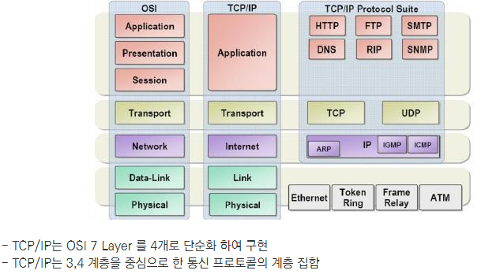
>>
>>각각 네트워크 호스트들의 고유 주소인 IP를 통해 다른 네트워크 안에 있더라도 데이터를 주고 받을 수 있도록 만들어 있다는 것이 특징이다.
>>
>>#### TCP/IP의 구성
>>
>>- TCP/IP 프로토콜은 아래 두가지 프로토콜로 이루어져 있다
>> - 패킷 통신 방식의 인터넷 프로토콜인 **IP (Internet Protocol)**
>> - 전송 조절 프로토콜인 **TCP(Transmission Control Protocol)**
>>- IP는 패킷 전달 여부를 보증하지 않고, 패킷에서 보낸 순서와 받는 순서가 다를 수 있다.
>>- TCP는 IP 위에서 동작하는 프로토콜로, 데이터의 전달을 보증하고 보낸 순서대로 받게 해준다.
>>
>>HTTP,FTP,SMTP 등 TCP를 기반으로 한 많은 수의 애플리케이션 프로토콜들이 IP 위에서 동작하기 때문에, 묶어서 TCP/IP로 부르기도 한다. 
>>
>>
>>
>>위의 사진에서 통신을 수행하는 주체이자 통신의 최종 목적지는 호스트 자체가 아닌
>>
>>호스트에서 수행하는 응용 프로그램(프로세스)이다.
>
>#### **네트워크 접근 계층**
>
>>물리적 네트워크를 통한 실제 데이터 송후신을 담당한다.
>>
>>물리적 신호-> 네트워크 하드웨어, 운영체제가 제공하는 ->장치 드라이버
>>
>>하드웨어적으로 정의된 물리 주소 (physical address)를 사용해 통신하는데,
>>
>>흔히 말하는 이더넷이 48비트 물리 주소이다.
>
>#### 인터넷 계층
>
>>네트워크 접근 계층의 도움을 받아 데이터를 목적지 호스트까지 전달하는 역할을 한다.
>>
>>네트워크 접근 계층처럼 주소를 지정하는 방법이 필요한데 물리 주소 대신 **논리 주소인 IP주소 사용**
>>
>>IP주소는 네트웍 물리주소와 별개로 정의하며, 전 세계적으로 **유일성**을 보장한다.
>
>#### 전송 계층
>
>>최종 통신 목적지를 지정하고 오류 없이 **데이터를 전송하는 역할**을 한다.
>>
>>인터넷 계층의 역할은 IP주소와 라우팅을 이용해 목적지를 호스트에 데이터가 도달할 수 있게 하는 것이다.
>>
>>그러나 통신의 최종 목적지는 호스트가 아닌 해당 호스트에서 실행하고 있는 프로세스(응용 프로그램)입니다.  따라서 전송 계층에서 프로세스를 지정하는 일종의 주소를 사용하는데, 이를 **포트 번호**(Port number)라 한다.
>>
>>따라서 **전송계층**에서는 이러한 데이터 손실 또는 손상을 검출해 잘못된 데이터가 목적지에 전달되는 일을 방지한다.
>>
>>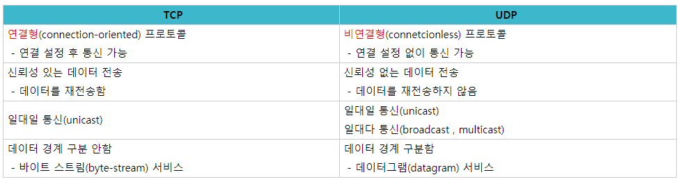
>
>#### 응용 계층(application layer)
>
>>전송 계층을 기반으로 한 다수의 프로토콜(Telnet, FTP , HTTP , SMTP 등)과 이 프로토콜을 사용하는 응용 프로그램을 포괄한다.
>>
>>소켓을 사용한 네트워크 프로그램도 여기에 속함.
>
>포트,소켓 ,ip주소를 햇갈리는 이들에게
>
>>포트는 아파트 번호입니다.
>>소켓은 아파트의 문입니다.
>>IP 주소는 건물의 주소입니다.

#### Socket

>**소켓은** 응용 프로그램에서 TCP/IP를 이용하는 창구 역할을 하며 응용 프로그램과 소켓 사이의 
>
>**인터페이스 역할을** 하고 있다.
>
>두 프로그램이 네트워크를 통해 서로 통신을 수행할 수 있도록 **양쪽**에 생성되는 링크의 단자이다.
>
>**두 소켓이 연결되면 서로 다른 프로세스끼리 데이터를 전달할** 수 있습니다.
>
>**TCP**는 신뢰할 수 잇는 통신을 ,**UDP**는 몇가지 신뢰도는 포기하되 좀더 직접적인 통신을 한다는 의미이다.
>
>#### 소캣의 종류
>
>>스트림(TCP)
>>
>>>양뱡향으로 바이트 스트림을 전송할 수 있는 연결 지향형 소켓으로 양쪽 어플리케이션이 모두 데이터를 주고받을 수 있다.
>>>
>>>이 소켓은 각 메시지를 보내기 위해 별도의 연결을 맺는 행위를 하므로 약간의 오버헤드가 존재한다.
>>>
>>>그러므로 소량의 데이터보다는 **대량의 데이터를 보내는 경우에 적당**합니다. **스트림 소켓은** 이러한 품질의 통신을 수행하기 위해서 **TCP**를 사용한다.
>>
>>데이터그램(UDP)
>>
>>> 연결을 맺지 않으므로 **비 연결형 소켓**이라고 한다.
>>>
>>> 이 프로토콜에서는 메시지의 크기에 약간의 제한이 있으며 메시지의 확실한 전달 역시 보장하지 않으며 통신 중 데이터를 잃어버려도 오류가 발생하지 않는다.
>>>
>>> 하지만 이러한 UDP도 신뢰적인 데이터 전송이 가능하다. 
>>>
>>> 애플리케이션이 신뢰성을 자체에서 제공한다면 신뢰적인 데이터 전송이 가능하다.
>>>
>>> 예를 들어 구글의 QUIC프로토콜이 그 예이다.
>>
>>Raw소켓
>>
>>>패킷을 가져오면 TCP/IP 스택상의 TCP,UDP 계층을 우회하여 바로 어플리케이션으로 송신하는 소켓이다.
>>>
>>>**RAW소켓을** 이용하여 프로그래밍을 하는 일은 거의 드물며 만약 시스템 소프트웨어나 패킷을 분석하는 프로그램을 개발할 경우 필요할 수도 있다.

#### malware

>- malware가 호스트에 침투할 수 있는 위치:
>  - virus: 객체(이메일 attachment) 수신/실행에 의한 자가복제 감염
>  - worm: 스스로 실행되는 물체를 수동적으로 수신하여 자가복제 감염
>- spywre malware가 키 입력, 웹 사이트 방문, 수집 사이트에 정보 업로드 가능
>- 감염된 호스트는 스팸에 사용되는 botnet에 등록될 수 있다. DDoS 공격

#### DDOS 와 DOS

>DoS 공격은 대상 시스템의 서비스 거부를 유발하는 공격이다.
>
>Denial of Service(DoS): 공격자가 가짜 트래픽으로 리소스를 압도하여 리소스(server, bandwidth)를 합법적인 트래픽에 사용할 수 없도록 함.
>
>(고의로 건물을 화재로 설정하는 것도 DoS 공격 이다). 
>
>DDoS 공격은 많은 호스트가 동시에 수행하는 특정 원격 네트워크 기반 DoS 공격을 의미합니다. 

#### Sniffing

>**스니핑**(sniffing)은 네트워크 중간에서 자신이 아닌 남의 패킷 정보를 도청하는 해킹 기법의 하나이다.
>
>promiscuous 네트워크 인터페이스가 모든 패킷(예: 암호)을 읽고 기록한다.
>
>스니핑을 할 수 있도록 하는 도구를 스니퍼라고 하며 스니퍼를 설치하는 과정은 전화기 도청 장치를 설치하는 과정에 비유될 수 있다.

#### Spoofing

>**스푸핑(Spoofing)**의 Spoof은 ‘속이다, 사기치다’의 뜻으로, 인터넷 내에서 여러가지 의미로 사용되며,
>
>잘못된 소스로 패킷을 보내거나 ,
>
>외부의 악의적 네트워크 침입자가 웹사이트를 구성해 사용자들의 방문을 유도,
>
>**인터넷 프로토콜인 TCP/IP의 구조적 결함을 이용해 사용자의 시스템 권한을 획득한 뒤,** 
>
>**정보를 빼가는 해킹 수법**을 말한다.

#### **Application architectures**

>#### client-server
>
>>server:
>>
>>- 모든 서버는 호스트이다
>>  - 모든 호스트가 서버인 것은 아님
>>  - 네트워크에 연결이 확립된 모든 장치는 호스트의 자격이 있는 반면, 다른 장치(클라이언트)로부터의 연결을 수락하는 호스트만 서버가 될 수 있다.
>>- 영구적인 IP 주소
>>- 스케일링을 위한 데이터 센터
>>
>>client:
>>
>>- 서버와 통신
>>- 간헐적으로 연결되었을 수 있다
>>- 동적 IP 주소가 있을 수 있다. (껐다 키면 IP가 바뀔 수 있다)
>>- 서로 직접적으로 통신하지 않는다
>>
>>
>
>#### peer-to-peer (p2p)
>
>>- no always-on server (상시 서버 없음)
>>- 임의의 end systems이 직접적으로 통신
>>- peer가 다른 peer에게 서비스를 요청하고 및 제공함 (동등한 관계)
>>  - self scalability: 새로운 동료(peers) 새로운 service demand 및 새로운 service capacity를 가져온다. -> 스스로 연결망을 넓힌다. 
>>- peers가 간헐적으로 연결되고 IP 주소를 변경한다
>>  - 복잡한 관리
>
>**Processes communicating**
>
>>- process: 호스트 내에서 실행 중인 프로그램
>>  - 같은 호스트 내에서, 두 개의 프로세스들이 (OS에 의해 정의된) inter-process communication를 사용하여 통신한다.
>>  - 서로 다른 호스트의 프로세스가 메시지를 교환하여 통신한다.
>>- clients, servers
>>  - client process: 통신을 시작하는 프로세스이다.
>>  - server process: 연락을 기다리는 프로세스이다.
>>- aside:
>>  - P2P 구조를 사용하는 애플리케이션은 client processes & server processes를 가진다.
>
>

## 캡슐화 & 역캡슐화

>캡슐화 encapsulation
>
>>송신 데이터에 필요한 정보 (헤더) 를 붙여서 다음 계층에 보내는 기술을 의미한다
>>
>>상위 –>**통신 프로토콜 정보 추가**–> 하위
>>
>>헤더 header
>>
>>>각 계층에서 수행한 정보들이 담겨있다 (데이터를 받을 상대에 대한 정보들도 포함되어 있음)
>>>
>>>데이터의 내용이나 성격을 식별하거나 제어하는 데 사용된다.
>
>역캡슐화 decapsulation
>
>>캡슐화의 반대 개념으로, 헤더를 제거하는 것을 역캡슐화라고 한다
>>
>>하위 –>**헤더 제거**–> 상위
>
>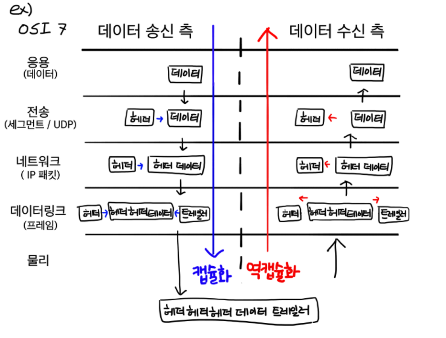
>
>
>

#### SSL

>**SSL(Secure Socket Layer) 프로토콜**은 TCP, UDP 같은 계층의 제3의 트랜스포트 프로토콜이 아니라 대신에 애플리케이션 계층에서 구현된 것이다. 
>
>SSL은 Certificate Authority(CA)라 불리는 서드 파티로부터 서버와 클라이언트의 인증을 하는데 사용된다.

##### HTTP(hypertext transfer protocol)

>client/server 모델
>
>client: 웹 개체를 요청, 수신, (HTTP 프로토콜 사용)하고 표시하는 브라우저
>
>server: 웹 서버가 요청에 대한 응답으로 (HTTP 프로토콜 사용) 오브젝트 전송
>
>즉 클라이언트란 요청을 보내는 쪽을 의미하며 일반적으로 웹 관점에서는 브라우저를 의미한다.
>
>비 상태 프로토콜(stateless protocol)이다. 
>
>본문은 요청의 마지막 부분에 삽입되며, `GET`, `HEAD`, `DELETE`, `OPTIONS`와 같이 리소스를 가져오는 요청은 본문이 필요없다. 
>
>일부 요청은 업데이트를 하기 위해 서버에 데이터를 전송하는데, 보통 `POST` 요청일 경우 Body를 포함하고 있다.
>
>연결을 생성할 때 거치는 핸드쉐이크 과정을 `3 Way Handshake`라고 하는데, 3 Way라는 말 그대로 총 3번의 통신 과정을 거친다.
>
>##### non- persistent HTTP 비지속
>
>>한 번 요청하게 되면 객체를 전달 한 후에 연결을 닫는다.
>>
>>각 object 마다 하나의 TCP connection을 사용하기 때문에 
>>
>>여러개의 객체를 받으려면 여러개의 연결을 해야한다.
>>
>>예를 들어 11개의 객체를 원하면 11개의 TCP연결이 만들어진다.
>>
>>#### RTT
>>
>>>작은 패킷이 클라이언트에서 서버로 이동한 후 다시 이동하는 시간
>>>
>>>비지속 HTTP 응답시간은 =2RTT+파일 전송 시간
>
>##### persistent HTTP 지속
>
>>하나의 TCP 에서 여러개의 객체를 보낼 수 있다.
>>
>>서버는 응답 전송 후 연결을 열어둔다.
>>
>>하나의 TCP 연결을 사용하여 복수의 HTTP요청/응답을 주고받는다는 개념
>>
>>매 요청/응답 쌍마다 새로운 요청을 여는 것과는 반대되는 개념이다.

#### HTTP overview

>- HTTP(Hypertext transfer protocol)
>  - Web's application layer protocol
>  - client/server model
>    - client: web objects를 요청, 수신(HTTP 프로토콜 사용) 및 "displays" 하는 브라우져
>    - server: 웹 서버가 요청에 대한 응답으로 HTTP 프로토콜을 사용하여 객체를 보낸다.
>- TCP 사용:
>  - client는 서버와 TCP 연결을 시작한다 (port 80으로)
>  - 서버는 클라이언트로부터 TCP 연결을 수락한다
>  - 브라우져(HTTP client)와 웹 서버 사이에서 HTTP 메시지(application-layer protocol messages)를 교환한다.
>  - TCP 연결 종료
>- HTTP는 "stateless"
>  - 서버는 과거 클라이언트 요청에 대한 정보를 보관하지 않는다.
>  - stateless: 이전에 했던 것(history)이 지금 상황에 영향을 끼치지 않음

####  HTTP Message

>서버와 클라이언트가 HTTP 통신을 할때 주고 받는 메세지 
>
>HTTP 요청과 응답의 구조 
>
>>- **시작줄(start-line)**(요청라인) 에는 **실행되어야 할 요청** 또는 **요청 수행에 대한 성공, 실패**가 기록되어 있으며, 항상 한줄로 끝난다.
>>- 옵션으로 **HTTP 헤더 세트**가 들어간다. 여기에는 **요청에 대한 설명**, 혹은 메시지 **본문에 대한 설명**이 들어간다.
>>- 요청에 대한 모든 메타 정보가 전송되었음을 알리는 **빈 줄(blank line)** 이 삽입된다. (CR,LF)
>>- cr:carriage return character ,lf: line-feed character
>>- **요청과 관련된 내용(HTML 컨텐츠 등)** 이 옵션으로 들어가거나, **응답과 관련된 문서(document)** 가 들어간다. 본문의 존재 유무 및 크기는 첫 줄과 HTTP 헤더에 명시된다.
>
>#### Request Message 형식
>
>>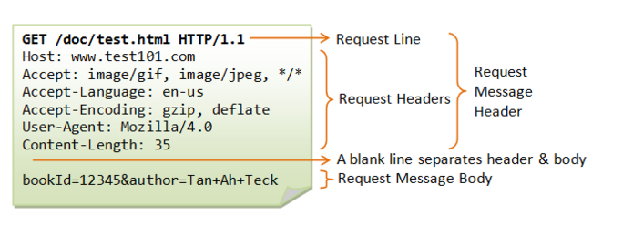
>>
>>요청라인(start-line): 데이터처리방식(HTTP Method) 와 기본페이지, 프로토콜 버전이 포함된다.
>>
>>>데이터 처리방식
>>>
>>> HTTP 프토로콜은 Request MEthod를 사용한다.
>>>
>>>GET: 요청라인을 통해서 자원 요청(캐싱 작업으로 인한 빠름)
>>>
>>>POST: 메세지 본문을 통해서 자원 요청
>>>
>>>PUT: URL에 자원을 생성
>>>
>>>DELETE : URL의 자원을 삭제
>>>
>>>HEAD: HTTP Header 정보만 수신 (요청한 개체를 응답하지 않도록 서버에 요청)
>>>
>>>HTTP/1.0: GET,POST,HEAD 지원
>>>
>>>HTTP/1.0: GET,POST,HEAD,PUT,DELETE 지원
>>
>>요청헤더:User-Aget,Accept,Cookie,Redferer,Host의 정보가 포함된다.
>>
>>>
>>
>>공백라인:요청에 의한 모든 메타정보가 전송되었음을 알림
>>
>>메세지 본문:요청과 관련된 문서가 들어가거나 비어있다. 개체 몸체라고도 한다. 
>>
>>사용자가 검색 단어를 제공할 때 POST 방식을 사용한다. 
>>
>>만약 개체 몸체는 사용자가 폼 필드에 입력 한 것을 포함한다. 
>
>#### Response Message
>
>>
>>
>>상태라인: HTTP버전, 상태코드, Reason-phrase 포함된다.
>>
>>>상태코드
>>>
>>>200:OK
>>>
>>>201:Create
>>>
>>>301:Moved permanently (영구 이동)
>>>
>>>400: Bad Request
>>>
>>>404: Not Found
>>>
>>>505: HTTP Version Not Supported
>>
>>응답해더: Date,Server,Content-tpye,Last-Modified 정보가 포함된다.
>>
>>Last-Modified는 객체가 생성되거나 마지막으로 수정된 시간과 날짜를 나타내는데
>>
>>이 해더는 로컬 클라이언트와 네트워크 캐시서버에서의 객체 캐싱에 매우 중요하다. 
>>
>>공백라인: 위와 동일
>>
>>메세지 본문: 위와 동일
>
>### 캐시와 쿠키 차이점
>
>쿠키는 서버가 사용자 접속을 제한하거나 사용자에 따라 콘텐츠를 제공하기 원하므로 웹 사이트가 
>
>사용자를 확인하는 것이 바람직할 때 쿠키를 사용한다. 
>
>즉 쿠키는 사용자 식별에 용이 비상태 HTTP에서 사용자 세션 계층을 생성하는데 이용된다. 
>
>쿠키는 다음과 같은 방법으로 상태를 저장한다. 
>
>- protocol endpoints: 여러 트랜잭션에서 송/수신자 상태를 유지
>- cookies: http 메시지는 state를 나타낸다(carry)
>
>Web caches (proxy server)는 원래 서버없이 클라이언트 요청 충족하기 위해 작동한다.
>
>- 사용가 브라우저를 설정: 프록시 서버에 요청된 내용들을 캐시를 통한 웹 접근한다. 
>- Proxy Server: 클라이언트가 자신을 통해서 다른 네트워크 서비스에 간접적으로 접속할 수 있게 해주는 컴퓨터이다.
>- 서버와 클라이언트 사이에서 중계기로서 통신을 수행하는 기능을 가리켜 proxy라고 한다
>- 브라우저는 모든 HTTP 요청을 캐시로 보낸다
>  - 캐시의 객체: 캐시는 객체를 반환하거나
>  - 캐시는 원래 서버에서 객체를 요청한 다음 객체를 클라이언트에게 반환를한다.
>
>
>
>추가적으로 웹 캐시는 기관의 접근 링크에서 트래픽을 줄이고
>
>대역폭 (bandwidth) 사용을 줄인다. 
>
>쿠키는 사용자의 PC의 임시저장소에 저장되고 캐시는 웹 서버의 저장소에 저장된다. 

#### 프록시 서버(proxy server) && web cashing

>프록시 서버는 클라이언트가 자신을 통해서 다른 네트워크 서비스에 간접적으로 접속 할 수 있게하는
>
>응용 프로그램

### 조건부 GET

>웹 캐시와 연관이 깊다.
>
>웹 캐시를 통해 사용자가 느끼는 응답 시간을 줄일 수 있지만 웹 캐시 서버에 있는 데이터가 가장 최근 것인지 확인하는 작업이 필요하다.
>
>즉 기존 서버의 데이터는 최신 것 으로 업데이트가 되어있는데 웹 캐시에 있는 복사본 데이터는 업데이트 이전에 생성된 복사본 데이터 일수도 있다.
>
>이러한 문제를 해결하기 위해 HTTP는 조건부 GET 메소드를 이용한다.
>
>Last-modified 와 if-nodified-since 값이 같게 되면 객체 애대한 변경이 없다고 가정하여 
>
>클라이언트에게 304 Not Modified 를 보내게 되는 것이다.
>
>이 상태라인을 통해 Origin 서버는 클라이언트의 요청 객체를 웹 캐시에 복사본을 그대로 사용하라는 뜻이다.

#### SMTP(Simple Mail Transfer Protocol)

> e-mail을 컴퓨터에서 다른 컴퓨터로 전송할 때 사용하는 메일 서버의 기본 프로토콜 이다. 
>
> SMTP는 지속적인 연결을 사용한다. 
>
> 3가지 구성요소
>
> >- user agents
> >- mail servers
> >- simple mail transfer protocol: **SMTP**
>
> mail servers:
>
> >- mailbox는 사용자에게 들어오는 메시지를 포함한다.
> >- 보내지는 메일 메시지의 message queue에 저장된다. 
> >- **메일 서버들** 사이에서 **메일 메시지**를 보내기 위한 SMTP protocol
> >  - client: 메일을 서버에게 보냄
> >  - server: 수신 메일 서버
>
> RFC2821 에따라 규정한 사용TCP포트번호는 25번 이고, 메일 서버간의 송수신뿐만 아니라, 메일 클라이언트에서 메일 서버로 메일을 보낼 때에도 사용되는 경우가 많다.
>
> SMTP는 푸시 프로토콜이기 떄문에 pull 동작을 수행할수 없다. 따라서 pull 동작을 지원하는 
>
> pop3와 IMAP를 사용한다.
>
> #### HTTP와 비교
>
> >- HTTP: pull
> >- SMTP: push
> >- 둘 다 ASCII 명령/응답 interaction, status codes를 가진다.
> >- HTTP: 각 객체는 자체 응답 메시지로 캡슐화된다.
> >- SMTP: 여러개의 메시지를 보내는 여러개의 객체
> >- HTTP는 클라이언트가 먼저 전송하고 서버가 응답을 주는데 FTP,SMTP,POP3,NNTP는 서버가 먼저 자신의 존재를 전송한다.

#### pop3

>**POP3**란 받는 메일이라고 불리는 POP (Post Office Protocol) 서버를 말하고, 3는 version3 라는 뜻이다.
>
>응용 계층 인터넷 프로토콜 중 하나로 메일 서버에 저장되어 있는 메일을 아웃룩 익스프레스와 같은 메일  
>
>전문 프로그램을 이용하여 **자신의 컴퓨터로 가져오는 역할을 한다.**
>
>인터넷 전용 서비스나 통신망 서비스는 모두 POP3 방식의 이메일 서비스를 지원하고 있습니다.
>
>POP3를 이용해 각 웹사이트의 메일들을 한곳으로 모아 직접 사이트에 접속해 각각 확인하지 않아도 하나의 메일로 송수신이 가능하다.
>
>POP3는 일반적으로 메일 서버에 연결하여 컴퓨터에 메시지를 다운로드한다. 그런 다음 선택적으로 서버에서 메시지를 삭제할 수 있다.

#### **IMAP** (Internet Message Access Protocol)

>수신함에 메일 전체를 가져오는 POP과 달리 메일의 제목이나 보낸 사람만 보고 메일을 다운로드할 것인지 선택할 수 있다. 그리고 이메일 메세지를 서버에 남겨두었다가 나중에 지울 수도 있다.
>
>pop3는 오프라인만 지원하는데에 반해 IMAP는 온라인 모드와 오프라인 모드를 모두 지원한다.

#### pop3 와 IMAP 차이점

>데스크톱 PC, 휴대폰, 랩톱 및 웹 인터페이스와 같은 여러 장치에서 동일한 전자 메일 계정을 사용하는 경우 IMAP는 환상적이다. 한 기기에서 이메일을 읽을 때마다 IMAP 서버와 동기화 된 다음 다른 모든 기기와 동기화되어 모든 기기에서 읽은 것으로 표시된다.
>
>반면에 POP3는 이메일을 클라이언트로 다운로드 한 다음 서버에서 (일반적으로) 삭제한다. 즉, 휴대 전화를 사용하는 동안 이메일을 받고 읽을 때 데스크탑 PC에서는 이메일을받지 못한다. 
>
>POP3는 세션 전체에서 stateless이고,
>
>사용자의 state를 across session에 저장가능하다.

### DNS(Domain Name System)

>**DNS**라하면 인터넷망통신규약인 TCP/IP 네트워크상에서 사람이 기억하기 쉽게 문자로 만들어진 도메인을 컴퓨터가 처리할 수 있는 숫자로 된 인터넷주소(IP)로 바꾸는시스템인 Domain Name System을 일컫기도 하고, 이런**역할**을 하는 서버컴퓨터 즉 Domain Name Server라고 한다.
>
>많은 name 서버의 계층 구조로 구현된 분산 데이터 베이스 이며
>
>application layer protocol로 구현된 핵심 인터넷 기능을 제공한다.  
>
>: ip주소는 4바이트로 구성되어있다.
>
>## DNS service
>
>>host aliasing : 복잡한 호스트 네임을 가진 호스트는 하나 이상의 별명을 가질 수 있다.
>>
>>ex) naver.com || www.naver.com
>>
>>mail server aliasing : 핫메일 서버의 호스트네임은 bob@hotmail.com 처럼 간단하지 않다.
>>
>>이것을 간단하게 만들어주는 역할을 한다.
>>
>>**load distribution** : DNS는 중복 웹서버 같은 여러 중복 서버 사이에 부하를 분산하기도 한다.
>>
>>예를 들어 인기 있는 사이트는 여러 서버에 중복되어 있어서 서로 다른 ip주소를 같는다. 
>>
>>DNS는 이러한 IP주소 집합을 가지고 있어서 부하가 걸리지 않게 서로 다른 ip주소를 제공한다. 
>>
>>이 처럼 DNS의 간단한 설계로 모든 매핑을 포함하는 하나의 인터넷 네임 서버를 생각 할 수 있다.
>>
>>하지만 만약 단일 DNS 서버를 가지게 되면 확장서이 없기때문에 분산되도록 설계 되었다. 
>
>#### root name servers
>
>>이름을 확인할 수 없는 로컬 이름 서버에 의해 연결됨
>>
>>로컬 이름 서버에 매핑을 반환함
>
>#### top level domain (TLD) servers
>
>>com, org, net, edu, 가 예시로, 직업, 박물관 및 모든 최상위 수준의 국가 도메인
>>
>>네트워크 솔루션에서 .com TLD용 서버를 유지 관리
>
>#### authoritative DNS servers: (책임 DNS서버)
>
>>조직의 자체 DNS 서버, 조직의 명명된 호스트에 대한 IP 매핑에 권한 있는 호스트 이름 제공
>>
>>조직 또는 서비스 제공업체가 유지 관리할 수 있음
>
>#### Local DNS name server
>
>>계층에 완전히 속하지 않는다.
>>
>>ISP(주거 ISP, 회사, 대학)는 각각 1개씩 가지고 있다.
>>
>>호스트가 DNS 쿼리를 만들 때 쿼리가 로컬 DNS 서버로 전송됨
>>
>>proxy 역할을 하며 쿼리를 계층구조로 전달하는 역할을 한다.
>
>
>
>**iterated query:**
>
>>- 접속한 서버가 접속할 서버 이름으로 연결
>>
>>1. local DNS 서버한테 해당 도메인의 IP 주소를 아니? 물어봄
>>
>>2. local DNS server가 root DNS server한테 물어봤는데 모른다고 하면
>>
>>4,6. TLD DNS 서버한테 물어보고 그래도 모르면 authoritative DNS 서버한테 물어봄
>
>**recursive query:**
>
>>- 연결할 수 있는 name server에 name 확인 부담을 줌
>>
>>- DNS 클라이언트가 최종 응답이 클라이언트에 반환될 때까지 후속 DNS 서버를 쿼리하도록 설정된 DNS 서버로부터 정보를 요청할 때 발생
>>
>>1. local DNS 서버한테 해당 도메인의 IP 주소를 아니? 물어봄
>>
>>2. local DNS server가 root DNS server한테 물어봤는데 모르면
>>
>>4. root DNS server가 TLD DNS 서버한테 물어보고 그래도 모르면
>>
>>5. TLD DNS 서버가 authoritative DNS 서버한테 물어봄
>
>이런 지연 을 향상 시키기 위해 DNS 캐싱을 사용한다. local DNS 서버에 질의 받았던 것을 기억하는 식이다.
>
>#### DNS 레코드
>
>>DNS 서버들은 호스트 네임을 IP주소로 매핑하기 위한 자원 레코드(RR)을 저장한다.
>>
>>각 DNS는 하나 이상의 자원 레코드 가진 메세지로 응답한다. 
>>
>>TTL은 데이터의 유효기간을 의미한다.  (Time to live)
>>
>>(Name, Value, Type , TTL)
>>
>>Type=A이면 Named은 호스트 네임이고 Value는 호스트 네임에 대한 IP주소이다.
>>
>>Type=NS이면 Name은 도메인이고 Value는 도메인 내부의 호스트에 대한 IP주소를 얻을수 있는 방법을 
>>
>>아는 책임 DNS 서버의 호스트 네임이다.
>>
>>Type=CNAME이면, Value는 별칭 호스트 네임 Name에 대한 정식 호스트 네임이다.
>>
>>Type=MX이면 Value는 별칭 호스트 네임 Name을 갖는 메일 서버의 정식이름이다. 
>
>#### DNS Attacking
>
>>중간자 공격 (man-in-middle) :공격자는 호스트로부터 질의를 가로채어 가짜 응답을 리턴한다.
>>
>>Dns중독 (poi-soning) : 공격자는 DNs 서버로 가짜 응답을 보내어 그서버가 자신의 캐시에 가짜 코드를 받아드리도록 하는 것. 

#### p2p

>P2P 파일 전송 네트워크는 클라이언트나 서버란 개념 없이, 오로지 동등한 계층 노드들(peer nodes)이 서로 클라이언트와 서버 역할을 동시에 네트워크 위에서 하게 된다. 
>
>따라서 서버가 항상 온라인 인 것이 아니다. 
>
>이 네트워크 구성 모델은 보통 중앙 서버를 통하는 통신 형태의 클라이언트-서버 모델과는 구별된다.
>
>FTP 서버야 말로 P2P 파일 전송 형식이 아닌, 대표적 반례로 꼽을 수 있다. 어떤 사용자가 FTP 서버에 어떤 파일을 올리면 다른 사용자들이 내려 받는데, 올리는 쪽과 내려받는 쪽 모두 동시에 접속하지 않아도 된다.
>
>client-server 랑 p2p랑 파일 분배하는데 걸리는 시간은
>
>즉, server-client는 N개의 파일을 올릴 때, 서버가 순차적으로(capacity만큼씩) 다 올려야하고, P2P에서는 peers들이 1개 이상씩 올려서 N개가 되면 되니까, P2P의 file distribution time이 더 짧다.
>
>#### 비트 토렌트
>
>>토렌트에 참여하는 피어들은 서로에게서 같은 크기의 청크를 다운한다. 
>>
>>일반적으로 청크의 크기는 256KB이다. 
>>
>>각 토렌트는 트랙커라고 부르는 기반구조 노드를 가지고 있다. 
>>
>>한 피어가 토렌트에 가입할 떄 트랙커에 자신을 등록하고 주기적으로 자신이 아직 토렌트에 있음을 알린다.
>>
>>트랙커는 참여하는 피어들을 추적한다. 
>>
>>트랙커는 참여하고 있는 피어 집합을 선택하여 피어들의 IP주소들을 앨리스에게 보낸다. 이 피어들의 리스트를 얻어서 모든 피어들과 동시에 TCP연결을 설정한다. 
>>
>>이웃 피어들 가각에게 그들이 가지고 있는 청크 리스트를 요구한다. 
>>
>>따라서 torrent는 피어쌍들이 청크파일을 교환하는 것이라고 말 할 수 있다. 혹은
>>
>>파일들을 교환하는 peers 그룹을 나타낸다. 
>>
>>이 때 청크를 제일 먼저 요구하는 것이 가장 드문것을 먼저(rarest first) 기법을 사용하여 빨리 재분배를 하게 한다.
>>
>>그리고 비트를 수신하는 속도가 제일 빠른 피어들을 선택한다. 이 떄 선택된 피어들은 활성화(unchoked) 라고한다.  여기서 비트 토렌트 용어로 선택된 피어들을  낙관적으로 활성화(optimistically unchoked) 되었다고 한다. 
>>
>>이러한 교역을 위한 보상 방식을 TFT(tit-for-tat) 이라고 한다. 이 보상방식을 회피할 수 있지만
>>
>>수백만의 피어들이 능동적으로 파일을 공유하고 있다. 

### CDN(Content Dis-tribution Network)

>사용자가 원격지에 있는 서버(Origin Server)로 부터 Content(예. Web Object, Video, Music, Image, Document 등)를 다운로드 받을때 가까이 있는 서버에서 받는 것보다 시간이 오래 걸리므로, 
>
>사용자와 가까운 곳에 위치한 Cache Server에 해당 Content를 저장(캐싱)하고 Content 요청시에 Cache Server가 응답을 주는 기술이다.
>
>CDN은 클러스터에 의해 Push 방식이 아닌 PUll 방식을 가진다. 상요자가 지역 클러스터에 없는 비디오를
>
>시청하면 다른 클로스터로 부터 전달받아 저장하고 전달한다. 자주 사용되지않는 것은 삭제된다. 
>
>#### CDN 구축 2가지 방법
>
>>Enter Deep: 서버 클로스터를 세계 곳곳의 접속 네트워크에 구축한다.
>>
>>Bring Home: 보다 적은 핵심 지점에 큰 규모의 서버 클로스터를 구축하여 ISP를 Home으로 가져오는 구조를 가진다. 

#### DASH

>DASH(Dynamic,Adaptive Streaming over HTTP)에서 비디오는 여러 개의 서로 다른 버전으로 인코딩되며
>
>각 버전은 서로 다른 비트율과 품질 수준을 가지고 있다. 클라이언트는 동적으로 서로 다른 버전의 비디오를
>
>몇 초 분량의 길이를 가지는 비디오 조각 단위(Chunk)로 요청한다. 가용 대역폭이 충분하면 높은 비트율의 
>
>비디오 버전을 요청하며 가용 대역폭이 적을 때는 낮은 비트율의 비디오 버전을 요청한다.  
>
>DASH를 사용 할 때 각 비디오 버전은 HTTP 서버에 서로 다른 URL을 가지고 저장된다. 
>
>HTTP서버는 비트율에 따른 각 버전의 URL을 제공하는 **매니페스트 파일**을 가지고 있다. 

### 서버 클로스터

>각기 다른 서버(Server Enterprise or server Datacenter)들을 하나로 묶어서 하나의 시스템같이 동작하게 함 으로써, 클라이언트들에게 고가용성의 서비스를 제공하는 것을 말한다.
>

#### 소켓 프로그래밍

>#### TCP(server)
>
>>```python
>>from socket import *
>>
>># TCP socket 설정
>>TCPsocket = socket(AF_INET, SOCK_STREAM) #tcp 소켓생성
>>TCPsocket.bind(('127.0.0.1', 4000))  #IP주소와 포트설정
>>TCPsocket.listen(1) # socket 클라이언트로부터 오는 신호 받을 준비
>>connection, addr = TCPsocket.accept() #신호 수락
>>data = connection.recv(1024) #데이터 크기 설정.
>>connection.send(data) #클라이언트에 값 전달.
>>connection.close() #소켓 닫기
>>```
>
>#### TCP(Client)
>
>>```python
>>from socket import *
>>TCP_Client = socket(AF_INET, SOCK_STREAM) #tcp 소켓생성
>>TCP_Client.connect(('127.0.0.1', 4000)) #서버 IP와 포트번호 접속
>>TCP_Client.sendall("data insert ".encode()) #보내고 싶은 데이터를 ""안에 입력 후 인코딩 후 전송 
>>resp = TCP_Client.recv(1024) #서버로부터 답신
>>
>>print(resp.decode())
>>```
>
>#### UDP(Server)
>
>>```python
>>from socket import *
>>
>>sock = socket(AF_INET, SOCK_DGRAM) #UDP 소켓생성
>>sock.bind(('127.0.0.1',4000))	#IP 포트번호 지정
>>data, addr = sock.recvfrom(200)	# 데이터 수신 대기 (크기)
>>sock.sendto(data,addr) #데이터를 클라이언트에게 보냄
>>sock.close() #소켓 닫기
>>```
>
>#### UDP(Client)
>
>>```python
>>from socket import *
>>
>>sock = socket.socket(socket.AF_INET, socket.SOCK_DGRAM) #UDP 소켓생성
>>sock.sendto("data insert".encode(), ('127.0.0.1',4000)) #""안에 적은 데이터를 인코딩 후 ip,포트번호로 전송
>>data, addr = sock.recvfrom(200) #Server로 부터 받은 데이터와 주소
>>print(data.decode())
>>```
>>
>>**socket programming with UDP**
>>
>>>- UDP: 클라인트와 서버 사이에 연결이 없다
>>>  - 데이터 보내기 전에 handshaking 없다
>>>  - 각 패킷에 IP 목적지 주소랑 port 명시적으로 부착하고 보냄 (따로따로)
>>>  - rcvr은 수신한 패킷에서 발신자 Ip주소와 포트 번호를 추출
>>>- UPD: 전송된 데이터가 솔실되거나, 뒤죽박죽으로 도착 가능(out of order)
>>>  - 패킷 단위로 보내서 상황에 따라 뒤에 순서인 것이 먼저 도착 가능
>>>  - 이럴때는 그냥 버리고 다시 받음
>>
>>**Socket programming with TCP**
>>
>>>- client는 반드시 서버와 연결해야한다.
>>>  - 서버 프로세스는 반드시 먼저 작동해야한다.
>>>  - 서버는 클라이언트의 연결을 받기 위해 반드시 소켓을 만들어야한다.
>>>- 클라이언트는 다음을 통해 서버와 연결한다:
>>>  - 서버 프로세스의 IP 주소와 포트번호를 지정하여 TCP 소켓 생성
>>>  - 클라이언트가 소켓을 만들면 클라이언트 TCP는 서버 TCP와 연결을 설립한다.
>>>  - 클라이언트와 연결되면 서버 TCP는 서버 프로세스가 해당 특정 클라이언트와 통신 할 수 있도록 새로운 소켓을 만든다.
>>>    - 서버가 여러 클라이언트와 대화할 수 있다.
>>>    - 클라이언트를 구별하는데 사용되는 source port numbers

#### 트랜스 포트 계층

>호스트 대 호스트 논리적 통신을 맡은 부분은 **네트워크 계층**이고 여기에 주 모델인
>
>IP 서비스 모델은 호스트 간의 **최선형 전달 서비스**(best-effort delivery)를 제공한다. 
>
>ip는 세그먼트 전달을 보장하지 않고 세그먼트를 순서대로 보내는 것을 보장하지 않기 때문에 
>
>**비신뢰적인 서비스**라고 한다. 
>
>**프로세스 대 프로세스 논리적 통신**(logical communication) , 즉 멀리 있는 프로세스도 연결되어있다고 느끼게 하는 것을 맡은 부분은 **트랜스 포트 계층**이다.
>
>network layer(3계층): 호스트들 사이에서 logical communication
>
>transport layer(4계층): 프로세스들 사이에서 logical communication
>
>- network layer services에 의존
>
>TCP에 대한 트랜스포트 계층 패킷을 **세그먼트**로 UDP에 대한 패킷을 **데이터그램**으로 표기한다.
>
>UDP는 다중화/역다중화  및 오류검출 만 하며
>
>TCP는 혼잡제어, 흐름제어를 추가적으로 수행한다. 
>
>트랜스포트 계층 세그먼트의 데이터를 올바른 소켓으로 전달하는 작업을 역다중화 라고 하고 
>
>세그먼트들을 네트워크 계층으로 전달하는 작업을 다중화 라고 한다. 
>
>역다중화는 세그먼트 필드를 검사한후 해당하는 소켓으로 보내주는 역할을 하며
>
>다중화는 데이터에 헤더 정보로 캡슐화하고 그 세그먼트들을 네트워크 계층으로 전달하는 작업을 한다. 
>
>#### 트랜스포트 계층 다중화 두가지 요구사항
>
>>1. 소켓은 유일한 식별자를 가진다.
>>2.  각 세그먼트는 세그먼트가 전달될 적절한 소켓을 가리키는 특별한 필드를 가진다. 
>>
>>이 특별한 필드는 **출발지 포트 번호 필드**와 **목적지 포트 번호 필드**이다. 
>>
>>여기서 출발지 포트번호는 복귀주소의 한 부분으로 사용된다. 
>>
>>UDP는 출발지 포트번호와 목적지 포트번호 , length, checksum  필드를 가지며
>>
>>TCP는 출발지,목적지 포트 번호 및 출발지 IP주소 , 도착지 IP주소 를 가진다. 
>
>세그먼트가 호스트에 도착하면, 트랜스 포트 계층은 세그먼트 안의 목적지 포트 번호를 
>
>검사하고 상응하는 소켓으로 세그먼트를 보낸다. 
>
>웹 서버 와 TCP에서는 연결 소켓과 프로세스 사이에 항상 일대일 대응이 이루어 지는 것이 아니다.
>
>실제로 하나의 프로세스만 사용한다. 가벼운 서브 프로세스인 쓰레드를 생성하여 연결한다.

#### 비연결형 트랜스포트 UDP

>#### TCP와 UDP 비교
>
>>TCP는 무슨 데이터를 언제 보낼지에 대해 애플리케이션 레벨에서 더 종교한 제어가 가능하기 때문에 신뢰적인 통신을 가능하게 한다.
>>
>>하지만 UDP는 비신뢰적인 통신을 하는데 신뢰적인 통신을 하게 해주는 어플리케이션 계층이 있다.
>>
>>예를 들어 구글의 크롬 부라우저에 사용되는 QUIC프로토콜이 그 예이다. 
>>
>>연결설정이 없기때문에 지연이 없고 이러한 특성으로 인해 DNS,streaming multimedia 에서 주로 사용한다.
>>
>>연결상태가 없기 때문에 특정 애플리케이션에 할당된 서버는 애플리케이션이 TCP 보다 UDP에서
>>
>>동작할때 더 많은 클라이언트를 수용 할 수 있다.
>>
>>작은 패킷 헤더 오버헤드: TCP가 세그먼트마다 20바이트의 헤더 오버헤드를 갖는 반면에
>>
>>UDP는 단지 8바이트 오버헤드만 가진다. 
>>
>>**연결 지향 demux** -> TCP 역다중화
>>
>>- TCP 소켓과 UDP 소켓 사이의 다른 점은 TCP 소켓은 4가지 요소들의 집합:
>>-  [출발지 IP 주소, 출발지 포트 번호, 목적지 IP주소, 목적지 포트 번호]에 의해서 식별된다는 것이다.
>>  - 목적지가 같아도 출발지가 다르면 다른 소켓으로 감
>>- 서버 호스트는 동시에 존재하는 많은 TCP 소켓을 지원할 수 있다.
>
>#### UDP 구조
>
>>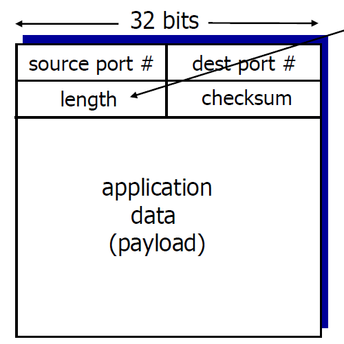
>>
>>UDP 헤더는 2바이트씩 구성된 4개의 필드를 가진다. 
>>
>>포트번호는 역다중화/다중화 작업에 필요한 것이며 체크섬은 세그먼트에 오류가 발생했는지 검사 하기 위해 수신호스트에서 사용된다. 
>>
>>길이필드는 헤더를 포함하는 UDP 세그먼트의 길이를 바이트 단위로 나타낸다. 
>>
>>UDP에서 기본적인 demultiplexing 동작 방식
>>
>>>호스트의 각 소켓은 포트 번호를  할당받는다.
>>>
>>>- who? os가 포트 번호 할당
>>>- how? list를 관리하면서 서로 다른 포트 번호를 할당
>>
>>#### 체크섬
>>
>>>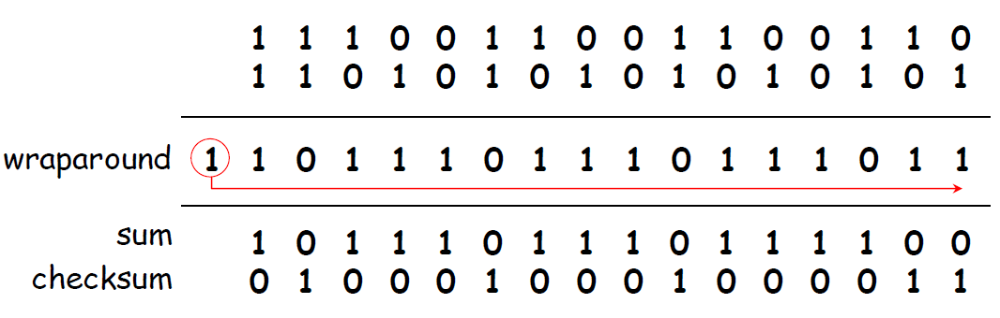
>>
>>많은 링크 계층 프로토콜이 오류검사를 제공하는데 왜 UDP가 체크섬을 제공할까?
>>
>>출발지와 목적지 사이의 모든 링크가 오류 검사를 제공한다는 보장이 없기 때문이다. 
>>
>>따라서 종단가의 트랜스포트 계층에서 오류검사를 제공해야한다는 시스템 설계를
>>
>>**종단간의 원리** 라고 한다. 

#### rdt (reliable data transfer)

>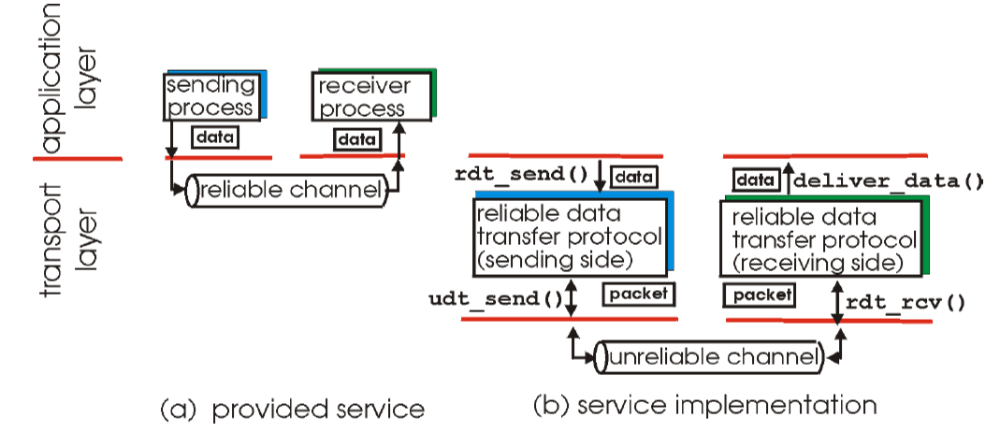
>
>rdt_send() 란 송신측이 호출되고 있는 것이고
>
>rtd_rcv()는 패킷이 수신측으로 도착한 경우에 호출된다.
>
>deliver_data()는 상위계층으로 데이터를 전달하며
>
>udt_send()는 이제 패킷을 보내는데 신뢰적이지 않은 채널을 통해 보낸다는 것이다. 
>
>하위 채널에서 데이터를 받을때에는 TCP가 resemble 하는 과정을 거치는데 이 과정에서 rdt가 가능하다고 생각함.
>
>#### rdt1.0
>
>>하위 채널이 완전히 신뢰적인 가장 간단한 경우
>>
>>유한상태 머신(finite-state machine)FSM을 사용한다. 
>>
>>여기서 수신자 , 송신자 동작이 별개로 구성되어있다. 
>>
>>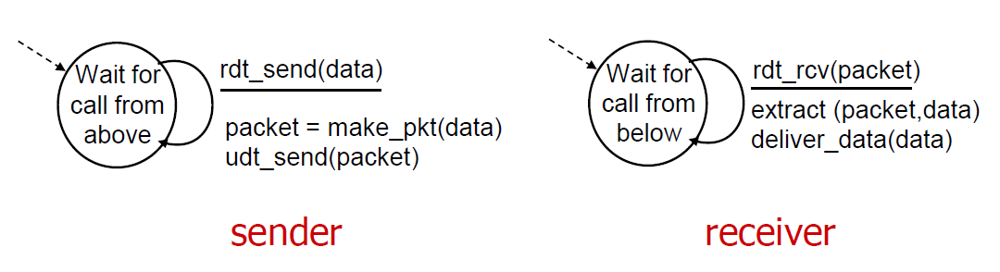
>>
>>라인 위 및 점선은 이벤트를 말하며 이벤트 후 action은 라인 밑과 실선으로 구분된다.
>>
>>아무것도 이벤트를 하지 않으면 꺽새로 표현한다.
>>
>>sender는 위로부터 데이터를 보내겠다고 하면 패킷을 만들고 전송하고
>>
>>리시버는 하위로부터 데이터가 오길 기다리고 패킷을 받으면 packet에서 
>>
>>추출하여 데이터를 위로 보낸다. 
>>
>>이 과정은 신뢰적인 채널에서는 오류가 생길 수 없으므로 수신 측이 송신 측에게 어떤 피드백도
>>
>>제공 할 필요가 없다. 
>
>#### rdt2.0
>
>>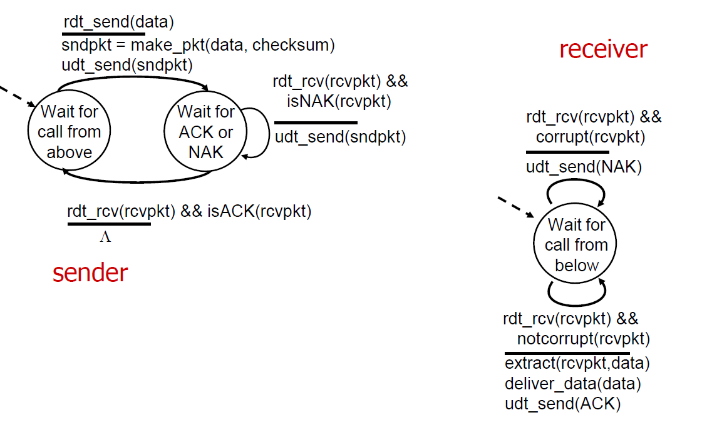
>>
>>rdt 2.0은 biterror 가 있는 채널상에서 신뢰적인 전송이다.
>>
>>비트에러가 난 여부를 잘받았으면 잘 받았다고 응답하는 것이다.
>>
>>긍정 확인 응답(acknowledgements)(ACK) 와 
>>
>>부정확인 응답(negative acknowledgements)(NCK)를 사용한다. 
>>
>>컴퓨터 네트워크 설정에서 그러한 재전송을 기반으로 하는 신뢰적인 데이터 전송 프로토콜은 
>>
>>자동 재전송 요구(ARQ) 프로토콜이라고 한다. 
>>
>>보내는 측에서 데이터를 보내면 패킷을 만들고 여기에 checksum을 더한다.
>>
>>그리고 체크섬이 포함된 패킷을 보내고 다음 상태 변화가 일어난다.
>>
>>ACK or NCK가 올때까지 기다리는 상태로 된다.
>>
>>수신쪽에서 checksum을 이용해 데이터 오류를 확인한다. 오류가 없으면 ACK,오류 일시에는 
>>
>>NCK를 송신측으로 보낸다.
>>
>>송신측에서 NAK가 오면 마지막 패킷을 재전송을 하고 ACK가 오면 가장 최근에 패킷이 정확하게 수신 된 것을 알기 때문에 위에서 데이터가 오길 기다리는 상태로 바뀐다.
>>
>>이때 ACK,NCK 답변을 기다리는 상태에서는 더 이상의 데이터를 전달 받을 수 없다.
>>
>>이러한 특성으로 전송 후 대기  프로토콜(stop-and-wait)로 알려져있다. 
>>
>>여기서 만약 ACK,NCK가 손상되면 어떻게 될까?
>>
>>송신자가 왜곡된 ACK,NCK를 받게 되면 패킷을 단순히 재송신하는데  이 패킷은 중복 패킷(**duplicate packet**)을 전달한다.
>>
>>그러므로 도착하는 패킷이 새로운 데이터를 포함하고 있는 것인지 재전송인지를 모른다. 
>>
>>따라서 해결책은 데이터 패킷에 **순서번호**(sequence number)를 삽입하는 것이다. 
>>
>>순서번호는 0,1로 확인하여 새로운 패킷인지 다시 재전송인지를 알게 된다. 
>
>#### rdt2.1
>
>>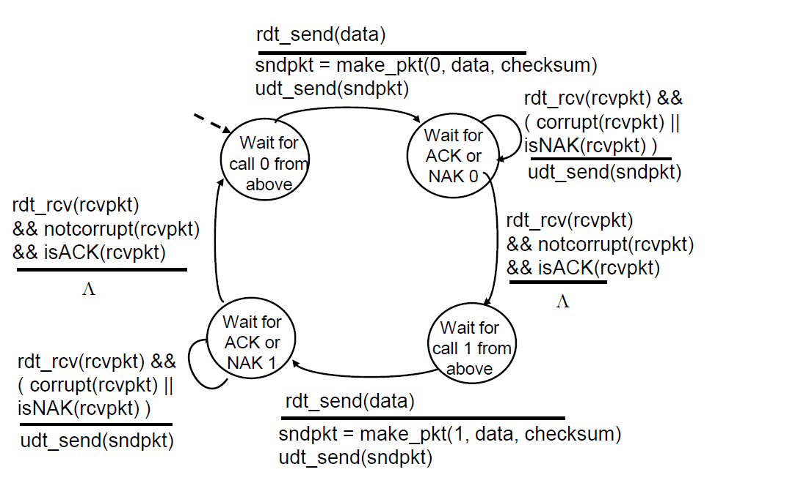
>>
>>송신자 부분이다.
>>
>>패킷에 0을 추가하는 것이 seq#이다.
>>
>>먼저 패킷을 보낸후 ACK or NAK 0 을 기다린다. 만약 패킷이 손상되거나 NAK가 넘오면
>>
>>다시 보내고 손상되지 않고 ACK가 오면 데이터 1을 기다리는 상태로 간다.
>>
>>마찬가지로 패킷(1) 을 보낸후 ACK or NAK 1 을 기다리는 상태가 된다. 이러한 일련 과정이
>>
>>반복된다. 
>>
>>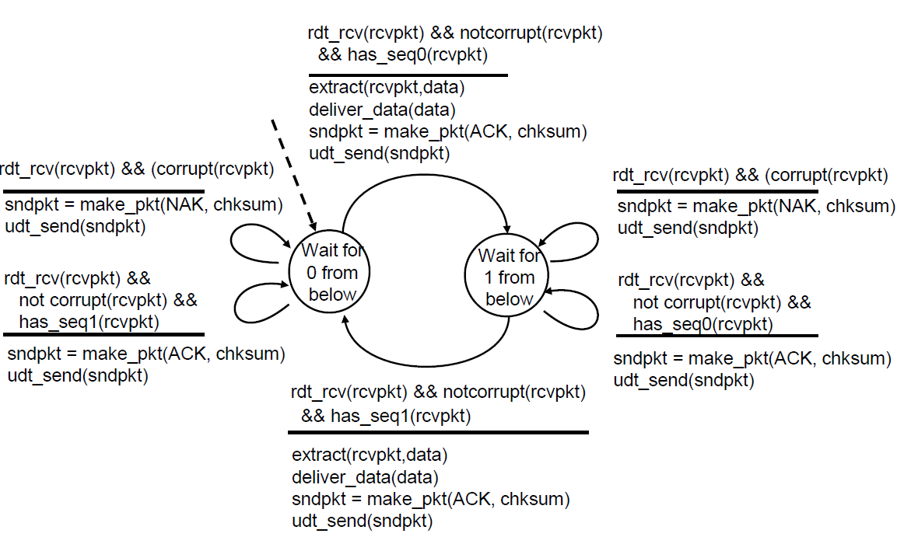
>>
>>먼저 0 패킷이 오기를 기다린다. 이떄 패킷이 손상되면 NAK를 보내고 패킷이 손상되지않았지만
>>
>>패킷 번호가 1이면 1에 대한 ACK를 보내고 다시 0패킷이 올때까지 기다린다.
>>
>>제대로 패킷이 손상되지않고 0인 패킷이 왔을때 추출하여 위로 보내고 ACK를 보낸다.
>>
>>1일 떄도 0인 부분이랑 유사하게 작동한다.
>>
>>**rdt2.1: 깨진(잘못된) ACK/NAKs 처리** 
>>
>>- 송신자: 패킷에 순서(seq) 추가
>>
>> - seq는 0,1이면 충분
>>   - 어차피 하나 보내 놓고 ACK/NAK 패킷 올 때까지 기다리는 stop-and-wait 구조이기 때문이다.
>>
>>- 수신자:
>>
>>   - 반드시 패킷이 중복되었는지 확인해야 한다.
>>   - 원하는 패킷을 0 또는 1로 나타냄
>>   - 수신자는 최근에 보낸 ACK/NAK을 송신자가 잘 받았는지 알 수 없다
>>
>> 
>>
>>rdt2.1은 순서가 바뀐 패킷이 수신되면 수신자는NCK를 보내느 것이 아니라
>>
>>이미 전에 수신한 패킷에 대한 ACK를 보낸다. 
>>
>>예를 들어 송신자가 1,2 를 보내고 수신자는 1,2에 대한 ACK를 이미 한 상태에서 4를 받으면
>>
>>2에 대한 ACK를 보낸다. 이러한 중복 ACK를 수신받은 송신자는 수신자가 두 번 ACK 한 패킷의 다음 패킷을 정확하게 수신 못했다는 것을 인지한다. 
>
>#### rdt2.2
>
>>비트 오류를 갖는 채널을 위한 NAK없는 신뢰적인 데이터 전송 프로토콜
>>
>>오로지 ACK만 사용하며 
>>
>>**수신자가 확인 응답하는 패킷의 순서 번호를 반드시 포함하여 ACK를 보낸다.**
>>
>>송신자가 중복된 ACK을 수신하면(같은 패킷에 대한 ACK을 두 번 받으면) 송신자는 수신자가 이 패킷의 다음 패킷을 제대로 받지 못했음을 알게 된다. => 재전송
>>
>>isACK()에 0 또는 1인 인수를 넣어서 확인응답된 패킷의 순서번호를 반드시 검사한다. 
>>
>>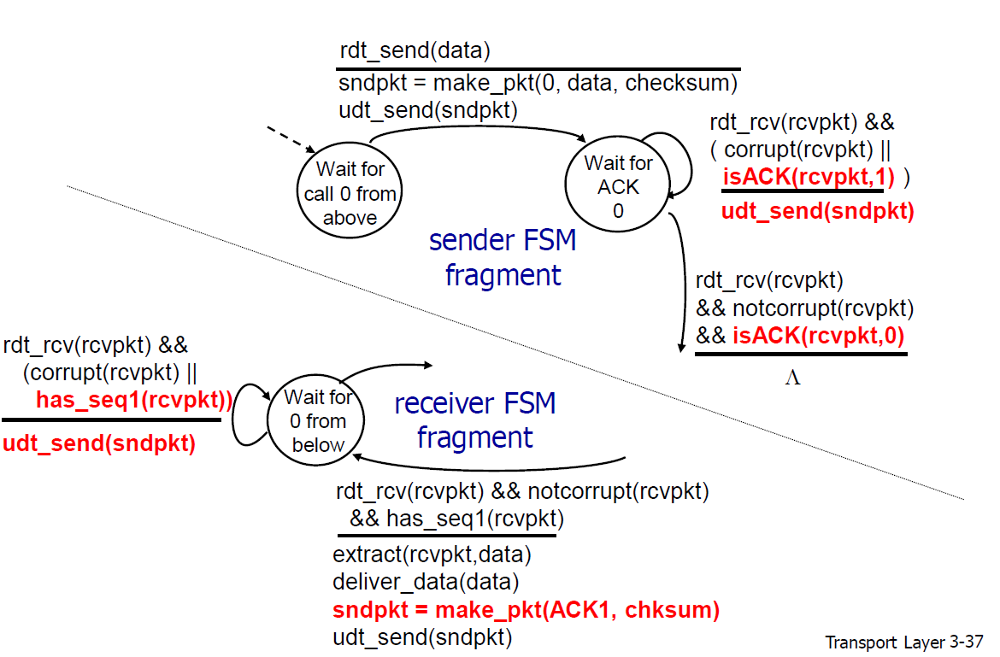
>>
>>
>
>#### rdt3.0
>
>>비트오류와 손실있는 채널상에서의 신뢰적인 데이터 전송이다. 
>>
>>이러한 손실은 ACK,Seq num, 재전송으로 충분하지 않다.
>>
>>손실을 카운트다운 타이머를 통해 처리한다. 
>>
>>>일정 시간이 지나도 ACK가 안오면 재전송
>>>
>>>만약 패킷이 손실된게 아니라 그냥 지연된 것인데 time out 이 된경우 수신자는 패킷을 
>>>
>>>중복하게 받게 된다. 
>>>
>>>수신자는 ACK보낼때 패킷의 seq num을 지정해서 보내야 한다. 
>>>
>>>받은 seq에 대해 동일한 번호로 보내야 한다.
>>
>>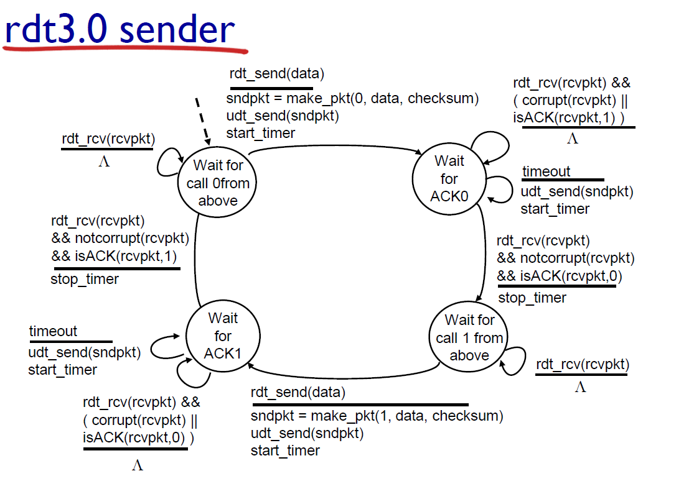
>>
>>0 패킷을 보낼때 타이머를 작동시키고 ACK 0 이 오길 기다린다.
>>
>>ACK 0 이 제시간에 안오면 time out 을 보내고 다시 타이머를 작동한다.
>>
>>제대로 올 경우 타이머를 멈추고 1에서도 동일하게 작동한다.
>>
>>event:
>>
>>- rdt_rcv(rcvpkt): 하위 채널로부터 패킷(ACK/NAK 패킷)을 수신 
>>- corrupt(rcvpkt): 받아온 패킷에 이상 있음
>>- isACK(rcvpkt,1): 0번을 보냈는데 1에 대한 ACK이 옴
>>
>>이처럼 패킷의 순서번호가 0과 1이 번갈아 일어나므로 
>>
>>얼터네이팅 비트 프로토콜(alternating-bit protocol ) 이라고 부른다. 
>
>#### pipelined protocols
>
>>rdt 3.0 은 올바르게 작동하나 효율적이지 못하다.
>>
>>링크 전송률이 1Gbps, 고아속 왕복 전파 지연(RTT) 는 대략 30msec, 패킷 길이가 8000 bit 인 경우
>>
>>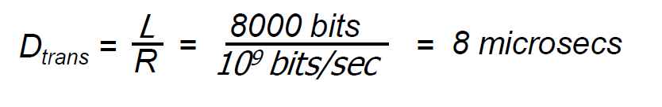
>>
>>이러한 시간이 걸리고 전체시간(이용률)으로 보면 이런식이 도출된다 .
>>
>>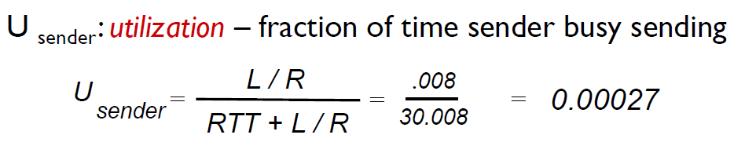
>>
>>stop-and-wait 프로토콜이기 때문인데 1Gbps의 링크를 가용하더라도 276kbps의 유효 처리량을 가지는 것이다. 
>>
>>비효율 적이기 때문에 전송후 대기방법 즉 파이프 라이닝 이 나왔다.
>>
>>- pipelining: 확인 응답(ACK/NAK) 기다리지 않고 여러개의 패킷을 전송한다. 
>>- stop-and-wait과 달리 확인 응답 받기 않은 패킷을 여러 개 전송하기 때문에 seq num의 범위가 증가해야 한다.
>>- 송신자와 수신자가 버퍼링을 한다. 
>>
>>파이프라인 오류 회복의 두가지 기본적인 접근 방법
>>
>>- go-Back-N (GBN): N부터 반복
>>- selective repeat(SR): 선택적 반복
>>
>>파이프라인으로 인한 utilization 이 증가한다.
>>
>>
>
>#### GBN(go-Back-N)
>
>>송신자는
>>
>>- 확인 응답을 기다리지 않고 여러 패킷을 전송할 수 있지만, 파이프라인에서 확인 안된 패킷이 N개가 넘으면 안된다.
>>- N을 window size라고 부르며, GBN 프로토콜은 슬라이딩 윈도우 프로토콜이라고 부른다. 
>>
>>여기서 N값으로 제한하는 것이 앞에서 배운 흐름제어가 송신자에게 제한을 한가지 이유이며 TCP
>>
>>혼잡제어에서 자세히 다룬다. 
>>
>>- 아직 ack되지 않은 패킷 중 가장 오래된 것에 대한 타이머를 가지고 있다.
>> - time out되면 ack이 오지 않은 패킷들을 전부 재전송한다.
>>
>>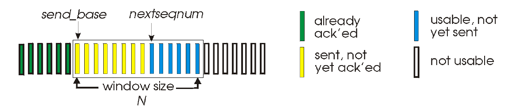
>>
>>[0,send_base-1]: 송신 했고, ack도 다 받은 패킷들
>>
>>[send_base, nextseqnum-1]: 송신 했고, ack을 아직 못 받은 패킷들
>>
>>[nextseqnum,base+N-1]: 데이터 도착하면 바로 전송 가능한 부분
>>
>>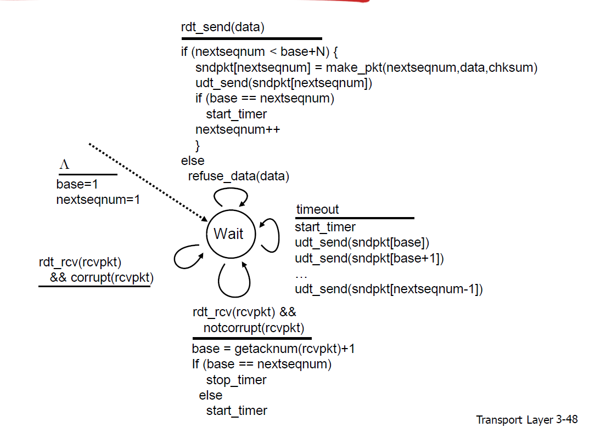
>>
>>송신자는
>>
>>- 상위로부터 호출
>> - 상위로부터 호출되면 윈도우가 가득찼는지를 확인한다. 가득차있지 않으면 패킷이 생성되고 송신되며 가득차있으면 데이터를 상위계층으로 전달한다. 
>>- ACK의 수신
>> * 순서번호N을 가진 패킷에 대한 확인응답은 누적확인응답으로 인식된다.
>>- 타임 아웃이벤트
>> * 송신자는 가장 오래된 전송되었지만 아직 확인응답이 안 된 패킷에 대한 타이머로 생각될 수 있는 단일 타이머를 사용한다. 
>>
>>수신자는
>>
>>- 오로지 축적된 ack(cumulative ACK)만을 보낸다.
>> - 순서가 올바르게 제대로 도착한 가장 최근 패킷의 seq num과 함께 ack을 보낸다. 
>> - 중복된 ACK을 보낼 수도 있다
>> - 받고자하는 패킷의 번호(expectedseqnum)만 기억하면 된다.
>>- 순서가 잘못된 패킷을 받으면 ex) 1,2,5 이렇게 받으면
>> - 버퍼링하는게 아니라 그냥 5를 버린다. (버퍼링을 하지 않는다.)
>> - 순서 제대로 왔었던 마지막ack한 패킷 다시 ack 보냄
>> - 따라서 패킷 하나의 문제로 많은 패킷을 재전송하는 경우 비효율적이다.
>>
>>   이를 고치고자 SR이 등장하였다. 
>
>#### SR(selective repeat)
>
>>SR은 받는 쪽에서도 저장 공간을 만드는 것이다. 그러므로 불필요한 재전송을 피한다. 
>>
>>- 송신자가 전송한 패킷 중에 오류가 발생했을 것 같다고 의심되는 패킷만을 다시 전송
>> - 불필요한 재전송 피함
>>- 필요에 따라 각각의 개별적인 재전송은 수신자가 올바르게 수신된 패킷에 대한 개별적인 확인 응답을 요구할 것.
>> - 패킷을 버퍼하여 상위 계층에 순서대로 전달
>>- 송신자는 ACK를 못 받은 패킷만 재전송
>> - 패킷(ACK 못 받은)마다 타이머가 있음
>>- sending window
>>
>>  > N 개의 시컨스 넘버가 있다. (GBN이랑 똑같다.)
>>
>>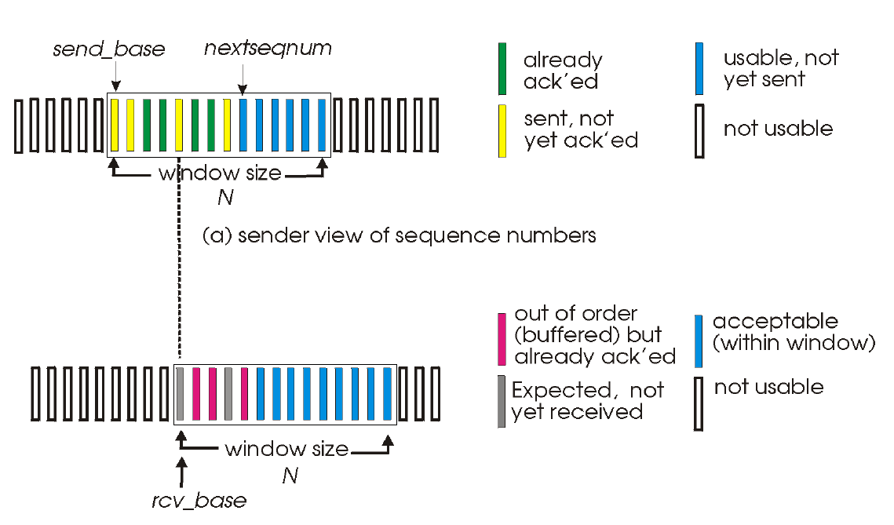
>>
>>송신자
>>
>>>  - 상위 계층에서 데이터가 들어오면
>>>    - window에 넣을 수 있으면 패킷 송신
>>>  - timeout(n)
>>>    - n번 패킷 다시 보내고, 타이머 다시 시작
>>>  - ACK(n) in [sendbase,sendbase+N]
>>>    - 수신되었을때 윈도우에 있다면 ack 받은 걸로 표시
>>>    - 만약 ack 받은 것이 원래 가장 작은 번호의 unACKed 패킷이였으면 send_base가 다음 unACKed 패킷 가리키는 곳으로 이동
>>
>>수신자
>>
>>> - [rcvbase,rcvbase+N-1] 내의 n번 패킷 수신
>>>   - ACK(n) 보냄
>>>   - 순서 다르면 -> 버퍼링
>>>   - 순서 맞으면 상위 계층으로 전송(버퍼에 이거 넣어서 순서 맞으면 순서 맞는 것들 다), window 이동
>>> - [rcvbase-N,rcvbase-1] 내의 n번 패킷 수신
>>>   - 이전에 응답한 것이라도 ACK(n)가 생성되어야 한다. 
>>> - otherwise:
>>>   - 무시
>>>
>>>
>>
>>송신자와 수신자의 윈도우가 항상 같지 않을수 있다. 그 예로
>>
>>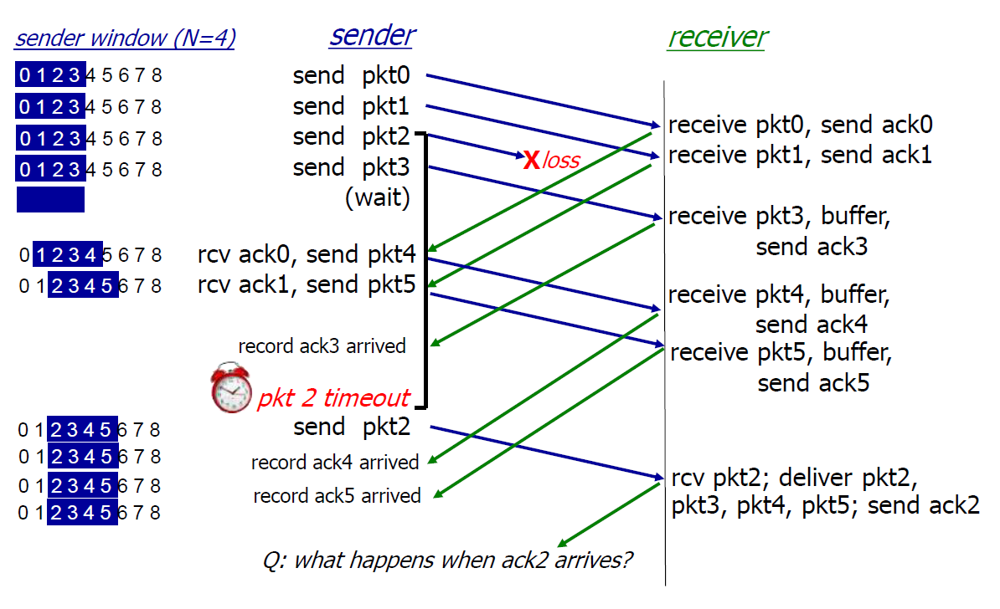
>>
>>로 나타 낼 수 있다. 송신측에서 0,1,2,3 보내고 기다리고 받는 쪽에서 2가 로스되어도
>>
>>0,1,3에 대한 ack를 보낸다. 송신측에서 0,1을 받아 슬라이딩 되어 4,5를 보낸다.
>>
>>수신측에서는 3을 받지만 슬라이딩이 안되어 가만히 있는다.
>>
>>송신측에서 4,5를 받고 2에 대한 타임아웃이 되어 다시 2를 전송한다.
>>
>>위 질문의 답은 2,3,4,5 가 슬라이딩 되어 6,7,8,9 로 바뀐다. 
>>
>>이러한 SR도 문제점이 있다.
>>
>>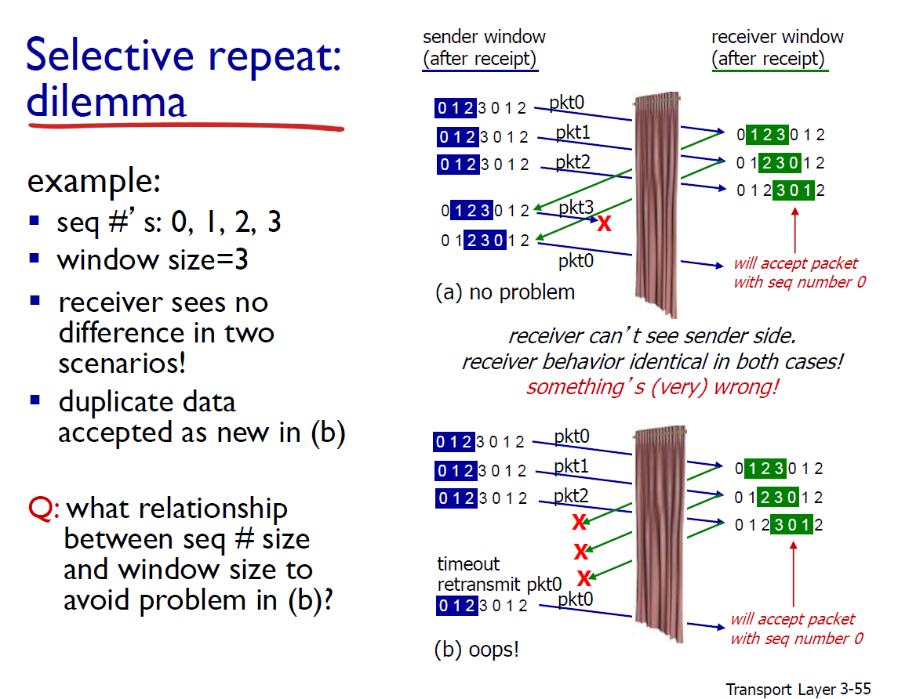
>>
>>그림 b에서 ack0,1,2가 다 로스 되고 타임아웃이 일어나 pck0이 다시 재전송할 때
>>
>>받는 입장에서는 pck0이 재전송인지 새로운 것인지 모른다.
>>
>>해결책은 window size 조절이다.
>>
>>시퀀스 넘버의 총 개수의 반씩 각 송신자와 수신자의 window size로  지정하는 것이다. 
>>
>>즉 윈도우 사이즈는 SR에 대한 순서번호 공간 크기의 절반보다 작거나 같아야 한다.
>>
>>예로, 순서번호가 0,1,2,3 이면 윈도우 크기는 2이하여야 한다.
>>
>>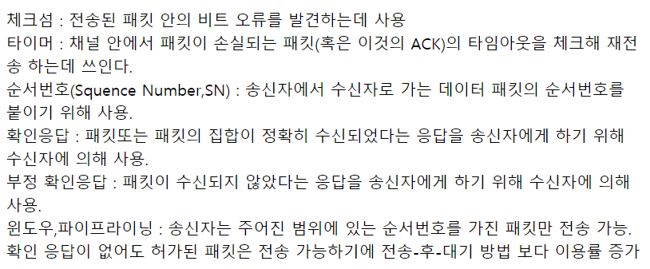

#### TCP

>TCP는 먼저 연결지향형이고 전이중 서비스를 제공한다. 
>
>TCP프로토콜은 오직 종단 시스템에서만 동작하고 중간의 네트워크 요소에서는 동작하지 않으므로,
>
>중간의 네트워크 요소들은 TCP 연결 상태를 유지 하지 않는다. 
>
>전이중은 A에서 B로 흐를때 B에서 A로 흐를수 있다는 것이다.
>
>또한 TCP연결은 항상 단일 송신자와 단일 수신자 사이의 점대점(point to point)이다.
>
>연결을 초기화하는 프로세스를 클라이언트 프로세스, 다른 프로세스를 서버 프로세스라고 부른다.
>
>TCP는 TCP헤더와 클라이언트 데이터를 하나로 만들어 TCP세그먼트를 형성한다.
>
>세그먼트는 네트워크 계층으로 전달되며 IP데이터그램 안에 각각 캡슐화 된다.
>
>TCP가 상대에게서 세그먼트를 수신 했을 때, 세그먼트의 데이터는 TCP 연결의 수신버퍼에 위치한다. 
>
>연결의 양 끝은 각각 자신의 송신 버퍼와 수신버퍼를 가지고 있다. 
>
>요약하자면
>
>- point-to-point:
>
>- 한 명의 송신자, 한 명의 수신자
>
>  multicasting 불가
>
>- tcp는 오로지 end system에서만 동작
>
>  중간에 라우터나 브리지에서 동작하지 않는다
>
>- reliable, in-order byte stream:
>
>  메시지 경계가 없다 => 패킷 트레인 이용
>
>- pipelined:
>
>  TCP congestion과 flow control에서 window 사이즈를 설정한다.
>
>- full duplex data
>
>  같은 연결에서 bi-directional data flow
>  - 보내는 것과 받는 것이 동시에 가능
>  - A->B로 보내면 B->A로 보낼 수 있음
>
>- MSS: 최대 세그먼트 크기(maximum segment size)
>  - 세그먼트의 데이터 필드의 크기 제한
>  - 사이즈 큰 파일 전송할 때, MSS 크기로 파일 자른다.
> 
>- connection-oriented:
>
>- '3 way handshaking'을 통해 데이터 교환 전에 송수신자의 상태를 초기화한다.
> 
>  - TCP를 연결 지향이라고 부르는 이유이다.
> 
>- flow controlled:
>
>   송신자는 수신자가 받을 수 있을 만큼만 보낸다.
>
>#### TCP세그먼트 구조
>
>>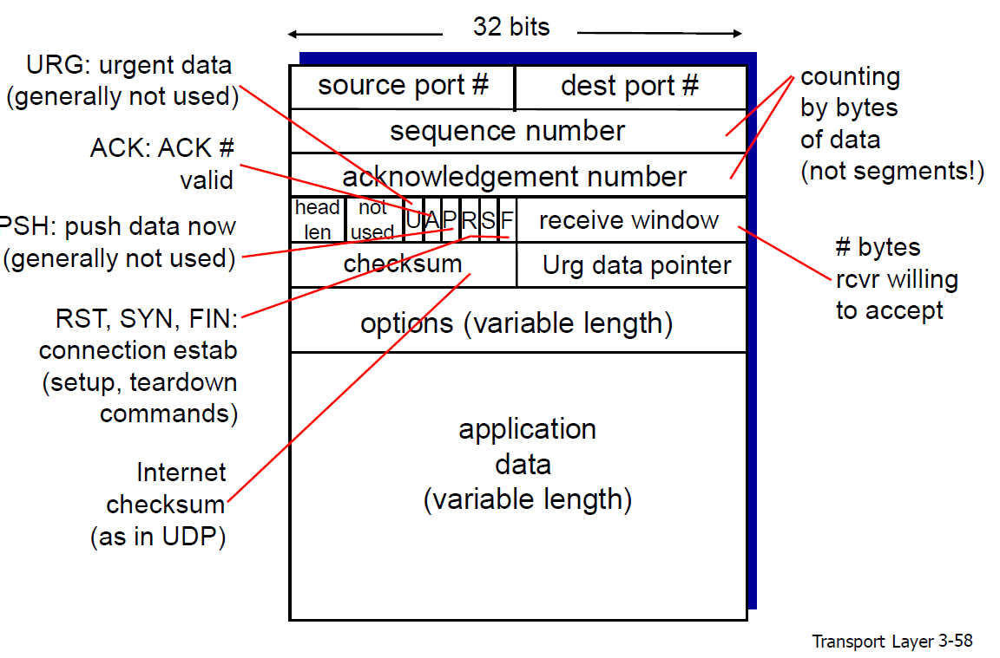
>>
>>
>>
>>TCP의 헤더의 길이는 20byte 이다.
>>
>>U,A,P,R,S,F 는 각 1bit를 가지며 flag bit라고 한다.
>>
>>수신 윈도우 (receive window)는 흐름제어에 사용된다.
>>
>>connection setup과 통신을 마친후, connection release를 해야한다. 이때 사용하는 값이 flag bit이다.
>>
>>sequence number, acknowledgement number는 앞에서 말한 것처럼 신뢰적인 데이터 전송 서비스 구현에서 TCP 송신자와 수신자에 의해서 사용된다.
>>
>>해더길이는 말 그대로 TCP 헤더의 길이를 나타낸다. TCP헤더의 길이는 옵션필드 때문에 가변적인 길이가 될 수 있다.
>>
>>옵션필드는 송신자와 수신자가 최대 세그먼트 크기를 협상하거나 고속 네트워크에서 사용하기 위한 윈도우 확장 요소로 이용된다. 
>
>**TCP seq. number, ACKs**
>
>>##### seq. number
>>
>>>데이터 스트림이 500,000byte이고, MSS가 1000이면 500개의 세그먼트가 생긴다. 첫 번째 세그먼트의 순서번호(sequence number)는 0, 두 번째 세그먼트의 순서 번호는 1000이 된다.
>>>
>>>세그먼트에 대한 순서번호는 세그먼트에 있는 첫 번째 바이트의 바이트-스트림 번호이다. 
>>
>>##### ACKs
>>
>>>호스트A가 자신의 세그먼트에 삽입하는 확인 번호는 호스트 A가 호스트B로부터 기대하는 다음 바이트의 순서번호이다. 
>>>
>>>수신자가 0~535 바이트를 포함하는 세그먼트와, 900~1000 바이트를 포함하는 세그먼트를 수신했다고 하면  수신자는 아직 536~899 바이트를 수신하지 않았다.
>>>
>>>그럼 수신자는 데이터 스트림을 재생성하기 위해 536번째 바이트를 기다리고 있으므로 다음 세그먼트 확인 응답 번호 필드(acknowledgement num)를 536으로 지정한다. (원하는 바이트+1)
>>>
>>>cummulative ACK (원하는 바이트+1)
>>>
>>>
>>
>>
>>
>>
>>
>>host A는 42번째 바이트를 보내면서, 79번째 바이트를 host B에게 요구한다.
>>
>>host B는 79번째 바이트를 보내면서, 다음 원하는 바이트인 43 바이트를 A에게 요구한다. (축적된 ack)
>
>**TCP round trip time, timeout**
>
>>- 어떻게 TCP timeout 값을 정할까?
>>
>>  RTT 보다는 길어야 한다.
>>
>>  너무 짧으면: premature한 timeout이 된다. -> 불필요한 재전송 유발
>>
>>  너무 길면: 세그먼트 loss에 대한 반응이 너무 느림
>>- 어떻게 RTT를 추정할까?
>>
>>  SampleRTT: 세그먼트 전송부터 ACK 응답이 올 때까지 걸린 시간 측정
>>
>>  - 재전송은 무시
>> - 현재 샘플뿐만 아니라 최근 몇 가지 측정값의 평균값RTT
>>
>>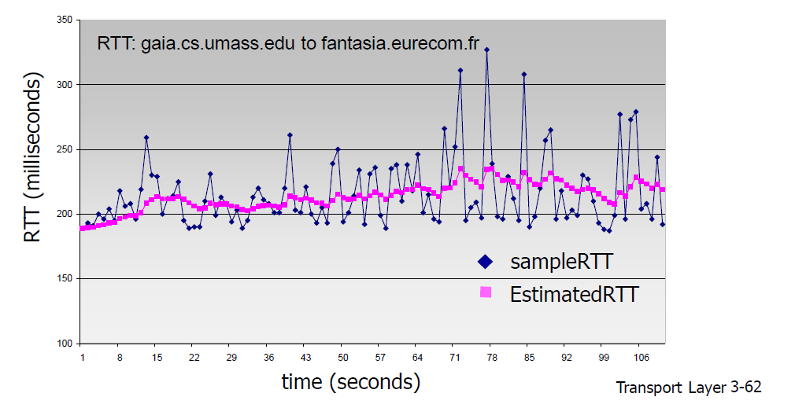
>>
>>EstimatedRTT = (1- a)*EstimatedRTT + a* * SampleRTT
>>
>>주로 a=0.125
>>
>>smapleRTT는 세그먼트가 송신되고 긍정응답이 도착한 시간까지의 시간 길이다.
>>
>>변동이 큰 이유는 라우터에서의 혼잡과 종단 시스템에서의 가변 부하때문에 세그먼트 마다 다르다.
>>
>>DevRTT는 sampleRTT가 EstimateRTT로부터 얼마나 많이 벗어나는지에 대한 예측으로 정의된다.
>>
>>DevRTT = (1 -b )*DevRTT +b *|SampleRTT EstimatedRTT| 
>>
>>주로 b=0.25
>>
>>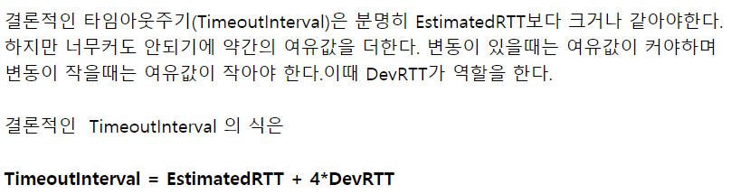
>
>**TCP: Reliable data transfer**
>
>>TCP는 IP의 비신뢰적인 서비스 위에서 rdt 서비스를 제공한다.
>>
>>​	pipelined segments
>>
>>​	cumulative acks
>>
>>​	single retransmission timer
>>
>>재전송은 다음으로 인해 발생한다
>>
>>​	timeout 발생
>>
>>​	중복된 ack
>
>**TCP sender events**
>
>>application layer로부터 데이터를 받음
>>
>>>seq num을 가지는 세그먼트를 만듦
>>>
>>>seq num은 세그먼트에서 첫 데이터의 바이트의 바이트 스트림 수이다.
>>>
>>>만약 타이머가 이미 다른세그먼트에 대해서 실행중이아니라면
>>>
>>>unacked 세그먼트에서 가장 오래된 것에 대한 타이머 시작 
>>>
>>>- TCP는 이 세그먼트를 IP로 넘길 때 타이머를 시작 -> 가장 오래된 것 
>>>
>>>- 타이머 만료 주기: TimeOutInterval
>>>
>>>
>>
>>timeout:
>>
>>>timeout으로 인한 세그먼트 재전송
>>>
>>>타이머 재시작
>>>
>>>ack 받음:
>>>
>>>​	만약 unacked 세그먼트에 대한 ack을 받은 거라면
>>>
>>>- ack 된 거 업데이트
>>>- 현재 ack 들어온 게 원래 가장 오래된 unacked 세그먼트였다면 timer 재시작
>>>
>>>
>>
>>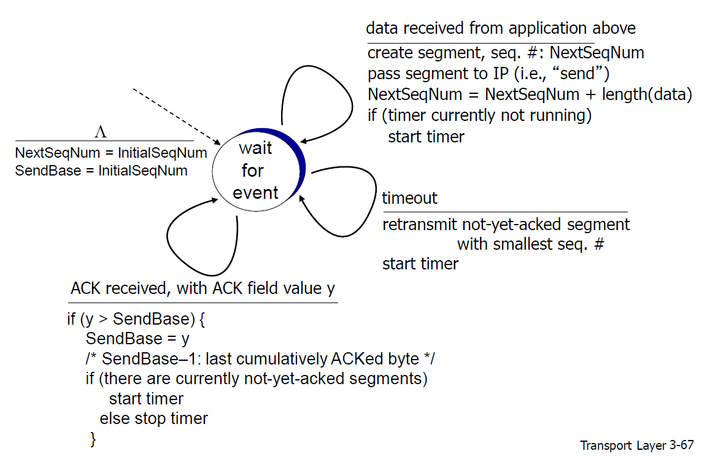
>>
>>중복된 ack, flow control ,congestion control 를 무시하고 간단하게 만든것이다.
>>
>>NextSeqNum에 처음 데이터가 전송되는 주소를 할당하고
>>
>>sendBase에도 할당한다.
>>
>>sendBase는 어디까지 전송이 완료됬나를 알수 있게 한다.
>>
>>맨 처음 어플리케이션으로 부터 데이터를 받았을때 
>>
>>세그먼트를 생성하고 시퀀스 넘버를 할당하고 다음 시퀀스 넘버는 현재+데이터의 길이이다.
>>
>>네트워크 계층으로 세그먼트를 넘기고 타이머를 설정한다.
>>
>>가장 작은 seq#에 대한 ACK를 보낸다. 그리고 다시 타이머를 동작한다.
>>
>>만약 ACK를 받았는데 sendbase 값보다 크면 sendbase값을 ACK값으로 갱신한다.
>>
>>만약 같거나 작으면 버리고 아직 ACK를 못받은 segment가 있다면 타이머를 동작시키고 없다면
>>
>>타이머를 멈춘다.
>>
>>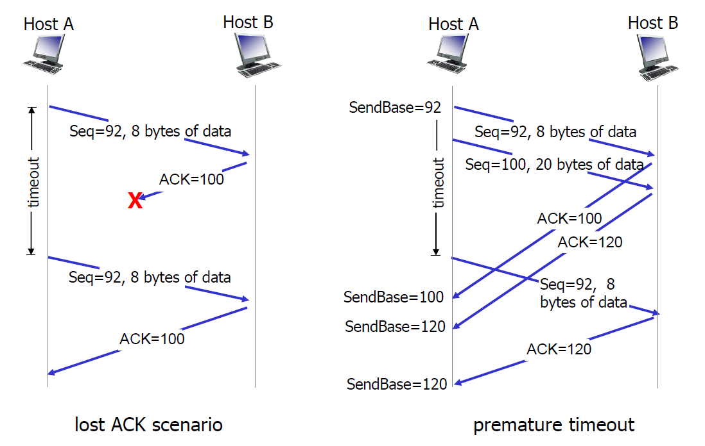
>>
>>host B가 seq 92인 데이터를 8 바이트 받았다면 ack은 (92+8)인 100을 보낸다
>>
>>받은 시퀀스 + bytes of data값이 ACK보다 낫으면 보냈던 ACK중 최근 ACK의 값을 그대로 보낸다.
>>
>>=> cummulative ack
>>
>>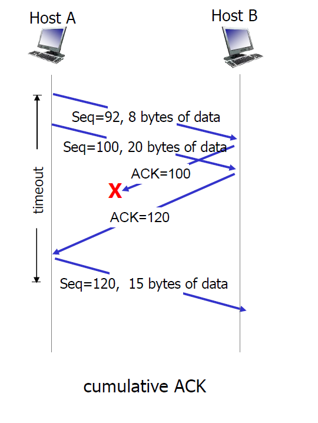
>>
>>ack=100이 제대로 안 갔어도  ack=120이 제대로 가면, 그 전 것들은 다 제대로 갔다고 host A는 생각한다. 
>>
>
>**TCP ACK 발생**
>
>>| event                                                        | TCP 수신자 action                                            |
>>| ------------------------------------------------------------ | ------------------------------------------------------------ |
>>| 기다리는 순서 번호를 가진 '순서가 맞는' 세그먼트의 도착. 기다리는 순서 번호까지의 모든 데이터들은 이미 확인 응답됨. | [delayed ACK] 또 다른 '순서가 맞는' 세그먼트의 도착을 위해 500 msec까지 기다린다. 만약 다음 '순서에 맞는' 세그먼트가 이 기간에 도착하지 않으면, ACK을 보낸다. |
>>| 기다리는 순서번호를 가진 '순서가 맞는' 세그먼트의 도착. ACK 전송을 기다리는 다른 하나의 '순서에 맞는' 세그먼트 있음 | [cumulative ACK] 즉시 2개의 '순서가 맞는' 세그먼트들을 ACK 하기 위해, 하나의 누적된 ACK을 보낸다(최근 것). |
>>| 기다리는 것보다 높은 순서번호를 가진 '순서가 틀린' 세그먼트의 도착. | [duplicate ACK]즉시 순서번호가 다음의 기다리는 바이트(원래 받아야 하는 번호)를 나타내는 중복 ACK를 보낸다. |
>>| 수신 데이터에서 격차를 부분적으로 또는 모두 채우는 세그먼트의 도착 | [immediate send ACK]즉시 ACK를 보낸다. 단, 그 세그먼트가 격차의 최솟값에서 시작한다고 가정. |
>
>**TCP fast retransmit** (빠른 회복)
>
>>- time out 기다리는 거 너무 오래 걸린다.
>>  - 손실된 패킷을 재전송하기 전 delay가 길다.
>>- 중복된 ACK를 통한 손실 세그먼트 탐지한다.
>>  - 송신자는 종종 많은 세그먼트를 back-to-back으로 보낸다
>>  - 세그먼트가 손실되면 많은 중복된 ack들을 받게 될 것이다.
>>- TCP fast retransmit
>>  - 똑같은 세그먼트에 대해 ACK이 3번 들어왔다면, 그다음 세그먼트가 손실되었다는 것을 의미한다.
>>  - 이 경우, 타이머를 기다리는 것이 아니라, 바로 unACKed 세그먼트(가장 작은 seq num)를 재전송한다. 
>>
>>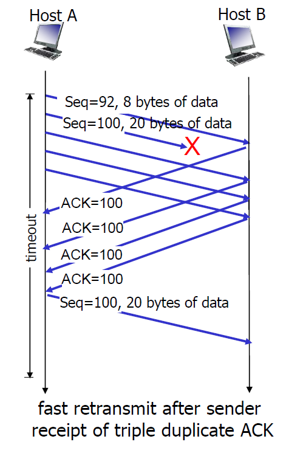
>>
>>TCP의 오류 복구 매커니즘은 GBN과 SR 프로토콜 의 혼합으로 분류하는 것이 적당하다.
>
>**TCP: flow control**
>
>>- 애플리케이션이 읽는 속도와 송신자가 전송하는 속도를 같게한다. 
>>- TCP는 전이중이므로 각 측의 송신자는 별개의 수신 윈도우를 유지한다.
>>- 목적은 버퍼 오버플로우가 일어나지 않게 하는 것이다. => 흐름제어 서비스
>>
>>**흐름제어 는 송신측과 수신측의 데이터 처리 속도 차이를 해결하기 위한 기법이고**
>>
>>**혼잡제어는 송신측의 데이터 전달과 네트워크(IP)의 데이터 처리 속도 차이를 해결하기 위한 기법이다.**
>>
>>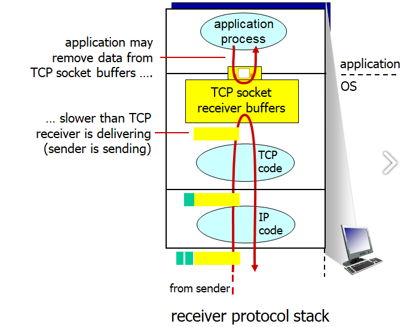
>>
>>수신자의 receiver buffer가 넘치지 않도록 송신자가 데이터를 송신하도록 송신자에게 receiver buffer를 알려준다.
>>
>>TCP는 송신자가 수신 윈도우라는 변수를 유지하여 흐름제어를 제공한다.
>>
>>수신 윈도우는 수신 측에서 가용한 버퍼 공간이 얼마나 되는지 송신자에게 알려주는데 사용된다.
>>
>>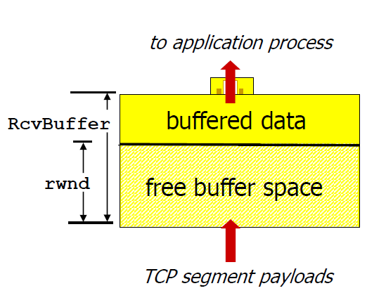
>>
>>송수신자 세그먼트의 TCP 헤더에 있는 rwnd 값을 포함함으로써 수신자는 free buffer space를 알린다.
>>
>>rwnd: 수신자의 unacked data를 저장하는 최대 양 (수신 윈도우 receive window 를 rwnd라 함)
>>
>>수신자 버퍼가 오버플로우되지 않는 것을 보장
>>
>>호스트 A가 호스트 B에게 큰 파일을 전송한다고 가정할때
>>
>>호스트 A는 LastBytesent, LastByteAcked 를 저장 (LastBytesent- LastByteAcked) 차이값 저장
>>
>>호스트 B는 LastByteRcvd ,LastByteRead 를 저장한다.  (LastByteRcvd -LastByteRead) 차이값 저장
>
>**TCP: Connection Management**
>
>>데이터를 교환하기 전, 송수신자들은 "handshake"를 한다
>>
>>- 연결 동의
>>- 연결 파라미터 동의
>>
>>2-way handshake는 다양한 딜레이 메세지 로스로 인해 자주 사용하지 않는다.
>>
>>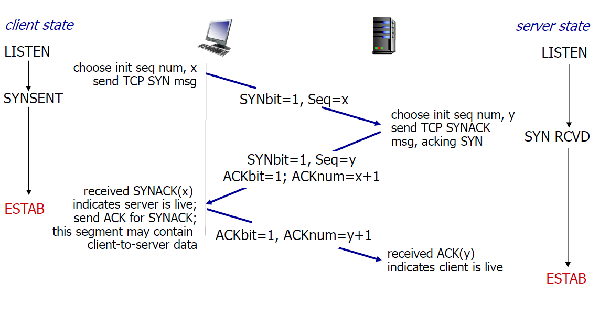
>>
>>세그멘트의 헤더에 SYN 비트라고 플래그 비트를 보내고 이 특별한 세그먼트는 애플리케이션 계층 데이터를 포함하지 않는다.
>>
>>서버에서 클라이언트로 SYN=1 를 보낼때 연결변수와 버퍼도 할당한다.
>>
>>시컨스로 클라이언트는 최초의 순서번호(client_isn)을 넣는다.
>>
>>3번째 핸드쉐이킹에서는 SYNbit=0 값을 보낸다. 
>
>**TCP: closing a connection**
>
>>- 클라이언트와 서버 각 각 연결을 끊는다.
>>  - FIN bit =1과 함께 TCP 세그먼트를 보내서
>>- 받은 FIN에 대해 ACK을 보낸다
>>- 동시에 FIN 교환 가능
>>
>>
>>
>>둘 다 끝내자고 FIN을 보내야 하고 그에 대한 대답(ACK)도 각각 보내야 한다.
>>
>>이렇게 연결 끊을 때도, 연결(대화) 다 하고 끊기 때문에 connection-oriented라고도 할 수 있다.
>>
>> 연결이 종료되면 호스트의 자원(버퍼와 변수)들은 회수한다.
>
>#### TCP **congestion**
>
>>- 네트워크가 처리하기에는 너무 많은 데이터를 너무 빨리 보내는 자원이 너무 많다.
>>- 라우터에서 버퍼 오버플로우가 발생해서 -> 패킷 손실
>>- 라우터 버퍼에서 queueing 때문에 -> delay가 길어짐
>>
>>#### 시나리오 1. 2개의 송신자와 무한 버퍼를 갖는 하나의 라우터
>>
>>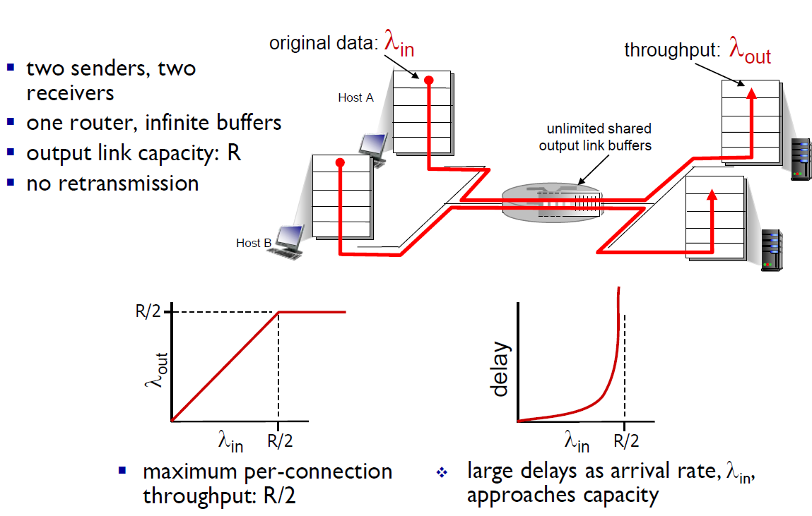
>>
>>왼쪽 그래프는 연결 전송률의 함수로 연결당 처리량을 그린 것이다.
>>
>>전송률이 R/2를 넘어가면 처리량도 단지 R/2이다. 
>>
>>처리량이 R근처의 양만큼 동작하는 것은 처리량 관점에서는 이상적이지만 지연 관점에서는 이상적이지
>>
>>않다. 또한 재전송이 없다.
>>
>>여기서의 혼잡비용은 **패킷 도착률이 링크 용량에 근접함에 따라 큐잉 지연이 커진다.**
>>
>>#### 시나리오2. 2개의 송신자와 유한 버퍼를 갖는 하나의 라우터
>>
>>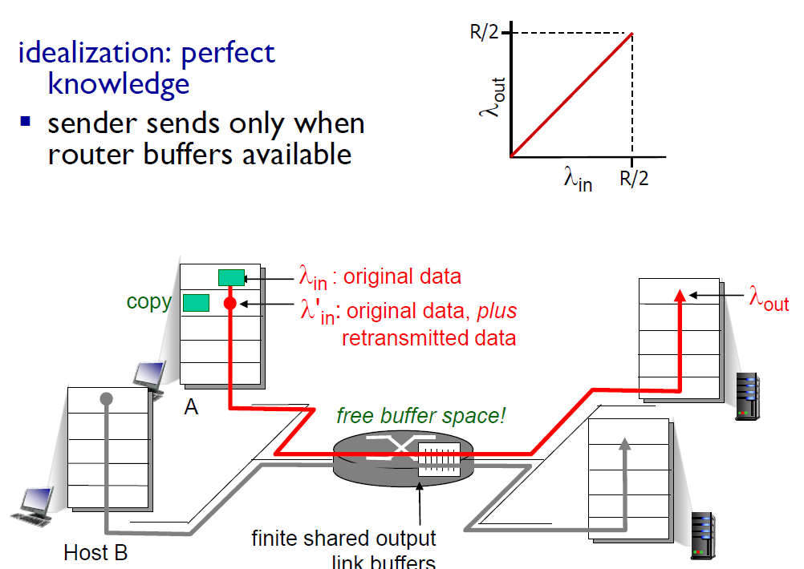
>>
>>버퍼가 유한하기 때문에 버퍼가 다 찼는데, 들어오는 패킷들은 버려진다.
>>
>>**가정2:** 호스트 A가 라우터에 있는 버퍼가 비어 있는지 아닌지 안다고 해보자.
>>
>>->송신자는 버퍼가 비어 있을 때만 송신 -> 패킷 손실이 일어나지 않음
>>
>>=> 시나리오1과 유사하다.
>>
>>여기서의 혼잡비용은 위와 동일하다.
>>
>>
>>
>>**가정3**: 패킷 손실된 것을 알았을 때만 송신자가 재전송을 한다고 하자.
>>
>>=> 총 R/2의 데이터를 전송했을 때, 원본 데이터는 R/3밖에 전송되지 않는다. 
>>
>>혼잡비용은 송신자는 **버퍼 오버플로 떄문에 버려진 패킷을 보상하기 위해 재전송 하는 비용이 추가적으로 들어간다.**
>>
>>**가정4**: 송신자에서 너무 일찍 타임아웃되는 바람에 패킷이 손실되지 않았지만 큐에서 지연되고 있는 패킷을 재전송하는 경우
>>
>>-> 수신자는 중복되서 받은 패킷 버림
>>
>>-> 수신자가 이미 받았는데 수신자가 똑같은거 포워딩 하고 있는 작업은 낭비
>>
>>=> 총 R/2의 데이터를 전송했을 때, 원본 데이터는 R/4밖에 전송되지 않는다. (두번씩 전달된다는 과정)
>>
>>더 추가적으로 송신자의 불필요한 재전송은 **라우터가 패킷의 불필요한 복사본들을 전송하는데 링크 대역폭을 사용하는 원인이 된다.** 
>>
>>#### 시나리오3. 4개의 송신자와 유한 버퍼를 가지는 라우터, 그리고 멀티홉 경로
>>
>>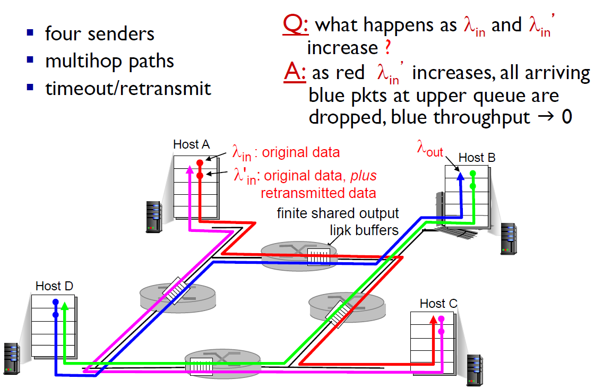
>>
>>사각형 윗부분이 R1 이고 오른쪽 부분이 R2 이다.
>>
>>B->D랑 A->C랑 R2를 같이 쓸 때,
>>
>>B->D 처리량으로 R2가 꽉차면 A->C 처리량은 0이 되고 R2로 보내지는 패킷들은 버려진다.
>>
>>R1은 이 와중에 R2에게 열심히 (A->C)데이터를 보냈는데 다 헛된 짓이였다.
>>
>>이 시간에 R1에서 사용되는 전송 용량을 다른 패킷을 전송하는데 썼으면 더 유용하게 사용가능하다.
>>
>>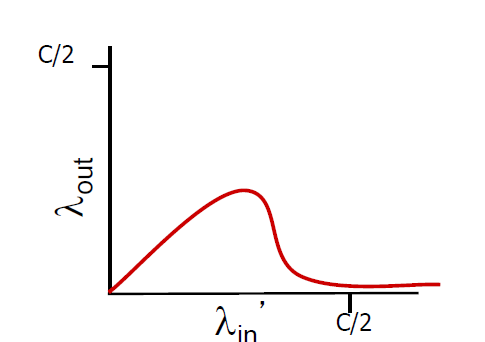
>>
>>위의 사진은 제공된 부하와 처리량 간의 트레이드오프가 발생함을 보여준다. 
>>
>>여기서 혼잡비용이 추가되는데 **버려지는 지점까지 패킷을 전송하는데 사용된 상위 라우터에서 사용된 전송 용량은 헛된 것이다.** 
>
>#### TCP congestion control
>
>>IP계층이 네트워크 혼잡에 관해서 종단 시스템 에게 어떠한 직접적인 피드백도 제공하지 않으므로
>>
>>TCP는 네트워크 지원 혼잡제어보다는 종단가의 혼잡제어를 사용해야 한다. 
>>
>>- 접근: 네트워크 혼잡에 따라 연결에 트래픽을 보내는 전송률을 각 송신자가 제한하도록 하는 것이다.
>>
>>- additive increase: loss가 발생하기 전까지 모든 RTT마다 cwnd를 1 MSS씩 증가시킨다.
>>
>>- multiplicative decrease: loss가 발생하면 cwnd를 절반으로 줄인다.
>>
>>- cwnd(congestion window): TCP 송신자가 네트워크로 트래픽을 전송할 수 있는 비율을 제한
>>
>>  cwnd를 혼잡 윈도우라고 하며 송신측에서 동작하는 TCP 혼잡제어 메커니즘의 추가적인 변수
>>
>>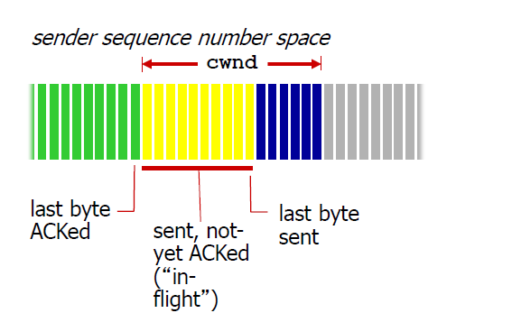
>>
>>송신자의 전송 제한: (LastByteSent-LastByteAcked) ≤ cwnd 
>>
>>- cwnd: 네트워크 혼잡에 따라 유동적이다.
>>- TCP 전송 속도: (cwnd/RTT) bytes/sec 
>>
>>TCP 는 확인응답을 혼잡 윈도우 크기의 증가를 유발하는데 트리거 또는 클록을 사용하므로
>>
>>TCP는 자체 클로킹이라고 한다. 
>
>#### TCP congestion control algorithm
>
>>1. 슬로 스타트 (slow start)
>>2. 혼잡 회피 (congestion avoidance)
>>3. 빠른 회복 (fast recovery)
>
>#### slow start
>
>>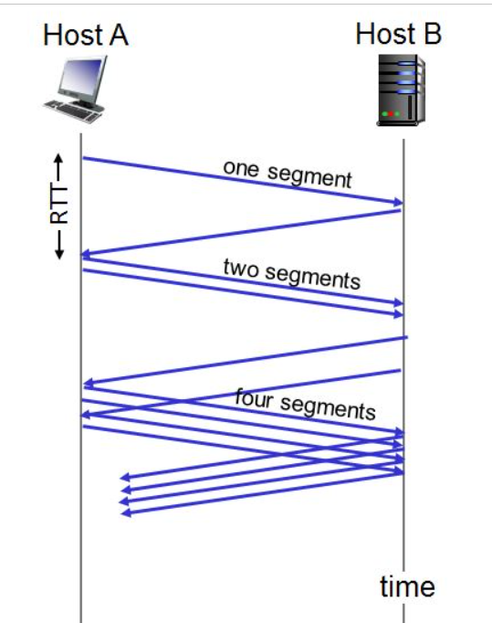
>>
>>슬루오 스타트는 하나보내고 잘 통신이 되면 다음엔 2배씩 증가해서 보내는 것이다.
>>
>>그다음 혼잡윈도우 크기만큼 세그먼트를 보내고 그에대한 확인응답이 오게되면 2*MSS만큼 혼잡윈도우를 증가시킨다. 이렇게 혼잡윈도우의 크기를 2^n 씩 증가를 시키게 되면(n은 0부터 시작) 슬로스타트는 지수함수의 형태를 띄게 된다.
>>
>>진행되다 loss가 발생하는데 타임아웃, 3duplicate ack에 의해 발생한다.
>>
>>일반적인 타임아웃은 cwnd를 1로 초기화하고 , ssthresh의 값을 혼잡이 검출되었을 때 의
>>
>>cwnd/2 로 설정한다.
>>
>>3duplicate ack에는  Reno or Tahoe 방식으로 처리한다. 
>>
>>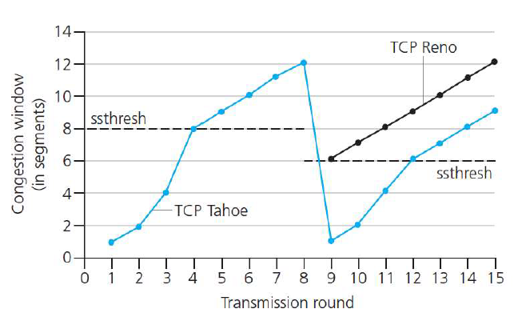
>>
>>2배씩 증가하다 임계점(ssthresh)를 넘어서면 슬로 스타트는 종료되고 TCP는 혼잡 회피 모드로 전환한다.
>>
>>cwnd를 1씩 증가하다가  3개의 중복 ACK들이 검출되면 TCP는 빠른 재전송을 수행하여 빠른 회복 상태로 들어간다.
>>
>>12의 절반 6으로 임계치를 정하고 다시 1부터 돌아가고 슬로스타트 단계를 가지는 방식은 **Tahoe** , 마찬가지로 임계치를 새로 정하고 1부터 보내는 것이 아닌 그 임계치 부터 다시 보내는 방식이 **Reno** 이다. 
>>
>>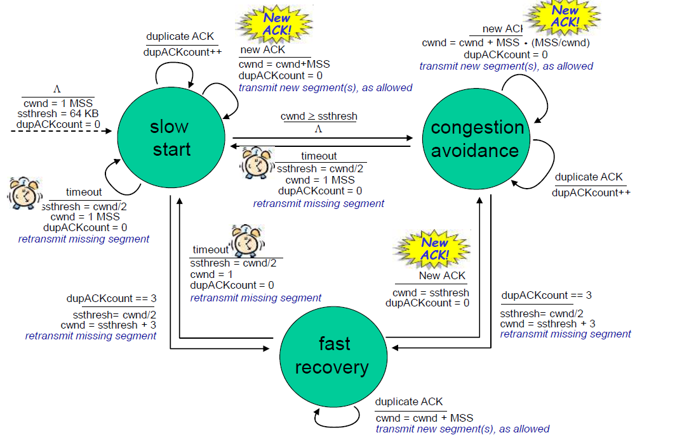
>>
>>위의 설명한 방식과 동일한 그래프이다.
>
>#### congestion avoidance
>
>>혼잡 회피는 ssthresh 값과 동일해졌을 때 아 혼잡이 발생할 가능성이 지금부터 매우 크겠구나! 라고 생각이 드는 부분이기 때문에 혼잡윈도우는 1MSS씩 선형으로 증가한다. 
>>
>>이렇게 선형으로 증가를 하다가 타임아웃이 발생했을 때는 슬로스타트와 똑같이 혼잡윈도우의 크기를 1MSS로 초기화 하고 빠른 회복으로 들어간다. 
>>
>>또한 타임아웃이 발생할 때의 혼잡윈도우 크기 값의 반으로 ssthresh를 설정한다. 만약 타임아웃이 아닌 3개의 중복 ACK 수신에 의한 손실 이벤트라면 혼잡윈도우의 크기를 현재 크기의 절반으로 줄이고 빠른 회복으로 들어간다.
>
>#### fast recovery
>
>>1. TCP Tahoe
>>
>>이는 초기버전으로 타임아웃이 되거나 3개의 중복 ACK에 의한 손실이 발생하면 무조건 혼잡윈도우를 1MSS로 줄이고, 슬로 스타트 단계로 들어간다.
>>
>>
>>
>>2. TCP Reno
>>
>>Tahoe 이후에 나온 버전으로 3개의 중복 ACK에 의한 손실이 발생하면 혼잡윈도우 크기를 1MSS로 줄이는게 아니라 현재 혼잡윈도우 크기의 절반으로 줄인다음 1MSS씩 선형으로 증가를 시킨다. 만약 타임아웃에 의한 손실이라면 Tahoe와 마찬가지로 1MSS로 초기화 되고 슬로스타트를 진행한다.
>>
>>현재 주로 Reno 사용
>
>#### AIMD 혼잡제어
>
>>위의 도표에서 cwnd값이 1씩 증가하는 부분을 혼잡회피라고 하는데 다른 말로는
>>
>>AIMD 혼잡제어라고 불린다. 1씩 증가하다 손실이벤트가 발생하면 1로 뚝 떨어지고 되는 것을 반복하면
>>
>>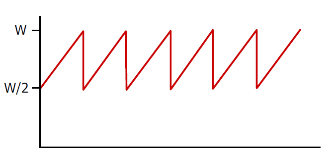
>>
>>와 같은 도표가 나오며 TCP 의 평균 throughput은 아래와 같은 식으로 구할 수 있다.
>>
>>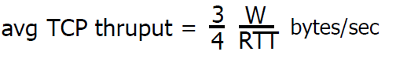
>
>#### 광대역 경로상의 TCP
>
>>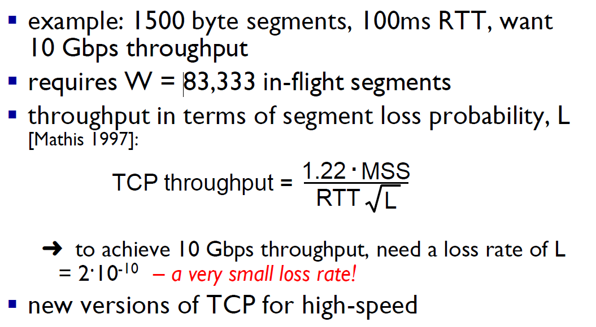
>>
>>
>
>#### TCP 공평성(TCP Fairness)
>
>>공평성(fairness)
>>
>>> K개의 TCP 연결이 R bps의 전송률(대역폭)의 병목 링크(bottleneck link)를 공유하는 경우, 각 연결의 평균 전송률이 R/K에 가깝다면 혼잡제어 메커니즘은 공평
>>
>>TCP가 공평한 이유
>>
>>  \- 이상적으로 두 처리율의 합은 R과 같아야 함
>>
>>  \- 동등한 대역폭 공유와 전체 대역폭 이용선의 교차 지점 가까운 곳의 처리율을 제공한다. 
>>
>>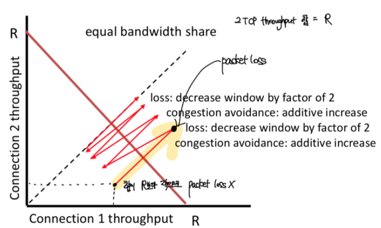
>>
>>위의 그래프는 동일한 RTT값을 가지며 하나의 단일 TCP연결만을 한다고 가정한 것이다.
>>
>>현실에서는 더 작은 RTT를 가진 세션은 대역폭이 좀 더 빠르게 비워지므로 링크에서 가능한 대역폭을 
>>
>>붙잡을수 있어 큰 RTT보다 더 높은 처리율을 가진다.
>
>#### Fairness and UDP
>
>> ① 멀티미디어 애플리케이션들은 TCP를 사용하지 않음
>>
>>  \- 혼잡제어로 인한 전송 속도 조정을 하지 않는다. 
>>
>> ② UDP 사용
>>
>>  \- 일정한 속도로 오디오/비디오를 전송한다.
>>
>>  \- 패킷 손실 감수
>>
>> ③ TCP 관점에서 UDP는 공평하지 못하다.
>>
>>  \- 다른 연결과 협력하지 않고, 전송률 조절도 하지 않는다.
>>
>>  \- UDP가 TCP 트래픽을 밀어낼 가능성 있다.
>
>#### Fireness parallel TCP connection
>
>>공평성과 병렬 TCP 연결들(Parallel TCP Connections)
>>
>> ① TCP 기반 애플리케이션이 두 호스트 사이에 다중 병렬 연결 될 수 있다.
>>
>>  \- 웹 브라우저는 웹 페이지에 다중 객체 전송을 위해 다중 병렬 TCP 연결 사용한다.
>>
>> ex) 9개의 진행중인 연결을 지원하는 전송률 R인 링크
>>
>>  \- 새 애플리케이션이 1개의 TCP 연결을 사용 => 전송률 R/10 획득
>>
>>  \- 새 애플리케이션이 11개의 병렬 TCP 연결을 사용 => 전송률 R/2 획득. 불공평한 할당
>
>#### 명시적 혼잡 표시(Explicit Congestion Notification ECN)
>
>>TCP는 현재 위에 배운 바로 종단간의 혼잡제어를 한다.
>>
>>따라서 네트워크 계층으로 부터 어떠한 명시적인 혼잡을 받지 않고 오로지 패킷의 손실로 부터
>>
>>측정한다. 
>>
>>하지만 최근에 명시적으로 TCP송신자와 수신자에게 혼잡을 알리는 IP와 TCP의 확장이 제안되었고 TCP와 IP가 관련이 있다.
>>
>>IP 데이터 그램 헤더의 서비스 형식 필드 내에 ECN을 사용한다. 
>>
>>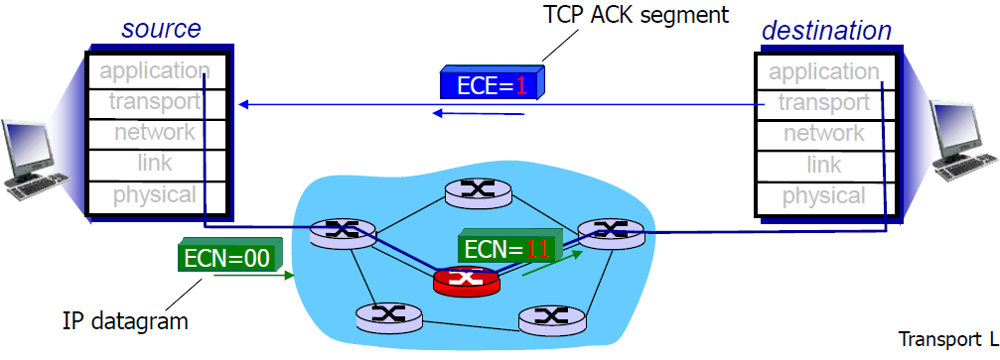
>>
>>ECN은 네트워크 라우터의 혼잡도를 IP헤더에 포함 시킨다. 
>>
>>ECE (ECN Echo)로 수신자는 송신자에게 네트워크 혼잡에 대응한 행동을 취할 수 있음을 나타낸다.

### 네트워크 계층

**Network layer**

>- 송신자 호스트에서 수신자 호스트로 세그먼트를 transport
>- 송신측: 세그먼트를 datagrams으로 캡슐화
>- 수신측: segment를 transport layer로 전달
>- 네트워크 계층은 호스트, 라우터에 존재한다.
>- 라우터는 IP 데이터그램 해더를 조사한 후에 그것을 전달한다.

#### Network service model

>지연 제한 이내 보장된 전달, 순서화 패킷 전달, 최소 대역폭 보장에 대한 답변은
>
>netwokr service model로 답을 할 수있따.
>
>인터넷 계층은 최선형서비스 즉 노력은 하지만 보장은 하지 않는 구조에서 **ATM 네트워크 구조**라는 것이 나왔다.
>
>이는 순서화 패킷 전달 서비스, 지연 제한 이내 보장된 전달 , 최소 대역폭등 넷플릭스 스카이프 등에서 주로 사용한다.
>
>

**2개의 주요 network layer functions**

>#### 	 forwarding: (데이터 평면)
>
> - 라우터의 input포트에서 적절한 라우터의 output포트로 패킷을 이동시킴
>
> - 하드웨어에서 실행
>
>   #### routing: (제어 평면)
>
> - 출발지에서 목적지까지 패킷이 이동할 경로를 결정
>
> - 라우팅 알고리즘을 이용하여 포워딩 테이블을 만드는 작업
>
> - 소프트웨어에서 실행 
>
> - 제어 평면적 접근은 전통적으로 라우팅 알고리즘은 라우터에서 계산하지만  **SDN**(software defined networking) 은 server에서 계산한다.
>
>
>
>**기존 전통 방법(라우터별 제어)** : 아래 그림은 라우팅 알고리즘들이 모든 라우터 각각에서 동작하는 경우를 나타낸다. 포워딩과 라우팅 기능이 모두 각각의 라우터에 들어있어서 모든 라우터는 서로 구성요소들은 통신하여 자신의 포워딩 테이블을 수정하게 된다. 
>
>즉 라우터 서로서로 제어면에서 상호작용을 하여 라우팅 알고리즘을 적용하여 포워딩 테이블을 작성하고 패킷은 이를 보고 목적지를 찾아가게 된다.
>
>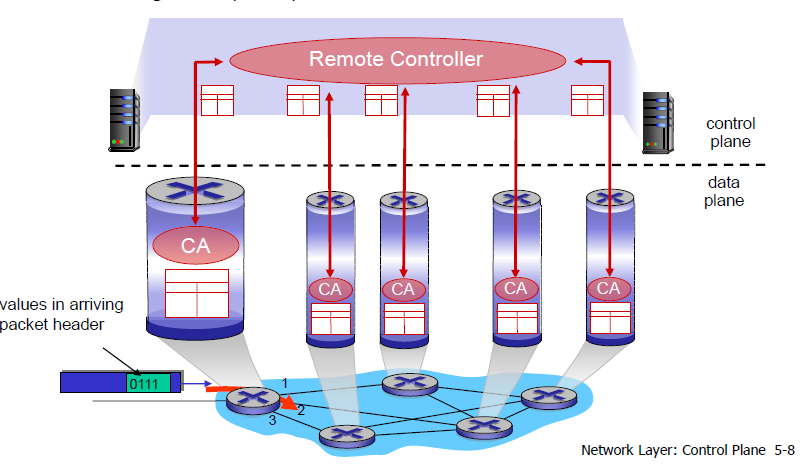
>
>**논리적으로 중앙 집중된 제어(SDN : software defined networking)** : 논리적으로 집중된 컨트롤러가 포워딩 테이블을 작성하고 이를 모든 개별 라우터가 사용할 수 있도록 포워딩 테이블을 제공하는 형태를 말한다. 
>
>기존 라우터별 제어와는 다르게 데이터 영역은 단순 포워딩의 역할에만 집중하고 라우팅알고리즘을 돌려서 포워딩 테이블을 만드는 것은 하나의 소프트웨어인 SDN이 담당하는 새로운 방법이다. 
>
>이로 인해 원격에 위치한 컨트롤러가 지역의 제어를 담당하게 되어 더욱 효율적인제어가 가능해졌다. 이는 목적지 기반의 포워딩로 포워딩 테이블을 작성하는게 아니라 플로우 테이블를 만들게 된다. 

#### 포워딩과 스위칭 비교 및 링크 계층 스위치 라우터 비교

>**포워딩**은 **네트워크 계층** 필드 값에 근거 하여 포워딩 결정
>
>**라우터**라 불리는 다른 패킷 스위치는 **네트워크 계층** 필드 값에 근거하여 포워딩을 결정한다.
>
>**스위칭**은 **링크 계층 프레임**의 필드값에 근거하여 포워딩하는 결정한다.
>
>**링크 계층**이라고 불리는 일부 패킷 스위치는 **링크 계층 프레임**의 필드 값에 근거하여 포워딩을 결정.
>
>따라서 둘 다 데이터를 전송하는 것은 유사하나 작동되는 계층이 다르다.

#### 라우팅 구조

>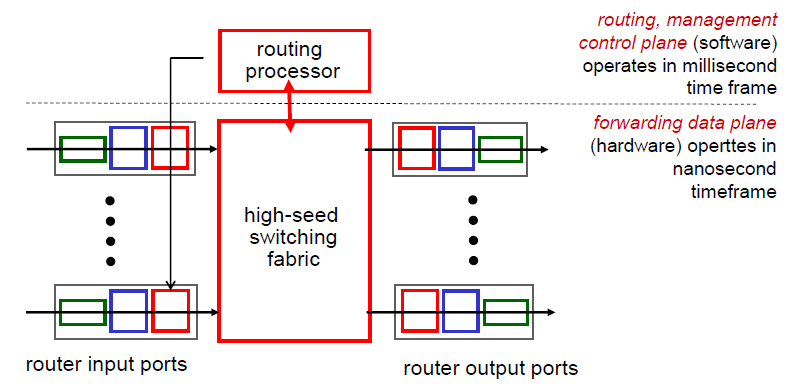
>
>라우팅 프로세서는 제어 평면 기능을 수행한다.
>
>**라우터의 주요 2가지 기능:**
>
>- 라우팅 알고리즘/프로토콜(RIP, OSPF, BGP) 작동
>- 들어오는 데이터그램을 나가는 링크로 포워딩 시킴
>
>#### Input port funcions
>
>>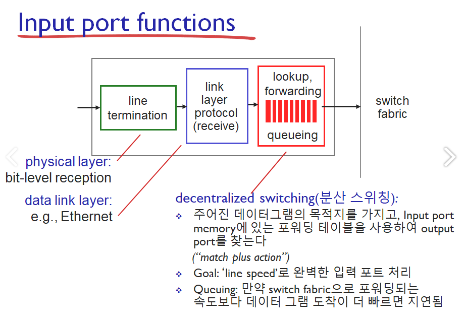
>>
>>**line termination** 에서는 라우터로 들어오는 입력 링크의 물리계층 기능을 수행하며 데이터 링크 계층 역할도 수행한다.
>>
>>**link layer protocol** 에서는 프로토콜, 캡슐화를 주로 하며
>>
>>**decentralized switching(분산 스위칭)**에서는 검색, 포워딩 ,큐잉을 진행한다. 
>>
>>검색을 통해 패킷의 출력 포트가 결정되면 패킷을 스위칭 구조로 보낼 수 있다. 
>>
>>**match plus action**
>>
>>match - 목적지 IP 주소를 찾음
>>
>>action - 패킷을 스위칭 구조를 통해 지정된 출력 포트로 보냄
>>
>>스위칭 구조는 라우터의 입력포트와 출력포트를 연결한다.
>>
>>**출력 포트**는 스위칭 구조에서 수신한 패킷을 저장하고 필요한 링크 계층 및 물리 계층 기능을 수행하여 출력 링크로 패킷을 전송한다. 
>>
>>**라우팅 프로세서**는 제어 평면 기능을 수행하고 라우팅 테이블과 연결된 링크 상태 정보를 유지하며 라우터의 포워딩 테이블을 계산한다.
>
>#### Destination-based forwarding
>
>>포워딩 테이블에서 라우터는 패킷의 목적지 주소의 프리픽스를 테이블의 엔트리와 대응 시키는 것이다. 
>>
>>#### Longest prefix matching
>>
>>>지정된 전달 테이블 항목을 찾을 때 대상 주소, 대상 주소와 일치하는 가장 긴 주소 접두사를 사용한다.
>>>
>>>즉 위에서 말하는 검색은 포워딩 테이블을 검색하여 가장 긴 프리픽스와 일치 하는것을 찾는 것이다.(겹치는 것이 많은 프리픽스)
>>
>>검색을 통해 패킷의 출력포트가 결정되면 패킷을 스위칭 구조로 보낼 수 있다.
>
>#### **Switching fabrics**(스위칭 구조)
>
>>- 스위칭 구조를 통해 패킷이 입력 포트에서 출력 포트로 실제로 스위칭(즉, 전달)되므로 스위칭 구조는 라우터의 핵심이다.
>>- 패킷을 인풋 버퍼에서 적절한 출력 버퍼로 이송시킴
>>- switching rate: 패킷이 인풋에서 아웃풋으로 전송될 수 있는 속도
>>- switching fabrics의 3가지 타입
>
>#### 1세대 라우터 (memory)
>
>>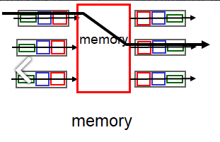
>>
>>- CPU(라우팅 프로세서)를 직접 제어해서 스위칭하는 전통적인 방식이다
>>- 입/출력 포트는 전통적인 I/O 장치처럼 작동함
>>- 패킷이 도착하면 입력 포트는 라우팅 프로세서에게 인터럽트를 보내 패킷을 프로세서 메모리에 복사한다. (패킷은 시스템 메모리에 카피됨)
>>- 속도는 메모리 bandwidth에 의해 제한된다. (데이터그램 당 2 bus crossings)
>
>#### switching via bus
>
>>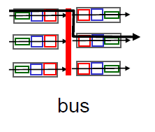
>>
>>- 데이터그램이 입력 포트 메모리에서 (라우팅 프로세서의 개입 없이) 공유 버스를 통해 출력 포트 메모리로 이동
>>- 모든 출력 포트에 패킷이 수신되지만 라벨과 일치하는 포트만 패킷을 유지한다.
>>- 라벨은 스위치 내에서 버스를 통과하기 위해서만 사용되므로 출력 포트에서 제거된다.
>>- 동시에 여러 패킷이 다른 입력 포트로 라우터에 도착하면 한번에 하나의 패킷만 버스를 통과할 수 있기 때문에 하나를 제외한 모든 패킷은 대기함
>>- **bus contention**: switching speed는 bus bandwidth에 의해 제한됨
>
>#### Switching via interconnection network (crossbar)
>
>>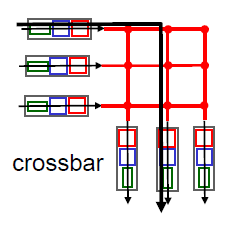
>>
>>- bus bandwidth의 제약을 극복
>>- N개의 입력 포트를 N개의 출력 포트에 연결
>>- 각 수직 버스는 교차점에서 각 수평 버스와 교차하며 스위치 구조 컨트롤러에 의해 언제든지 열거나 닫을 수 있다.
>>- 여러 패킷을 병렬로 전달 가능
>>- 두 개의 서로 다른 입력 포트에서 나오는 두 개의 패킷이 동일한 출력 포트로 보내지는 경우 -> 한번에 하나의 패킷만 특정 버스에서 전송될 수 있으므로 나머지 하나는 입력포트에서 기다려야 한다.
>>
>>보다 정교한 기술로  데이터그램을 고정된 길이 셀로 분할하고, 스위치 구조을 통해 셀을 전환한다.
>>
>>여러 단계의 스위칭 요소를 사용하기 때문에 시스코 CRS는 3단계 **논 블로킹 스위칭 전략**을 사용한다.
>
>#### how many buffer demand
>
>>버퍼링: B, 평균 왕복 시간: RTT(250msec), C: 링크 용량
>>
>>B = RTT*C  -> 상대적으로 작은 양의 TCP 흐름에 대한 큐잉 분석
>>
>>많은 수의 TCP 흐름(n)이 링크를 통과할 때, 필요한 버퍼링은 RTT∗C/루트N 이다.
>
>#### input prot queuing
>
>>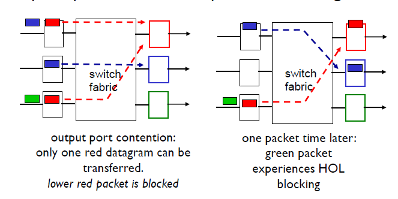
>>
>>- 입력 회선을 통해 도착하는 모든 패킷을 전송하기에 스위치 구조가 충분히 빠르지 않다면  queuing지연과 손실이 발생한다. (인풋  버퍼 오버플로우)
>>
>>- Head-of-the-Line**(HOL) blocking**: 
>>
>> 입력 포트에 있는 서로 다른 2개의 패킷이 같은 출력 포트(빨간색)을 향해 간다. 이 중 한 패킷은 차단되고 입력 큐에서 기다려야 한다 
>>
>>입력 링크에서 패킷 도착속도가 용량의 58%가 되면 HOL차단 때문에 입력 큐가 무한정 길이로 증가함을 보여준다.
>
>**Output ports** **queuing**
>
>>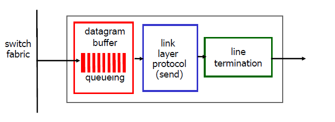
>>
>>- 전송 속도보다 데이터그램 도착 속도가 더 빠르다면 **버퍼링**이 필요하다
>>
>>  패킷은 혼잡이나 버퍼의 크기가 작으면 손실날 수 있기 때문이다. 
>>
>>- **scheduling discipline**은 전송되길 기다리는 (queued)데이타그램 사이에서 최고의
>>
>>  효율을 내는 것을 고른다.
>>
>>버퍼가 커지면 라우터의 메모리가 소모될 수 있으며
>>
>>패킷을 저장 할 수 있는 메모리가 없을때 패킷 손실 발생한다.
>
>#### Router external connections
>
>>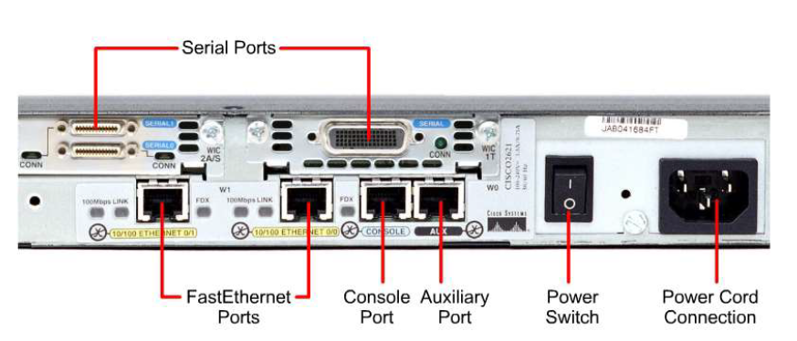
>>
>>

### **The Internet network layer**

>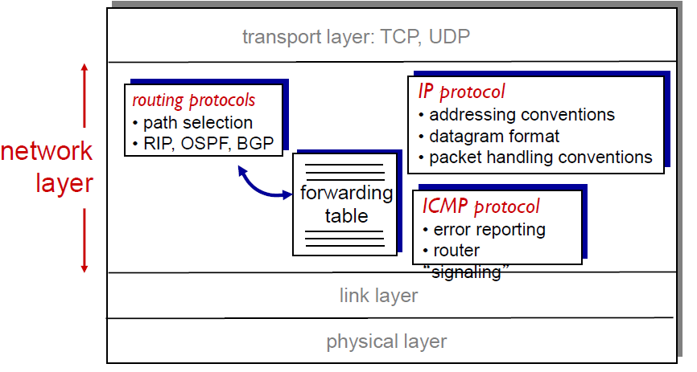
>
>- Routing protocol: 패킷이 목적지까지 가는 경로 결정 - static과 dynamic 프로토콜로 구분됨
>- path selection - 다익스트라, 벨만 포드 등에서 선택
>- RIP: Routing Information Protocol -> 네트워크 구조상 계층은 없고 평면적인 프로토콜(자주사용)
>- OSPF: Open Shortest Path First     -> 최단 경로 우선 프로토콜
>- BGP: Border Gateway Protocol      -> 외부 라이팅 프로토콜
>
>*  ICMP(Internet Control Message Protocol): 인터넷 제어 메시지 프로토콜
>
>  ​    오류 메시지를 전송받는데 주로 쓰임(ping)

#### **IP datagram format**

>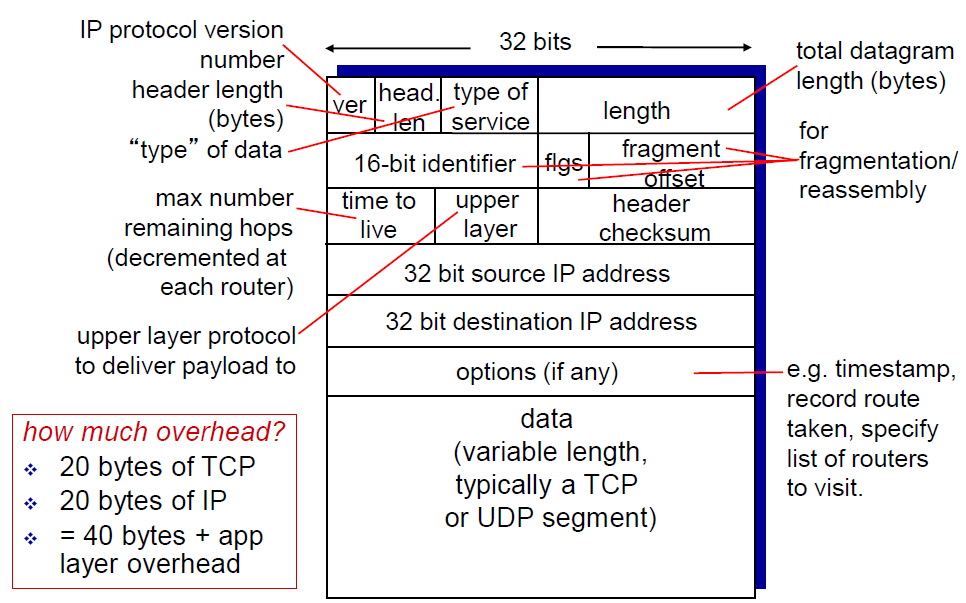
>
>- 버전 번호: 4비트로 데이터그램의 IP프로토콜 버전을 명시한다.
>
>- 헤더 길이: IPv4의 데이터그램 헤더는 20바이트이다.
>
>- 서비스 타입: 실시간 데이터 그램과 비실시간 트래픽을 구분하는데 사용 즉 서비스 타입 비트는 서로 다른 유형의 IP데이터그램을 구별한다. 
>
>- 데이터 그램 길이: 바이트로 계산한 IP 데이터그램의 전체 길이이다.
>
>- identifier, flags, fragment offset(식별자, 플래그, 단편화 오프셋) -
>
>  - IP fragment(단편화)와 관계있다.
>  - IP의 새로운 버전인 IPv6는 단편화를 허용하지 않는다.
>
>- TTL(Time to live) - 라우팅 잘못하면 루프가 생길 수 있는데 TTL이 이를 방지한다.
>
>  - 라우터마다 1씩 감소하고 0이 되면 버려짐
>
>- upper layer(protocol) - 일반적으로 IP 데이터그램이 최종 목적지에 도착했을 때만 사용되는 필드
>
>  - 이 필드 값은 IP 데이터그램에서 데이터 부분이 전달될 목적지의 전송 계층의 특정 프로토콜을 명시한다. 값 6은 데이터 부분을 TCP로 , 값 17은 UDP로 데이터로 전달 하라는 것이다.
>
>    전송 계층 세그먼트에서 포트 번호 필드의 역할과 비슷하다. 
>
>- header checksum - 라우터가 수신한 IP 데이터그램의 비트 오류를 탐지하는데 도움을 줌
>
>  ​	라우터는 보통 오류가 검출된 데이터그램을 페기한다.  
>
>  TCP/IP는 전송과 네트워크 계층에서 오류 검사를 하는가?
>
>  첫째로 IP 헤더만 IP계층에서 체크섬을 수행하지만 TCP/UDP 체크섬은 전체 TCP/UDP 세그먼트를 계산한다.  TCP/UDP와 IP는 동일한 프로토콜 스택에 속할 필요가 없기 때문이다.
>
>  예를 들어 TCP는 IP가 아닌 다른 네트워크 프로토콜(ATM) 위에서 운영될 수 있고 IP는 TCP/UDP로 전달 되지않는 데이터를 전달 할 수 있기 때문이다. 
>
>- 옵션 : IP헤더를 확장한다. 
>
>IP 데이터 그램은 총 20바이트의 헤더를 갖는다. TCP 세그먼트를 전송한다면 총 40바이트의 헤더를 전송한다.

#### **IP fragmentation, reassembly**

>커다란 IP 패킷을 링크 계층 프레임의 페이로드를 작은 IP데이터 그램으로 분할하고 별도의 링크 계층 프레임으로 캡슐화하여 출력 링크로 보내는 것을 **fragement** 라고 한다. 
>
>- 모든 링크 계층 프로토콜이 같은 크기 네트워크 계층 패킷을 전달할 수 없다 -> 6장에서 배움
>  - 어떤 프로토콜은 큰 데이터그램 전달하는 반면 다른 프로토콜은 작은 것만 전달 가능
>- **MTU(Mszimum Transmission Unit)**: 링크 계층 프레임이 전달할 수 있는 최대 데이터의 양
>  - 링크 타입이 다르면 MTU도 다르다
>- 각 IP 데이터그램은 한 라우터에서 다른 라우터로 전송하기 위해 링크 계층 프레임 내에 캡슐화되므로 링크 계층 프로토콜의 MTU는 IP 데이터 그램의 길이에 엄격한 제약을 둔다.
>- 큰 IP 데이터그램을 net 내에서 분할한다(fragmented)
>  - 하나의 데이터그램이 여러 개의 데이터그램으로 나뉨
>  - 마지막 목적지에서만 "재조립(reassembled)"됨 이러한 재조합을 할 수 있도록 식별자, 플래그 , 단편화 오프셋 필드를 IP 데이터그램 헤더에 찍는다. 또한 목적지 호스트가 원본 데이터그램의 마지막 조각을 알기 위해서 플래그 비트를 0으로 한다. 
>  - 
>  - 원본 데이터 4000은 3980 + 20  byte 이며 각 세그먼트는 1480 + 20 byte로 구성되어 있기 때문에 마지막 길이는 1020 + 20 = 1040 이다. 
>  - IP header bifs는 fragments의 순서와 identify 하기 위해 사용된다
>

#### **IP addressing: introduction**

>- IP 주소: 32bit - 호스트와 라우터의 인터페이스 식별할 수 있다. 
>- **인터페이스**(interface) : 호스트와 라우터간의 물리적 계층 사이의 경계를 나타낸다. 
>- 호스트는 일반적으로 네트워크와 연결되는 하나의 링크를 가진다.
>  - 호스트 IP가 데이터그램을 보낼 때 이 링크를 통해 데이터 링크를 보낸다
>- 호스트와 physical link 사이의 경계를 '인터페이스'라고 부른다.
>- 라우터의 작업: 한 링크로부터 데이터그램을 수신하여 다른 링크로 전달하는 것
>  - 2개 이상의 연결된 링크가 필요
>  - 라우터와 이런 링크 사이의 경계 또한 인터페이스라고 함
>- 모든 호스트와 라우터는 IP 데이터그램을 송수신할 수 있으므로 IP는 각 호스트와 라우터 인터페이스가 IP 주소를 갖도록 요구한다.
>  - 따라서 기술 면에서 IP 주소는 인터페이스를 포함하는 호스트 라우터보다는 인터페이스와 관련이 있다.
>- IP 주소: 호스트를 identifier 할 32-bit를 나타낸다. 
>- 인터페이스의 IP 주소 일부는 연결된 '서브넷'이 결정
>- 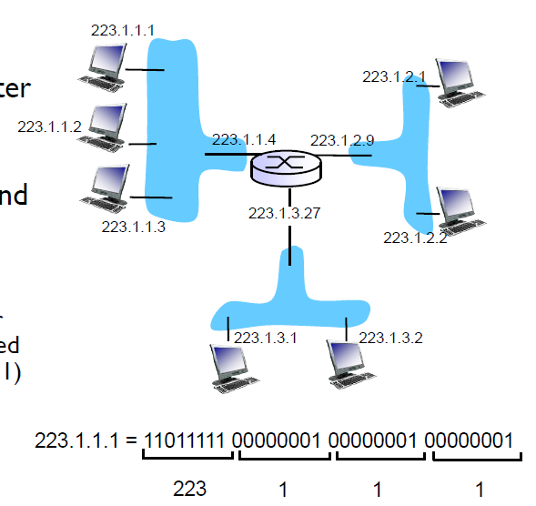
>
>- 오른쪽 그림을 보면, 하나의 라우터가 7개의 호스트를 연결한다.
>  - 왼쪽 3개의 호스트와 연결된 라우터 인터페이스 모두 223.1.1.xxx 형식의 IP 주소를 갖는다.
>    - 즉 동일한 왼쪽 24비트를 사용한다.
>  - 또한 4개의 인터페이스가 중계하는 라우터 없이 하나의 네트워크에 서로 연결되어 있다.
>  - 이 네트워크는 이더넷 LAN으로 상호 연결되고 이 경우 인터페이스는 이더넷 허브나 이더넷 스위치 또는 무선 액세스 포인터로 상호 연결된다.
>  - 세 호스트들의 인터페이스들과 하나의 라우터 인터페이스로 연결된 네트워크는 **서브넷**을 구성한다고 말한다. 혹은 서브넷을 결정하려면 먼저 호스트나 라우터에서 각 인터페이스를 분리하고 고립된 네트워크를 만든다. 이 고립된 네트워크의 종단점은 인터페이스의 끝이 된다. 이렇게 고립된 네트워크 각각을 서브넷이라고 부른다 
>  - IP 주소체계는 이 서브넷에 223.1.1.0/24라는 주소를 할당해주는데, 여기서 /24는 **서브넷 마스크**라 부르며 32비트 주소의 왼쪽 24비트가 서브넷 주소라는 것을 가리킨다.
>
>

#### Reserved IP Addresses

>예약된 IP 주소로 특정 호스트 주소는 예약되어 있으므로 네트워크의 디바이스에 할당할 수 없음.
>
>모든 호스트 비트 위치에 이진 0이 있는 IP 주소는 네트워크 주소에 예약되어 있다.
>
>모든 호스트 비트 위치에 이진 1이 있는 IP 주소는 네트워크 주소에 예약되어 있다.
>
>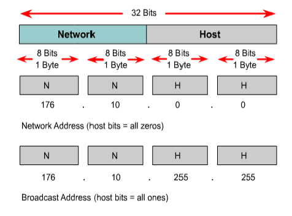

#### IPv4 Addressing (Class 주소체계)

>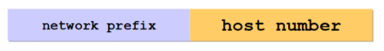
>
>- network prefix는 네트워크 식별, host number는 특정 호스트를 식별
>
>  (정확히는 네트워크의 인터페이스를 식별)
>
>* network prefix가 얼마나 긴지 어떻게 알 수 있을까?
>
>- 명시적인 정의를 사용한 network prefix (class bassed addressing, A,B,C,D...)
>  - IP 주소의 네트워크 부분을 8,16,24비트로 제한하고 각각을 A,B,C 클래스 네트워크로 분류
>- network prefix를 유연하게 prefix/netmask로 나타냄. (classless)
>
>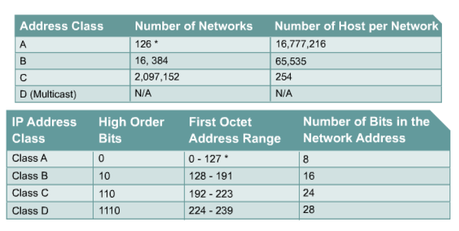
>
>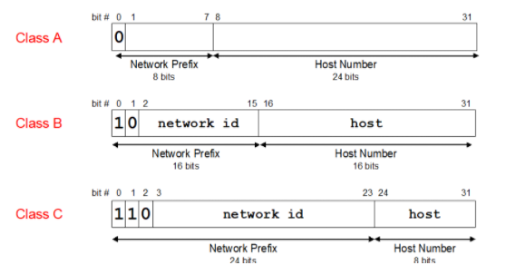
>
>Classful IP Addresses의 문제
>
>1. 큰 네트워크에 비해 네트워크 주소가 너무 적음(부족)
>2. 2계층 구조는 클래스 A 및 클래스 B 주소가 있는 대규모 네트워크에는 적합하지 않음
>   - Fix #1: subnetting
>3. 호스트 ip 주소가 10,000개 필요한데, 클래스 C로는 부족해서 클래스 B를 할당 받으면, 
>   - 클래스 B = 2^(32-16) =65,000
>   - 65000-10000개가 낭비됨

#### Private IP Addresses

>공용 IP 주소가 글로벌하고 표준화되어 있기 때문에 공용 네트워크에 접속하는 두 개의 기계는 동일한 IP 주소를 가질 수 없다.
>
>그러나 인터넷에 연결되지 않은 사설 네트워크는 사설 네트워크 내의 각 호스트가 고유하기만 하면 어떤 호스트 주소도 사용할 수 있다.
>
>RFC 1918은 개인용, 내부용 IP 주소의 블록 3개를 따로 설정한다.
>
>개인 주소를 사용하여 인터넷에 네트워크를 연결하려면 NAT(네트워크 주소 변환)을 사용하여 개인 주소를 공용 주소로 변환해야 한다.

#### IP addressing: CIDR

>**CIDR: Classless Inter Domain Routing**
>
>서브넷 주소체계 표기를 일반화 한것
>
>32비트 IP주소를 network prefix, host number로 나누고 이것을 다시 점으로 된 십진수 형태의 
>
>**a.b.c.d/x** 를 가지며 여기서 x는 주소 첫 부분의 비트수이다.  혹은 MSB(most significant bit) 최상위 비
>
>트라고 말한다. 이를 **프리픽스** 또는 네트워크 프리픽스라고 한다. 
>
>호스트 넘버로 특정 호스트를 식별한다. 

#### DHCP

>**DHCP: Dynamic Host Configuration Protocol:**
>
>호스트에 IP주소를 할당하는 것은 수동으로 구성이 가능하지만 DHCP를 많이 사용한다. 
>
>DHCP는 호스트 IP주소의 할당 뿐만 아니라, 서브넷 마스크, 홉 라우터 주소나 로컬 DNS  서버 주소같은 추가 정보를 얻게 해준다.
>
>네트워크에서 자동으로 호스트와 연결해주는 DHCP의 능력 때문에 플러그 앤 플레이(plug -and -play)
>
>혹은 제로 구성 프로토콜(zero-configuration protocol) 이라고 말한다.
>
>**호스트가 네트워크에 가입할 때 호스트가 네트워크 서버에서 IP 주소를 동적으로 가져올 수 있도록 허용한다.**
>
>>사용 중인 주소의 리스를 갱신할 수 있다.
>>
>>**주소 재사용 허용**(연결/설정 중에만 주소 유지) 및 주소가 바뀔수 있다.
>>
>>네트워크에 가입하려는 모바일 사용자 지원(더 빠른 시간)
>
>- host broadcasts "DHCP 발견" 메시지 [optional] - 호스트가 DHCP 서버 발견 메시지 발송
>- DHCP 서버는 "DHCP 제공" msg로 응답 [optional] - 
>- host는 "DHCP request" msg로 IP 주소 요청
>- DHCP 서버는 "DHCP ack" msg로 주소 보냄
>- 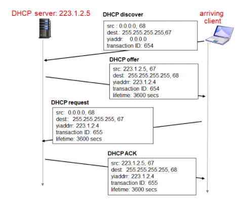
>- 여기서의 yiaddr은 새롭게 도착한 클라이언트에 할당된 주소이다.
>
>**DHCP 기본 동작 원리**
>
>>1. DHCP discover (서버 발견)
>>
>>   - device가 부팅되면 동일 서브넷에 위치한 DHCP 서버를 찾기 위해 **DHCP discover message**를 이더넷 망에 브로드캐스팅한다. (IP dest:FF-FF-FF-FF-FF)
>>
>>     메세지 내의 목적지 IP주소를 255.255.255.255.255.portnumber 로 설정하며 위의 사진은 포트 번호가 67인 것이다. 그리고 출발지 IP주소는 0.0.0.0 으로 설정한다.
>>
>>2. DHCP offer (서버 제공)
>>
>>   - DHCP discover 메시지를 수신한 DHCP 서버는 **DHCP offer message** broadcast 또는 unicast로 클라이언트에게 전송한다. 여기에는 장치(클라이언트)에게 임대해 줄 IP 주소와 자신의 IP 주소가 포함되어 있다. 또 한 라이언트의 IP 주소, Subnet mask, Default gateway IP 주소, DNS 서버 IP 주소, LifeTime(IP 주소 임대 시간)도 포함하고 있다.
>>
>>3. DHCP request (요청)
>>
>>   - 클라이언트는 DHCP offer 메시지로부터 받은 네트워크 정보들을 사용하겠다고 요청
>>
>>4. DHCP ACK
>>
>>   - 서버는 DHCP 요청 메세지에 대해 요청된 파라미터를 확인하는 DHCP ACK 메세지로 응답한다.
>
>**DHCP: more than IP addresses**
>
>>DHCP는 서브넷에서 할당받은 IP 주소 외에도 다음 정보를 전달
>>
>>- 고객의 first-hop router의 주소
>>- DNS 서버의 이름과 IP 주소
>>- network mask ( network host portion of address)
>
>#### DHCP 예시
>
>>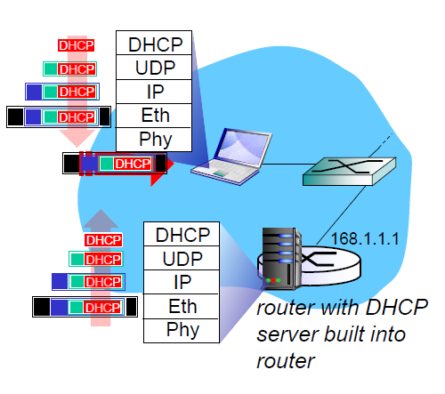
>>
>>- 노트북과 연결하기 위해서는 IP 주소, first-hop router 주소, DNS 서버 주소가 필요하다: use DHCP
>>- DHCP는 UDP로 캡슐화되고, IP로 캡슐화되고, 802.1 Ethernet으로 캡슐화된다.
>>- Ethernet frame은 LAN으로 broadcast(dest:FFFFFFFFFFFF), 작동되는 DHCP 서버에서 받음
>>- Ethernet은 IP demuxed로 demuxed되고, UDP는 DHCP로 demuxed된다.
>>
>>- unicast: 1대 1 통신 ,multicast: 1대 다 통신
>>- broadcast: 전체 통신 (원하지 않더라도 모두에게 패킷 다 보냄)
>>- DHCP는 unicast 안됨
>>  - why? IP 주소를 모르니까 => 그래서 broadcast 함
>>
>>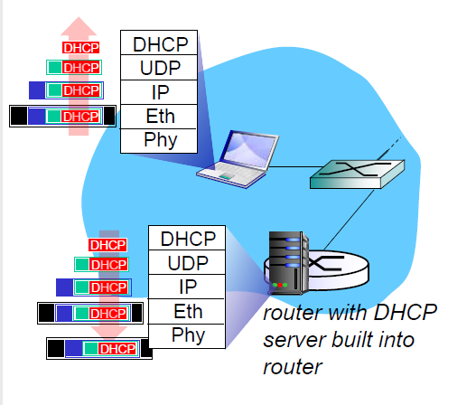
>>
>>- DCP 서버는 클라이언트의 IP 주소, 클라이이언트의 first-hop router의 IP 주소, DNS 서버의 이름 및 IP 주소를 포함하는 DHCP ACK을 공식화한다
>>- DHCP 서버 캡슐화, 클라이언트에 프레임 전달, 클라이언트에서 DHCP로 demuxing
>>- 이제 클라이언트는 자신의 IP주소, name, DSN 서버의 IP 주소, 자신의 first-hop router를 알게 된다.

#### 주소 블록 획득

>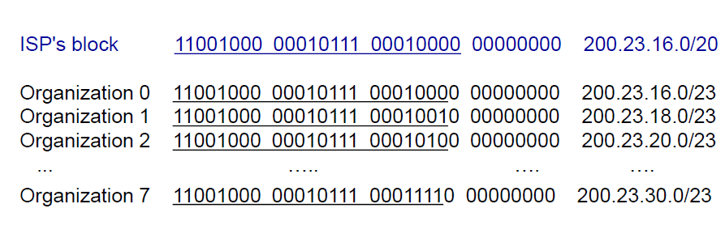
>
>ISP로부터 주소를 획득하는 것은 주소 블록을 얻는 한 방법이지만 다른 방법도 있다.
>
>ISP도 주소 블록을 얻기 위한 방법이 있어야 하는데 이러한 IP주소는 ICANN(Internet Corporation for Assigned Names and Numbers)을 기반으로 관리한다.

#### NAT: network address translation

>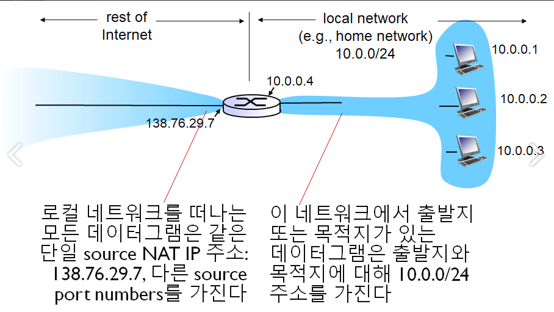
>
>- motivation: 로컬 네트워크는 오로지 한 개의 IP 주소만 가진다.
>  - ISP로부터 필요하지 않은 주소 범위: 모든 디바이스를 위해 단 하나의 IP 주소만 있으면 된다.
>  - 바깥 세상과으로부터 독립됨:
>    - 밖에 알리지 않고 로컬 네트워크에 있는 디바이스의 주소를 바꿀 수 있다.
>    - 로컬 네트워크의 주소를 바꾸지 않고 ISP를 바꿀 수 있다.
>    - 로컬 net에 있는 디바이스는 바깥세상에 의해 명시적으로 addressable, visible하지 않는다.
>  - 하나의 네트워크 망에서 여러 개의 디바이스들이 존재할 때, 그들 각각에게 실제 IP를 하나씩 주게 되면 IP를 너무 많이 필요로 한다. -> 이를 해결하는 방법이 NAT(네트워크 주소 변환) 
>    - 현재 사용 중인 IPv4 주소가 많이 남아있지 않음
>
>implementation: NAT router must:
>
>- outgoing datagrams: 모든 나가는 데이터그램의 (출발지 IP 주소, 포트 번호)를 (NAT IP 주소, 새로운 포트 번호 -> 목적지 주소로 사용)로 대체한다.
>- 모든 (출발지 IP 주소, 포트 번호)->(NAT IP 주소, 새로운 포트 번호) 변환 쌍을 **NAT translation table**에 기록한다.
>- incoming datagrams: 들어오는 데이터그램의 목적지 필드에 있는 (NAT IP 주소, 새로운 포트 번호)를 NAT 테이블 내의 상응하는 (출발지 IP 주소, 포트 번호)로 바꾼다.
>
>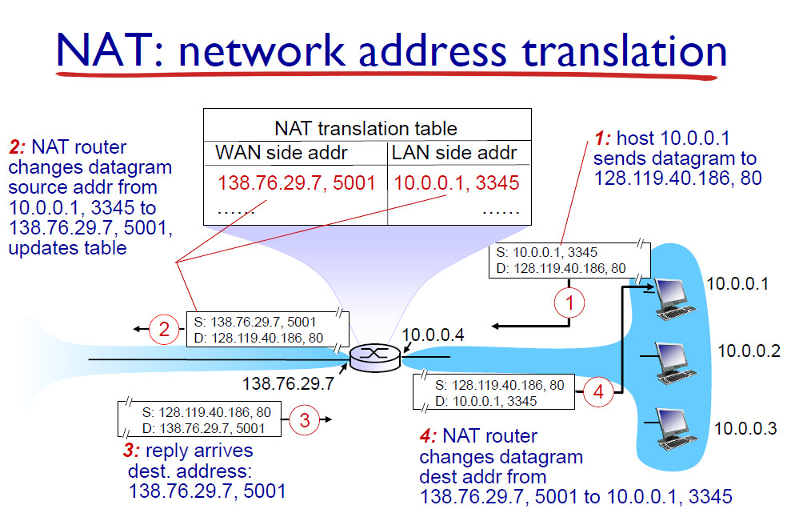
>
>- 외부에서 보기에는 하나의 IP 주소인(138.76.29.7)만 알고 있다.
>- NAT 라우터는 ISP의 DHCP 서버로부터 IP 주소를 얻고, NAT-DHCP-라우터로 제어되는 홈 네트워크의 주소 공간에서 DHCP 서버를 실행하여 컴퓨터에게 주소를 제공
>- 16bit의 port-number field:
>  - 하나의 LAN 주소로 동시에 60,000개의 연결이 가능
>  - [(WAN side addr) 138.76.29.7, 5001]이랑 [(LAN side addr) 10.0.0.1, 3345]를 바인딩한 것 => flow
>  - 60,000개의 flow를 생성할 수 있다는 말
>
>* NAT은 논란의 여지가 있다.
>
>- 라우터는 3계층까지만 처리해야 한다.
>- end-to-end 법칙을 위반함
>  - host가 중간 노드에서 (IP 주소, 포트 번호) 수정 없이 직접 통신해야 한다는 원칙을 어김
>  - 장점: 경제적
>  - 단점: 인터넷 원칙을 어김 (smart end, dump middle)
>- NAT 대신 IPv6로 주소 부족 문제를 해결해야 한다. -> 라고 NAT 사용 반대하는 사람들의 주장

#### **IPv6: motivation**

>- 초기 동기: 32bit 주소 공간이 곧 완전히 할당될 것이다. (남은 게 얼마 없음) ->128bit로 늘림
>- 추가적인 동기:
>  - 헤더 포멧이 빠른 처리(processing)&전송(forwarding)을 도와줌
>  - 헤더는 QoS(Quality of Service)가 용이하도록 도와줌
>- IPv6 데이터그램 형식:
>  - 고정된 길이의 40byte 헤더
>    - IPv4는 20byte
>  - fragmentation 허용 안 함
>- **흐름 라벨링:**
>  - 높은 사용자 우선 순위를 가지고 전달된 트래픽 또한 흐름으로 처리 가능

#### IPv6 datagram format

>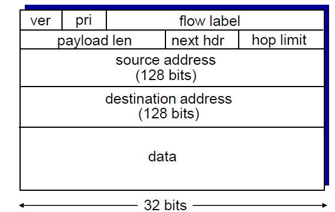
>
>- **priority**: flow 안의 데이터그램 사이의 우선순위를 식별
>- **flow label**: 같은 flow 안의 데이터그램을 식별 (데이터그램의 흐름을 인식)
>- **next header**: 데이터를 위한 상위 계층 프로토콜을 식별
>- IPv4로부터 변화
>  - **checksum**: 각 hop에서 처리 시간을 줄이기 위해 전체 제거함
>  - **options**: 허락하지만 헤더 밖에서만. "Next header" field로 나타냄
>- **ICMPv6**: ICMP의 새로운 버전
>  - 추가적인 메시지 타입. 예: "Packet too big"
>  - multicast group management functions (멀티캐스트 그룹 관리 기능)
>
>**ICMP: Internet control message protocol**
>
>>- 호스트와 라우터 사이에서 network-layer 정보를 전달하는 데 사용
>>  - 에러 보고: 호스트, 네트워크, 포트, 프로토콜에 도달하지 못함
>>  - echo request/reply (ping을 사용하여)
>>- IP의 상위인 네트워크 계층:
>>  - IP에서 ICMP msg를 운반
>>- ICMP 메시지: Type, code, 에러가 발생한 IP 데이터그램의 첫 8바이트

#### Transition from IPv4 to IPv6 (**IPv4에서 IPv6로의 변화**)

>
>
>모든 라우터가 동시에 업그레이드될 수 없다.
>
>- no "flow days"
>- 어떻게 IPv4와 IPv6를 섞어서 네트워크를 운영할 수 있을까?
>
>**Tunneling** (터널)
>
>>IPv4 라우터들이 IPv6 데이터그램을 IPv4의 데이터 필드에 넣어 운반
>>
>>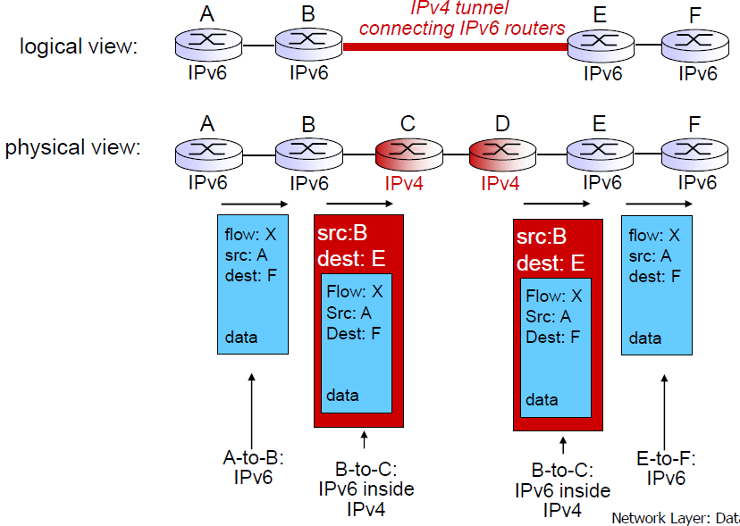
>>
>>IPv4를 지날때 IPv6 내용을 캡슐화한다. 

#### Generalized Forwarding and SDN

(일반적인 포워딩 및 소프트웨어 기반 네트워크 SDN)

>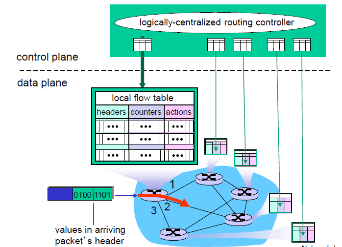
>
>
>
>각 라우터는 논리적으로 중앙 집중화된 라우팅 컨트롤러에 의해 계산되고 배포되는 
>
>**흐름 테이블**을 포함한다.
>
>라우터 안에 있는 **흐름 테이블**은 매치+액션 룰에 기반하여 정의된다. 

#### OpenFlow data plane abstraction

>- forwarding을 할때 중앙 SDN서버에서 룰을 주고 그 룰에 의해서 일반화된 forwarding
>- flow는 해더 필드에 정의되어 있다. 
>- OpenFlow : SDN을 하기위한 표준
>- 외부 어떤 포트로 보낼 것인가? packet에 들어있는 정보 : source
>- Pattern: 패킷 해더 필드 안의 value값을 매칭한다. 
>- address가 매칭되는 부분에 대한 값이 header에 존재한다.
>- counters : flow가 얼마나 됐는지 counter 혹은 어느 곳으로 보냈는지 count하여 네트워크의 traffic volum을 파악
>- action :  drop, forwarding, modify(소스와 목적지를 바꾸는 것이 아니라 다른 것들을 수정하는 것), 매치된 패킷을 controller(중앙집중적인 메인서버)로 전송 -> SDN을 위해 사용되는 패킷들
>
>- priority : 여러개의 패턴이 있는데, 같은 범위안의 겹치는 패턴의 모호성을 없앰
>
>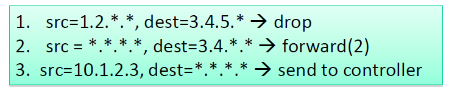
>
>1. 1.2.*.*에서 전송하고 dest가 3.4.5.*의 모든 곳으로 가는 것들을 드랍 -> 드랍 후 재전송이있을 수있다
>2. 모든 곳에서 전송하고 목적지가 3.4.*.* 범위 내의 것들 모두 2번으로 forwarding
>3. 10.1.2.3 에서 전송한 데이터는 모든 dest로 가는 것들을 컨트롤러가 확인하겠다(컨트롤러에 전송) -> 컨트롤러는 local마다 하나씩 존재하여 서로 정보를 주고 받음

### OpenFlow: Flow Table Entries

>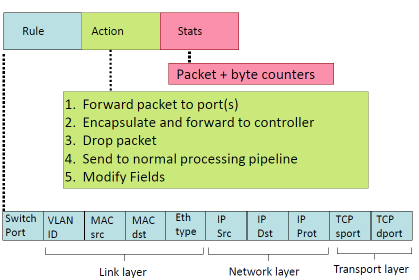
>
>그림에서 보이듯이 패킷 스위치에 도달하는 링크 계층 프레임은 페이로드로 네트워크 계층 데이터 그램
>
>을 포함하며 전송 계층 세그먼트도 포함하고 있다. 
>
>OpenFlow의 일치 개념이 프로토콜 헤더의 세 계층에서 선택된 필드에 일치하도록 허용한다. 
>
>계층화 원칙을 무시하는 것이다. 
>
>SDN은 네트워크 레이어에서 사용되지만 하위 레이어(링크)에 대한 룰을 정의 가능
>
>Action : 포워딩, 컨트롤러로 포워딩, 드랍, 원래 프로세싱(기본 router)으로써 작동하라, 수정하라
>
>stats : 얼마나 많은 flow가 있었는지 counter와 Packet 

#### Open flow 예시

>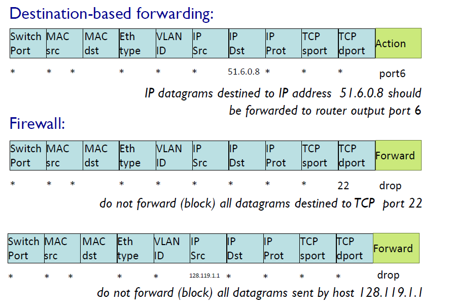
>
>- Destunation-based forwarding : IP Dst가 51.6.0,8로 향하는 모든 데이터그램을 받으면 port6로 forwarding하라
>
>- Firewall : 22번 port number로 들어오는 데이터들은 드랍
>- 지정된 소스로부터 온 데이터는 다 드랍하라
>- 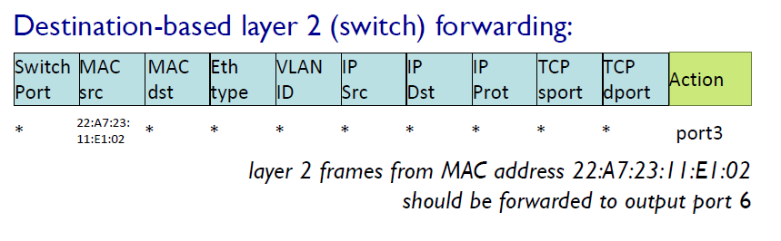
>- Mack address를 지정하여 그로부터 오는 데이터를 port3으로 보내라

#### OpenFlow abstraction

>match+action: 여러 종류의 장치를 통일하다.
>
>- Router
>
>- - match : longest IP prefix matching -> 이전시간에 배운 것 and하여 해당하는 action을 취함
>  - action : forward out a link
>
>- Switch
>
>- - match : 목적지 MAC주소
>  - action : forward 혹은 flood
>
>- Firewall
>
>- - match : IP 주소 및 TCP / UDP 포트 번호
>  - action : 허가 또는 거부
>
>- NAT 가능
>
>- - match : IP 주소 및 포트
>  - action : 주소와 포트 재 작성 -> 해당하는 내부 망(IP address와 port)
>
>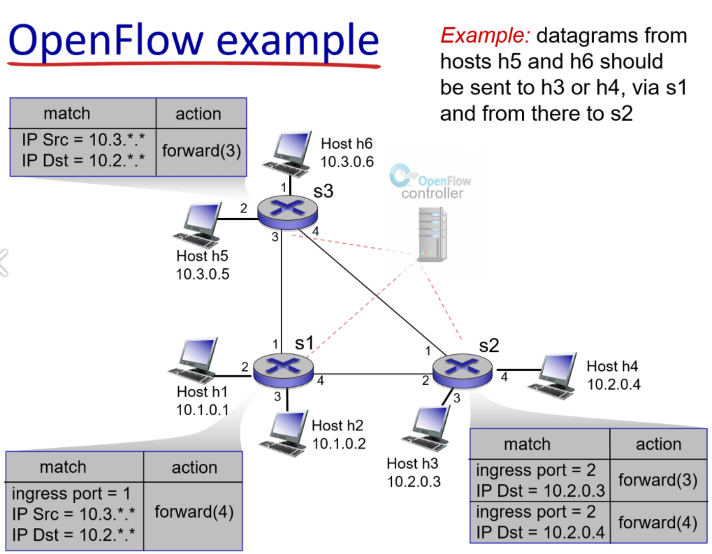
>
>h5 및 h6 호스트의 데이터그램은 s1을 통해 h3 또는 h4로 전송되어야 하며, 거기서 s2로 전송되어야 한다.
>
>1. 소스가 10.3. 으로 시작하고 목적지가 10.2. 로 시작하는 서브넷들이 s3로 오면 패킷을 3번으로 forwarding
>2. 소스가 10.3. 으로 시작하고 목적지가 10.2. 로 시작하면 4번으로 전송
>3. 목적지가 10.2.0.3이면 3번으로 10.2.0.4이면 4번으로 전송

